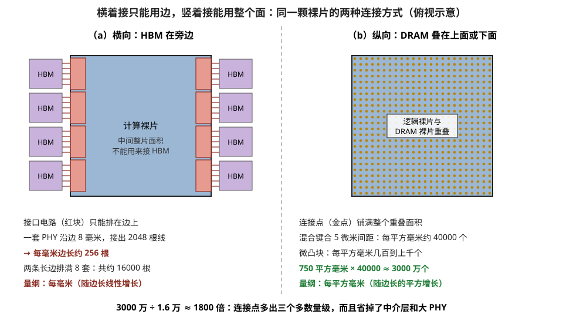
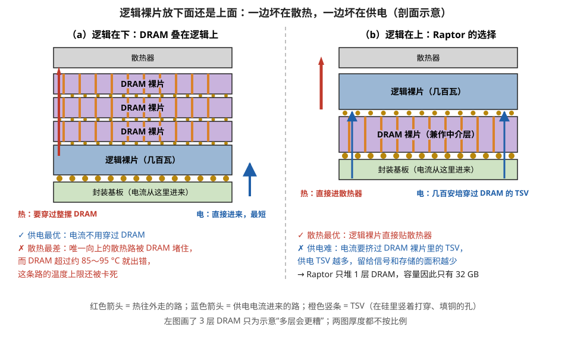
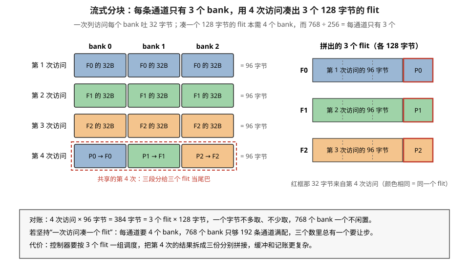
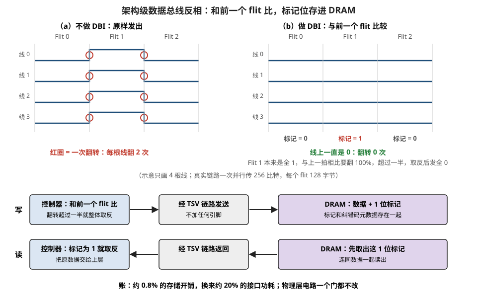

# 3D-DRAM：把存储直接叠到逻辑上，为了绕开"岸线"这道墙

> **所属模块**：模块 21 · 封装与堆叠存储
> **状态**：🟨 学习中（第一版。知识截至 2026-08，主要素材为 Hot Chips 2026 上 d-Matrix 关于 Raptor 的演讲，以及 Samsung 关于 3D 封装场景的部分内容）
> **本节主旨**：上一节（21-02）讲的 HBM 站在计算芯片旁边，靠硅中介层横向连过来。这个姿势有一个很少被单独点名、但比光罩极限更早发作的约束：**HBM 的接口电路必须排在计算裸片的边缘上，所以带宽被裸片的"周长"卡死，而不是被"面积"卡死。** 这条约束业界叫岸线密度（beachfront density），它是 3D-DRAM 这条路线存在的全部理由——把 DRAM 直接叠到逻辑裸片上，连接点就按面积铺开，一下子从"每毫米几根线"变成"每平方毫米几百根线"。这一节讲这条路线的动机、它自己撞上的两难（逻辑层放上面供电难、放下面散热难），以及 d-Matrix 的 Raptor 给出的一组具体工程解法。两个挑战会完整走一遍：**bank 数除不尽通道数怎么办**，以及**没有边带引脚怎么实现数据总线反相**。这两个例子的价值不在结论，而在于它们展示了 3D 堆叠会把什么样的问题从"参数调优"变成"必须改架构"。

---

## 0. 这一节要回答的问题

- 光罩极限已经是横向的天花板了，为什么还要单独讲一个"岸线密度"？两者有什么区别？
- 把 DRAM 直接叠在逻辑芯片上，具体能省掉什么？
- 逻辑裸片放上面还是放下面？为什么两个选项都不好？
- 为什么 3D-DRAM 的容量反而比 HBM 小？
- "bank 数除不尽"这种听起来像凑整数的问题，为什么会上升成架构问题？

---

## 1. 基础词汇

**岸线（beachfront）**。一颗裸片边缘可用于放置对外接口电路的长度。这个词借自海岸线的意象：不管一块陆地面积多大，能盖海景房的只有沿岸那一条。对芯片来说，面向某个方向的对外接口必须排在朝那个方向的边上，所以能接出去的线数由边长决定，不由面积决定。**岸线密度**就是每毫米边长能接出多少带宽。

**微凸块（microbump，µbump）**。两颗裸片之间的小焊球，间距约 25 到 40 微米（21-01 §3.2）。3D 堆叠里逻辑裸片和 DRAM 裸片之间常用它连接。

**C4 凸块（C4 bump）**。比微凸块大一个数量级的焊球（间距 150 微米量级），用于把整个芯片组件接到封装基板上。名字来自 controlled collapse chip connection。

**flit**。互连网络里一次传输的基本单位（flow control unit，流控单元），可以理解成"网络这一层眼里的一个包"。本节里 d-Matrix 的设计中 flit 固定为 128 字节，第 5 节整节都在处理"怎么把 128 字节这个数凑出来"。

**列访问（column access）**。DRAM 打开一整行之后，从行缓冲里取出其中一段的操作。一次列访问吐出的字节数是固定的，本节的例子里是 32 字节。

**数据总线反相（DBI，data bus inversion）**。一种降低总线翻转功耗的编码技巧：如果这一拍要传的数据相对上一拍有超过一半的位需要翻转，就把整个数据取反再传，让实际翻转的位数降到一半以下，接收端再取反回来。第 6 节详细讲。

---

## 2. 岸线密度：一条比光罩极限更早发作的墙

21-01 §6.2 算过一笔面积账：计算裸片加八颗 HBM，中介层总面积超过 1600 平方毫米，接近光罩极限的两倍，所以必须光罩拼接或者换成局部硅桥方案。那笔账说的是**中介层放不放得下**。这一节说的是另一件事：**计算裸片自己接不接得出来**。

理由回到 21-02 §5 讲的那两级 PHY。HBM 的对外接口是微凸块 PHY，它驱动 1024 或 2048 根信号线横向穿过中介层去到几毫米外的 HBM 堆叠。这些线是横着走的，所以驱动它们的电路必须放在计算裸片朝向那颗 HBM 的那条边上——不能放在裸片中央，否则信号要先在裸片内部横穿几毫米，那段布线的延迟和功耗比中介层上那段还大。

于是算一笔岸线的账，用 21-02 §8 那个 PHY 尺寸：

1. 一套 HBM PHY 的尺寸大于 8 mm × 4 mm，其中 **8 毫米是沿着裸片边缘的方向**。
2. 光罩极限是 26 mm × 33 mm，取长边 **33 毫米**当一条可用的岸线。
3. 一条边能排 33 ÷ 8 ≈ **4 套** PHY，也就是接 4 颗 HBM。
4. 计算裸片通常用左右两条长边接 HBM（另两条边要留给片间互连、供电和 PCIe），所以 **4 × 2 = 8 颗**。

这就是"为什么高端 AI 芯片总是贴 8 颗 HBM"这个看似巧合的数字的来源——它是边长除以 PHY 宽度得到的整数。想贴 12 颗，要么把裸片边加长（撞光罩极限），要么把 PHY 做窄（这正是 21-02 §8 讲的换 D2D 接口的动机之一），没有第三条路。

**把两道墙并排放，区别就清楚了**：

| | 约束的是什么 | 量纲 | 触发条件 |
| --- | --- | --- | --- |
| 光罩极限 | 单次曝光能印多大 | 面积（mm²） | 中介层或裸片本身太大 |
| 岸线密度 | 裸片边上能接出多少带宽 | 每毫米边长（GB/s per mm） | 接口数量太多，边长排不下 |

两者会先后发作，而**岸线通常先撞上**：一颗计算裸片可以在面积还没用满的时候，就因为四条边排满了 PHY 而无法再增加带宽。这就是 3D-DRAM 要解决的那个问题。

---

## 3. 3D-DRAM：把量纲从"每毫米"换成"每平方毫米"

解法在方向上很直白：既然横向接出去受周长限制，那就把 DRAM 直接叠到逻辑裸片上面，纵向连接。纵向连接点是在整个裸片面积上二维铺开的，量纲立刻从"每毫米边长"变成"每平方毫米面积"。

差距有多大，可以对着 21-01 §3.3 那笔间距的账算：混合键合按 5 微米间距算，每平方毫米约 40000 个连接点；即便用较粗的微凸块，每平方毫米也有几百到上千个。而横向那条路，一条 8 毫米宽的 PHY 接出 2048 根线，折合每毫米边长 256 根。**一颗 750 平方毫米的裸片，纵向可用的连接点数量比横向高出三到四个数量级。**



> **图 3-1**　一句话：存储放在旁边时，只有裸片的边能用来接线，线数跟着边长走；存储叠在上面或下面时，整个面都能铺连接点，线数跟着面积走，一下子多出三个多数量级。
>
> **先知道一件事**：两幅都是从上往下看的俯视示意图。“岸线”指裸片边缘能放对外接口电路的那一圈长度：驱动长导线的接口电路必须贴着朝外的那条边放，放在中间的话，信号得先在片内横穿几毫米，得不偿失。
>
> **按这个顺序看**：
> 1. 左图（横向）：蓝色是计算裸片，左右各 4 颗紫色 HBM 在旁边。红色小块是接口电路（PHY，把片内数字信号变成能在导线上跑的电信号的电路），只能贴着左右两条长边排；一套 PHY 沿边占 8 毫米、接出 2048 根线，折合每毫米边长约 256 根。两条长边排满 8 套，合计约 16000 根。
> 2. 左图中间那一大片面积，不能用来接 HBM。
> 3. 右图（纵向）：DRAM 裸片直接叠在逻辑裸片上（或下），金色小点是两层之间的连接点，铺满整个重叠面积。用混合键合（铜对铜直接压合，间距约 5 微米）时每平方毫米约 40000 个；用较粗的微凸块（小焊球）也有几百到上千个。
> 4. 底部那行：750 平方毫米 × 40000 ≈ 3000 万个连接点，是左图约 16000 根的约 1800 倍。
>
> **打个比方**：一座城只能沿城墙开城门，城门数量受城墙周长限制；如果改成从地下挖通道，整个城区的地面都能开入口，数量就由面积决定了。
>
> **看懂的标志**：能回答“裸片面积翻一倍，横向和纵向能接的线各多多少”——面积翻倍，边长只变成约 1.41 倍，横向线数也只多约 41%；纵向连接点随面积走，直接翻倍。
>
> **与正文的对照**：纵向的数字按混合键合算。即使换成 40 微米间距的微凸块（每平方毫米 625 个），750 × 625 ≈ 47 万，也是横向的约 29 倍。
>
> 来源：本库自绘。

连接密度上去之后，还能连带省掉两样东西，这是 3D-DRAM 真正诱人的地方：

**省掉中介层。** 横向方案里，中介层的职责是"承载多颗 die 并提供密集横向布线"。3D 方案里 DRAM 裸片本身就压在逻辑裸片底下（或顶上），它自己就能当那块载板——d-Matrix 的剖面图里 DRAM 裸片被直接标注为"DRAM interposer"（DRAM 中介层），它同时承担存储和转接两个角色。这不是命名上的花招，而是结构上的事实：中介层的功能被 DRAM 裸片吸收了。

**省掉 PHY。** 这一条的收益更大。PHY 之所以又大又费电，是因为它要驱动几毫米长的传输线。纵向连接的距离是几十微米，寄生电容小两三个数量级，用简单得多的驱动器就够，不需要均衡、不需要复杂的时钟恢复。21-02 §8 算过计算芯片侧要为 8 颗 HBM 付出约 256 平方毫米的 PHY 面积（占一颗 750 平方毫米大芯片的三分之一），这块面积在 3D 方案里基本可以全部换成计算或存储。

代价在第 4 节。

---

## 4. 两难：逻辑层放上面还是放下面

3D 堆叠一旦落到"高功耗逻辑裸片 + DRAM 裸片"这个组合上，就会撞上一个没有好答案的选择题。两个选项各自坏在一个地方，而且坏的是不同的地方。

**逻辑裸片放下面（DRAM 叠在逻辑上）**：供电这一侧是最优解——逻辑裸片直接坐在封装基板上，供电路径最短，电流不用穿过任何 DRAM 裸片。但散热这一侧很糟：21-01 §5.1 那笔账说过，热几乎只能朝上走（向上热阻约 0.2 °C/W，向下约 10 °C/W，向下只分走约 2%），而现在朝上那条路被一摞 DRAM 堵住了。更糟的是 DRAM 自己有 85 到 95 摄氏度的温度上限，也就是说这条散热路径的出口温度还被限制着。

**逻辑裸片放上面（逻辑叠在 DRAM 上）**：散热这一侧是最优解——逻辑裸片直接贴顶盖和散热器，这正是 21-01 §5.4 那个对照实验（AMD 把缓存裸片从计算裸片上方挪到下方，超频能力立刻放开）的同一条道理。但供电这一侧很糟：几百安培的电流必须从底下的封装基板穿过 DRAM 裸片的 TSV 才能到达逻辑裸片。TSV 的电阻不可忽略，而且 DRAM 裸片上的 TSV 面积要和信号 TSV 抢位置，供电 TSV 一多，能留给信号的就少。

图 3-2 把这两个选项并排画了出来。



> **图 3-2**　一句话：把 DRAM 叠到逻辑芯片上，逻辑芯片放下面会把散热路堵死，放上面则让供电电流不得不穿过 DRAM；两种放法各坏一边。
>
> **先知道一件事**：芯片的热几乎只能往上走到散热器（向下那条路难走约五十倍）；而供电电流只能从下面的封装基板进来。所以谁贴散热器、谁贴基板，决定了热和电各自要穿过什么。
>
> **按这个顺序看**：
> 1. 左图（逻辑在下）：蓝色的逻辑裸片（几百瓦的发热源）直接坐在浅绿色封装基板上，右下的蓝色箭头表示供电电流直接从基板进来，路径最短。
> 2. 左图的红色箭头：逻辑裸片的热要往上走，得先穿过上面整摞紫色 DRAM 裸片才能到散热器。DRAM 在约 85～95 °C 以上就会出错，所以这条路不但更长，出口温度还被卡住。
> 3. 右图（逻辑在上，d-Matrix Raptor 的做法）：逻辑裸片直接贴着散热器，红箭头表示热直接散走。
> 4. 右图的蓝色箭头：供电电流从基板进来，必须穿过下面那片 DRAM 裸片里的 TSV（橙色竖条：在硅里竖着打穿、填铜的孔）才能到达逻辑裸片。几百安培的电流需要大量供电 TSV，它们和信号 TSV、存储阵列抢同一片面积。
> 5. 右下黑字：Raptor 只堆一层 DRAM，让电流只穿过一层，代价是容量只有 32 GB。
>
> **看懂的标志**：能回答“Raptor 为什么只有 32 GB，远小于同期 HBM 方案的 192 GB”——它选择逻辑在上来保散热，于是供电要穿过 DRAM，每多叠一层 DRAM，电流就多穿一层、供电 TSV 就多占一层的面积，所以只能停在一层。
>
> **与正文的对照**：右图对应正文下面那张 Raptor 剖面的 ASCII 图，DRAM 裸片同时兼作中介层。左图画三层 DRAM 只是为了示意“层数越多越糟”。
>
> 来源：本库自绘。

**Raptor 的取舍是：逻辑放上面，然后用只堆一层来救供电。** 只有 1-Hi（一片 DRAM 裸片），供电路径穿过的 DRAM 层数就只有一层，电阻和 TSV 面积压力都是最小的。散热拿到了最优解，供电的代价被层数限制住。

这个取舍的直接后果写在容量上：**Raptor 只有 32 GB**。对比 21-02 §6 算过的 MI300X 的 192 GB，少了整整六倍。这就是 3D-DRAM 当前最诚实的定位——**它不是来接替 HBM 的容量的，它是来换带宽密度和接口功耗的**。哪种负载适合，取决于工作集能不能装进这个容量里。

Raptor 的完整剖面因此是这样：逻辑裸片在最上面，经微凸块落在 DRAM 裸片上；DRAM 裸片既存数据又当中介层，靠自己的 TSV 和 C4 凸块连到封装基板；多个这样的堆叠之间靠 D2D 接口横向通信。

```
        ┌─────────────────┐  ← 散热器方向（逻辑裸片贴顶，散热最优）
        │   Logic die     │
        └──○──○──○──○─────┘  ← 微凸块
        ┌─────────────────┐
        │  DRAM die       │  ← 同时是存储和"中介层"
        │  （含 TSV）      │
        └──●───────●──────┘  ← C4 凸块（供电电流穿过 DRAM 的 TSV 上来）
        ┌─────────────────┐
        │   封装基板       │
        └─────────────────┘
```

顺带记一笔：Samsung 也在提 3D 封装形态的 HBM 场景（演讲里写作 zHBM），思路同样是把存储从"旁边"挪到"上下"，只是产品形态和目标客户不同。这说明 3D-DRAM 不是单家厂商的孤例，而是岸线约束逼出来的共同方向。

**这条路线的工程难度是全方位的。** d-Matrix 用一张三行六列的矩阵把它摊开：从工艺、供电、散热、测试、良率到设计工具，每一格都有未解的问题。演讲里挑了两个具体的讲，下面两节各走一遍。之所以值得完整跟着走，不是因为这两个问题本身多重要，而是因为它们展示了一个共同的模式：**3D 集成会把原本可以靠调参数解决的问题，变成必须改架构才能解决的问题。**

---

## 5. 挑战一：bank 数除不尽通道数

### 5.1 三个互相独立的数字对不上

先把三个来自不同地方的数字摆出来：

1. **128 字节**：一个 flit 的大小，由互连协议规定。计算侧每次访问要拿到一个完整的 flit。
2. **256 条通道**：每个小芯片有 16 个张量引擎组，每组配 16 条通道，16 × 16 = 256。这个数由计算侧的组织方式决定。
3. **32 字节**：DRAM 一次列访问吐出的字节数。这个数由 DRAM 阵列的物理结构决定。

推一下需要多少个 bank：凑出 128 字节需要 128 ÷ 32 = **4 个 bank**，也就是每条通道底下要挂 4 个 bank 同时供数。

再看实际有多少：DRAM 裸片上有 **840 个 bank**，扣掉 72 个用于修复的备用 bank，剩 **768 个**可用。分给 256 条通道：768 ÷ 256 = **3 个 bank/通道**。

**需要 4 个，只有 3 个。** 而且这三个数字没有一个是可以商量的：840 由 DRAM 裸片的物理版图决定，256 由计算侧的引擎组织决定，128 由 flit 协议决定。它们分别来自三个不同的设计团队，各自都有充分理由，凑在一起就是除不尽。

这就是前面说的"从参数调优变成架构问题"的意思：在传统的分立 DRAM 里，接口是标准化的，这三个数不会直接碰面；一旦 DRAM 和逻辑叠成一体协同设计，它们就必须在同一张版图上对齐。

### 5.2 解法：流式分块（stream blocking）

思路是放弃"一次访问对应一个 flit"这个隐含假设，改成**一批访问对应一批 flit**。既然 3 和 4 除不尽，就找它们的公共节奏：**3 个 flit 一组**。

一组 3 个 flit 共 3 × 128 = **384 字节**。而每次访问动用 3 个 bank（每通道就 3 个），一次拿 3 × 32 = **96 字节**。384 ÷ 96 = **4 次访问**，整除。

关键在于这 4 次访问怎么分配。前 3 次各自对齐到一个 flit，第 4 次是三个 flit 共享的：

| 第几次访问 | 取到的 96 字节 | 去向 |
| --- | --- | --- |
| 第 1 次 | 96 字节连续数据 | Flit 0 的主体 |
| 第 2 次 | 96 字节连续数据 | Flit 1 的主体 |
| 第 3 次 | 96 字节连续数据 | Flit 2 的主体 |
| 第 4 次（共享） | 96 字节 = P0(32B) + P1(32B) + P2(32B) | 三个 flit 各缺的那条尾巴 |

最后拼装：96 + P0 = Flit 0（128 字节），96 + P1 = Flit 1，96 + P2 = Flit 2。三个 flit 全部凑齐，四次访问一个字节都没浪费。

核对一遍守恒：4 次访问 × 96 字节 = 384 字节 = 3 个 flit × 128 字节。左右相等，没有过取也没有欠取。图 3-3 把这 4 次访问和 3 个 flit 的对应关系画了出来。



> **图 3-3**　一句话：每条通道只有 3 个 bank，一次访问只能拿 96 字节，凑不满一个 128 字节的 flit；把 3 个 flit 编成一组，用 4 次访问正好凑齐，第 4 次访问拿到的 96 字节拆成三段，分别补给三个 flit。
>
> **先知道一件事**：flit 是片上网络一次传输的基本单位，这里固定为 128 字节；bank 是 DRAM 里一块能独立读写的存储阵列，一次列访问从每个 bank 取出 32 字节。一条通道底下挂几个 bank，一次访问就能同时拿几个 32 字节。
>
> **按这个顺序看**：
> 1. 顶部灰字交代约束：凑满 128 字节需要 4 个 bank，但 768 个可用 bank 分给 256 条通道，每条只有 3 个。
> 2. 左边方格：每一行是一次访问，每一列是一个 bank，每格 32 字节，一行合计 96 字节。颜色表示这 32 字节最终属于哪个 flit：蓝色 F0、绿色 F1、橙色 F2。
> 3. 前 3 行各是一种颜色：第 1 次访问的 96 字节全部给 F0，第 2 次全部给 F1，第 3 次全部给 F2。
> 4. 红色虚线框里的第 4 次访问是三种颜色各一格：bank 0 那 32 字节（P0）给 F0，bank 1 的（P1）给 F1，bank 2 的（P2）给 F2。
> 5. 右边是拼好的三个 flit：每个都是“一整次访问的 96 字节 + 第 4 次访问里的一段 32 字节（红框）”，正好 128 字节。
>
> **打个比方**：一次只能端 3 杯饮料，但每桌要 4 杯。那就一次服务 3 桌：前三趟各给一桌端 3 杯，第四趟端的 3 杯分给三桌各一杯，四趟正好全送齐，一杯不多一杯不少。
>
> **看懂的标志**：能回答“为什么是 3 个 flit 一组、4 次访问，而不是别的组合”——每次访问 96 字节、每个 flit 128 字节，两者的最小公倍数是 384 字节，正好是 3 个 flit，也正好是 4 次访问。
>
> **与正文的对照**：对应本节的四次访问表；图底部灰框的第二行是本图补充的对照：若坚持“一次访问凑一个 flit”，768 个 bank 只够 192 条通道各配 4 个。
>
> 来源：本库自绘。

**这个解法的代价**是控制逻辑变复杂了：内存控制器必须以三个 flit 为单位来调度，第 4 次访问的结果要被拆成三份分别拼到三个不同的 flit 上，缓冲和记账都要跟着改。换来的是那 768 个 bank 一个不浪费，以及不必为了凑整数去改动 840、256、128 这三个数里的任何一个。

---

## 6. 挑战二：没有边带引脚，怎么做数据总线反相

### 6.1 功耗的账：省下的 PHY 不等于免费

3D-DRAM 的卖点之一是接口功耗低，但低到什么程度需要算。演讲里给了两个可以互相印证的数字：

- **HBM 侧**：跑到 100 TB/s 需要 1.92 千瓦。反推每比特能耗 = 1920 W ÷ (100 × 10¹² 字节/秒 × 8 比特) = **2.4 pJ/bit**。
- **Raptor 侧**：0.37 pJ/bit，跑 100 TB/s 需要 0.37 pJ × 100 × 10¹² × 8 = **296 瓦**。

省了六倍多，从 1.92 千瓦降到 296 瓦。但 296 瓦仍然是一个必须继续压的数字——它相当于一整颗高端 GPU 的功耗预算里，只是搬数据这一项就吃掉了一大块。所以还得继续找降功耗的手段。

### 6.2 标准答案装不上去

总线功耗的经典解法是数据总线反相（DBI）：总线上的功耗主要花在"翻转"上，一根线从 0 变 1 或从 1 变 0 要给寄生电容充放电，保持不变则几乎不耗电。所以如果这一拍相对上一拍要翻转的位超过一半，就把整个数据取反再发，翻转数从超过 50% 降到低于 50%，接收端再取反回来。演讲里给的收益是省 20% 功耗。

但 DBI 在 3D-DRAM 这条链路上装不上去，原因是它依赖两个前提，而这两个前提在这里都不存在：

**前提一：能看到完整的突发。** DDR 和 HBM 的一次传输是多周期突发（突发长度 4 到 16），PHY 可以先看到整个突发的内容，再决定要不要取反。而 3D-DRAM 是**单周期 256 比特传输**，数据到了就得发，没有任何前瞻的机会。

**前提二：有一根引脚去通告这个决定。** 接收端必须知道这一拍到底取没取反，所以 DDR/HBM 每个字节通道都配一根专用的 DBI 引脚。而 3D-DRAM 加不了引脚——TSV 密度已经到了约 700 根/平方毫米，每多一根信号 TSV 都要和供电、接地 TSV 抢位置（第 4 节说过供电本来就紧张）。

于是问题变成：**怎么在架构层面实现 DBI 的效果，而不依赖它原本的两个前提。**

### 6.3 解法：用时间换前瞻，用存储换引脚

两个前提各换了一个实现方式，思路都是"本地没有的东西，从别处借"。

**没有突发可以前瞻，但有很长的 flit 流。** 一个硬件 tile 是 16 KB，也就是 16384 ÷ 128 = **128 个 flit**。同一条通道上天然存在一条长长的 flit 序列。既然不能向前看，那就**向后看**：拿当前 flit 和**前一个** flit 比较，翻转位超过一半就整体取反。前一个 flit 是已经发过的，收发两端都知道它是什么，不需要任何前瞻。

举一个演讲里给的例子，直观得可以直接数：假设连续三个 flit 分别是全 0、全 1、全 0。

| | 不做 DBI | 做了 DBI |
| --- | --- | --- |
| Flit 0 | 全 0 | 全 0（不取反） |
| Flit 1 | 全 1 → **每一位都翻转** | 全 1 相对全 0 要翻 100% 的位，超过一半，**取反后发全 0** |
| Flit 2 | 全 0 → **每一位又翻转一次** | 全 0 相对上一拍线上的全 0，翻转 0 位，不取反 |
| 总线上的翻转次数 | 每根线翻两次 | 每根线翻 **0 次** |

翻转从"每位两次"降到零，代价只是多记一个标记位。

**没有通告引脚，就把标记存进 DRAM 里。** 这是最巧妙的一步：既然读写的另一端本来就是 DRAM，那就把"这个 flit 取没取反"这一位和纠错码元数据存在同一个位置。流程变成：

- **写的时候**：把当前 flit 与前一个比较，决定是否取反，取反后发送，同时把标记位写进 DRAM 的元数据区。
- **读的时候**：先取出这 1 位标记，如果置位，就把读出的数据取反再交给上层。

代价是 **0.8% 的存储开销**，收益是 **20% 的 I/O 功耗**，而且 **PHY 一个门都不用改**——所有改动都在控制器和元数据布局上。图 3-4 把上面的例子和读写流程画在一起。



> **图 3-4**　一句话：发送前把每个 flit 和前一个比，要翻转的位超过一半就整个取反再发，线上的翻转次数就少了；“是否取反”这一位不走额外的引脚，而是和数据一起存进 DRAM，读出时再按它还原。
>
> **先知道一件事**：总线上耗电的主要是“翻转”：一根线从 0 变 1 或从 1 变 0，要给这根线上的寄生电容充电或放电；电平保持不变几乎不耗电。上半部分是波形图，横轴是时间（依次发出 Flit 0、1、2），每根线高位代表 1、低位代表 0。
>
> **按这个顺序看**：
> 1. 左上（a）：三个 flit 依次是全 0、全 1、全 0，原样发出。每根线在 Flit 0 到 1、Flit 1 到 2 各翻转一次（红圈），每根线翻 2 次。真实链路一次有 256 根线同时这样翻。
> 2. 右上（b）：发 Flit 1 前先和刚发出的 Flit 0 比，发现 100% 的位要翻，超过一半，于是整个取反，线上发的是全 0，并把标记记为 1。发 Flit 2 前再比，Flit 2 是全 0，和线上上一拍的全 0 相同，不取反，标记为 0。结果线上一直是 0，一次都没翻。
> 3. 下半“写”这一行：控制器做比较和取反，数据经 TSV 链路发给 DRAM，不需要任何额外引脚；那 1 位标记和纠错码的元数据存在同一处。
> 4. 下半“读”这一行：DRAM 把数据连同标记一起读出，控制器看到标记为 1 就把数据再取反一次，交给上层的就是原始数据。
>
> **打个比方**：抄写员每抄一页前先看看和上一页比要改多少字，要改的超过一半，就干脆把整页“反着写”，在页脚画个记号；读的人看到记号，把整页再反过来读。
>
> **看懂的标志**：能回答“普通 DDR 和 HBM 的 DBI 为什么要一根专用引脚，这里为什么不用”——接收端必须知道这一拍有没有取反。DDR/HBM 用专用引脚实时告诉对方；这里读写的另一端本来就是 DRAM，标记可以写进 DRAM 存起来，读的时候一起取回，所以省掉了那根引脚（TSV 已经很紧张，加一根都难）。
>
> **与正文的对照**：例子与本节的三行表一致；波形只画 4 根线示意。0.8% 的存储开销与“每 128 字节 1 位约 0.1%”对不上，正文已记为存疑。
>
> 来源：本库自绘。

（这里有一个数字对不上，值得记下来：单纯按"每 128 字节的 flit 配 1 个标记位"算，开销只有 1 ÷ 1024 ≈ 0.1%，远低于 0.8%。差出来的部分大概率是因为标记位没法单独存一位，必须按纠错码元数据的最小存储粒度对齐，或者标记是按更细的粒度打的。演讲没展开，先按 0.8% 记，存疑放在第 10 节。）

### 6.4 这个例子真正的价值

两个挑战放在一起看，共同的模式是：**3D 集成把原本被标准接口隔开的两侧强行绑到了一起。** DRAM 的 bank 数量、纠错码元数据的布局，本来是 DRAM 厂商内部的事，计算侧只看到一个标准接口；一旦叠成一体，这些内部参数就直接暴露给了架构设计，既带来麻烦（bank 除不尽），也带来新的自由度（可以把 DBI 标记塞进 DRAM 的元数据里）。

这个模式和 21-01 §5.5 讲的逻辑折叠是同一件事在不同层次的表现：**堆叠打破了原有的抽象边界，代价是设计复杂度，收益是原本不可能的优化。**

---

## 7. 开发者视角

3D-DRAM 目前没有主流量产产品，所以这一栏更多是"怎么读一个方案"而不是"怎么调一个旋钮"：

| 你想知道/做什么 | 去哪里看/做 |
| --- | --- |
| 判断一个存储方案是被面积卡住还是被岸线卡住 | 看它的接口数量除以裸片边长。带宽还想涨但四条边已经排满 PHY，就是岸线问题，加大面积没用（§2） |
| 判断一个 3D-DRAM 方案的定位 | 先看容量。容量远小于同期 HBM（例如 32 GB 对 192 GB）说明它换的是带宽密度和接口功耗，不是容量——那么它只适合工作集能装下的负载 |
| 判断逻辑层放哪一边 | 逻辑在上说明优先保散热、堆叠层数会被供电限制死；逻辑在下说明优先保供电、散热会成为频率上限（§4） |
| 我的负载适不适合这类芯片 | 算工作集大小。装得进 32 GB 的模型（或者能靠模型并行切到每片 32 GB 以内）才谈得上，否则要退回 HBM 的容量层次 |
| 红旗信号 | 宣传里只讲带宽密度和 pJ/bit 而不讲容量和堆叠层数；讲了 3D 堆叠但回避供电路径怎么走 |

---

## 8. 最新架构落点（知识截至 2026-08）

- **d-Matrix Raptor**：本节的主要案例。1-Hi 堆叠、容量 32 GB、逻辑裸片在顶部、DRAM 裸片兼作中介层，去掉了独立中介层和 HBM PHY。接口能耗 0.37 pJ/bit（对比 HBM 量级的 2.4 pJ/bit）。属于面向推理的专用加速器路线，不是通用 GPU。
- **Samsung zHBM**（路线图）：把 HBM 从"旁边"挪到"上下"的 3D 封装形态方案，与 3D-DRAM 是同一个方向的不同实现。
- **对照 HBM4/HBM4E**（见 21-02 §12）：主流路线仍然是横向 HBM，通过把基底裸片换成逻辑工艺、把接口从 HBM PHY 换成短距 D2D 接口来**缓解**岸线压力，而不是像 3D-DRAM 那样**绕开**它。这两条路线接下来几年会并行存在，各自服务不同的容量区间。
- **需要留意的是产能耦合**：3D-DRAM 用的是和逻辑堆叠、HBM4E 同一批混合键合和微凸块设备（21-01 §9 提到混合键合设备可用性是先进封装供应链最紧的卡点之一）。这条路线的量产节奏受同一个瓶颈约束。

---

## 9. 和其它模块的挂钩

- **20-02 DRAM 单元与阵列 §8**：注意术语区分。本节的"3D-DRAM"指把做好的 DRAM 裸片叠到逻辑裸片上，是封装层面的堆叠；20-02 §8 讲的"单片 3D DRAM"指把存储单元阵列本身在一片晶圆上做成多层，是晶圆工艺层面的。两者互不排斥，那一节有一张三者（HBM、本节的 3D-DRAM、单片 3D DRAM）的对照表。
- **20-03 DRAM 接口**：本节第 3 节说 3D 堆叠可以省掉 PHY，被省掉的那些电路（延迟线、端接、均衡）和训练流程在 20-03 §5、§6 有完整说明；第 6 节的数据总线反相在 20-03 §5 有省电原因的电路解释。
- **21-01 先进封装与 3D 堆叠**：§5 那笔"热几乎只能朝上走"的账是本节第 4 节两难的直接来源；§6.2 的光罩极限和本节第 2 节的岸线密度是两道不同的墙，建议对照着记；§3.3 那笔间距平方的密度账是第 3 节"三到四个数量级"的算法依据。
- **21-02 HBM 解剖**：本节是那一节的对照组。那里的结论是"容量靠堆叠、带宽靠 base-die"，本节是同一个问题的另一种回答——干脆不要横向接口。§8 那笔 32 平方毫米的 PHY 面积账在两节都用到了。
- **50-01 存储层级与搬运指令全图 §3.1**：本节第 5 节的 bank 与通道的对应关系，是那一节讲的"通道拥挤"问题在协同设计场景下的极端形态——那里是软件没散开地址，这里是硬件参数本身就除不尽。
- **11-空间脉动架构**：Raptor 的"张量引擎组"组织方式属于空间架构那一支，本节只用到它的通道数目，架构本身见模块 11。

---

## 10. 术语卡

### 岸线密度（beachfront density）
**定义**：一颗裸片每毫米边长能接出多少对外带宽。之所以按边长而不是面积计算，是因为驱动横向长线的接口电路必须排在裸片朝向那个方向的边缘上——放在裸片中央的话，信号要先在片内横穿几毫米，那段的延迟和功耗比片外那段还大。
**为什么存在**：它是一道比光罩极限更早发作的墙。一颗计算裸片可以在面积还有富余的时候，就因为四条边排满了 HBM PHY 而无法再增加带宽。按 8 毫米宽的 HBM PHY 和 33 毫米的长边算，一条边只能排 4 套，两条长边共 8 套——这就是高端 AI 芯片几乎总是贴 8 颗 HBM 的原因。绕开它只有两条路：把接口做窄（换 D2D 短距接口），或者改成纵向连接（3D-DRAM，连接点按面积铺开）。
**语境例句**："我们的带宽被 beachfront 卡住了。" —— 意思是：不是中介层放不下也不是裸片面积不够，而是裸片边上已经排不下更多接口电路了——加大芯片面积解决不了，得换更窄的接口或者改成上下堆叠。

### DRAM 中介层（DRAM interposer）
**定义**：在 3D-DRAM 结构里，那片 DRAM 裸片同时承担两个角色：既是存储介质，又是承载逻辑裸片并把信号转接到封装基板的载板。逻辑裸片经微凸块落在它上面，它再用自己的 TSV 和 C4 凸块连到基板。
**为什么存在**：它解释了 3D-DRAM 为什么能同时省掉独立中介层和 HBM PHY 两样东西——中介层的"承载加转接"功能被 DRAM 裸片本身吸收了，而纵向几十微米的连接距离让驱动电路可以简化到几乎不需要 PHY。代价是这片 DRAM 裸片上要同时容纳存储阵列、信号 TSV 和供电 TSV，三者抢面积。
**语境例句**："DRAM 那片同时当 interposer 用。" —— 意思是：这个封装里没有单独的硅中介层，存储裸片自己就是载板——通常同时意味着供电电流要穿过这片 DRAM 的 TSV，堆叠层数会因此被限制得很低。

### 流式分块（stream blocking）
**定义**：当 DRAM 的 bank 数量除不尽通道数、导致"一次访问凑不出一个完整 flit"时使用的调度手法。放弃"一次访问对应一个 flit"的假设，改成以若干个 flit 为一组来调度：例如每通道只有 3 个 bank、一次访问拿 96 字节，就以 3 个 flit（384 字节）为一组，用 4 次访问凑齐，其中前 3 次各构成一个 flit 的主体，第 4 次取到的 96 字节被拆成三段，分别补上三个 flit 缺的尾巴。
**为什么存在**：它处理的是 3D 协同设计特有的一类问题——DRAM 的物理 bank 数（例如 840 个，扣掉 72 个备用剩 768）、计算侧的通道数（例如 256）、互连协议的 flit 大小（例如 128 字节）分别由三个独立的团队定死，凑在一起就是除不尽，而且三个数都改不动。在传统分立 DRAM 里这三个数被标准接口隔开，不会直接碰面。
**语境例句**："这里得做 stream blocking，不然要浪费四分之一的 bank。" —— 意思是：按每次访问凑一个 flit 来设计的话，每通道要 4 个 bank 而实际只有 3 个，只能按整数向下取整、白白闲置一批 bank；改成多个 flit 一组调度就能整除，代价是控制器的记账逻辑变复杂。

### 数据总线反相（DBI，data bus inversion）
**定义**：降低总线翻转功耗的编码技巧。总线上的功耗主要花在位翻转（给寄生电容充放电）上，保持不变几乎不耗电。所以当这一拍相对上一拍需要翻转的位超过一半时，就把整个数据取反再发送，让实际翻转数降到一半以下，接收端按标记再取反回来。典型收益约 20% 的 I/O 功耗。
**为什么存在**：它在 DDR/HBM 上是标准做法，依赖两个前提——能看到完整的多周期突发再决定是否取反，以及有一根专用引脚通告这个决定。3D-DRAM 两个前提都没有（单周期传输无前瞻；TSV 密度约 700 根/平方毫米，加不了引脚）。所以它被改造成了架构级实现：与**前一个** flit 比较来替代前瞻（同一通道上天然有很长的 flit 流），把标记位和纠错码元数据一起存进 DRAM 来替代引脚，代价约 0.8% 存储开销，PHY 一个门都不用改。
**语境例句**："DBI 我们是在架构层做的，PHY 没动。" —— 意思是：取反的决定由控制器基于上一个 flit 做出，标记位存在 DRAM 元数据里而不是走边带引脚——收益和硬件 DBI 相当，但不占 TSV、不改物理层。

---

## 11. 我的困惑 / 待深挖

- 那 0.8% 的存储开销和"每 128 字节配 1 个标记位约 0.1%"对不上（§6.3）。差值来自元数据的最小存储粒度，还是标记按更细粒度打的？需要找原始材料核对。
- Raptor 的逻辑裸片在顶部，供电电流穿过 DRAM 裸片的 TSV 上来。这条路径的压降和 TSV 面积占比具体是多少？它是不是就是"只能 1-Hi"的定量原因？如果换成 2-Hi，供电先撑不住还是散热先撑不住？
- 3D-DRAM 的 DRAM 裸片上要同时放存储阵列、信号 TSV 和供电 TSV，那么它的存储密度相对普通 DRAM 裸片损失了多少？32 GB 这个容量里有多少是被 TSV 吃掉的？
- 逻辑在顶部的方案，DRAM 被压在下面，它的温度怎么控制？DRAM 有 85 到 95 摄氏度的上限，而它下面是封装基板（向下热阻约 10 °C/W），上面是发热的逻辑裸片——这条路和 21-01 §5.3 讲的"堆叠内部没有温度低的地方"是同一个困境吗？
- 岸线密度这个约束在多芯片（chiplet）方案里怎么算？把计算裸片切成几块并排放，总岸线是变长了（每块都有自己的四条边），这是不是 chiplet 化的一个被低估的动机？（挂钩 30-01）
- 3D-DRAM 和 HBM 的容量差距（32 GB 对 192 GB）会不会随代际收敛？如果 3D-DRAM 也堆到 4-Hi 甚至 8-Hi，供电问题有没有工程解（比如背面供电，见 21-01 §12）？

---

*最后更新：2026-08-24（第一版。素材来自 Hot Chips 2026 上 d-Matrix 关于 Raptor 的演讲。核心概念是岸线密度这道比光罩极限更早发作的墙；两个完整走查的工程例子是 bank 除不尽通道时的流式分块、以及没有边带引脚时的架构级 DBI）*（2026-09 补图 4 张：现成 0 张，自绘 4 张；图注按费曼法写）
