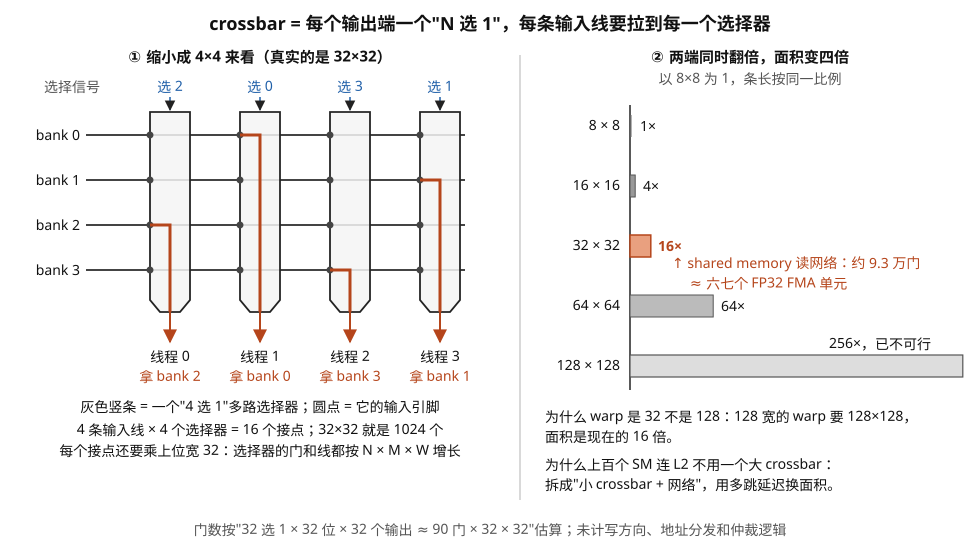
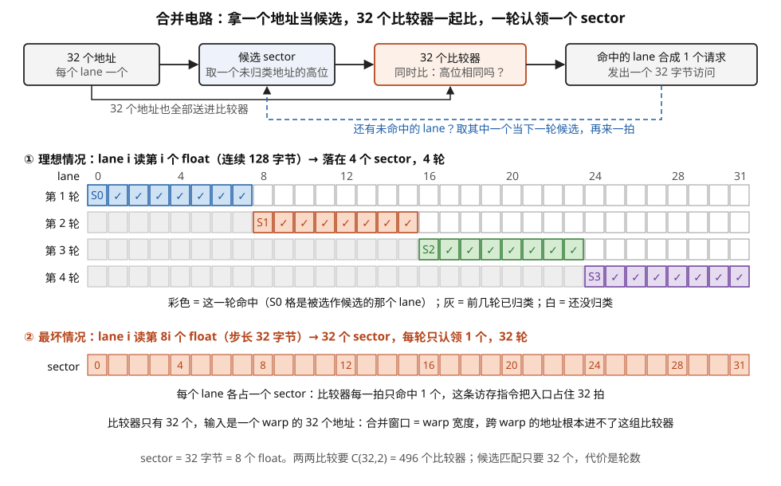
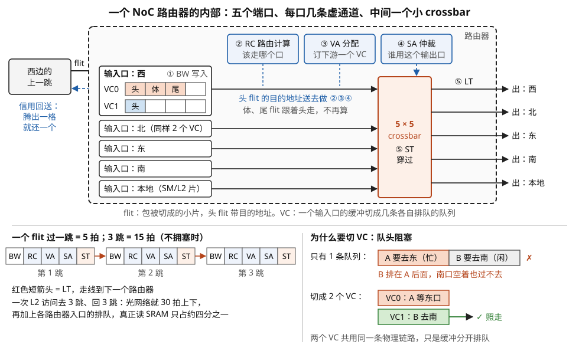
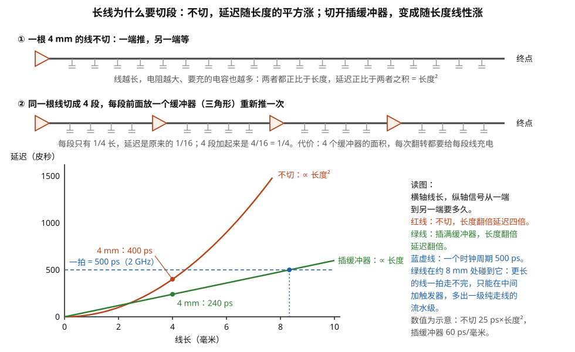
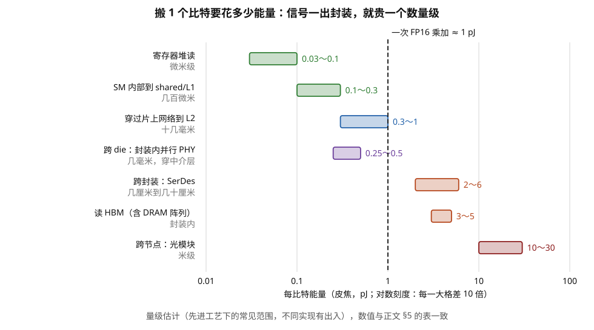
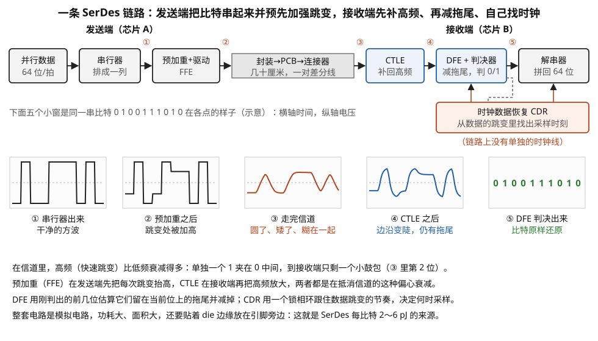
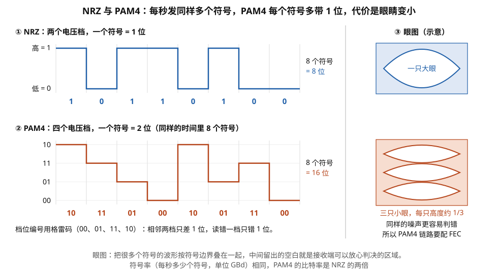
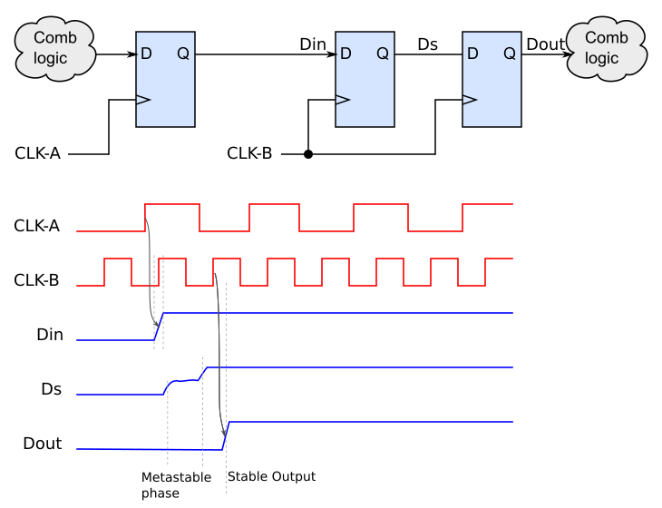
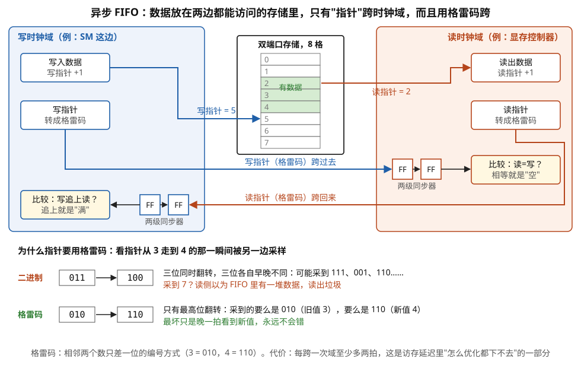

# 互连的物理实现：crossbar、NoC 路由器、SerDes 与跨时钟域

> **所属模块**：模块 30 · 互连
> **状态**：🟨 学习中（第一版。知识截至 2026-08）
> **本节主旨**：前面三节讲的都是"某个点上发生了什么"——一次乘加、一次 SRAM 读、一次发射决策。这一节讲**点与点之间**：数据在芯片上从一个地方到另一个地方，要穿过哪些电路。这条线上有一个贯穿全节的物理事实：**晶体管每代都在变快变小，金属线不但没有变快，还因为变细而变慢了**。后果是互连从"顺便连一下"变成了芯片设计的第一约束——**32 个线程访问 32 个 bank 那个"随便怎么排都行"的交叉开关，面积随两端数量的乘积增长；一次跨 die 的传输，能耗是一次片内 SRAM 读的十倍以上；而两个不同时钟域之间传一个字，物理上无法做到绝对可靠，只能把出错概率压到几万年一次。** 这一节把 crossbar、NoC 路由器、die 间 PHY 与 SerDes、异步 FIFO 四类互连器件依次拆开，并给出一张贯穿全芯片的"每比特搬多远花多少能量"的表——**它是理解模块 50 那句"数据搬运比计算贵"的最终依据。**

---

## 0. 这一节要回答的问题

- 交叉开关（crossbar）在硅上是什么？为什么它的面积长得那么快？
- shared memory 那个"32 个线程任意访问 32 个 bank"的网络，成本是多少？
- 访存合并（coalescing）在电路上是什么？为什么它只能在一个 warp 内做、不能跨 warp？
- L2 为什么要切成很多片（slice）？地址是怎么分到片上的？
- 片上网络（NoC）的路由器内部有哪几级？"虚通道"是干什么的？
- 为什么长线要插缓冲器？插了之后延迟和能量各是什么规律？
- 跨 die 的 PHY 和长距离的 SerDes 有什么本质区别？能耗差多少？
- SerDes 里的"均衡""时钟恢复"分别在解决什么问题？
- 两个不同时钟域之间传数据，为什么会有"亚稳态"？工程上怎么处理？
- 一次数据搬运的能量，随距离是怎么涨的？
- 架构图上到处都是 lane，它们指的是同一种东西吗？
- 怎么从一张图上的"×32""x16""1024-bit"折算出实际带宽？GT/s 和 Gb/s 差在哪？

---

## 1. 基础词汇：先把本节要用的词讲清楚

**多路选择器（multiplexer，MUX）**。数字电路里最基础的"开关"：N 个输入、一个输出、加一组选择信号，选择信号决定哪个输入被送到输出。2 选 1 是一个基本单元（约 3 个门），更宽的选择器用它们搭成树：N 选 1 大约需要 N−1 个 2 选 1 单元，延迟是 log₂N 级。**它是本节所有互连结构的原子零件。**

**交叉开关（crossbar）**。让 N 个输入端和 M 个输出端之间任意配对连通的网络。最直接的实现方式是：**给每个输出端配一个 N 选 1 的多路选择器**，一共 M 个。所以一个 N×M、每条通路 W 位宽的 crossbar，大致需要 M 个 N 选 1 选择器、每个 W 位宽——**规模正比于 N × M × W**。这个乘积是本节第一笔要算的账。

**仲裁器（arbiter）**。当多个请求方同时要用同一个资源（同一个输出端口、同一个存储 bank）时，决定这拍给谁用的电路。最常见的是**轮询仲裁（round-robin）**：维护一个指针，从指针位置开始找第一个有请求的，给它，然后指针移到它的下一个。物理上是一个优先编码器加一个可旋转的掩码。

**片上网络（NoC，Network-on-Chip）**。当芯片上要互连的单元多到不能用一个大 crossbar 时（比如上百个 SM 和几十片 L2），就把它们组织成一个网络：数据被切成**微片（flit）**，在**路由器（router）**之间一跳一跳传递。这和计算机网络是同一套概念，只是尺度在毫米和纳秒上。

**流控（flow control）**。防止发送方把接收方的缓冲塞爆的机制。芯片上最常用的是**基于信用的流控（credit-based）**：发送方记着接收方还剩几个缓冲槽（信用），发一个 flit 就减一个信用，接收方腾出槽位时回送一个信用。**它的好处是完全无损、且不需要等待往返确认。**

**PHY（物理层电路）**。把芯片内部的数字信号变成能在封装或电路板上传输的电信号的那一整套模拟电路：驱动器、接收器、终端匹配、时钟电路。**任何"离开这颗 die"的信号都要经过 PHY。**

**SerDes（serializer/deserializer，串行器/解串器）**。一种特殊的 PHY：把并行的多位数据在发送端串成一条极高速的串行流，接收端再还原成并行。**它的存在理由是引脚不够**——芯片能引出的引脚数有限（模块 21 讲过封装的扇出），所以宁可让每根线跑得极快（几十 Gbps），也不用很多根慢线。

**亚稳态（metastability）**。触发器要求输入在时钟沿前后一段时间内保持稳定（模块 13 第 1 节讲的 setup/hold）。如果输入恰好在这个窗口里变化，触发器可能进入一个既不是 0 也不是 1 的中间状态，并停留一段不确定的时间。**这不是设计缺陷，是物理上无法根除的现象**——只能把它发生并造成后果的概率压到足够低。

## 2. crossbar：为什么"任意互连"是芯片上最贵的东西之一

**先算 shared memory 那个网络的账。** 模块 10 说"一个 warp 的 32 个线程可以访问 shared memory 的 32 个 bank，只要不冲突就一拍完成"。这句话在电路上要求：**32 个数据源（bank 的输出）到 32 个目的地（线程的寄存器写口）之间，任意排列都要能连通**——这就是一个 32×32 的 crossbar。

按 §1 的公式，它需要 32 个 32 选 1 的多路选择器，每个 32 位宽（结构缩小成 4×4 画在图 2-1 左半）：

- 一个 32 选 1 的 1 位选择器约需 31 个 2 选 1 单元，约 90 个门。
- 32 位宽 → 约 2900 个门。
- 32 个输出端 → **约 93000 个门**。

作为对照，模块 13 第 2 节算过一个 FP32 FMA 大约 1 万几千个门。**也就是说，仅仅是 shared memory 的读数据交叉网络，就相当于六七个 FMA 单元的面积**——而且还没算写方向的网络、地址方向的分发网络、以及冲突检测和仲裁逻辑。

**更麻烦的是它的增长规律。** 面积正比于 N × M：

| crossbar 规模 | 相对门数 | 说明 |
| --- | --- | --- |
| 8 × 8 | 1× | |
| 16 × 16 | 4× | 端数翻倍，面积四倍 |
| 32 × 32 | 16× | |
| 64 × 64 | 64× | |
| 128 × 128 | **256×** | 已经完全不可行 |

**这条平方律是所有"为什么不做一个大的全互连"问题的统一答案。** 它同时解释了几件看起来无关的事：

- **为什么 warp 是 32 而不是 128**：warp 宽度直接决定了 shared memory 交叉网络的两端规模。128 宽的 warp 意味着 128×128 的 crossbar，面积是现在的 16 倍。
- **为什么 SM 内部分成 4 个子分区**：每个子分区 32 条通道各自面对自己那部分资源，比让 128 条通道共享一个大网络便宜得多。**"分区"这个架构决策的物理动机就是拆掉一个大 crossbar。**
- **为什么上百个 SM 连 L2 不能用 crossbar**：132 × 64 的全互连按上表推算已经在几百万门量级，且**连线本身会占满好几层金属**——真实设计必须换成分层结构或网络。

**还有一个常被忽略的成本：连线，而不是逻辑。** crossbar 里的多路选择器本身是小逻辑，但**每一条输入都要物理地拉到每一个输出选择器那里**，所以线的总长度也正比于 N × M × W。在先进工艺上，**这些线占的面积经常超过选择器本身**，而且它们是长线，要插缓冲器、要付延迟和功耗（§5）。**"crossbar 很贵"这句话，一半贵在逻辑，一半贵在线。**

> **图 2-1**　一句话：crossbar 就是给每个输出端配一个"从 N 个输入里挑一个"的选择器，每条输入线都要拉到每一个选择器那里，所以两端数量同时翻倍时，选择器的门和线都变成四倍。
>
> **先知道一件事**：多路选择器（图中灰色竖条）是一组受控的开关：它有好几个输入、一个输出，外面送来一个编号（图中顶上的蓝字"选 2"），它就把 2 号输入接到输出上，其它输入全部断开。
>
> **按这个顺序看**：
> 1. 左半边横着的四根线，是四个 bank（shared memory 里能各自独立读写的四块存储）送出的数据。每根线都从左贯穿到右，经过每一个选择器，并在那里留一个输入引脚（圆点）。
> 2. 竖着的四个灰条是四个"4 选 1"选择器，每个服务一个线程。顶上的蓝字是这一拍每个线程要读哪个 bank。
> 3. 红线是这一拍实际接通的路径：线程 0 拿 bank 2，线程 1 拿 bank 0，线程 2 拿 bank 3，线程 3 拿 bank 1。四个线程要的 bank 互不相同，所以一拍就能全部送到。
> 4. 数一下接点：4 条线 × 4 个选择器 = 16 个。真实的 shared memory 是 32 个 bank 对 32 个线程，就是 1024 个接点，而且每个接点还要乘上 32 位的数据宽度。
> 5. 右半边是规模的增长。以 8×8 为 1，16×16 是 4，32×32 是 16（橙色，就是 shared memory 这张网，约 9.3 万个门），128×128 是 256。条长按同一比例画，所以 32×32 那条还很短，128×128 已经横穿整幅图。
>
> **打个比方**：老式电话交换台要让 32 部电话里任意一部接通任意另一部，接线员面前就得有 32 × 32 个插孔；电话数翻倍，插孔变成四倍。
>
> **看懂的标志**：能回答"为什么 warp 宽度定在 32 而不是 128"——warp 宽度就是这张网两端的数量，128 宽要 128×128 的 crossbar，面积是现在的 16 倍，而且多出来的有一半是长线。
>
> **与正文的对照**：门数算法同本节开头的三行估算（一个 32 选 1 的 1 位选择器约 90 个门）。图中只画了读方向的数据网络，写方向、地址分发和 bank 冲突检测都不在图中。
>
> 来源：本库自绘。

## 3. 访存合并：一棵比较器树，和它的窗口为什么那么小

模块 10 第 4 节讲过合并（coalescing）：一个 warp 的 32 个线程各发一个地址，硬件把落在同一个 32 字节 sector 里的合并成一个请求。这一节讲这件事的电路。

**朴素做法的成本。** 要知道 32 个地址里哪些是同一个 sector，最直接的办法是两两比较：32 个地址两两组合是 C(32,2) = **496 次比较**，每次比较是一个约 40 位的比较器（地址高位）。496 × 40 位比较器，加上从比较结果推导分组的逻辑——**面积大得离谱，而且逻辑深度很深，一拍绝对做不完。**

**真实硬件的做法是"候选 sector 匹配"**（电路与逐轮过程见图 2-2），思路是：

1. 取第一个（或按某种规则选出的）地址，算出它属于哪个 sector，作为**候选 sector 0**。
2. 用 32 个比较器**并行地**把所有 32 个地址和候选 sector 0 比一次，命中的打上标记。
3. 从未命中的地址里再取一个，作为候选 sector 1，重复上一步。
4. 直到所有地址都被归类。

**这个做法的成本是 32 个比较器（可复用），代价是拍数：需要几个候选就要几拍。** 理想情况（32 个地址落在 4 个 sector 里，即完美合并的 128 字节访问）只要 4 轮；最坏情况（32 个地址在 32 个不同 sector）要 32 轮——**这正是模块 13 第 4 节讲的"重放"：不是指令被重发，是这条指令在地址级要占住入口 32 拍。**

> **图 2-2**　一句话：合并电路不做两两比较，而是每一拍拿一个地址当"候选"，用 32 个比较器同时查出哪些 lane 和它落在同一个 32 字节块里，命中的一起打包成一个请求。
>
> **先知道一件事**：显存不是一个字节一个字节地读，而是按 32 字节一块来读，这一块叫 sector。一个 warp 的 32 个线程各占一个 lane（一条执行通道），各给出一个地址，硬件要把它们归并成尽量少的 sector 请求。判断两个地址是否在同一个 sector，只需比较去掉最低 5 位之后的高位是否相同。
>
> **按这个顺序看**：
> 1. 顶上一排方框是电路本身：32 个地址、一个存放"候选 sector"的寄存器、32 个比较器、把命中的 lane 合成一个请求的逻辑。蓝色虚线表示：还有 lane 没被归类，就从中挑一个当下一轮的候选，下一拍再比一次。
> 2. 看 ① 理想情况：lane i 读第 i 个 float（4 字节），32 个 lane 正好覆盖连续的 128 字节，也就是 4 个 sector。第 1 轮拿 lane 0 当候选（标 S0 的格），比较器发现 lane 0～7 都在这个 sector 里（蓝色对勾），一起打包。
> 3. 第 2 轮从剩下的白格里拿 lane 8 当候选，认领 lane 8～15；第 3、4 轮同理。4 轮之后全部归类，发出 4 个请求。
> 4. 看 ② 最坏情况：lane i 读第 8i 个 float，相邻 lane 相隔 32 字节，每个 lane 各落在一个不同的 sector。比较器每一轮只能命中候选自己，要 32 轮、发 32 个请求，这条访存指令把入口占住 32 拍。
>
> **看懂的标志**：能回答"warp 0 和 warp 1 的地址首尾相接，硬件会把它们合并吗"——不会。比较器只有 32 个，输入端接的是同一个 warp 的 32 个地址，另一个 warp 的地址根本不在这组比较器的输入里。
>
> **与正文的对照**：两两比较要 C(32,2) = 496 个比较器；候选匹配只要 32 个，用轮数换面积。② 的情况在 profiler 里表现为 sectors per request 从理想的 4 变成 32（见 §9 的表）。
>
> 来源：本库自绘。

**现在可以回答一个模块 10 没解释的问题：为什么合并只在一个 warp 内做，不能跨 warp？** 因为合并电路的输入宽度是硬连线的 32 个地址。**要跨两个 warp 合并，比较器阵列要变成 64 输入，候选匹配的轮数上限翻倍，而且两个 warp 的访存指令还得被硬件凑到同一拍**——这需要一个访存请求的重排序缓冲，那是 CPU 的路子（模块 13 第 4 节对照表里 GPU 明确砍掉的东西）。**合并窗口等于 warp 宽度，是电路宽度决定的，不是软件约定。**

**这条认识对写代码的直接影响**：想要合并，就必须让**同一个 warp 内相邻的 lane 访问相邻的地址**。跨 warp 的连续性没有任何帮助——即使 warp 0 和 warp 1 的访问在地址上首尾相接，硬件也不会把它们合并成一个请求。**这是"为什么索引要用 `threadIdx.x` 做最内层"这条老规矩的电路依据。**

## 4. 从 SM 到 L2：切片、地址散列与片上网络

**L2 为什么要切片。** H100 的 L2 是 50 MB。如果做成一整块 SRAM，它的位线和字线长到无法工作（模块 13 第 03 节算过），而且**132 个 SM 同时来访问，一个入口一拍只能服务一个**——带宽完全不够。所以 L2 被切成几十个**片（slice）**，每片是一块独立的、有自己 tag 阵列和访问端口的 cache。

**地址怎么分到片上：散列（hashing）。** 最简单的做法是取地址的某几位当片号，但那会出事——如果程序按某个大步长访问（比如每次跳 4096 字节），这些地址的低位模式相同，**会全部落在同一片上，其余几十片闲着**。这就是模块 10 讲过的"分区camping（partition camping）"现象。所以真实硬件用一个**散列函数**：把地址的很多位异或搅拌之后再取片号，让任何规则的访问模式都被打散。

**代价是：软件失去了对"数据落在哪片"的控制。** 散列函数不公开，且各代际会变。**这是一个典型的硬件设计取舍——用不可预测性换取统计意义上的均匀。** 它的后果是，模块 40 讲的那些精细的数据布局优化，到了 L2 这一层就基本失效了，只能靠"访问模式尽量随机化或尽量局部化"这类粗粒度手段。

**SM 与 L2 之间的网络。** 132 个 SM 对几十片 L2，全 crossbar 已经不可行（§2 的平方律），所以是分层结构：SM 先在 GPC（图形处理簇）内部汇聚，GPC 之间和 L2 之间由一个更粗粒度的网络连接。这个网络在 NVIDIA 的公开材料里细节很少，但它的存在能从两个现象上被观察到：**跨 GPC 的访问延迟高于同 GPC**（Hopper 的线程块簇/DSMEM 特性正是为了利用这一点，见模块 50），以及**L2 带宽在全芯片满负荷时会饱和**。

**路由器内部有什么。** 通用的 NoC 路由器（AMD、Intel 的多核互连和很多 NPU 都用标准结构）流水线是五级（路由器内部结构见图 2-3）：

| 级 | 名称 | 干什么 |
| --- | --- | --- |
| 1 | BW（缓冲写入） | 到达的 flit 存进对应输入端口的缓冲队列 |
| 2 | RC（路由计算） | 根据目的地址算出该往哪个输出端口走 |
| 3 | VA（虚通道分配） | 给这个包分配下游路由器的一个虚通道 |
| 4 | SA（交换分配） | 仲裁：多个输入端口都想去同一个输出端口时，选一个 |
| 5 | ST + LT（交换穿越 + 链路传输） | 穿过路由器内部的小 crossbar，走线到下一跳 |

**虚通道（virtual channel, VC）解决的是队头阻塞。** 如果一个输入端口只有一个队列，队头那个 flit 因为目的端口忙而卡住，**后面所有 flit 即使目的端口空闲也过不去**。虚通道的做法是把一个物理输入端口的缓冲切成几个逻辑队列，各自独立排队，共享同一条物理链路。**代价是缓冲、分配器和状态机都要按 VC 数量翻倍。** 虚通道还有第二个用途：**避免死锁**——把不同类型的流量（请求 / 响应）分到不同 VC，可以打破"请求等响应、响应等请求"的循环。

> **图 2-3**　一句话：片上网络的每个路由器有五个输入口，每口的缓冲切成几条各自排队的虚通道；一个数据片过一个路由器要经过写缓冲、算路由、订下游通道、仲裁、穿过交叉开关五步，每步一拍。
>
> **先知道一件事**：在片上网络里，一次传输（一个包）被切成若干个固定大小的小片，叫 flit。第一个叫头 flit，带着目的地址；后面的体 flit、尾 flit 只装数据，跟着头 flit 走同一条路。
>
> **按这个顺序看**：
> 1. 虚线大框是一个路由器，用在网格结构里：东、南、西、北四个方向连着邻居路由器，另有一个"本地"口连着挂在它上面的 SM 或 L2 片，所以是五进五出。
> 2. 左上是展开画的"西"输入口。flit 从左边的上一跳进来，第 ① 步 BW 把它写进缓冲。缓冲分成 VC0、VC1 两条队列（VC 即虚通道），VC0 里排着一个包的头、体、尾三个 flit，VC1 里是另一个包的头 flit。
> 3. 看顶上三个蓝框：头 flit 的目的地址送到 ② RC，算出该从哪个输出口出去；③ VA 在下一跳路由器的输入口里订一条空闲的虚通道；④ SA 在多个输入口都想用同一个输出口时，决定这一拍给谁。
> 4. 橙色方框是路由器中间的 5×5 crossbar：第 ⑤ 步 ST 让 flit 穿过它到达选定的输出口，然后 LT 沿导线送到下一个路由器。
> 5. 最左边的蓝色虚线是信用回送：下游每腾出一个缓冲格，就还给上游一个"信用"；上游手里没有信用就不发。所以缓冲永远不会被挤爆，也不会丢数据。
> 6. 左下是一个 flit 连走 3 跳的拍数：每跳五拍，3 跳 15 拍，一去一回 30 拍，这还是没有排队的情况。
> 7. 右下说明为什么要切虚通道：只有一条队列时，队头的 A 要去的东口正忙，排在它后面、要去空闲南口的 B 也只能干等；切成两条队列后，B 在自己的队列里直接走。
>
> **打个比方**：只有一条车道的路口，前车等左转，后面直行的车全被堵住；多画一条直行车道（虚通道），路面还是那条路（同一条物理链路），直行车就不必陪着等。
>
> **看懂的标志**：能回答"L2 命中率已经 90%，为什么延迟还是很差"——一次 L2 访问光是网络流水就要 30 拍左右，高负载时每个路由器入口还要排队，而读 SRAM 本身只占约四分之一。
>
> **与正文的对照**：五级名称与本节路由器流水线表一致。真实路由器常把几级合并（例如把路由计算提前到上一跳做），不拥塞时每跳可以少于五拍，所以拍数构成表里网络一项写作 15～30 拍。NVIDIA 的 SM 到 L2 网络拓扑没有公开，这里画的是通用的网格路由器；网格、环、全互连三种拓扑的对照见模块 30 的图 1-2。
>
> 来源：本库自绘。

**一个可以跟踪的例子：一次 L2 访问的拍数构成。** 假设一个 SM 发出的请求要走 3 跳到达目标 L2 片：

| 阶段 | 拍数 |
| --- | --- |
| SM 内地址计算与合并 | 4~10 |
| L1 查找与缺失判定 | 20~30 |
| 网络：3 跳 × 每跳 5 级流水（不拥塞时可以缩短） | 15~30 |
| L2 片：tag 比较 + 数据阵列读 | 20~40 |
| 网络返回：3 跳 | 15~30 |
| 写回寄存器堆 | 5 |
| **合计** | **约 80~145 拍** |

真实测量的 L2 命中延迟在 **200 拍**量级，比这个估算大——差额来自排队等待（网络和 L2 片入口的仲裁队列）和更长的实际跳数。**这里要记住的结论是：L2 的延迟里，真正"读 SRAM"的部分只占四分之一左右，其余全是网络和排队。** 这也是为什么在高负载下延迟会显著恶化——排队部分对负载极其敏感。

## 5. 线本身：为什么长线要插缓冲器，以及能量随距离怎么涨

**一根金属线的电学模型是分布式的电阻和电容。** 一根长度 L 的线，电阻 R 正比于 L，对地电容 C 也正比于 L。信号在这根线上的传播延迟大致正比于 R × C，也就是**正比于 L²**。这是一个很糟糕的规律：线长翻倍，延迟四倍。

**解决办法是每隔一段插一个缓冲器（repeater）**：把长线切成 k 段，每段延迟正比于 (L/k)²，总延迟是 k × (L/k)² = L²/k——**插的缓冲器越多，延迟越接近线性**。工程上有一个最优间距（缓冲器本身也有延迟），典型是每几百微米插一个。图 2-4 把两种接法的延迟曲线画在了一起。

**代价有三条，每一条都不小**：

1. **面积**：缓冲器要占标准单元的位置，长线上密密麻麻的缓冲器在版图上是一条实实在在的走廊。
2. **功耗**：每个缓冲器每次翻转都要给下一段线的电容充放电。**长线的功耗正比于线长**，而且这部分功耗完全没有产生任何计算。
3. **流水级**：如果一段线长到即使插满缓冲器也超过一个时钟周期，就必须在中间插触发器，**变成一级流水**。芯片上确实存在这种"纯粹用来走线"的流水级——它对性能的贡献是零，纯粹是物理距离的税。

> **图 2-4**　一句话：一根导线不切的话，信号跑过去的时间随长度的平方增长；每隔一段插一个缓冲器重新推一次，时间就只随长度线性增长。
>
> **先知道一件事**：芯片上的金属线既有电阻，又对地有电容（图中每隔一段挂着的"接地"小符号表示这部分电容）。信号从一端传到另一端，就是驱动端要隔着电阻把整根线的电容充满电。线越长，电阻越大，要充的电容也越多，两者都正比于长度，所以时间正比于长度乘长度。
>
> **按这个顺序看**：
> 1. ① 一根 4 毫米的线只在最左端有一个驱动器（三角形），一路推到终点。
> 2. ② 同一根线切成 4 段，每段开头放一个缓冲器。缓冲器是一个把信号重新放大、重新推一次的小电路。每段只有原来的四分之一长，延迟变成十六分之一；四段加起来是原来的四分之一（还要加上缓冲器自身的延迟）。
> 3. 下方曲线横轴是线长（毫米），纵轴是延迟（皮秒，1 皮秒是 10⁻¹² 秒）。红色曲线是不切的线，长度翻倍延迟四倍；绿色直线是插满缓冲器的线，长度翻倍延迟翻倍。在 4 毫米处，红线 400 皮秒，绿线 240 皮秒。
> 4. 短于约 2.4 毫米时红线反而在下面：缓冲器本身也有延迟，线太短时插缓冲器不划算。这就是正文说的"存在一个最优间距"。
> 5. 蓝色虚线是一个时钟周期，2 GHz 时是 500 皮秒。绿线在约 8 毫米处碰到它：比这更长的线插满缓冲器也一拍走不完，只能在中间加触发器（在时钟沿把数据存住的单元），多出一级只为走线的流水级。
>
> **看懂的标志**：能说出插缓冲器的代价——每个缓冲器要占面积，每次信号翻转都要给它后面那段线充电，所以长线的功耗正比于线长，而这部分能量没有做任何计算。
>
> **与正文的对照**：曲线数值为示意（不切取 25 皮秒 × 长度²，插缓冲器取每毫米 60 皮秒），只用来显示平方与线性的差别，不对应某个具体工艺。对照一下尺度：一颗 800 平方毫米级的 GPU 边长近 30 毫米，横跨整颗芯片的信号要经过好几级走线流水。
>
> 来源：本库自绘。

**能量随距离的表：本节最该记住的一张表。** 下面是各类数据搬运的**每比特能量量级**（先进工艺下的普遍量级，不同实现有出入，重点看倍数关系；图 2-5 把它画在对数刻度上）：

| 搬运类型 | 距离量级 | 每比特能量 | 相对基准 |
| --- | --- | --- | --- |
| 寄存器堆读（含译码与灵敏放大） | 微米级 | 约 0.03~0.1 pJ | 1× |
| 跨 SM 内部（到 shared memory / L1） | 几百微米 | 约 0.1~0.3 pJ | 3× |
| 跨片到 L2（含网络与排队） | 十几毫米 | 约 0.3~1 pJ | 10× |
| 跨 die（封装内并行 PHY，如 UCIe 先进封装） | 几毫米，穿过键合或中介层 | 约 0.25~0.5 pJ | 5~10× |
| 跨封装（长距离 SerDes，如 NVLink/PCIe） | 几厘米到几十厘米 | 约 2~6 pJ | 50× |
| HBM 读（含 DRAM 阵列与 PHY） | 封装内 | 约 3~5 pJ | 50× |
| 跨节点（光模块） | 米级 | 约 10~30 pJ | 300× |

> **图 2-5**　一句话：把 1 个比特从一个地方搬到另一个地方，距离越远、越要穿过芯片和封装的边界，能量就越高；信号一出封装，比留在片内贵一个数量级左右。
>
> **先知道一件事**：横轴是对数刻度，每向右一大格，数值乘 10，所以两个条形在图上隔一格，能量就差 10 倍。pJ（皮焦）是 10⁻¹² 焦耳。
>
> **按这个顺序看**：
> 1. 先找黑色虚线：一次 FP16 乘加约 1 pJ。左边的搬运比一次乘加便宜，右边的比一次乘加还贵。
> 2. 最上面两行（绿色）都在 SM 里面：读寄存器堆 0.03～0.1 pJ，到 shared memory 或 L1 约 0.1～0.3 pJ。
> 3. 第三行（蓝色）穿过片上网络到 L2，走十几毫米，0.3～1 pJ，已经和一次乘加差不多。
> 4. 第四行（紫色）是跨 die 但留在封装内：两颗 die 挨着，中间用中介层上上千根短线并行连接，只要 0.25～0.5 pJ，甚至比跑到 L2 还便宜。
> 5. 第五、六行（橙色）：出了封装走 SerDes 要 2～6 pJ；读 HBM 虽然在封装内，但要打开 DRAM 阵列再经接口电路送出，3～5 pJ。
> 6. 最下面一行是跨机器的光模块，10～30 pJ。
>
> **看懂的标志**：能算出"一个从 HBM 读来、只用一次的 16 位数"要花多少搬运能量——16 位 × 3～5 pJ ≈ 50～80 pJ，是一次乘加的几十倍。所以一个数据被读进来之后被复用多少次，几乎直接决定了能效。
>
> **与正文的对照**：数值取自上表，都是先进工艺下的量级范围。第四行与第五行的对比就是 §6 两条技术路线分野的能耗依据。模块 11 的图 3-6 用 Eyeriss 团队的相对比例讲了同一件事在 PE 阵列里的样子。
>
> 来源：本库自绘。

**这张表是模块 50 那句"数据搬运比计算贵"的量化形式。** 对照模块 13 第 2 节：一次 FP16 乘加大约 1 pJ 量级，也就是**几十比特的搬运能量**。所以一次矩阵乘法如果每个数据只用一次，能量几乎全花在搬运上；数据复用率（模块 11 讲的 tiling 和数据流分类的核心目标）**直接就是能效比**。

**这张表还解释了封装技术的经济学（模块 21）**：跨 die 的并行 PHY 比长距离 SerDes 省一个数量级的能量，这正是"把两颗 die 用中介层或混合键合缝在一起"值得付出高昂封装成本的理由——**省下的不只是延迟，主要是每比特能量**。

## 6. 离开这颗 die：并行 PHY 与 SerDes 的分野

**两条技术路线的分界线是"信道有多难走"。**

**并行 PHY（封装内，短距离）**。die 之间的距离只有几毫米，走的是中介层或键合面上的短线，信号衰减很小。所以可以：**用很多根线、每根跑得不太快、用最简单的收发电路**。UCIe 的先进封装模式就是这个路子——凸块间距做到几十微米，一次能引出上千根线，每根几 Gbps，收发端几乎就是加强版的缓冲器加一点时序对齐逻辑。**能耗低到零点几 pJ/bit，就是因为省掉了所有复杂的模拟电路。**

**SerDes（封装外，长距离）**。信号要穿过封装基板、PCB 上几十厘米的走线、连接器，甚至线缆。这段信道对高频分量的衰减极其严重（几十 dB），一个方波发出去，到接收端已经变成一团模糊的波形，相邻比特互相重叠——这叫**码间串扰（ISI）**。要在这种信道上跑几十 Gbps，收发两端都要堆复杂的模拟电路（整条链路与各点波形见图 2-6）：

| 电路 | 作用 |
| --- | --- |
| 串行器 + 驱动器 | 把并行数据串成高速流并驱动到信道上 |
| 发送端预加重（FFE） | 提前把高频分量加强，抵消信道衰减 |
| 接收端连续时间线性均衡（CTLE） | 用一个模拟滤波器把被压平的高频拉回来 |
| 判决反馈均衡（DFE） | 用已经判决出的前几个比特，反推它们对当前比特的干扰并减掉 |
| 时钟数据恢复（CDR） | 接收端没有单独的时钟线，必须**从数据流本身的跳变里提取出时钟**，用锁相环跟踪 |
| 前向纠错（FEC） | 速率高到误码率无法为零时，用编码在链路层纠错，代价是额外的延迟和带宽开销 |

> **图 2-6**　一句话：一条 SerDes 链路从发送端到接收端要经过五个环节，每个环节都在对付同一个问题：长导线对快速跳变的削弱远大于对慢速变化的削弱，比特到达接收端时已经糊成一团。
>
> **先知道一件事**：下面五个小窗是示波器的视角：横轴是时间，纵轴是电压，中间的灰色虚线是判 0 还是判 1 的分界，高于它读成 1，低于它读成 0。
>
> **按这个顺序看**：
> 1. 上排是链路本身，从左往右：芯片 A 每拍 64 位的并行数据进串行器，被排成一位接一位的高速比特流；再经过预加重和驱动器送上导线；穿过封装、电路板和连接器组成的几十厘米信道（灰框）；到芯片 B 先过 CTLE，再过 DFE 和判决器，最后由解串器拼回 64 位。红色圈号 ①～⑤ 是下面五个小窗的取样位置。
> 2. 小窗 ①：串行器出来是干净的方波，比特串是 0 1 0 0 1 1 1 0 1 0。
> 3. 小窗 ②：预加重（FFE）把每次跳变后的第一位抬高一些，连续相同的位则稍低。它在发送端提前补偿信道对跳变的削弱。
> 4. 小窗 ③：走完信道后，波形变圆、变矮，前一位的电压还拖进后一位（这叫码间串扰）。第 2 位那个夹在两个 0 中间的 1 只剩一个小鼓包，没有越过分界线，直接判会读错。
> 5. 小窗 ④：CTLE 是接收端的一个模拟滤波器，把快速变化的部分放大，边沿重新变陡，第 2 位的鼓包越过了分界线，但各位仍拖着尾巴。
> 6. 小窗 ⑤：DFE 用已经判出的前几位估算它们留下的尾巴并减掉，判决器再按分界线判 0 或 1，还原出原来的比特。
> 7. 右边橙色框是 CDR（时钟数据恢复）。链路上只有数据线、没有时钟线，接收端必须从数据跳变的时刻推算"什么时候采样最准"，再把这个采样时钟送给判决器和解串器。
>
> **打个比方**：隔着一个回声很重的山谷喊话。喊的人把每个字的开头咬得特别重（预加重），听的人先让耳朵对尖音更灵（CTLE），再在心里减掉上一个字的回声（DFE），并靠对方说话的节奏判断每个字从哪一刻开始（CDR）。
>
> **看懂的标志**：能回答"为什么封装内 die 之间的并行连接不需要这一套"——几毫米的短线几乎不削弱跳变，小窗 ③ 那样的变形不会出现，所以省掉了 FFE、CTLE、DFE、CDR，每比特能耗从几 pJ 降到零点几 pJ。
>
> **与正文的对照**：五个小窗的波形为示意，只表示变化的方向。DFE 的内部结构和数字算例见模块 20 的图 3-8，锁相环见模块 20 的图 3-4，真实的 NRZ 眼图见模块 20 的图 3-1。上表最后一行的 FEC（前向纠错，在链路层用编码纠正少量误码）不在这张图里。
>
> 来源：本库自绘。

**这一整套电路就是 SerDes 每比特能耗高一个数量级的原因**，也是它面积大、且必须放在 die 边缘（靠近引脚）的原因——**模块 21 讲的"岸线密度"约束，说的正是这些 PHY 抢占 die 边缘的争夺战。**

**一个能说明分野的例子。** 同样是"把 100 GB/s 从 A 送到 B"：

- **封装内并行 PHY**：1000 根线 × 每根 1 Gbps × 能耗 0.3 pJ/bit → **功耗 0.24 W**，但需要 1000 个凸块和中介层布线。
- **封装外 SerDes**：4 条 lane × 每条 200 Gbps × 能耗 4 pJ/bit → **功耗 3.2 W**，但只要 8 个引脚（差分对）。

**十几倍的功耗差，换来的是引脚数从一千降到八。** 什么时候用哪个，就取决于两颗 die 能不能被塞进同一个封装——**这就是模块 21 讲的封装技术为什么值那么多钱。**

## 7. "lane"这个词：架构图上的四种含义，以及怎么从它折算带宽

看硬件架构图时，`lane` 这个词几乎无处不在——计算单元旁边写 32 lanes，显存接口旁边写 byte lane，PCIe 插槽写 x16，die 之间的接口写 lane count。它们的共同点只有一个：**"一条并行的通道"**。但它们指的东西完全不同，**看图时如果不先确认是哪一种，折算出来的带宽会差几个数量级**。这一节先消歧，再给一套通用的折算方法。

**四种 lane 的对照。**

| 图上出现的 lane | 指的是什么 | 一条 lane 一次传多少 | 典型数量 |
| --- | --- | --- | --- |
| **计算 lane（SIMD lane）** | SIMD 阵列里的一条数据通路，配一份运算电路和一片寄存器 | 32 位（一个 FP32） | 一个 SM 子分区 32 条 |
| **字节 lane（byte lane / DQ 组）** | 并行存储接口上的一组数据引脚 | 8 位 | 一个 32 位接口有 4 条 |
| **链路 lane（SerDes lane）** | 一对差分线，串行传输 | 一个符号（NRZ 是 1 位，PAM4 是 2 位） | PCIe x16 就是 16 条 |
| **die 间 lane（UCIe 等封装内接口）** | 封装内并行接口上的一根信号线 | 1 位 | 一个模块几十到上百条 |

**它们全都服从同一个折算公式**：

> **带宽 = 通道数 × 每通道每次传输的位数 × 每秒传输次数 ÷ 8**

差别只在"每秒传输次数"从哪来：**计算 lane 和字节 lane 用的是时钟频率**（并行接口还要看是不是双沿传输），**链路 lane 用的是符号率（厂商常写成 GT/s，口径见下面陷阱 1）**。下面四个算例，四种 lane 各一个。

**算例一：计算 lane —— 寄存器堆的读带宽。** 一个 SM 有 4 个子分区，每个 32 条 lane，每条 lane 每拍要取 3 个 4 字节源操作数：

> 4 × 32 × 3 × 4 = **1536 字节/拍**
> 按 1.755 GHz：1536 × 1.755×10⁹ ≈ **2.7 TB/s（单个 SM）**
> 132 个 SM：≈ **356 TB/s**

**这就是模块 13 第 03 节说的"寄存器堆是全芯片带宽最高的存储"的算法。** 它之所以能达到这个量级，正是因为它是 32 × 132 = 4224 条**物理上互相独立的窄通道**在并行工作（模块 13 第 02 节 §4 的 lane 切片），而不是某一块 SRAM 跑得特别快。

**算例二：字节 lane —— HBM 的带宽。** 一个 HBM3 堆叠对外是 1024 位宽的接口（也就是 128 条字节 lane）。H100 上每个数据引脚的速率是 5.23 Gb/s：

> 1024 × 5.23×10⁹ ÷ 8 = **669 GB/s（每堆叠）**
> H100 SXM 用 5 个堆叠：5 × 669 ≈ **3.35 TB/s** ✓（与官方规格一致）

**两个要点。** 第一，**HBM3 规范支持到 6.4 Gb/s，而 H100 并没有跑满**——规范速率和产品速率是两回事，看规格表时要认产品实测值。第二，这里的"位宽"是**物理引脚数**，所以它直接受模块 21 讲的岸线密度和中介层布线能力约束——**想加带宽，要么提引脚速率，要么加引脚，而后者受封装物理限制**，这正是模块 21 那条主线。

**算例三：链路 lane —— PCIe。** PCIe 5.0 每条 lane 的符号率是 32 GT/s，编码是 128b/130b：

> 每 lane 有效速率 = 32×10⁹ × (128/130) ÷ 8 = **3.94 GB/s（单向）**
> x16 = **63 GB/s（单向）**，即 **126 GB/s（双向合计）**

**这个算例里有三个必须记住的陷阱**：

1. **符号率不等于比特率，而 GT/s 两种用法都有。** 导线上每秒发出的**符号**数叫符号率（单位波特，GBd）。NRZ 编码一个符号携带 1 位，符号率和比特率数值相同；但 **PAM4 一个符号携带 2 位**，比特率是符号率的两倍（两者的波形对照见图 2-7）。GT/s（每秒传输次数）在 NRZ 时代两者不分，到了 PAM4 就要看口径：PCIe 6.0 标称的 64 GT/s 数的是比特，线上实际是 32 GBd 的 PAM4 符号；有些 SerDes 资料里的 GT/s 数的却是符号。现代高速 SerDes 大多用 PAM4，看到 GT/s 时要先确认它数的是符号还是比特。
2. **编码开销要扣。** 128b/130b 约扣 1.5%，老的 8b/10b 要扣 20%；速率再高时还要叠加前向纠错的开销。
3. **单向还是双向。** 厂商习惯报双向合计，比较时必须先统一口径，否则会差两倍。

> **图 2-7**　一句话：NRZ 每个符号只有高低两档、带 1 位；PAM4 每个符号有四档电压、带 2 位，所以同样每秒发 N 个符号，PAM4 送出 2N 个比特，代价是相邻两档的电压间隔只剩三分之一。
>
> **先知道一件事**：符号是导线上"一小段时间内保持不变的一个电压值"。每秒发出多少个符号叫符号率，单位是波特（32 GBd 即每秒 32 × 10⁹ 个符号）；每秒送出多少个比特叫比特率（Gb/s）。两者只在每个符号带 1 位时数值相等。
>
> **按这个顺序看**：
> 1. ① NRZ：8 个时间格，每格一个符号，电压只有高、低两档，读出 1 0 1 1 0 1 0 0，共 8 位。
> 2. ② PAM4：同样 8 个时间格，电压有四档，从上到下编号 10、11、01、00。每格读出两位：10 11 01 00 10 01 11 00，共 16 位。
> 3. 档位编号不是按 00、01、10、11 的顺序排，而是让相邻两档只差 1 位（这叫格雷码）。接收端受噪声干扰读错一档时，只错 1 位而不是 2 位。
> 4. ③ 眼图：把成千上万个符号的波形按符号边界叠在一起，中间留下的空白（"眼"）就是接收端能放心判决的余量。NRZ 只有一只大眼；PAM4 在同样的电压摆幅里塞进四档，出现三只眼，每只高度约为原来的三分之一，同样大小的噪声更容易把它合上。
>
> **看懂的标志**：能把"每条 lane 32 GBd、PAM4"换算成比特率——32 × 2 = 64 Gb/s；还能说出为什么 PAM4 链路几乎都要配前向纠错：眼睛变小之后误码率压不到零，只能靠编码把少量错误纠回来。
>
> **与正文的对照**：对应上面陷阱 1。PCIe 6.0 标称 64 GT/s，线上实际是 32 GBd 的 PAM4 符号，也就是说它的 GT/s 数的是比特而不是符号。真实眼图：NRZ 见模块 20 的图 3-1，三档电压的 PAM3 见模块 20 的图 3-17；本图的眼图为示意。
>
> 来源：本库自绘。

**算例四：NVLink —— 同样是链路 lane，但按"链路"报数。** Blackwell 的 NVLink 5：

> 每 GPU 18 条链路 × 每条 50 GB/s（单向）= 900 GB/s（单向）= **1.8 TB/s（双向合计）**

官方口径的"1.8 TB/s"就是这么来的。Rubin 一代的 NVLink 6 计划把它再翻倍到约 3.6 TB/s（已发布规格，2026 年内爬产）。**比较不同厂商的互连时，第一件事永远是把口径统一成单向。**

**从任何一张架构图上读出带宽的四步法**：

1. **先确认这是哪种 lane**——看它连的是计算单元、存储颗粒，还是走出了封装。
2. **找通道数**——图上通常直接标着 ×32、x16、或者 1024-bit。
3. **找速率，并确认单位**——是时钟频率（要问是不是双沿）、是 GT/s（要问是不是 PAM4）、还是已经折算好的 Gb/s。
4. **扣编码开销，确认单向还是双向。**

**一个常见的误读示范**：看到"HBM3e 每引脚 9.6 Gb/s"和"NVLink 每对 200 Gb/s"，很容易得出"显存比 NVLink 慢二十倍"的结论。**但前者是每引脚速率、后者是每差分对速率，两者都要乘上各自的通道数才有可比性**——HBM 那一侧有 1024 条，NVLink 那一侧只有几十条。

**这组对比正好是 §6 那条分野在数字上的体现：并行接口靠通道数取胜，串行接口靠单通道速率取胜。** 前者要求两端物理上挨得很近（否则布不下上千根线），后者能跑很远但每比特能量高一个数量级。**看到一张图上标着"1024-bit"还是"x16"，其实就已经知道这条通路是封装内还是封装外了。**

## 8. 跨时钟域：一个无法根除的物理问题

一颗 GPU 上不止一个时钟。核心（SM）一个时钟域，L2 和网络可能另一个，显存控制器和 HBM PHY 又是另一个（且频率完全不同），NVLink PHY 还有自己的。**数据要在这些域之间穿行。**

**问题的本质。** 接收域的触发器要求数据在它的时钟沿前后一小段窗口内稳定。但发送域的时钟和它没有固定的相位关系，**数据的变化时刻相对于接收时钟沿是随机的**——总有一定概率恰好落在那个窗口里。落进去之后，触发器会进入亚稳态：输出电压悬在 0 和 1 之间，需要一段随机长度的时间才会"塌"到某一边。**如果它在下游电路采样它之前还没塌下来，就会传播出一个非法值，后果不可预测。**

**注意这个问题不能靠"设计得更仔细"解决。** 它是采样一个异步信号的固有属性，概率不为零。工程上的处理是把它的**平均无故障时间（MTBF）**压到远超产品寿命。

**标准解法一：两级同步器。** 让信号连续经过两个触发器再使用（波形见图 2-8）。第一个触发器可能进入亚稳态，但它有整整一个时钟周期的时间去恢复；恢复的概率随时间指数上升，所以经过一个周期之后仍未稳定的概率极低。**加一级触发器，MTBF 提升几个数量级**（典型能把 MTBF 从秒级提到几万年）。代价是增加一到两拍延迟。

> **图 2-8**　一句话：一个信号从时钟 A 的区域送进时钟 B 的区域时，第一个触发器可能被"卡在中间"一会儿；再串一个触发器等它一拍，输出就稳定了。
>
> **先知道一件事**：触发器（图中浅蓝方块，D 是数据输入，Q 是输出，左下的小三角是时钟输入）只在时钟上升沿那一刻"拍照"，把 D 的值存下来送到 Q。拍照那一刻前后很短的时间内，D 必须保持不变；如果 D 恰好在这时变化，Q 可能停在既不是 0 也不是 1 的中间电压上，过一段随机的时间才落到某一边，这就是亚稳态。
>
> **按这个顺序看**：
> 1. 上半是电路：左边的触发器由 CLK-A 驱动，属于 A 时钟域；它的输出 Din 送进右边两个串联的触发器，这两个由 CLK-B 驱动，属于 B 时钟域。两端的 Comb logic 是各自的组合逻辑（与门、或门之类的计算电路）。
> 2. 下半是波形，横轴是时间。两条红线是两个时钟：CLK-A 慢，CLK-B 快，两者的跳变时刻没有固定关系。
> 3. 看蓝色的 Din：它在 CLK-A 的上升沿之后变高（左边的细弯箭头表示这个因果），而它变化的时刻恰好贴着 CLK-B 的一个上升沿。
> 4. 看 Ds（第一个 B 触发器的输出）：它没有干脆地跳上去，而是先抬到半高、停留一会儿（标注 Metastable phase，亚稳态阶段），然后才升到高电平。
> 5. 看 Dout（第二个 B 触发器的输出）：它在 CLK-B 的下一个上升沿才去采 Ds，那时 Ds 已经稳定，所以 Dout 干净地一跳到位（标注 Stable Output，稳定输出）。下游电路只用 Dout。
>
> **打个比方**：一枚硬币恰好立在桌面上，迟早会倒向一边，但不知道要立多久。两级同步器的做法是先不去读它，等一整拍再看；等得越久，它还立着的可能性越小。
>
> **看懂的标志**：能回答"两级同步器能不能用来传一个 32 位的数"——不能。32 位各自可能在不同的拍稳定下来，第二级拍到的可能一半是新值、一半是旧值，拼出一个从未存在过的数。多位数据要用图 2-9 的异步 FIFO。
>
> **与正文的对照**：图中 Ds 就是正文说的"第一个触发器可能进入亚稳态"，Dout 是经过两级之后的安全信号；Dout 比 Din 晚了一到两个 CLK-B 周期，这就是"增加一到两拍延迟"。
>
> 来源：[Metastability D-Flipflops.svg](https://commons.wikimedia.org/wiki/File:Metastability_D-Flipflops.svg)，作者 wdwd，许可 CC BY-SA 4.0（本库加了白色背景）。

**标准解法二：异步 FIFO（用于成批传数据）。** 两级同步器只能安全传递单个电平信号，不能传多位数据（多位数据同时穿越时，各位可能在不同拍稳定下来，组合出一个从未存在过的值）。传数据用异步 FIFO（结构见图 2-9）：

1. 一块双端口 SRAM，写口在发送域，读口在接收域。
2. 读写指针各自在自己的域里增长。
3. **指针用格雷码（Gray code）编码后再跨域**——格雷码的性质是相邻两个数只有一位不同，所以即使跨域时采到"新旧交界"的瞬间，读到的也一定是新值或旧值之一，不会是一个中间的错值。
4. 跨过去的指针经过两级同步器，再用来判断空/满。

> **图 2-9**　一句话：异步 FIFO 让数据留在一块两边都能直接读写的存储里，跨时钟域的只有读写指针；指针在跨域前先换成格雷码，保证对面采到的要么是旧值、要么是新值。
>
> **先知道一件事**：FIFO 是先进先出的队列。这里用一块 8 格的存储加两个指针实现：写指针指向下一个要写的格子，读指针指向下一个要读的格子，两者之间的格子就是还没被读走的数据。
>
> **按这个顺序看**：
> 1. 左边蓝框是写时钟域（例如 SM），右边橙框是读时钟域（例如显存控制器），两边的时钟频率不同，跳变时刻也没有固定关系。
> 2. 中间是双端口存储：左边一个写口、右边一个读口，可以同时使用。现在第 2、3、4 格有数据（绿色），写指针 = 5，读指针 = 2。写入时写到第 5 格并把写指针加 1，读出时从第 2 格读并把读指针加 1。数据本身在存储里，不需要跨域采样。
> 3. 读侧要知道"还有没有数据"，就得知道写指针。蓝色长线把写指针（先转成格雷码）送到右边，经过两个触发器（FF）组成的两级同步器，再和读指针比较：两者相等，说明读已追上写，FIFO 为空，不能再读。
> 4. 写侧同理：红色长线把读指针送回左边，经两级同步器后与写指针比较；写指针绕一圈追上读指针，说明 8 格已满，不能再写。
> 5. 下半说明为什么非用格雷码不可。指针从 3 走到 4 时，二进制是 011 → 100，三位同时翻转，而三位翻转的时刻各有早晚。对面恰好在这个瞬间采样，可能采到 111（即 7）这种从未出现过的值，读侧会误以为 FIFO 里有 5 个数据，读出垃圾。格雷码下 3 是 010、4 是 110，只有一位变，采到的不是 3 就是 4。
>
> **看懂的标志**：能回答"对面采到的是旧指针会怎样"——只是保守了：读侧以为数据比实际少，晚一拍再读；写侧以为空位比实际少，晚一拍再写。结果永远不会错，只会慢一点。
>
> **与正文的对照**：对应上面的四步描述。每穿越一次时钟域，指针都要多走两级触发器，这就是"跨域至少两拍的延迟"，也是访存延迟里怎么优化都去不掉的那一部分。
>
> 来源：本库自绘。

**这个结构的代价**：FIFO 的存储、指针逻辑、以及**跨域至少两拍的延迟**。芯片上每一处时钟域边界都有一份。**"为什么访问 HBM 的延迟里有一部分是固定的开销"，其中就包括这几次跨域同步。**

**一个架构层面的推论**：既然跨时钟域有成本，为什么不全芯片一个时钟？因为**不同部件的最优频率不同**——SM 要 2 GHz，HBM PHY 的接口频率由 DRAM 决定，NVLink PHY 由链路速率决定，而且让整片几百平方毫米的芯片共享一个低偏斜的时钟树，功耗和设计难度都极高（下一节算时钟树的账）。**多时钟域是必然的，跨域电路是它的税。**

## 9. 开发者视角：互连在软件侧的三个通道

| 物理事实 | ① 源码拨盘 | ② 编译器回执 | ③ Profiler 探针 |
| --- | --- | --- | --- |
| 合并窗口 = warp 宽度（32 个地址的比较器阵列） | 让 `threadIdx.x` 做最内层索引，保证同 warp 内 lane 访问相邻地址 | SASS 里访存指令的宽度（`LDG.E.128` vs `LDG.E`） | `l1tex` 的 **sectors per request**：理想 4，越大越糟 |
| shared memory 的 crossbar 一拍只能做一个排列 | swizzle / padding 布局（模块 50） | 无 | shared memory bank conflict 计数 |
| L2 地址散列不可控 | 无法精确控制；只能靠提高 L1/shared 命中率来少去 L2 | 无 | L2 各片的访问不均衡（部分工具可看 slice 级计数） |
| 跨 GPC 访问比同 GPC 慢 | Hopper+ 的线程块簇（cluster）与分布式 shared memory | `__cluster_dims__` 属性 | DSMEM 相关计数器；cluster 内外延迟差 |
| 跨 die / 跨 GPU 的能量高一个数量级 | 通信-计算重叠、减少 all-reduce 次数、用更低精度通信 | 无 | NVLink/PCIe 吞吐计数器；NCCL 的带宽利用率 |
| 跨时钟域有固定同步延迟 | 无拨盘 | 无 | 表现为访存延迟里那个"怎么优化都下不去"的底 |

**一个具体排查场景**：一个 kernel 的 L2 命中率很高（90%），但延迟依然很差。**如果只知道"L2 命中就快"，这个现象无法解释**；知道 §4 那张拍数构成表之后就清楚了——**L2 的延迟大头是网络和排队，不是 SRAM 读**。命中率高但并发请求数太多时，网络入口排队会把延迟拉长。对策是降低在飞请求数（减少并发）或提高更上层（L1/shared）的命中率，而不是继续优化 L2 的命中率。

## 10. 最新架构落点（知识截至 2026-08）

- **互连已经是 AI 芯片的主要竞争维度，而不是配角。** NVIDIA 的 NVLink 逐代翻倍（Blackwell 的 NVLink 5 达到每 GPU 1.8 TB/s 双向），**Rubin 一代的 NVLink 6 计划把每 GPU 的总带宽再翻一倍到约 3.6 TB/s**（属于已发布规格、2026 年内爬产）。注意这类数字通常是"双向合计"口径，比较时要对齐。
- **die 间互连的标准化**：UCIe 已成为封装内 die-to-die 的行业标准接口，先进封装模式下的能效在零点几 pJ/bit 量级。它的意义是让 chiplet 可以跨厂商组合——**但高端 AI 芯片目前多用自有的私有接口**，因为标准接口为了通用性要付一些开销。
- **背面供电对互连的间接影响**（模块 13 第 1 节提过）：TSMC A16 的 Super Power Rail 把电源网络挪到 die 背面，**正面金属层不必再让出几层给电源，可以全部留给信号布线**。对本节的意义很直接——crossbar 和 NoC 这类布线密集的结构，是这项工艺变化的最大受益者。A16 计划 2026 年下半年量产。
- **光互连正在从"节点之间"往"封装之内"移动**。共封装光学（CPO）把光引擎放进交换机或加速器的封装里，替代一部分电 SerDes，目标正是 §5 那张表里"跨节点 10~30 pJ/bit"这一行。这在 2026 年仍处于早期部署阶段，**在加速器封装内替代 die 间电互连则更远**。
- **另一条路的对照**：Cerebras 的晶圆级引擎把整片晶圆不切开，所有通信都限制在**相邻 tile 之间的短线**上，等于把 §5 那张表里除第一行外的所有行都删掉——这是"用制造方式绕开互连能耗"的极端做法。Groq 的确定性架构则把片上网络做成**编译期完全排定的静态调度**，省掉路由器里的 VA/SA 仲裁逻辑（§4 那五级流水里的第 3、4 级），换取可预测的延迟。

## 11. 和其它模块的挂钩

- **模块 10 第 4 节（访存通路）**：那里讲合并、sector、L2，本节给出了它们的电路形态，以及"合并窗口为什么等于 warp 宽度"的硬约束。
- **模块 30 第 1 节（NoC 与多芯片扩展）**：那里给的是判据（缝合带宽配不配得上片内带宽），本节给的是实现（并行 PHY vs SerDes 的能耗与引脚账）。
- **模块 21（封装与堆叠存储）**：本节 §6 的能耗对照，是模块 21 那句"为什么值得花大价钱做先进封装"的量化答案；§6 提到的 PHY 抢占 die 边缘，正是模块 21 第 1 节讲的"岸线密度"。
- **模块 50（数据视角）**：本节 §5 的能量表，是模块 50"数据的一生"那条线的能量标价单。
- **模块 13 第 02 节 §4（lane 与寄存器堆接线）与模块 13 第 03 节 §6（数据通路拓扑）**：那里讲计算 lane 这一端，本节 §7 把它和存储接口、链路上的 lane 放在同一套折算公式下对照。
- **模块 13 第 3 节（片上存储）**：bank 与 crossbar 是一对——bank 提供并行度，crossbar 提供任意配对能力，两者的成本一个是外围电路一个是平方律。
- **模块 13 第 5 节（能量账本）**：本节的搬运能量表会在那里被放进全芯片的功耗预算里。

## 12. 术语卡

### 交叉开关（crossbar）与它的平方律
**定义**：让 N 个输入端与 M 个输出端之间任意配对连通的网络，实现方式是给每个输出端配一个 N 选 1 的多路选择器。规模（逻辑门数与连线总长）正比于 N × M × 位宽，所以两端数量同时翻倍时面积变成四倍。
**为什么存在**：多个数据源要能被任意分发到多个目的地时，没有比它更直接的结构。但它的平方律使得规模稍大就不可行，这直接塑造了芯片的分层结构——分区、切片、片上网络，本质都是在拆解一个本来会太大的 crossbar。
**语境例句**："这里做全互连太贵，得切成两级。" —— 意思是：一个大 crossbar 的面积和布线不可接受，要改成"小 crossbar + 网络"的分层结构，代价是多跳的延迟。

### 访存合并的候选匹配电路
**定义**：把一个 warp 的 32 个地址归类到若干个存储事务的硬件。做法不是两两比较（那要 496 次），而是取一个地址作为候选事务，用 32 个比较器并行地把所有地址与它比对，命中的归类，未命中的里再取一个作候选，如此循环。需要几个事务就占用几拍。
**为什么存在**：显存以固定大小的事务（如 32 字节 sector）为单位访问，必须把线程各自的地址归并成事务。全比较的面积和逻辑深度不可行，候选匹配用"多花拍数"换掉了面积。
**语境例句**："这条访存展开成 20 多个事务了。" —— 意思是：候选匹配轮了二十多轮，这条指令把访存单元入口占了二十多拍——问题在地址布局，不在延迟。

### 虚通道（virtual channel）与信用流控
**定义**：把片上网络路由器一个物理输入端口的缓冲切分成几个独立排队的逻辑队列，共享同一条物理链路。信用流控则是发送方记录接收方剩余缓冲槽数，发一个微片减一个信用、接收方腾出槽位时回送信用。
**为什么存在**：单队列会发生队头阻塞——队首微片因目的端口忙而卡住时，后面本可通行的微片也过不去。虚通道还用于把请求与响应分到不同队列，打破死锁循环。信用流控则保证网络完全无损且不需要往返确认。
**语境例句**："这个网络两个 VC，请求和响应各一个。" —— 意思是：把两类流量物理隔离，避免"请求占满缓冲导致响应无法返回、响应无法返回导致请求无法退出"的死锁。

### 并行 PHY 与 SerDes 的分野
**定义**：并行 PHY 用于封装内几毫米的短距离，走上千根不太快的线，收发电路简单，能耗在零点几 pJ/bit。SerDes 用于封装外几十厘米以上，把数据串成几十 Gbps 的高速流，需要预加重、均衡、时钟数据恢复、前向纠错一整套模拟电路，能耗高一个数量级。
**为什么存在**：分界线是信道衰减。短信道几乎不衰减，可以用最省的电路换最低能耗；长信道对高频分量衰减几十分贝，波形到接收端已经互相重叠，必须靠复杂的模拟电路把信息还原出来。
**语境例句**："这两颗 die 塞进一个封装，链路就能从 SerDes 换成并行 PHY。" —— 意思是：每比特能耗降一个数量级，延迟也大幅下降——这就是先进封装的高成本换回来的东西。

### lane 的四种含义与带宽折算
**定义**：`lane` 在架构图上至少有四种含义——SIMD 阵列里的一条计算通路（32 位）、并行存储接口上的一组数据引脚（8 位，byte lane）、一对做串行传输的差分线（SerDes lane）、以及封装内并行接口上的一根信号线。它们共用一个折算公式：带宽 = 通道数 × 每次传输的位数 × 每秒传输次数 ÷ 8。
**为什么存在**：这个词描述的是"一条并行的通道"这个抽象结构，而这个结构在计算、存储接口、链路三个层次上都成立，于是被反复借用。代价是看图时必须先确认语境，否则折算结果会差几个数量级。
**语境例句**："这个接口 1024 bit、5.23 Gb/s 每引脚。" —— 意思是并行接口，带宽是 1024 × 5.23 Gb/s ÷ 8 ≈ 669 GB/s——并行接口靠通道数取胜，所以它必然在封装内，走不远。

### GT/s、Gb/s 与单向双向口径
**定义**：符号率（GBd）是每秒传输的**符号**数，Gb/s 是每秒传输的**比特**数。NRZ 编码一个符号载 1 位，两者数值相同；PAM4 一个符号载 2 位，比特率是符号率的两倍。GT/s 在 NRZ 链路上两者皆指；在 PAM4 链路上口径不一，PCIe 6.0 的 64 GT/s 指比特率（符号率是 32 GBd）。此外还要扣编码开销（128b/130b 约 1.5%，8b/10b 达 20%）与前向纠错开销，并确认厂商报的是单向还是双向合计。
**为什么存在**：高速链路的物理层用符号率描述，而软件关心的是有效字节率，中间隔着调制方式和编码两层换算。厂商在宣传时又倾向选择数字更大的口径，于是同一条链路能被说成好几个不同的数。
**语境例句**："这个 1.8 TB/s 是双向合计。" —— 意思是单向只有 900 GB/s，和另一家报单向的数字比较时必须先除以二，否则会得出相差两倍的错误结论。

### 亚稳态与两级同步器
**定义**：触发器的输入若恰好在时钟沿前后的敏感窗口内变化，输出可能悬在 0 与 1 之间一段随机时间，这就是亚稳态。跨时钟域传单个信号的标准解法是串联两个触发器，给第一个整整一个周期恢复，把平均无故障时间提升几个数量级。
**为什么存在**：两个无固定相位关系的时钟域之间，数据变化落进敏感窗口的概率不为零，这是采样异步信号的固有物理属性，无法通过更仔细的设计根除，只能把出错概率压到远低于产品寿命。
**语境例句**："这条信号跨域了，加两级同步。" —— 意思是：不能直接用，必须串两个触发器再使用，代价是多一到两拍延迟——多位数据则要用异步 FIFO 而不是同步器。

### 格雷码异步 FIFO
**定义**：跨时钟域成批传数据的标准结构：一块双端口存储，读写指针各在自己的域里增长，指针用格雷码编码后经两级同步器跨域，再用来判断空满。格雷码相邻两值只差一位，所以跨域采样即使采到跳变瞬间，得到的也必定是新值或旧值之一。
**为什么存在**：多位数据同时跨域时，各位可能在不同拍稳定，组合出一个从未存在过的值。格雷码把这个风险从"多位同时变化"降到"只有一位可能被采错，而错了也只是采到旧值"。
**语境例句**："跨到显存域的这个队列是标准异步 FIFO。" —— 意思是：这里有一个时钟域边界，数据靠格雷码指针安全穿越，代价是固定的几拍延迟——这是访存延迟里那部分"怎么优化都下不去的底"。

## 13. 我的困惑 / 待深挖

- NVIDIA 的 L2 地址散列函数各代际是什么形式？有逆向工作测出来过吗？知道它对优化真的有帮助吗，还是纯粹满足好奇？
- SM 到 L2 的网络到底是什么拓扑？公开材料几乎为零，只能从延迟测量间接推断。
- 一个 SM 内部，从 LSU 到 shared memory 的 crossbar 和到 L1 的通路是共用的还是分开的？
- UCIe 标准接口相对私有 die-to-die 接口的开销具体是多少（面积、能耗、延迟）？为什么高端产品还不用它？
- 共封装光学在加速器封装内替代电互连的时间点，取决于什么技术门槛？是能耗、密度还是可靠性？
- 每比特能量表里的数字，有没有可信的、按现代工艺（4nm/3nm）更新过的公开来源？

---

*最后更新：2026-08-31（第一版：模块 30 第 2 节；含 32×32 crossbar 门数算例与平方律表、候选匹配合并电路、L2 访问拍数构成表、每比特搬运能量表、100 GB/s 的并行 PHY 与 SerDes 两笔账、格雷码异步 FIFO、lane 四种含义的对照与四个带宽算例）*（2026-09 补图 9 张：现成 1 张，自绘 8 张；图注按费曼法写）
