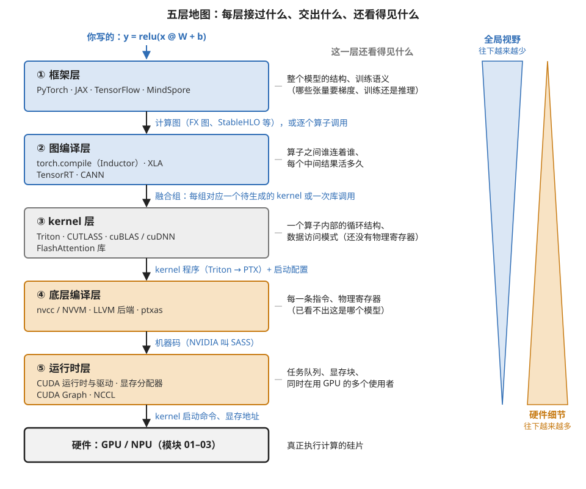
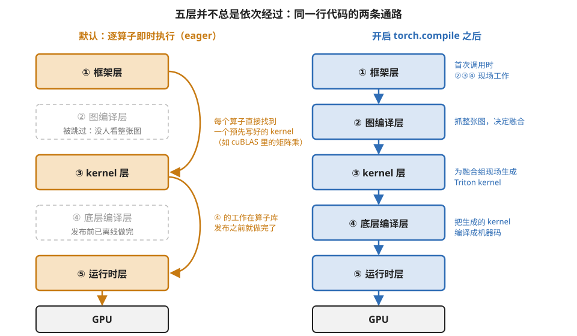
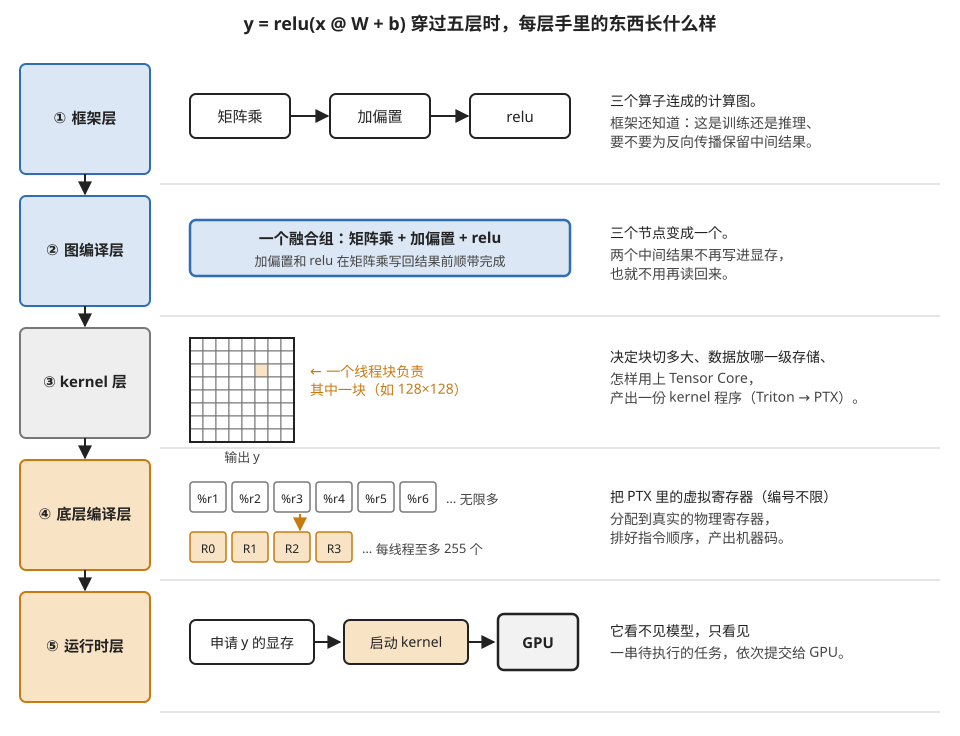

# 软件栈全景：从一行 Python 到硅片上的电流

> **所属模块**：模块 40 · 软件优化栈
> **状态**：🟨 学习中（第四版：五层的名称与后续五章对齐，补入各层展开章节的导读。知识截至 2026-08）
> **本节主旨**：你写的一行 `y = relu(x @ W + b)`，要经过**五层软件**的接力翻译才变成硅片上的电流。本节先把五层地图立起来，然后讲清一个贯穿整个模块的原理——**信息衰减**：每往下一层，就丢掉一部分"全局视野"、换来一部分"硬件细节"；**每层能做的优化，恰好由"这层还看得见什么"决定**。理解了这个原理，"性能问题该去哪一层解决"就从经验变成了推理。**本节只立地图和原理；五层各自的定义、输入输出、边界接口、功能清单、业界项目和项目走查，在紧接着的第 2～6 节里一层一章地展开。**

---

## 0. 这一节要回答的问题

- 从框架代码到机器码，中间有哪几层？每层的输入输出是什么？
- 为什么算子融合只能在图层做、切块只能在 kernel 层做、寄存器分配只能在最后一层做？
- 拿到一个性能问题，怎么判断"这是哪一层的锅"？
- GPU 的软件栈和 NPU 的软件栈，设计哲学差在哪？
- 主流工具（torch.compile、Triton、XLA……）各站在哪一层？

---

## 1. 基础词汇：先把本节要用的词讲清楚

**计算图（computation graph）**。把模型表示成"节点是算子（矩阵乘、加法、激活函数）、边是数据依赖"的有向图。它是框架层交给编译层的标准交付物——一张图看清整个模型的结构。

**IR（intermediate representation，中间表示）**。编译过程中每一层内部使用的"工作语言"。源代码对人友好、机器码对硬件友好，中间的各层各有一种既方便分析又方便改写的中间格式——统称 IR。听到"lowering（下沉）"指的就是把高层 IR 翻译到更低层 IR 的动作。

**kernel**。提交给 GPU 执行的一段程序，软件栈里的"最小发货单位"：输入输出都在显存，附带启动配置（多少线程块、每块多少线程）。一个算子（或几个融合后的算子）通常对应一个 kernel。

**运行时（runtime）**。负责"让 kernel 真正跑起来"的那层软件：启动 kernel、分配显存、管理多个执行队列。它看不见模型，只看得见一串待执行的任务。

## 2. 五层地图

```
 层                   输入 → 输出              这一层还"看得见"什么        展开章节
────────────────────────────────────────────────────────────────────────────────
 ① 框架层             Python 代码 → 计算图      整个模型、训练语义          第 2 节
   (PyTorch / JAX)    （或逐个算子调用）
 ② 图编译层           计算图 → 优化后的图       算子之间的关系：谁连着谁、   第 3 节
   (Inductor/XLA/                              中间结果的生命周期
    TensorRT/CANN)
 ③ kernel 层          单个(融合)算子 → kernel    循环结构、数据访问模式       第 4 节
   (Triton/CUTLASS/   程序                     （还没有物理寄存器概念）
    算子库)
 ④ 底层编译层         kernel 程序 → 机器码      每条指令、物理寄存器         第 5 节
   (nvcc/LLVM/ptxas)                           （已看不见模型）
 ⑤ 运行时层           机器码 → 硅片上的执行      任务队列、显存块、           第 6 节
   (CUDA runtime/                              多个使用者
    驱动/显存分配器)
────────────────────────────────────────────────────────────────────────────────
                          ▼ 硬件（模块 10–12 的全部内容）
```

图 1-1 把这张表画成了从上到下的接力，并在每一层旁边标出代表项目。



> **图 1-1**　一句话：一行 Python 要经过五层软件的接力才落到硬件上，每一层接过上一层的产物、改写成更贴近硬件的形式再往下交，同时丢掉一部分上层才有的信息。
>
> **先知道一件事**：这里的"层"和网络协议栈的分层是同一种意思：每层只和紧挨着的上下两层打交道，通过一种固定格式的交付物（图中层间蓝字）对接。所以每层能做什么优化，只取决于它手里这份交付物里还剩什么信息。
>
> **按这个顺序看**：
> 1. 先看左列五个方框。方框里第一行是层名，第二行是这一层的代表项目：PyTorch 在第①层，torch.compile 和 TensorRT 在第②层，Triton 和 cuBLAS 在第③层，ptxas（NVIDIA 把中间代码翻译成机器码的编译器）在第④层，CUDA 驱动和显存分配器在第⑤层。蓝色方框离模型近，橙色方框离硬件近，灰色的第③层夹在中间。
> 2. 再看方框之间的箭头和蓝字：①交出计算图（节点是算子、边是数据依赖的图），②交出"融合组"（几个算子合并成一组，每组将来变成一个 kernel，即提交给 GPU 执行的一段程序），③交出 kernel 程序和启动配置（开多少线程块），④交出机器码，⑤交出启动命令。
> 3. 然后看中间一列"还看得见什么"。从上往下读，范围越来越窄：整个模型 → 算子之间的连接 → 一个算子内部的循环 → 一条条指令 → 一串待执行的任务。
> 4. 最后看右侧两个三角形。蓝色三角形上宽下窄，表示关于模型的全局信息逐层减少；橙色三角形上窄下宽，表示关于硬件的细节（片上存储多大、寄存器有几个）逐层增加。本节 §3 说的"信息衰减"就是这两个三角形。
>
> **打个比方**：像把一份建筑设计交给施工队的层层分包。总设计师知道整栋楼的用途，分包商只知道自己那一层的图纸，瓦工只知道眼前这面墙。越往下越懂手上的活，越不知道整体。
>
> **看懂的标志**：能回答"为什么算子融合不能放在第③层做"——第③层手里只有一个算子，它看不见这个算子后面还连着谁，而融合恰恰需要知道"谁的输出只给了谁"。
>
> **与正文的对照**：层间交付物与上面文本框里"输入 → 输出"一列一致；第⑤层的输出在文本框里写作"硅片上的执行"，图里写成它实际交给硬件的东西：启动命令和显存地址。
>
> 来源：本库自绘。

**五层的展开章节采用同一种结构**，方便横向对照。每一章依次回答：这一层的定义是什么；为什么在这个位置和上下两层分开；输入和输出各是什么；上下边界的接口长什么样；这一层看得见什么、看不见什么；它要做哪几件事；业界有哪些代表项目；最后拿其中一个项目，用能逐步跟踪的例子讲清这一层的技术原理。

| 层 | 展开章节 | 用来讲透的项目 | 走查的例子 |
| --- | --- | --- | --- |
| ① 框架层 | [第 2 节](./02-框架层.md) | PyTorch（对照 JAX） | 一次 `x @ W` 调用经过的六站；三个算子的反向图占多少显存 |
| ② 图编译层 | [第 3 节](./03-图编译层.md) | torch.compile（对照 TensorRT） | 一个函数从抓图到生成 kernel 的六步；融合前后的显存流量 |
| ③ kernel 层 | [第 4 节](./04-kernel层.md) | Triton | 一份矩阵乘源码里的七项功能；一个配置的资源占用 |
| ④ 底层编译层 | [第 5 节](./05-底层编译层.md) | NVIDIA 编译工具链（对照 AMD） | 一个十行 kernel 从 C++ 到 PTX 到机器码的两次变形 |
| ⑤ 运行时层 | [第 6 节](./06-运行时层.md) | PyTorch 显存分配器、CUDA Graph | 六次显存操作后的状态；逐个启动与整图重放的时间线 |

**这张地图有一处需要补充说明：五层并不总是依次经过。** 框架层在默认的逐算子执行方式下，每个算子直接调用第③层里预先写好的 kernel，经第⑤层提交，第②层被跳过，第④层的工作也早在算子库发布之前就做完了。只有开启图编译（如 `torch.compile`）时，五层才按图中的顺序全部参与。本模块第 2 节 §2.3 详细讲这两条通路。图 1-2 把两条通路并排画了出来。



> **图 1-2**　一句话：PyTorch 默认的逐算子执行只经过五层中的三层；开启 `torch.compile` 之后，五层才全部参与。
>
> **先知道一件事**：即时执行（eager）指写一行 Python 就立刻执行这一行对应的算子，和解释执行的脚本语言一样；`torch.compile` 则先把一段代码整体抓成计算图、编译好再执行，更像先编译后运行的语言。
>
> **按这个顺序看**：
> 1. 先看左列的橙色路径。从①框架层出发的弯箭头直接跳到③kernel 层：每个算子在算子库里找一个事先写好、编译好的 kernel（例如矩阵乘用 cuBLAS 里的实现），再经⑤运行时层提交给 GPU。
> 2. 看左列的两个虚线框。②图编译层被跳过，没有任何软件在看整张图，所以相邻算子无法合并。④底层编译层并非不存在，而是它的工作在算子库发布之前就离线做完了，运行时不再发生。
> 3. 再看右列的蓝色路径：五个方框依次连通。右侧的注释说明首次调用时②③④三层现场工作：②抓图并决定融合，③为每个融合组生成 Triton kernel（Triton 是一种用 Python 语法写 GPU 程序的语言），④把它编译成机器码。
>
> **打个比方**：左边像点外卖，每道菜都由现成的厨房做好送来，快但不会替你搭配；右边像请厨师先看完整张菜单再统一备料，第一次要等备料，之后每次都更省事。
>
> **看懂的标志**：能回答"不开 compile 时，性能工具里看到的 kernel 名字从哪来"——来自算子库（如 cuBLAS 的内部 kernel）；开了 compile 才会出现编译器现场生成的、名字里带 `triton` 和 `fused` 的 kernel。
>
> 来源：本库自绘。

## 3. 题眼：信息衰减决定优化归属

沿着这张地图往下走，**信息单向衰减**：①层知道"这是一个 Transformer、正在训练第三个 epoch"，②层只知道"一张 800 个节点的图"，③层只知道"眼前这一个算子"，④层只知道"眼前这一条指令"。而每种优化需要特定的信息才能做——**信息在哪层，优化就只能在哪层**。三个立刻能懂的推论：

- **算子融合只能在②层做**。融合（把相邻的几个算子合成一个 kernel，省掉中间结果写显存再读回来的往返）的前提是**看见算子之间的连接关系**。到了③层，一个 kernel 就是全世界——它根本不知道自己身后还跟着一个激活函数可以捎带。
- **切块（tiling）只能在③层做**。切块要摆弄循环的结构（模块 11 第 4 节的两边夹逼），②层眼里"矩阵乘"是一个不可拆的节点、没有循环可切；④层里循环已经变成指令流、切不动了。
- **寄存器分配只能在④层做**。模块 10 第 6 节讲过：③层产出的中间代码里寄存器是无限的虚拟编号，物理寄存器只在 ptxas 眼里存在。

**例子：跟着 `y = relu(x @ W + b)` 走完五层。** ①框架层：三个算子（矩阵乘、加偏置、relu）进入计算图，框架还知道它们属于哪个模块、要不要留反向传播的中间值。②图编译层：看见"加偏置和 relu 紧跟在矩阵乘后面、中间值没有别人用"——决定**把三个算子融合成一个 kernel**（加法和 relu 搭矩阵乘写回结果的便车，几乎零成本；本模块第 3 节 §4.2 细讲），图从三个节点变成一个。③kernel 层：拿到这个融合算子，决定分块尺寸、数据放 shared memory 还是寄存器、用 `tl.dot` 触发 Tensor Core——产出一份 Triton/PTX 代码。④底层编译层（ptxas）：分配物理寄存器、重排指令、写控制位（模块 10 第 6 节的四行对照例），产出机器码。⑤运行时层：分配输出显存、把 kernel 排进执行队列、向 GPU 提交启动命令（模块 10 第 7 节的分发路径）。**每一层只做了自己那层信息支持的事，五层接力，一行 Python 落地成电流。** 图 1-3 画出了这行代码在每一层手里的样子。



> **图 1-3**　一句话：同一行 `y = relu(x @ W + b)`，在五层里分别以五种形态存在：计算图、融合组、切块的循环程序、分配好寄存器的机器码、一串待提交的任务。
>
> **先知道一件事**：寄存器是 GPU 每个线程私有的、最快的一小块存储，数量有硬上限（每线程最多 255 个）。编译器的中间代码里先假装寄存器有无限多个，最后一步才把它们对到真实的有限个寄存器上。
>
> **按这个顺序看**：
> 1. 第一行（①框架层）：矩阵乘、加偏置、relu 三个方框连成链，这就是计算图。框架还记得训练语义，比如反向传播要不要保留中间结果（右侧说明）。
> 2. 第二行（②图编译层）：三个方框合成一个蓝框。编译器看到加偏置和 relu 紧跟在矩阵乘后面、中间结果没有别人用，就把它们塞进矩阵乘写回结果之前顺带完成。原来要写进显存再读出来的两个中间结果消失了。
> 3. 第三行（③kernel 层）：网格代表输出矩阵 `y`，每个小格是一块（tile），橙色那格由一个线程块（GPU 上一起调度的一组线程）负责计算。这一层决定块切多大、数据放在哪一级存储、怎样用上 Tensor Core（GPU 里专门做小矩阵乘的计算单元）。图中画了 8×8 块作示意；若输出是 4096×4096、块取 128×128，实际是 32×32 块。
> 4. 第四行（④底层编译层）：上排 `%r1`、`%r2`……是中间代码里的虚拟寄存器，编号不限；下排 `R0`、`R1`……是物理寄存器。ptxas 把前者分配到后者上，并排好指令的先后顺序。
> 5. 第五行（⑤运行时层）：只剩两件事排成队：为 `y` 申请显存，然后把 kernel 的启动命令交给 GPU。这一层已经不知道这是哪个模型。
>
> **看懂的标志**：能说出"块切多大"这个决定为什么只能在第三行做——第二行里矩阵乘是一个不可拆的方框，没有循环可切；到了第四行，循环已经变成一条条指令，切不动了。
>
> 来源：本库自绘。

信息衰减还有一个重要的反面推论：**当某个优化需要的信息"跨层"时，自动化就失灵了**。最著名的例子是 FlashAttention：它需要"这三个算子永远连在一起出现"（②层的知识）和"改写 softmax 的数学让中间结果可以分块丢弃"（③层的重写，且**要改算法**）——②③层之间的标准接口（一个算子一个 kernel）传不过去这种组合知识，编译器至今做不到，只能由人把两层知识捏在一起手写。**软件栈历史上的多次重大性能突破，都是这种"人肉跨层"的产物。**

## 4. 排查指南：这是哪一层的锅

拿到性能问题，先按症状定层，再进对应章节：

| 症状（性能工具里看到的） | 哪层的锅 | 去哪拧 |
| --- | --- | --- |
| 时间线上密密麻麻的小 kernel、间隙比 kernel 还宽 | ②层没融合 / ⑤层启动开销 | 开 torch.compile；用 CUDA Graph 把启动序列录制重放 |
| 单个 kernel 慢、Tensor 管道活跃度低 | ③层 | 检查 dtype/形状/代码路径（模块 12 第 1 节三层检查）；重写 kernel |
| 编译器报寄存器溢出 | ④层 | 限寄存器/减少每线程工作量（模块 10 第 2 节） |
| 显存不够 | ①/②层 | 重计算换显存；检查图编译层的显存复用 |
| 形状一变就卡顿几秒 | ②/③层 | 动态形状触发了重编译——分桶固定形状（模块 11 第 5 节） |

**先问"哪一层"再动手**，比直接扎进某一层碰运气高效得多——这张表是本模块后面各节的目录。

## 5. 两种栈哲学：运行时重 vs 编译期重

软硬件的哲学是配套的（模块 00 的光谱在软件侧的延伸）：

- **GPU 栈：运行时偏重。** 默认逐算子立即执行（写一行跑一行，好调试），图编译（torch.compile）是**可选的加速档**——不开也能跑，开了更快。动态形状、数据相关控制流都能容忍。这配合的是动态调度的硬件。
- **NPU/TPU 栈：编译期偏重。** 全图必须先交给编译器（XLA、CANN）静态编译才能上芯片——**编译是必经之路**，形状必须编译期已知。换来的是全图视野的彻底优化和可预测的性能（模块 11 第 2 节"编译期算出耗时"的例子）。这配合的是静态时序的硬件。

**两边也在互相靠近**：torch.compile 的普及是 GPU 栈向"编译期"借红利；MoE 和变长序列的流行则逼着 NPU 栈补动态能力。这个双向奔赴和硬件侧（模块 00 第 1 节的光谱）如出一辙。

## 6. 工具点名：谁站在哪一层

- **①层**：**PyTorch**（默认逐算子执行，研究与生产的主流）、**JAX**（函数变换风格，和 XLA 结合最紧）、TensorFlow、MindSpore（昇腾的原生框架）。各框架的对照见本模块第 2 节 §4。
- **②层**：**torch.compile/Inductor**（PyTorch 主线：自动抓图、融合、生成 Triton 代码）、XLA（TPU 的正统、JAX 的后端）、TensorRT（NVIDIA 的推理专用编译器）、CANN（昇腾全栈）。底座方面，**MLIR** 值得认识——它不是产品而是"造编译器的工具箱"，上述多家的新版内部都基于它（听到 dialect、lowering、pass 这些词就是 MLIR 的世界）。
- **③层**：cuBLAS/cuDNN/FlashAttention 库（预制菜——标准算子直接用）、**Triton**（用 Python 写 kernel 的事实标准，也是 Inductor 的代码生成目标）、CUTLASS（C++ 模板积木，造库的人用）、Ascend C（昇腾）。
- **④层**：**ptxas**（把 PTX 翻译成机器码，NVIDIA 闭源，寄存器分配和指令排序都在这里）、nvcc 与 NVVM（CUDA C++ 到 PTX）、LLVM 的 NVPTX 后端（Triton 等工具到 PTX 的通路）、LLVM 的 AMDGPU 后端（AMD 一侧，开源）。
- **⑤层**：CUDA 运行时与驱动、框架的显存分配器、**CUDA Graph**（把一长串 kernel 启动录成图、之后整图重放，把每次几微秒的启动开销摊成一次——小 kernel 密集的推理场景标配）、NCCL（跨卡通信，模块 30 第 1 节）。

## 7. 开发者视角

- 日常写 PyTorch：你活在①层，最有价值的一个动作是**试一次 `torch.compile`** 并对比时间线前后——它把②层的融合红利一键交付，也让你在时间线上直观看到"融合"长什么样（kernel 数量骤减）。
- 需要自定义算子：进③层写 Triton——先确认②层真的融合不了（本节 §3 的跨层情形）再动手，标准件用库。
- ④⑤层基本只读不写：④层用本模块第 5 节 §7 的工具验证编译结果，⑤层最常用的两件事是看懂显存的已分配与已保留、在小 kernel 密集时使用 CUDA Graph（本模块第 6 节）。

## 8. 最新架构落点（知识截至 2026-08）

- **torch.compile 已成 PyTorch 主干道**，"Inductor 生成 Triton、Triton 交给 ptxas"是 GPU 栈的新标准路径——Triton 事实上成了②层与③层之间的通用接口语言（NVIDIA/AMD/Intel 后端都有）。
- **推理引擎自成一栈**：vLLM、SGLang、TensorRT-LLM 把①②⑤层压成一体（调度、显存管理、定制 kernel 深度耦合）——是"垂直打穿"的产品化形态。
- **MLIR 一统②层地基**：各家新编译器几乎都构建其上，学一次概念多处通用（内部机制见本模块第 10 节）。
- **③层的工具在爆炸，而且方向一致**：CuTe-DSL、Gluon、TileLang、CUDA Tile IR、Helion 一批新玩家（本模块第 9 节 §10 有对照表）。**它们没有一个是在"把 Triton 做得更自动"，全都在往下开新海拔或把某一维决策权还给人**——这印证了本节的分层观：**自动化的边界由"这一层还看得见什么"决定，看不见的东西再聪明的编译器也补不上，只能把控制权还给看得见的人。**
- **⑤层（运行时）的地盘在明显变大**。推理引擎（vLLM、SGLang、TensorRT-LLM）把调度、显存管理、批处理策略做成了核心竞争力——**同样的 kernel（大家都在用同一批开源实现），谁的调度器更懂负载谁就赢**。运行时层自身的内容见本模块第 6 节，推理引擎的调度见模块 60 第 2 节。
- **这张五层地图之上还有一层，本库现在补上了**：模块 60 讲的**系统层**——很多张卡怎么协同。**它和这五层的关系是：五层讲"一次计算怎么落到硅片上"，系统层讲"很多次计算怎么协同"，而后者遵守的规律有时和前者相反**（最典型的例子是"利用率越高越好"这条直觉在有延迟约束的服务上不成立，模块 60 第 2 节 §6）。

## 9. 术语卡

### 计算图（computation graph）
**定义**：模型的图表示——节点是算子、边是数据依赖。框架层交给编译层的标准交付物，②层一切全局优化（融合、显存规划）的工作对象。
**为什么存在**：逐行执行的代码看不见"后面还有什么"，无法全局优化；先摊开成图，优化器才有全局视野。
**语境例句**："这段代码有 graph break。" —— 意思是：抓图在某处被打断（如遇到 print 或数据相关的 if），图被切成两段，跨断点的融合机会丢失——查一下断点在哪、能否移走。

### 信息衰减（本模块的题眼）
**定义**：软件栈每往下一层丢失一部分全局信息、获得一部分硬件细节的单向过程。每种优化只能发生在"拥有它所需信息"的那一层。
**为什么存在**：分层是管理复杂度的必然，而分层的接口传不过所有信息——衰减是分层的代价。它决定了优化归属，也解释了为什么"跨层"优化只能靠人。
**语境例句**："这个优化在 kernel 层做不了，得上到图层。" —— 意思是：所需的信息（比如相邻算子的连接关系）在 kernel 层已经看不见了——去还拥有这份信息的层做。

### torch.compile / Inductor
**定义**：PyTorch 的图编译入口与其默认编译器：自动抓取计算图、做融合等图层优化、生成 Triton kernel。一行 `model = torch.compile(model)` 启用。
**为什么存在**：把②层的优化红利（主要是融合）以近乎零改造成本交付给①层用户——GPU 栈从"纯运行时"向"编译期"借力的主通道。
**语境例句**："compile 之后 kernel 数从 4000 降到 800。" —— 意思是：融合把大量零碎算子合并了——显存往返和启动开销同步下降，这正是图层优化生效的直观证据。

### Triton
**定义**：用 Python 语法写 GPU kernel 的语言和编译器，块级抽象（你写"一块数据怎么算"，线程细节编译器代管）。既供人手写自定义 kernel，也是 Inductor 自动生成代码的目标语言。
**为什么存在**：CUDA C 的门槛（手管线程/shared memory/同步）挡住了大多数算法工程师；Triton 把③层的门槛降到 Python 水平，同时保留触发 Tensor Core、控制分块等关键能力。
**语境例句**："这个融合算子用 Triton 写半天就能出 80 分版本。" —— 意思是：③层自定义的性价比之选——标准件用库、极限性能用 CUTLASS，中间的广阔地带属于 Triton。

### CUDA Graph
**定义**：⑤层机制：把一串 kernel 启动序列录制成图，之后一次提交整图重放，省去逐个启动的开销（每个几微秒）。
**为什么存在**：小 kernel 密集的负载（尤其推理的解码阶段）里，启动开销累计可观甚至超过计算本身；录制重放把 N 次开销摊成一次。
**语境例句**："解码阶段套上 CUDA Graph 提速两成。" —— 意思是：每步几百个小 kernel 的启动开销被消掉了——典型的⑤层优化，跟 kernel 本身快慢无关。

## 10. 我的困惑 / 待深挖

- Dynamo 抓图的机制（字节码拦截）与 graph break 的完整触发清单？
- MLIR 的 dialect 体系实际长什么样？跟一遍从 StableHLO 到 LLVM 的下沉链？
- CUDA Graph 与动态形状的兼容边界？

---

*最后更新：2026-09-28（第四版：五层名称与后续五章对齐——"底层编译"改为"底层编译层"、"运行时"改为"运行时层"；§2 补入展开章节导读表与"五层并不总是依次经过"的说明；§6 补入①层和④层的工具；章节号引用按模块重排更新。第三版：§8 更新到 2026-08，补入③层工具爆炸的方向性判断、⑤层地盘变大、以及"五层之上还有系统层"的定位。第二版：按含自检的写作规范重写；核心例为 relu(x@W+b) 的五层走查）*（2026-09 补图 3 张：现成 0 张，自绘 3 张；图注按费曼法写）
