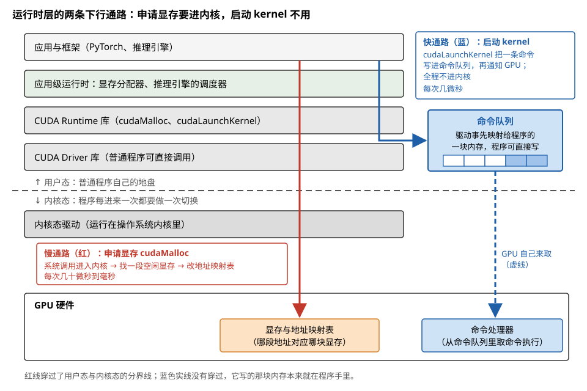
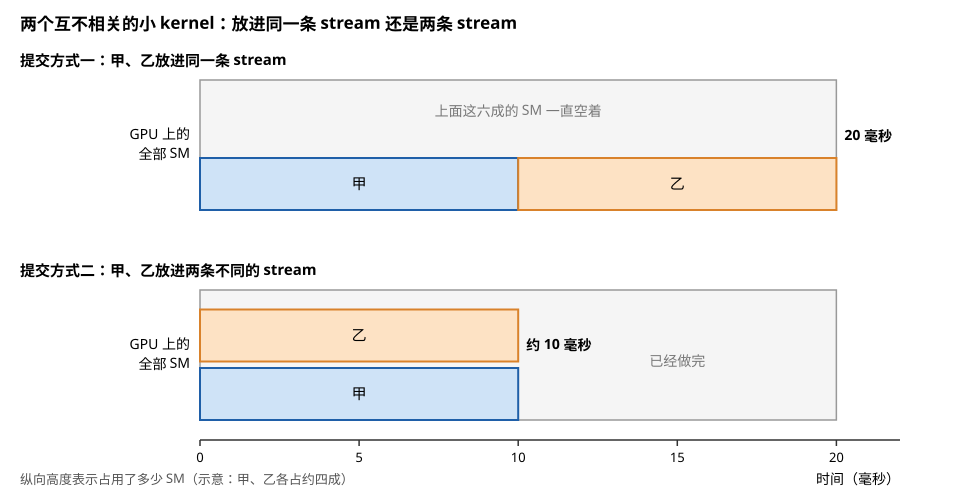
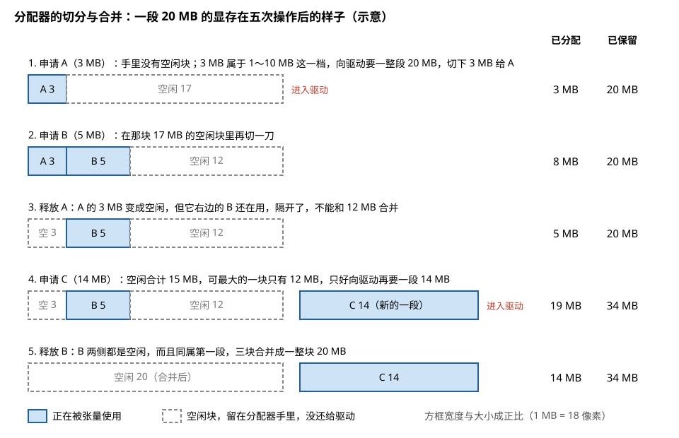
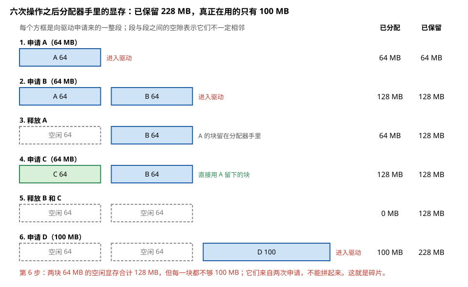
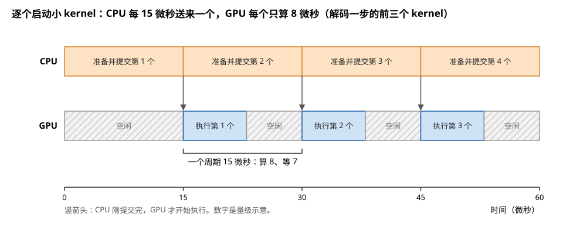
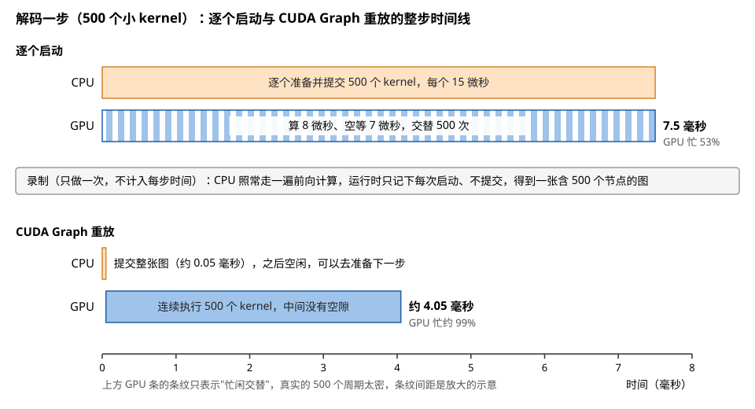
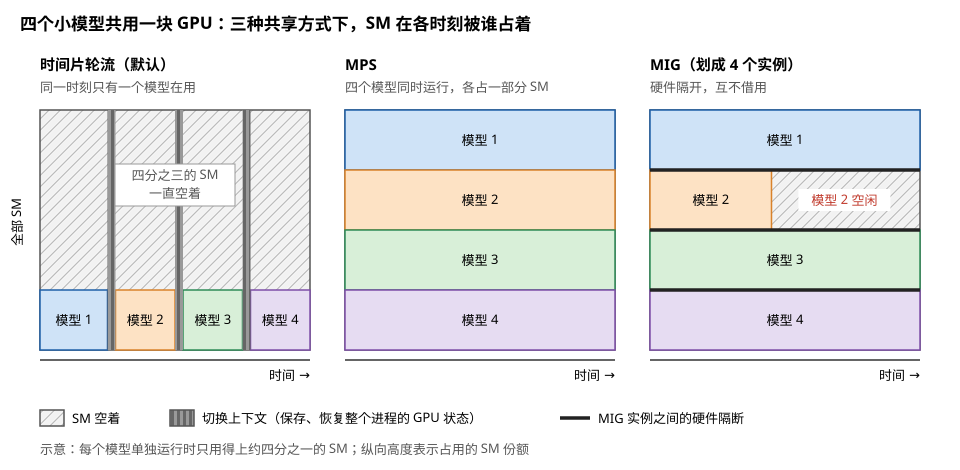

# 第⑤层 · 运行时层：让编译好的 kernel 真正执行起来

> **所属模块**：模块 40 · 软件优化栈（五层地图的第⑤层；五层逐层展开的第五章）
> **状态**：🟨 学习中（第一版。知识截至 2026-08）
> **本节主旨**：前四层的产物是一份份编译好的 kernel。要让它们执行，还需要有人把程序装进 GPU、为输入输出准备显存、把启动命令发给硬件、保证先后次序正确、在多个使用者之间分配 GPU。这些工作都属于运行时层。这一层看不见模型，也看不见 kernel 内部，它面对的是**一串等待执行的任务和一块块显存**。它对性能的影响集中在两处：**显存的申请和释放**（处理不好会很慢，还会产生碎片），以及 **kernel 启动的固定开销**（小 kernel 很多时，它会超过计算本身的时间）。本节先按统一格式给这一层建档，然后用两个标本讲透这两处：**PyTorch 的显存分配器**和 **CUDA Graph**。模块 10 第 7 节讲的是启动命令到达 GPU 之后硬件如何分发线程块，本节讲的是命令到达 GPU 之前软件做了什么。

---

## 0. 这一节要回答的问题

- 运行时层由哪些部件组成？哪些属于系统，哪些属于应用？
- 它向上提供什么接口？向下又是怎样和硬件打交道的？
- 这一层一共要做哪些事？
- 向驱动申请显存为什么慢？框架是怎么绕开这个问题的？
- "已保留的显存远大于已分配的显存"是怎么产生的？
- 启动一个 kernel 的固定开销是多少？什么情况下它会成为瓶颈？
- CUDA Graph 省掉的是什么？使用它有哪些限制？
- 推理引擎为什么也算运行时层的一部分？

---

## 1. 基础词汇：先把本节要用的词讲清楚

**运行时（runtime）**。程序运行期间在背后提供服务的软件。对 GPU 程序来说，它负责加载 kernel、管理显存、提交启动命令。

**驱动（driver）**。操作系统里直接管理硬件的软件。GPU 的驱动分成两部分：一部分运行在操作系统内核里，负责最底层的硬件访问；另一部分是普通程序可以直接调用的库。

**上下文（context）**。一个进程在一块 GPU 上的全部状态，包括它申请的显存、加载的程序、地址映射表。不同进程的上下文互相隔离。

**stream（流）**。提交 GPU 工作的队列。同一条 stream 里的工作按提交顺序执行；不同 stream 之间没有顺序约束，可以同时执行。

**异步提交**。CPU 把启动命令发出之后立刻返回，不等待 GPU 执行完。GPU 上的工作和 CPU 上后续的代码同时进行。

**同步点**。CPU 停下来等待 GPU 把已提交的工作全部做完的位置。把 GPU 上的结果取回 CPU（比如打印一个张量的值）就会产生一个同步点。

**系统调用**。普通程序请求操作系统内核代为执行某项操作的机制。每次系统调用都要在程序和内核之间切换，耗时在微秒量级，比普通的函数调用贵得多。

**锁页内存（pinned memory）**。被操作系统固定在物理内存中、不会被换出到磁盘的主机内存。GPU 和主机之间的高速数据传输要求主机一侧的内存是锁页的。

---

## 2. 这一层的档案

### 2.1 定义

**运行时层是负责执行的那层软件：它把编译好的 kernel 装进 GPU，管理显存，提交启动命令，维持执行的先后次序，并在多个使用者之间分配 GPU。**

### 2.2 这一层的内部结构：系统运行时和应用级运行时

这一层的部件按"谁提供"可以分成两组。

| 组别 | 部件 | 由谁提供 | 作用 |
| --- | --- | --- | --- |
| **系统运行时** | CUDA Runtime 库 | NVIDIA | 提供显存申请、kernel 启动、stream 管理等函数 |
| | CUDA Driver 库 | NVIDIA | 更底层的一套函数，Runtime 库建立在它之上 |
| | 内核态驱动 | NVIDIA | 运行在操作系统内核里，直接操作硬件 |
| **应用级运行时** | 框架的显存分配器 | PyTorch 等框架 | 建立在系统的显存申请之上，加一层缓存 |
| | 推理引擎的调度器 | vLLM 等引擎 | 决定哪些请求合成一批、何时执行 |
| | 跨设备通信库 | NCCL 等 | 在多块 GPU 之间传输数据 |

**应用级运行时从代码归属上看是框架或引擎的一部分，但从功能上看属于这一层**，因为它们做的事和模型无关、和 kernel 内部无关，只和"任务怎么安排、显存怎么管理"有关。第 2 节（框架层）提到的显存分配器就是这种情况：它的代码在 PyTorch 里，它的职责属于运行时。

### 2.3 为什么在这里切一刀

**和上面的底层编译层之间的一刀：静态和动态的分界。** 编译层产出的机器码是固定的。运行时层处理的全是执行时才知道的事实：此刻显存还剩多少、这个请求的序列有多长、GPU 上是否还有别的进程。这些信息在编译时不存在，所以相应的决策只能留到这一层。

**和下面的硬件之间的一刀：软件和硬件的分界。** 运行时层是软件栈的最后一层，它的输出是写给 GPU 硬件的命令。命令到达之后，由 GPU 芯片上的分发硬件接手（模块 10 第 7 节）。

**这一层还有一个独有的视角：它是唯一能看到"多个使用者"的层。** 前四层处理的都是一个模型、一个 kernel。多条 stream 怎么并行、多个进程怎么共用一块 GPU、多块 GPU 之间怎么传数据，这些问题只在这一层出现。

### 2.4 输入与输出

| | 内容 |
| --- | --- |
| **输入** | 编译好的 kernel（cubin）；每次启动的参数（启动哪个 kernel、多少个线程块、每块多少线程、实参、提交到哪条 stream）；显存的申请和释放请求 |
| **输出** | 写入 GPU 命令队列的启动命令；返回给调用者的显存地址；表示工作完成的事件 |

### 2.5 上下边界的接口

| 边界 | 接口形态 | 具体例子 |
| --- | --- | --- |
| **上边界**（供框架和应用调用） | 一组函数 | 显存：`cudaMalloc`、`cudaFree`；启动：`cudaLaunchKernel`；次序：`cudaStreamCreate`、`cudaStreamSynchronize`；传输：`cudaMemcpyAsync`；批量：CUDA Graph 的一组函数 |
| **下边界**（和内核态驱动之间） | 系统调用 | 申请显存、建立地址映射、创建上下文 |
| **下边界**（和 GPU 硬件之间） | 命令队列 | 一块由驱动事先映射好的内存区域。运行时把命令写进去，再通知 GPU 来取 |
| **横向**（供性能工具使用） | 回调接口 | CUPTI：性能分析工具通过它得知每次启动、每次显存操作发生的时间 |

**下边界有两条通路，它们的速度相差很大，这决定了这一层的性能特征。** 申请显存走的是系统调用这条通路，要进入内核、修改地址映射表，比较慢。启动 kernel 走的是命令队列这条通路，命令队列所在的内存已经事先映射给了程序，写命令不需要进入内核，所以很快。第 5 节和第 6 节分别讨论这两条通路。图 6-1 把这两条通路画在同一张分层图上。

> **图 6-1**　一句话：运行时层向下有两条通路。申请显存要经过系统调用进入操作系统内核，所以慢；启动 kernel 只是往一块早已映射好的内存里写一条命令，不进内核，所以快。
>
> **先知道一件事**：操作系统把程序运行的地方分成"用户态"和"内核态"。普通程序在用户态运行；分配物理内存、改地址映射这类涉及整台机器的操作，必须请内核代办，这叫系统调用。每次系统调用都要切换一次，耗时在微秒量级，比普通的函数调用贵得多。
>
> **按这个顺序看**：
> 1. 左边从上到下是运行时层的各个部件：框架、应用级运行时（显存分配器、推理引擎的调度器）、CUDA Runtime 库、CUDA Driver 库。然后是一条横向的虚线，虚线下面是内核态驱动和 GPU 硬件。
> 2. 看红线：`cudaMalloc` 从上面一路穿过虚线进入内核态驱动。驱动找出一段空闲显存，再改写地址映射表（记录哪段地址对应哪块物理显存）。这一趟每次要几十微秒到毫秒。
> 3. 看蓝色实线：`cudaLaunchKernel` 把"启动哪个 kernel、多少个线程块、参数在哪"编码成一条命令，写进右边的命令队列。命令队列是驱动事先映射给程序的一块内存，程序可以直接写，所以蓝线没有穿过虚线。
> 4. 看蓝色虚线：GPU 上的命令处理器自己从命令队列里取命令执行。程序写完命令后只需通知 GPU 一声，同样不进内核。整条快通路每次只要几微秒。
>
> **看懂的标志**：能回答"为什么 PyTorch 要自己缓存显存，却不去缓存 kernel 启动"——显存申请走红线，每次几十微秒以上，一次前向计算要申请几千次，必须缓存起来少走红线；kernel 启动本来就走蓝线，没有可以省掉的系统调用。启动开销要靠第 6 节的 CUDA Graph 另想办法。
>
> **与正文的对照**：对应上表的两行"下边界"。命令处理器取到命令之后，怎样把线程块分发到各个 SM，属于硬件一侧的事，见模块 10 第 7 节。
>
> 来源：本库自绘。

**例子：两条通路的速度差在一次前向计算里意味着什么。** 设一次前向计算有 3000 个算子，每个算子要申请一次显存、启动一次 kernel。申请显存按每次 50 微秒计，3000 次是 150 毫秒；启动 kernel 按每次 5 微秒计，3000 次是 15 毫秒。如果这次前向计算在 GPU 上本身只需要 50 毫秒，那么不加处理的显存申请会使总时间变成原来的四倍。这就是第 5 节的显存分配器必须存在的原因。

### 2.6 这一层看得见什么、看不见什么

| 看得见 | 看不见 |
| --- | --- |
| 待执行的任务队列、每个任务属于哪条 stream | 模型的结构 |
| 每块显存的大小、是否空闲 | kernel 内部在算什么 |
| 此刻有哪些进程在使用这块 GPU | 两个 kernel 之间的数据依赖（除非调用者通过 stream 或 CUDA Graph 说明） |
| 每个任务的提交时间和完成时间 | 某块显存里存的是权重还是中间结果 |

---

## 3. 功能集合：这一层要做的九件事

| 功能 | 做什么 | 对性能的影响 |
| --- | --- | --- |
| **程序加载** | 把 cubin 装入 GPU；必要时调用编译器现场编译 | 影响启动时间，不影响稳定运行时的性能 |
| **显存管理** | 响应显存的申请和释放 | 申请本身慢；管理不当产生碎片 |
| **kernel 启动** | 把启动参数打包成命令，写入命令队列 | 每次启动有固定开销 |
| **次序与并发** | 通过 stream 维持先后次序，允许无依赖的工作并行 | 用错 stream 会使本可并行的工作排队 |
| **批量提交** | 把一长串启动预先录制成图，之后整体重放 | 消除大量小 kernel 的启动开销 |
| **主机与设备间的传输** | 在主机内存和显存之间拷贝数据 | 主机内存是否锁页，传输速度可相差一倍 |
| **多使用者共享** | 在多个进程之间分配 GPU | 决定隔离程度和整体利用率 |
| **跨设备通信** | 在多块 GPU 之间传输数据 | 分布式训练的通信开销 |
| **错误上报与可观测** | 上报硬件错误；向性能工具提供事件 | 不直接影响性能，是排查问题的依据 |

**对"次序与并发"举一个例子，因为它是日常最容易出错的一项。** 有两个 kernel，甲和乙，它们处理互不相关的数据，各自只占用 GPU 的一小部分。

| 提交方式 | 执行情况 | 总耗时（设每个 kernel 需 10 毫秒） |
| --- | --- | --- |
| 甲和乙提交到同一条 stream | 运行时保证同一条 stream 内按顺序执行，乙要等甲结束才开始 | 20 毫秒 |
| 甲和乙提交到两条不同的 stream | 两者之间没有顺序约束，GPU 上有空余的 SM 时可以同时执行 | 约 10 毫秒 |

运行时并不知道甲和乙之间有没有数据依赖，它只按 stream 的规则办事：同一条 stream 里的工作一定按顺序执行，不同 stream 的工作可以并行。**所以依赖关系需要由调用者通过"放进哪条 stream"来告诉运行时。** 把所有工作都放进默认的那一条 stream，结果一定正确，但失去了并行的机会。图 6-2 把两种提交方式下 GPU 的占用画了出来。

> **图 6-2**　一句话：两个互不相关、各占一小部分 SM 的 kernel，放进同一条 stream 就只能排队执行，放进两条 stream 就能同时执行，总时间从 20 毫秒降到约 10 毫秒。
>
> **先知道一件事**：stream 是提交 GPU 工作的队列。同一条 stream 里的工作一定按提交顺序执行，前一个完成了后一个才开始；不同 stream 之间没有顺序约束。运行时只按这条规则办事，不去分析两个 kernel 之间有没有数据依赖。
>
> **按这个顺序看**：
> 1. 两个面板的横轴都是时间（毫秒）。灰色大框代表 GPU 上的全部 SM（执行线程块的计算单元），色块的高度表示这个 kernel 占了多少 SM。
> 2. 上面板：甲、乙在同一条 stream 里。甲从 0 执行到 10 毫秒，只占下面约四成的 SM；乙要等甲结束才开始，从 10 执行到 20 毫秒。整段时间里，上方六成的 SM 都空着。
> 3. 下面板：甲、乙在两条 stream 里。两者都在 0 时刻开始，各占约四成的 SM，一起在约 10 毫秒时结束。10 毫秒之后整块 GPU 已经空出来了。
>
> **看懂的标志**：能回答"如果甲、乙各自都要占满全部 SM，放进两条 stream 还能快一倍吗"——不能。GPU 上没有空余的 SM 让它们同时执行，乙的线程块只能等甲的线程块腾出位置，总时间仍接近 20 毫秒。两条 stream 只是允许并行，能不能真的并行，要看硬件上有没有空位。
>
> **与正文的对照**：对应上表。"各占约四成"是示意，正文只说"各自只占用 GPU 的一小部分"。
>
> 来源：本库自绘。

---

## 4. 业界的典型项目

| 项目 | 主导方 | 属于哪一组 | 做什么 |
| --- | --- | --- | --- |
| **CUDA Runtime 与 Driver** | NVIDIA | 系统运行时 | NVIDIA GPU 上一切执行的基础 |
| **PyTorch 显存分配器** | PyTorch | 应用级 | 在 `cudaMalloc` 之上加缓存，避免反复向驱动申请 |
| **RMM** | NVIDIA（RAPIDS 项目） | 应用级 | 独立的显存分配库，提供多种分配策略，可供多个库共用 |
| **CUDA Graph** | NVIDIA | 系统运行时 | 把一串 kernel 启动录制成图，整体重放 |
| **MPS 与 MIG** | NVIDIA | 系统运行时 | 多进程共享 GPU 的两种方式（第 7 节） |
| **NCCL** | NVIDIA | 应用级 | 多 GPU 之间的集合通信（模块 60 第 3 节） |
| **vLLM、SGLang、TensorRT-LLM** | 各开源社区与 NVIDIA | 应用级 | 大模型推理引擎：批处理调度、KV 缓存的显存管理 |
| **Triton Inference Server** | NVIDIA | 应用级 | 通用的模型服务框架：接收请求、组批、分发到后端。注意它和写 kernel 的 Triton 语言只是同名，两者没有关系 |
| **ROCm 的 HIP 运行时** | AMD | 系统运行时 | AMD GPU 上和 CUDA Runtime 对应的部件，函数名基本一一对应 |
| **昇腾的运行时（ACL）** | 华为 | 系统运行时 | 昇腾芯片上加载和执行离线模型的接口 |

**这张表里，系统运行时的项目提供的是"机制"，应用级的项目提供的是"策略"。** CUDA Runtime 提供了申请显存的函数，但什么时候申请、申请多大、释放后要不要留着备用，是 PyTorch 的分配器决定的。CUDA Runtime 提供了 stream，但哪些请求合成一批、先执行哪一批，是推理引擎的调度器决定的。

---

## 5. 拿 PyTorch 的显存分配器讲透

### 5.1 要解决的问题：向驱动申请显存很慢

`cudaMalloc` 每次被调用，都要通过系统调用进入内核态驱动，由驱动找出一段空闲的物理显存，并为它建立地址映射。这个过程的耗时在几十微秒到毫秒的量级。

把它和模型执行时的需求放在一起看。第 2 节（框架层）讲过，每个算子执行时都要为输出申请一块显存。一个大模型的一次前向计算有几千个算子，如果每个算子都调用一次 `cudaMalloc`，仅申请显存就要花掉几十到几百毫秒，可能比计算本身还长。

**解决的办法是缓存：向驱动申请来的显存，用完之后不还给驱动，留在分配器手里，下次有大小合适的请求时直接拿出来用。** 这样只有最初的几次申请需要进入驱动，之后的申请只是在分配器内部的表格里查找，耗时不到一微秒。

### 5.2 分配器的规则

PyTorch 分配器的规则可以概括为五条：

1. **请求的大小向上取整到 512 字节的整数倍。**
2. **先在自己持有的空闲块里找。** 找的是大小不小于请求的空闲块里最小的那一个。
3. **找到的空闲块如果比请求大得多，就把它切成两块**，一块给请求者，剩下的一块仍然标记为空闲。
4. **找不到合适的空闲块时，才向驱动申请一段新的显存。** 申请的大小按请求分三档：请求不超过 1 MB 时，申请 2 MB；请求在 1 MB 到 10 MB 之间时，申请 20 MB；请求超过 10 MB 时，按请求的大小申请（向上取整到 2 MB 的整数倍）。前两档多申请出来的部分切下来留作空闲块。
5. **一块显存被释放时，标记为空闲并留在分配器里。** 如果和它相邻的块也是空闲的，并且它们来自同一次向驱动的申请，就把它们合并成一个大块。

分配器有两个对外报告的数字：**已分配**（正在被张量使用的显存总量）和**已保留**（分配器从驱动那里拿到的显存总量）。两者之差就是分配器手里的空闲块。图 6-3 用一段 20 MB 的显存演示规则 3、4、5 怎样一步步起作用。

> **图 6-3**　一句话：分配器从驱动那里拿来一整段显存后，按请求切成小块分出去；块释放后留在分配器手里，只有和同一段里相邻的空闲块才能合并回大块。
>
> **先知道一件事**：分配器是 PyTorch 在 `cudaMalloc` 之上加的一层缓存，它向驱动要来的每一段显存，用完都不还，留给后面的请求。一段显存在地址上是连续的，段内可以切开，也可以重新合并；两段之间的地址不一定相连，不能拼在一起用。
>
> **按这个顺序看**：
> 1. 第 1 行：申请 A（3 MB）。分配器手里什么都没有；按规则 4，1～10 MB 的请求要向驱动申请一整段 20 MB，切下 3 MB 给 A，剩下 17 MB 标为空闲（虚线框）。右边"已分配"是正在被张量使用的量，"已保留"是分配器从驱动拿到的总量。
> 2. 第 2 行：申请 B（5 MB）。不必再找驱动，直接在 17 MB 的空闲块上切一刀（规则 3），剩 12 MB。
> 3. 第 3 行：释放 A。A 的 3 MB 变回空闲，但它右边的 B 还在用，把它和 12 MB 的空闲块隔开了，合并不了。
> 4. 第 4 行：申请 C（14 MB）。空闲合计 3 + 12 = 15 MB，比 14 MB 多，但没有一块单独够 14 MB，只好再向驱动要一段 14 MB（超过 10 MB 的请求按实际大小申请）。已保留跳到 34 MB。
> 5. 第 5 行：释放 B。B 左边的 3 MB、右边的 12 MB 都是空闲，而且同在第一段里，三块合并成一整块 20 MB（规则 5）。
>
> **看懂的标志**：能回答"如果先释放 B、再申请 C，还要找驱动吗"——不用。B 一释放，第一段就合并成 20 MB 的整块，足够切出 14 MB。同样几个请求，只因释放的先后不同，已保留的显存就差了 14 MB。碎片多少，与申请和释放的顺序有关。
>
> **与正文的对照**：对应本小节的规则 3、4、5。图中的大小是为演示切分与合并而设的示意，§5.3 的走查用的是 64 MB 的张量。1 MB 以下的小请求由另一组 2 MB 的段管理（规则 4 的第一档），图中没有画。
>
> 来源：本库自绘。

### 5.3 逐步走查：六次操作之后的状态

下面跟踪一串操作，看这两个数字如何变化。每个张量的大小以第 2 节和第 3 节用过的 64 MB 为例。

| 步骤 | 操作 | 分配器做了什么 | 是否进入驱动 | 已分配 | 已保留 |
| --- | --- | --- | --- | --- | --- |
| 1 | 申请张量 A，64 MB | 没有空闲块，向驱动申请 64 MB | 是 | 64 MB | 64 MB |
| 2 | 申请张量 B，64 MB | 没有空闲块，向驱动申请 64 MB | 是 | 128 MB | 128 MB |
| 3 | 释放 A | A 的块标记为空闲，留在分配器里 | 否 | 64 MB | 128 MB |
| 4 | 申请张量 C，64 MB | 找到 A 留下的空闲块，大小正好，直接使用 | 否 | 128 MB | 128 MB |
| 5 | 释放 B 和 C | 两个块都标记为空闲 | 否 | 0 | 128 MB |
| 6 | 申请张量 D，100 MB | 手里有两个 64 MB 的空闲块，但每一个都不够 100 MB；它们来自两次不同的申请，地址不一定相邻，不能合并。只好向驱动再申请 100 MB | 是 | 100 MB | 228 MB |

图 6-4 把这张表的每一步画成分配器手里的显存段。

> **图 6-4**　一句话：六次申请和释放之后，分配器手里一共有 228 MB 显存，真正被张量使用的只有 100 MB；另外 128 MB 以两块 64 MB 的形式闲置着，却满足不了一个 100 MB 的请求。
>
> **先知道一件事**：分配器每次向驱动申请的都是一整段连续的显存，图中一个方框就是一段。不同次申请得到的段，在地址上不一定挨着，所以两段的空闲部分不能拼成一块来用。
>
> **按这个顺序看**：
> 1. 第 1、2 行：A、B 各 64 MB。分配器手里没有空闲块，两次都进入驱动（红字），各拿到一段 64 MB。
> 2. 第 3 行：释放 A。A 的那段变成虚线框，表示空闲、但仍由分配器保留着。已分配降到 64 MB，已保留仍是 128 MB。
> 3. 第 4 行：申请 C（64 MB）。分配器在自己手里找到 A 留下的那块，大小正好，直接给 C（绿色）。这一步没有进入驱动，这就是缓存的收益。
> 4. 第 5 行：B、C 都释放，两段都空闲。已分配为 0，已保留仍是 128 MB。
> 5. 第 6 行：申请 D（100 MB）。两块空闲各 64 MB，每块都不够；它们又不相连，不能合起来用。只好再向驱动要一段 100 MB，已保留涨到 228 MB。
>
> **看懂的标志**：能解释"为什么 `torch.cuda.memory_reserved()` 报 228 MB，而 `torch.cuda.memory_allocated()` 只有 100 MB"——前者数的是分配器从驱动拿到的全部显存，其中 128 MB 是它攥在手里、眼下用不上的两块空闲块。
>
> **与正文的对照**：与上表逐行对应。
>
> 来源：本库自绘。

**第 4 步展示了缓存的收益**：申请 C 没有进入驱动，耗时从几十微秒以上降到不足一微秒。在形状固定的训练循环里，第一步之后的每一步都是这种情况，所有申请都能从空闲块里得到满足。

**第 6 步展示了缓存的代价**：此时真正在用的显存只有 100 MB，分配器却占着 228 MB。那 128 MB 空闲显存是存在的，但因为分成了两块且无法合并，对 100 MB 的请求没有用。这种"总量够、但没有一块足够大"的情况叫**碎片**。

### 5.4 碎片在什么负载下严重

**形状固定的负载几乎没有碎片。** 每一步申请的大小序列和上一步完全相同，上一步释放的块正好满足这一步的请求。

**形状变化的负载容易产生碎片。** 例如每个批次的序列长度不同，这一步申请 64 MB，下一步申请 100 MB，再下一步申请 80 MB。每种新的大小都可能找不到合适的空闲块而向驱动申请，旧的空闲块则越积越多。运行一段时间后，已保留的显存明显高于已分配的显存，最终可能在显存总量其实够用的情况下报告显存不足。

**应对的办法有三类。** 第一类是从源头减少形状的种类，把长度相近的序列归到同一档并填充到相同长度。第二类是调整分配器的行为，PyTorch 通过环境变量 `PYTORCH_CUDA_ALLOC_CONF` 提供了几个选项，例如限制大块被切分的程度，或者改用一种可以在原地址上扩展的申请方式以便相邻的块能够合并。第三类是绕开通用分配器，由应用自己管理一大块显存。大模型推理引擎对 KV 缓存采用的分页管理就属于第三类：预先申请一大块显存，切成固定大小的页，按需分配页（模块 60 第 2 节）。固定大小的页不存在"大小不合适"的问题，所以没有碎片。

---

## 6. 拿 CUDA Graph 讲透

### 6.1 一次 kernel 启动的路径

先看不使用 CUDA Graph 时，一次 kernel 启动在运行时层经过的步骤：

1. 调用者给出要启动的 kernel、线程块的数量、每块的线程数、实参、目标 stream。
2. 运行时检查参数，把实参复制到一块缓冲区里。
3. 运行时把这次启动编码成一条命令，写入命令队列。命令队列是一块已经映射给程序的内存，写入不需要系统调用。
4. 运行时通知 GPU 有新命令。
5. 函数返回。此时 GPU 可能还没有开始执行这个 kernel。

这五步合计约几微秒。如果调用来自 PyTorch 这样的框架，还要加上框架层自己的开销（第 2 节 §5 算过，几微秒到十几微秒）。两项相加，**一次算子调用在 CPU 上的固定开销按 15 微秒估算**。

### 6.2 什么时候这笔开销成为瓶颈

**例子：解码阶段的一步。** 大模型推理在解码阶段每生成一个 token 要执行一遍完整的前向计算。这时每个 kernel 处理的数据量很小，执行得很快。设一步包含 500 个 kernel，每个 kernel 在 GPU 上执行 8 微秒，每次启动在 CPU 上花 15 微秒。（这组数字是量级上的示意，实际数值因模型和硬件而异。）

逐个启动时，前三个 kernel 的时间线如下：

| 时间（微秒） | 0 – 15 | 15 – 23 | 23 – 30 | 30 – 38 | 38 – 45 | 45 – 53 |
| --- | --- | --- | --- | --- | --- | --- |
| CPU | 准备并提交第 1 个 | 准备第 2 个 | 准备并提交第 2 个 | 准备第 3 个 | 准备并提交第 3 个 | 准备第 4 个 |
| GPU | 空闲 | **执行第 1 个** | 空闲 | **执行第 2 个** | 空闲 | **执行第 3 个** |

GPU 每执行 8 微秒，就要空闲 7 微秒等待 CPU 送来下一个任务。**这时决定速度的是 CPU 提交任务的速度，GPU 有将近一半的时间无事可做。** 整步的耗时是 500 × 15 = 7.5 毫秒，其中 GPU 真正在计算的时间只有 500 × 8 = 4 毫秒。图 6-5 把上表画成了时间线。

> **图 6-5**　一句话：逐个启动小 kernel 时，GPU 每算 8 微秒就要空等 7 微秒，等 CPU 把下一个 kernel 准备好送过来。
>
> **先知道一件事**：启动 kernel 是异步的，CPU 把启动命令写进队列就返回，GPU 随后才执行。但每启动一个 kernel，CPU 都要花一段固定的时间准备参数、编码命令，这里连同框架自己的开销按 15 微秒计。
>
> **按这个顺序看**：
> 1. 横轴是时间（微秒），上一行是 CPU，下一行是 GPU。
> 2. CPU 一行从头到尾都是橙色：它一直在忙，每 15 微秒准备并提交完一个 kernel。
> 3. 竖箭头表示"CPU 提交完这一个，GPU 才能开始执行它"。第 1 个 kernel 在第 15 微秒才送到，之前 GPU 空闲。
> 4. GPU 一行：每个 kernel 只执行 8 微秒（蓝色），然后空等 7 微秒（斜线），直到下一个 kernel 送到。
> 5. 下方括号标出一个周期：15 微秒里只有 8 微秒在计算。
>
> **看懂的标志**：能回答"把每个 kernel 的计算优化到 4 微秒，这一步会快多少"——几乎不会变快。GPU 每 15 微秒才收到一个 kernel，算 4 微秒还是 8 微秒，都要等下一个送到，整步仍是 500 × 15 = 7.5 毫秒。这时的瓶颈在 CPU 提交的速度，不在 GPU。
>
> **与正文的对照**：数字与上表一致，是量级上的示意。
>
> 来源：本库自绘。

### 6.3 CUDA Graph 的做法：录制一次，之后重放

CUDA Graph 分两个阶段使用。

**录制阶段。** 程序告诉运行时"开始录制"，然后照常执行一遍前向计算。这期间运行时不把 kernel 真正提交给 GPU，只是把每一次启动的全部信息（哪个 kernel、什么参数、依赖哪些前面的 kernel）记录下来，构成一张图。录制结束后，运行时把这张图整理成一份可以整体提交的形式。

**重放阶段。** 之后每一步，程序只调用一次"重放这张图"。运行时把整张图作为一个整体提交给 GPU，GPU 依次执行其中的 500 个 kernel，中间不需要 CPU 再参与。

重放时的时间线：

| 时间 | 0 – 约 0.05 毫秒 | 约 0.05 – 4.05 毫秒 |
| --- | --- | --- |
| CPU | 提交整张图 | 空闲，或者去准备下一步 |
| GPU | 空闲 | **连续执行 500 个 kernel，中间没有间隙** |

| 方式 | 每步耗时 | GPU 的忙碌比例 |
| --- | --- | --- |
| 逐个启动 | 约 7.5 毫秒 | 约 53% |
| CUDA Graph 重放 | 约 4.05 毫秒 | 约 99% |

**每步的耗时降到原来的一半多一点。kernel 本身一条指令都没有改，省下的全部是 CPU 逐个准备和提交任务的时间。** 这是运行时层优化的典型特征：它不让任何一个 kernel 变快，只是消除了 kernel 之间的空隙。图 6-6 把两种方式放在同一根时间轴上对比。

> **图 6-6**　一句话：CUDA Graph 把 500 次启动合成一次提交，GPU 从头到尾连续执行，整步耗时从 7.5 毫秒降到约 4.05 毫秒；每个 kernel 本身一点都没有变快。
>
> **先知道一件事**：CUDA Graph 分两个阶段。录制阶段 CPU 照常执行一遍，运行时只把每次启动的信息记下来，不真的交给 GPU；之后每一步只需调用一次"重放"，运行时把整张图一次交给 GPU。
>
> **按这个顺序看**：
> 1. 横轴是时间（毫秒），比图 6-5 的刻度大了一千倍。上半部分是逐个启动：CPU 用 7.5 毫秒逐个提交 500 个 kernel；GPU 一行的条纹表示"算 8 微秒、空等 7 微秒"交替 500 次，忙碌的比例只有 53%。
> 2. 中间的灰框是录制阶段：只做一次，之后每一步都复用这张图，所以不计入每一步的时间。
> 3. 下半部分是重放：CPU 只用约 0.05 毫秒提交整张图，之后就空下来，可以去准备下一步。
> 4. GPU 一行是一整条不间断的蓝色：500 个 kernel 首尾相接，共 4 毫秒计算，加上开头的 0.05 毫秒，约 4.05 毫秒结束。
>
> **看懂的标志**：能说出省下的约 3.45 毫秒是从哪里来的——正是上半部分 GPU 那 500 段 7 微秒的空等（500 × 7 微秒 = 3.5 毫秒），再减去重放时开头提交整张图的约 0.05 毫秒。
>
> **与正文的对照**：数字与上面两张表一致。重放要求形状、分支、显存地址都与录制时相同，见 §6.4。
>
> 来源：本库自绘。

### 6.4 使用的限制

重放的是录制时记下的那一串操作，所以录制时和重放时的操作必须完全一致。具体有四条限制：

| 限制 | 原因 |
| --- | --- |
| **张量的形状不能变** | 形状变了，每个 kernel 的线程块数量和参数都会变，录下来的图不再适用 |
| **执行哪些 kernel 不能依赖 CPU 上的判断** | 重放时 CPU 不参与，录制时走了哪个分支，重放时就一直走那个分支 |
| **输入输出的显存地址不能变** | 图里记录的是具体的地址。使用时要把新的输入数据拷贝到录制时的那个地址上 |
| **录制期间不能有同步点** | 录制时 kernel 并没有真正执行，无法取回任何结果 |

这四条限制解释了它的适用范围。**解码阶段正好满足这些条件**：每一步的计算结构相同，批的大小在一段时间内固定。而训练、或者形状多变的推理，就不容易使用。实际系统常见的做法是为几种常见的批大小各录制一张图，运行时按当前的批大小选择其中一张。为了满足形状固定的条件，上层有时要做专门的配合，例如把数量不定的有效数据填充到固定的大小，再用掩码标出哪些位置有效。

---

## 7. 多个使用者共享一块 GPU

前面两节讲的是一个进程内部的事。这一层还负责多个进程共用一块 GPU 时的安排，有三种方式：

| 方式 | 做法 | 隔离程度 | 利用率 | 适用场景 |
| --- | --- | --- | --- | --- |
| **时间片轮流**（默认） | 各进程轮流独占 GPU，每次切换要保存和恢复整个上下文 | 中 | 低：切换有开销，同一时刻只有一个进程在用 | 没有专门配置时的默认行为 |
| **MPS** | 由一个服务进程代理所有进程的提交，多个进程的 kernel 可以同时在 GPU 的不同 SM 上执行 | 弱：一个进程出错可能影响其它进程 | 高 | 彼此信任的多个进程，如同一团队的多个推理实例 |
| **MIG** | 把一块 GPU 在硬件上划分成最多 7 个实例，每个实例有独立的 SM、缓存和显存 | 强：性能和故障都互不影响 | 中：划分之后不能互相借用资源 | 多个租户共用的云环境 |

**例子：四个小模型共用一块 GPU。** 每个模型单独运行时只用到 GPU 约四分之一的计算能力。用时间片轮流，同一时刻只有一个模型在运行，GPU 有四分之三的能力闲置，而且每次切换还有开销。用 MPS，四个模型的 kernel 可以同时运行，各占一部分 SM，GPU 接近满负荷。用 MIG 划成四个实例，效果和 MPS 接近，并且一个模型的负载突然升高时不会影响另外三个，代价是某个模型空闲时它那一份资源别人也用不了。图 6-7 把这三种情况画在一起。

> **图 6-7**　一句话：四个各自只用得上四分之一算力的小模型共用一块 GPU 时，时间片轮流让大部分 SM 闲着；MPS 和 MIG 都能让四个模型同时运行，区别在于 MIG 在硬件上把资源隔开、互不借用。
>
> **先知道一件事**：SM 是 GPU 上执行线程块的计算单元，一块 GPU 有一百多个。一个小模型的 kernel 线程块不多，只能铺满其中一部分 SM；剩下的 SM 能不能给别的进程用，取决于共享方式。
>
> **按这个顺序看**：
> 1. 三个面板的横轴都是时间，纵向代表全部 SM，色块的高度是某个模型占用的份额，斜线格是空着的 SM。
> 2. 左：时间片轮流。四个模型轮流独占整块 GPU，每次只有一个在运行，它只铺得满四分之一的 SM，上方四分之三一直空着。每次换人时（深灰竖条）还要保存和恢复整个进程在 GPU 上的状态，也就是上下文，这段时间谁都不能算。
> 3. 中：MPS。一个服务进程代理四个模型的提交，四个模型的 kernel 同时在不同的 SM 上执行，GPU 被占满。代价是它们共用同一套执行环境，一个模型出错可能牵连其它模型。
> 4. 右：MIG。GPU 在硬件上被划成 4 个实例（黑色粗线是硬件隔断），每个实例有自己的 SM、缓存和显存。四个模型同样同时运行；但模型 2 空闲时（右侧斜线），它那一份资源别的模型借不走。
>
> **看懂的标志**：能回答"模型 1 的请求突然翻倍时，MPS 和 MIG 下各会怎样"——MPS 下，模型 1 的 kernel 可以去用其它模型没占满的 SM，但也会挤慢别的模型；MIG 下，模型 1 只能在自己那一份里排队变慢，另外三个模型完全不受影响。
>
> **与正文的对照**：对应上面的三种方式对照表和"四个小模型"例子。MIG 最多可以划成 7 个实例，这里按例子划成 4 个。
>
> 来源：本库自绘。

---

## 8. 应用级运行时：推理引擎的调度器

大模型推理引擎（vLLM、SGLang、TensorRT-LLM）里有一个调度器，它每一步要决定：当前正在处理的请求里哪些继续生成、等待队列里的哪些新请求可以加入、KV 缓存的显存够不够。这些决策和模型的结构无关，和 kernel 的实现无关，只和"任务与资源"有关，所以按职责划分属于运行时层。

**把它算作运行时层的一部分，有助于理解近几年推理性能提升的来源。** 各家推理引擎使用的 kernel 大体相同（矩阵乘调用同样的库，注意力使用同样的开源实现），性能差别主要来自调度：怎样组批可以让 GPU 保持忙碌而不使单个请求等待过久，怎样管理 KV 缓存的显存可以同时容纳更多请求。这部分内容足够多，在模块 60 第 2 节单独展开。

---

## 9. 开发者视角

| 你想知道或控制什么 | 去哪里看或怎么做 |
| --- | --- |
| 显存的已分配和已保留各是多少 | `torch.cuda.memory_allocated()` 和 `torch.cuda.memory_reserved()`；`torch.cuda.memory_summary()` 给出详细报表 |
| 每块显存被谁占用、何时申请 | PyTorch 的显存快照工具 |
| 把分配器手里的空闲显存还给驱动 | `torch.cuda.empty_cache()`。它不会释放正在使用的显存，只在需要把显存让给别的进程时有用 |
| 调整分配器的行为 | 环境变量 `PYTORCH_CUDA_ALLOC_CONF` |
| 启动开销是否成了瓶颈 | 性能时间线上看 kernel 之间的间隙；间隙和 kernel 本身差不多宽，说明 CPU 提交的速度跟不上 |
| 使用 CUDA Graph | PyTorch 里 `torch.compile` 的 `mode="reduce-overhead"` 会自动使用；也可以用 `torch.cuda.CUDAGraph` 手动录制 |
| 找出意外的同步点 | 时间线上 CPU 长时间停在某个等待函数里；常见原因是在循环中调用了 `.item()`、`.cpu()` 或打印了张量 |
| 主机到 GPU 的传输是否用了锁页内存 | 数据加载器的 `pin_memory=True`；拷贝时加 `non_blocking=True` 使其异步进行 |
| 多进程共享的方式 | `nvidia-smi` 查看当前模式；`nvidia-cuda-mps-control` 启用 MPS；`nvidia-smi mig` 配置 MIG |

**四个红旗信号**：已保留的显存远大于已分配的显存（碎片）；时间线上密集的小 kernel 之间有明显的间隙（启动开销）；训练循环里每一步都有一次不必要的同步（多半是为了打印日志而取回了某个张量的值）；无依赖的工作在时间线上一个接一个地执行（被提交到了同一条 stream）。

---

## 10. 最新架构落点（知识截至 2026-08）

- **运行时层在推理场景中的重要性明显上升。** 推理引擎把调度、显存管理、批处理策略作为主要的竞争点。在 kernel 大体相同的情况下，调度器更了解负载特征的引擎性能更好。
- **CUDA Graph 已是解码阶段的标准配置。** 主流推理引擎都默认使用。为了满足形状固定的要求，上层做了不少配合，例如 MoE 模型在解码时按最大可能的数量排布数据、用掩码跳过无效部分。
- **同一进程内划分 SM 的能力在增强。** CUDA 的 Green Contexts 允许一个进程把 SM 分成几组，分别用于不同的任务。推理服务可以用它把首次处理提示词的计算和逐个生成 token 的计算放到不同的 SM 上，避免互相干扰。它的粒度介于 stream 和 MIG 之间。
- **显存管理正在向应用一侧转移。** 通用的分配器面对大模型推理的负载不够理想，推理引擎普遍采用自己的分页方案管理 KV 缓存。
- **从存储直接读入显存的通路在普及。** GPUDirect Storage 让数据从存储设备直接进入显存，不经过主机内存（模块 50 第 3 节）。它属于本层"主机与设备间的传输"这项功能的延伸。
- **AMD 和昇腾的运行时在结构上与 CUDA 对应。** HIP 的函数名与 CUDA 基本一一对应；昇腾的运行时以加载离线模型为中心。名称不同，要完成的九项功能相同。

---

## 11. 和其它模块的挂钩

- **本模块第 2 节（框架层）**：那一节第 5 站申请显存、第 6 站提交 kernel，调用的就是本层；那一节算出的框架固定开销，和本层的启动开销合在一起，构成第 6.2 节的 15 微秒。
- **本模块第 3 节（图编译层）**：那一层通过融合减少 kernel 的数量，本层通过 CUDA Graph 减少每个 kernel 的启动开销，两者针对的是同一个问题的两个方面。
- **本模块第 5 节（底层编译层）**：那一层输出的 cubin 由本层加载；程序里没有当前芯片的机器码时，本层调用那一层的编译器现场编译。
- **模块 10 第 7 节（调度全景）**：命令到达 GPU 之后，硬件如何把线程块分发到各个 SM，以及 stream、抢占、MPS、MIG 在硬件一侧的实现。
- **模块 50 第 1 节（存储层级）**：显存的地址翻译、大页，以及框架自建分配器的另一个理由。
- **模块 50 第 3 节（数据进 GPU 之前）**：锁页内存、主机到设备的传输通路。
- **模块 60 第 2 节（推理服务）**：推理引擎调度器的完整内容。
- **模块 60 第 3 节（集合通信）**：跨设备通信库的完整内容。

---

## 12. 术语卡

### 显存分配器（caching allocator）
**定义**：框架在系统的显存申请函数之上加的一层缓存。它向驱动申请来的显存在释放后不归还，而是留作空闲块，供之后大小合适的请求直接使用。
**为什么存在**：向驱动申请显存要经过系统调用，耗时在几十微秒以上；模型每次前向计算要申请几千次显存。不加缓存，申请显存的时间会和计算时间相当。
**语境例句**："nvidia-smi 显示占了 20 G，其实模型只用了 12 G，剩下的是 PyTorch 缓存着的。" —— 意思是：`nvidia-smi` 看到的是分配器从驱动那里拿到的总量，其中一部分是分配器手里的空闲块，并没有被张量使用。

### 已分配与已保留（allocated / reserved）
**定义**：已分配是正在被张量使用的显存总量；已保留是分配器从驱动那里拿到的显存总量。两者之差是分配器持有的空闲块。
**为什么存在**：这两个数字分别回答两个问题。已分配回答"模型实际需要多少显存"，已保留回答"这个进程占了 GPU 多少显存"。两者差距很大时说明存在碎片。
**语境例句**："reserved 比 allocated 高出 30%，形状太碎了。" —— 意思是：分配器手里积累了很多大小不合适的空闲块，原因多半是输入的形状种类太多。

### 碎片（fragmentation）
**定义**：空闲的显存总量足够，但被分成了许多小块，没有任何一块能满足一个较大的请求。
**为什么存在**（作为现象）：不同大小的显存块交替申请和释放之后，空闲块的大小和位置变得零散；来自不同次申请的块又无法合并。
**语境例句**："还剩 8 G 空闲却报 OOM，申请的那块要 3 G 连续的。" —— 意思是：空闲显存的总量够，但最大的一块空闲块不到 3 GB，这是碎片造成的显存不足。

### 启动开销（launch overhead）
**定义**：每启动一个 kernel，CPU 一侧要付出的固定时间，包括准备参数、编码命令、写入命令队列。系统运行时这一段约几微秒，加上框架层的开销后可达十几微秒。
**为什么存在**：这些步骤每次启动都要做，和 kernel 处理的数据量无关。kernel 越小、数量越多，这笔开销所占的比例越高。
**语境例句**："decode 这一步的 GPU 利用率才 50%，时间都花在 launch 上了。" —— 意思是：kernel 都很小，GPU 执行完一个之后要等 CPU 提交下一个，瓶颈在 CPU 一侧。

### CUDA Graph
**定义**：运行时层的一种机制。先把一串 kernel 启动录制成一张图，之后每次只需一次调用就能重放整张图，GPU 连续执行其中所有的 kernel。
**为什么存在**：小 kernel 密集的负载里，逐个启动的开销累计起来可以接近甚至超过计算时间。录制之后，这些开销只在重放时付一次。
**语境例句**："batch size 变了要换一张 graph，我们预先录了 1、2、4、8 四档。" —— 意思是：图对形状有要求，每种批大小需要单独录制；运行时按当前的批大小选用对应的图。

### 同步点（synchronization point）
**定义**：CPU 停下来等待 GPU 完成已提交工作的位置。把张量的值取回 CPU、显式调用同步函数都会产生同步点。
**为什么存在**：GPU 的工作是异步提交的，CPU 要使用计算结果，就必须先等结果算出来。
**语境例句**："循环里那个 loss.item() 每步都在 sync，挪到每 100 步打一次。" —— 意思是：每一步都取回损失值，导致 CPU 每一步都要等 GPU 做完所有工作，应降低取值的频率。

### stream
**定义**：提交 GPU 工作的队列。同一条 stream 内的工作按提交顺序执行，不同 stream 的工作可以并行。
**为什么存在**：运行时不知道各个 kernel 之间有没有数据依赖，需要调用者用一种方式表达。放在同一条 stream 表示有先后要求，放在不同 stream 表示可以并行。
**语境例句**："这两个没依赖的 kernel 串着跑，是不是都丢进 default stream 了？" —— 意思是：两个 kernel 本来可以同时执行，因为被提交到了同一条 stream 而排队。

---

## 13. 我的困惑 / 待深挖

- `cudaMalloc` 的耗时具体花在哪些环节？申请的大小对耗时有多大影响？
- CUDA Graph 重放时，图里没有依赖关系的 kernel 会不会被并行执行？录制时的 stream 信息怎样影响重放？
- 分配器"可在原地址上扩展"的申请方式是怎么实现的？它对碎片的改善有多大？
- MPS 下多个进程的 kernel 同时执行时，它们之间对显存带宽的竞争怎么量化？
- 推理引擎的调度器和 CUDA Graph 之间如何配合？批的组成每一步都可能变化，图是怎样保持可用的？

---

*最后更新：2026-09-28（第一版：模块 40 按五层地图重排后新增。含层档案、系统运行时与应用级运行时的划分、两条下边界通路、九项功能与 stream 的对照例、业界项目对照、PyTorch 显存分配器的五条规则与六步走查、CUDA Graph 的启动路径与双时间线对照及四条限制、多进程共享的三种方式、推理引擎调度器的归属）*（2026-09 补图 7 张：现成 0 张，自绘 7 张；图注按费曼法写）
