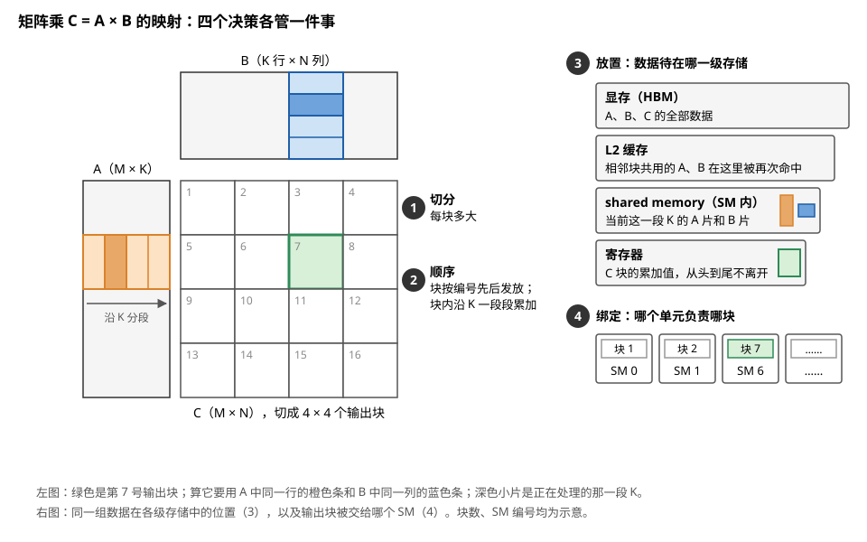
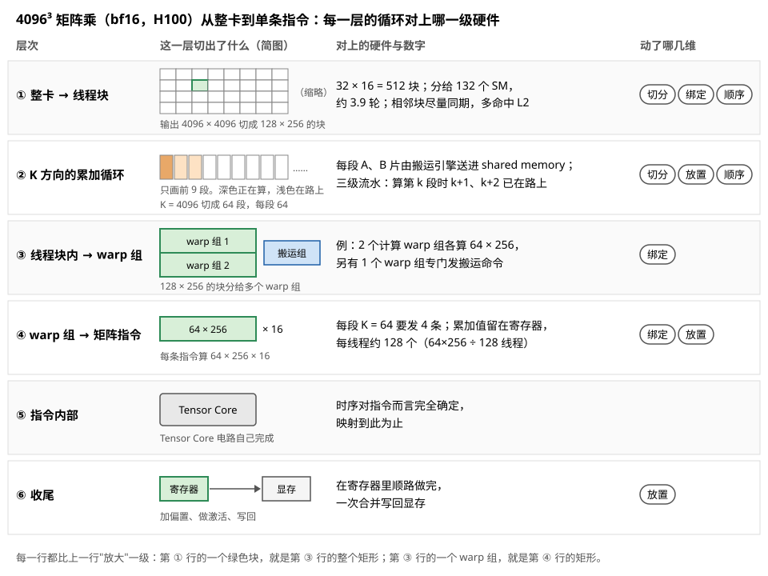
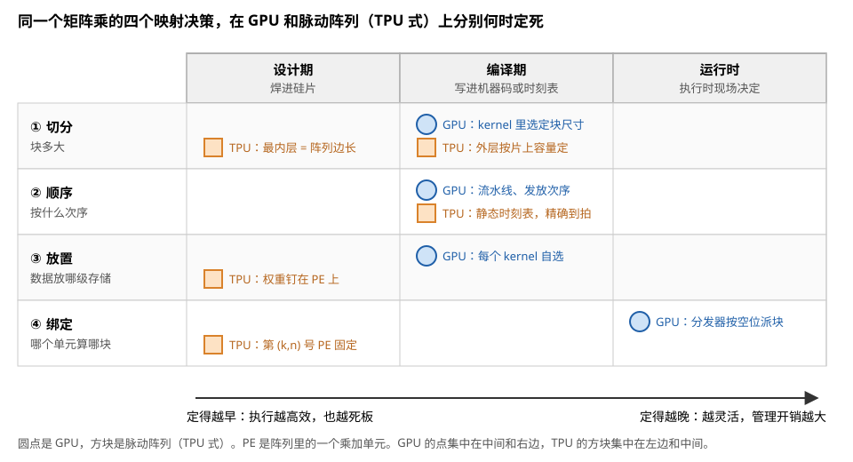
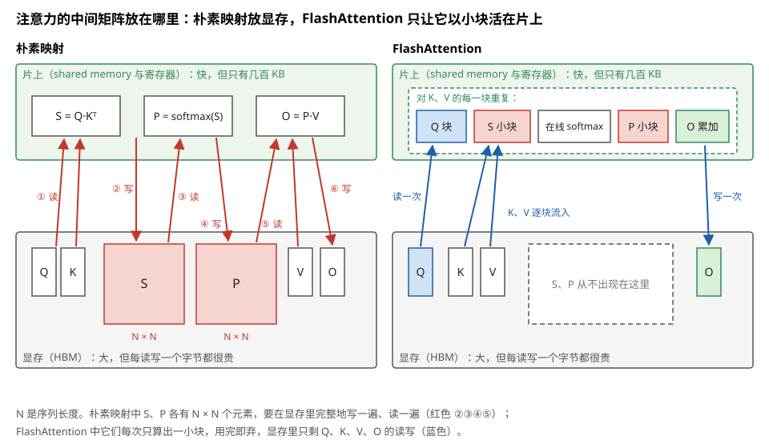

# 映射问题：全库知识的收束点

> **所属模块**：模块 40 · 软件优化栈 ⭐ 全库的收束点
> **状态**：🟨 学习中（第二版：按《写作规范》全文重写。知识截至 2026-08）
> **本节主旨**：学到这里，可以把全库内容收拢成一个问题了——**映射（mapping）：把一个计算的每一次操作，安排到硬件的某个计算单元、某个时刻、某级存储上**。这个安排只有四个决策维度：**切多大、按什么顺序、数据放哪、谁来算**。GPU 和脉动阵列的全部差异，只是这四个决策"在什么时候、由谁做出"不同；FlashAttention 这类著名优化的本质，是对其中某个决策的非常规解法。掌握了这四维语言，任何 kernel 方案、编译器特性、芯片卖点，都能被翻译成"它动了四维里的哪一维"——这是"能顺畅对话"的最终形态。

---

## 0. 这一节要回答的问题

- "映射"的精确定义是什么？为什么恰好是四个决策维度？
- 一个矩阵乘映射到 GPU 上，从整卡到单条指令共分几层？每层做了哪些决策？
- 同一个矩阵乘映射到脉动阵列上，哪些决策消失了？去了哪里？
- FlashAttention 在映射语言下的本质是什么？
- 映射到底在优化什么？有没有统一的目标函数？
- 怎么用"四维语言"去听懂和评审任何方案？

---

## 1. 映射的定义：四个决策维度

任何张量计算展开到底层都是一组嵌套循环。以矩阵乘为例：

```
for m in 0..M:  for n in 0..N:  for k in 0..K:
    C[m][n] += A[m][k] * B[k][n]
```

这一共 M×N×K 次乘加，**每一次都要被安排到"某个计算单元、某个时刻、某级存储"上**——这个安排就是映射。看似千头万绪，其实只需回答四个问题：

| 维度 | 问题 | 你已经在哪里见过它 |
| --- | --- | --- |
| **① 切分（tiling）** | 循环切成多大的块？ | 模块 11 第 4 节的两边夹逼；本模块第 4 节的 BLOCK_M/N/K |
| **② 顺序（ordering）** | 块之间、块内部按什么次序执行？ | 本模块第 4 节 §7 的流水线（把搬运顺序提前）；11-02 的静态时刻表 |
| **③ 放置（placement）** | 每块数据驻留在哪级存储？ | 模块 11 第 3 节的数据流选择；模块 10 第 4 节的存储层次 |
| **④ 绑定（binding）** | 哪个计算单元负责哪块？ | 模块 10 第 7 节的块分发；11-01 的 PE 分工 |

图 7-1 把这四个决策放在同一个矩阵乘上指给你看。



> **图 7-1**　一句话：把矩阵乘的 M×N×K 次乘加安排到硬件上，只需要回答四个问题：块切多大、按什么次序算、数据放在哪一级存储、由哪个计算单元来算。
>
> **先知道一件事**：矩阵乘 C = A × B 里，C 的每一个元素都是 A 的一行和 B 的一列逐项相乘再相加的结果。所以要算出 C 的一块，只需要 A 中对应的那几行和 B 中对应的那几列；这几行、几列沿 K 方向（逐项相乘再相加的那个方向）可以一段一段地取来累加。
>
> **按这个顺序看**：
> 1. 左图中间是 C，被切成 4 × 4 个输出块，每块左上角是编号。块切多大，就是决策 1"切分"。
> 2. 绿色的 7 号块要用到 A 中同一行的橙色条和 B 中同一列的蓝色条。橙色条和蓝色条又沿 K 方向切成 4 段，深色的是正在处理的那一段。
> 3. 决策 2"顺序"包括两件事：16 个块按编号以什么次序发出去；每个块内部沿 K 一段一段累加时，下一段数据什么时候开始搬。
> 4. 右上是决策 3"放置"：同一批数据待在哪一级存储。全部数据在显存；正在处理的那一段 A、B（深色小片）搬进 SM 内部的 shared memory；7 号块的累加值一直留在寄存器里。越往下的存储越快、也越小。
> 5. 右下是决策 4"绑定"：哪个输出块交给哪个 SM（GPU 上的一个计算单元）去算，例如 7 号块交给了 SM 6。
>
> **看懂的标志**：能把"中间结果留在寄存器里，不写回显存"这句话归到四维中的一维——它是放置。
>
> **与正文的对照**：对应上表。块数和 SM 编号是示意；§2 的真实例子是 512 个块、132 个 SM。
>
> 来源：本库自绘。

一个重要的统一在这里正式落定：**模块 11 第 3 节的"数据流"（权重驻留还是输出驻留）、本模块第 4 节的"调度"、这里的"放置"——是同一个决策的三个名字**，只是硬件圈、编译器圈、学术圈各有习惯叫法。以后听到任何一个，心里翻译成"③放置决策"即可。

## 2. 走一遍：矩阵乘映射到 GPU，六层分解

**例子：4096³ 的矩阵乘（bf16，H100），从整卡到单条指令逐层看四维决策。** 每一层都是前面某节讲过的机制，这里把它们串成一条完整的链：

**第一层：整卡 → 线程块。** ①把输出矩阵切成 128×256 的块，共 512 个；④每块交给一个线程块，由芯片级分发器按"谁有空位给谁"发往 132 个 SM（模块 10 第 7 节）。②还有一个不起眼但值得知道的顺序决策：块的发放次序被刻意排成"相邻块尽量同期执行"——因为相邻输出块共享 A 的行或 B 的列，同期执行时后到者能在 L2 里搭前者的车（模块 10 第 4 节的 L2 命中）。

**第二层：时间维 → 累加循环。** ①K 维切成 64 一段；③每段的 A 块、B 块由搬运引擎装进 shared memory；②按本模块第 4 节 §7 的三段式排成三级流水——算第 k 段时，第 k+1、k+2 段已在路上。

**第三层：线程块内 → warp 分工。** ④128×256 的输出分给若干 warp 组，Hopper 上还可按 B2 精读的方式专业分工：少数 warp 专职发搬运订单，其余专职计算。

**第四层：warp 组 → 矩阵指令。** ④每次发射一条 warpgroup 级矩阵指令（一口气算 64×256×16 的小块，模块 12 第 1 节）；③**累加器常驻寄存器不动**——这正是模块 11 第 3 节的"输出驻留"数据流，只是用软件在 GPU 上实现。

**第五层：指令内部。** Tensor Core 内部电路自己的事，时序对指令而言完全确定（模块 12 第 1 节）——映射到此触底。

**第六层：收尾。** 结果写回时顺路完成偏置和激活（本模块第 3 节 §4.2 的 epilogue 融合），一次合并写出（模块 10 第 4 节）。

图 7-2 把这六层排成一张梯子，每一层写明切出了什么、对上哪一级硬件。



> **图 7-2**　一句话：一个 4096³ 的矩阵乘，从整卡到单条指令一共分六层安排；每一层都把上一层的一块再切小，并对上一级硬件。
>
> **先知道一件事**：GPU 的硬件本身是分层的。一块 H100 芯片有 132 个 SM；每个 SM 里同时驻留多组线程，每 128 个线程组成一个 warp 组；warp 组发出的矩阵指令，由 Tensor Core（专做小块矩阵乘的电路）执行。映射的层次就是跟着这几级硬件往下走的。
>
> **按这个顺序看**：
> 1. 第 ① 行：4096 × 4096 的输出切成 128 × 256 的块。M 方向 4096 ÷ 128 = 32 块，N 方向 4096 ÷ 256 = 16 块，共 512 块（简图只画了一角）。132 个 SM 每轮各领一块，512 ÷ 132 ≈ 3.9 轮做完。
> 2. 第 ② 行：一个块要沿 K 方向累加 4096 次乘积，切成 64 段、每段 64。每段的 A、B 片由搬运引擎（TMA，专门在显存和 shared memory 之间搬数据的硬件）送进来。深色那段正在计算时，后面两段（浅色）已经在路上，这就是三级流水。
> 3. 第 ③ 行：一个 128 × 256 的块分给两个做计算的 warp 组，各负责 64 × 256；另有一个 warp 组只负责给搬运引擎发命令。
> 4. 第 ④ 行：每个计算 warp 组每次发一条矩阵指令，算 64 × 256 × 16 的一小块乘加。每段 K = 64 要发 64 ÷ 16 = 4 条。64 × 256 个累加值分摊到 128 个线程上，每个线程在寄存器里存 128 个，从头到尾不离开。
> 5. 第 ⑤、⑥ 行：指令内部由 Tensor Core 电路完成，时序固定，映射到此为止。最后在寄存器里顺路加上偏置、做完激活，一次写回显存。
> 6. 最右一列是每一层动了四维中的哪几维。
>
> **看懂的标志**：能说出第 ① 行的"约 3.9 轮"意味着什么——前三轮做掉 3 × 132 = 396 块，最后一轮只剩 116 块，有 16 个 SM 空着。这就是模块 10 第 7 节讲的"wave 尾巴"；§6 翻译术第 1 句的 persistent kernel，改的正是这一层的绑定。
>
> **与正文的对照**：对应上面的六层分解。第 ③ 行"2 个计算 warp 组 + 1 个搬运 warp 组"是一种常见安排，正文只写了"若干 warp 组"；每线程 128 个累加寄存器按 fp32 累加值计算；"每轮 132 块"假设每个 SM 同时只放一个块。
>
> 来源：本库自绘。

验收一下这个映射的质量，用的全是学过的判据：块尺寸对齐 128——无形状税（模块 11 第 5 节）✅；累加器驻留、A/B 在 shared 复用——数据流合理 ✅；三级流水盖住搬运（本模块第 4 节 §7.4 的账）✅。**六层分解，每层一两个四维决策，一个高性能矩阵乘就这样被"安排"出来了。**

## 3. 同一个矩阵乘映射到脉动阵列：决策去哪了

四个决策一个没少，但**大部分不再由软件在运行前做，而是提前冻结了**：

| 决策 | GPU（软件层层安排） | 脉动阵列（TPU 式） |
| --- | --- | --- |
| ①切分 | kernel 作者/自动调优选块尺寸 | **最内层焊死**（阵列边长就是硬件参数，TPU v1–v5 为 128、v7 为 256 量级），外层由编译器按 scratchpad 容量定（模块 11 第 4 节） |
| ②顺序 | 流水线、块发放次序，软件排 | **编译器排成静态时刻表**，精确到拍（模块 11 第 2 节的公式） |
| ③放置 | 每个 kernel 自选驻留方案 | **焊死在硅片上**：权重钉在 PE、部分和走列线（模块 11 第 3 节） |
| ④绑定 | 分发器动态分派 | **焊死**：第 (k,n) 号 PE 永远负责它那格 |

图 7-3 把这张表画成"每个决策在哪个时刻定死"。



> **图 7-3**　一句话：四个映射决策在 GPU 上大多到编译期或运行时才定，在脉动阵列上大多在设计芯片时就定死了；两类芯片的差别，可以读成"同一组决策的定死时刻不同"。
>
> **先知道一件事**：脉动阵列是一种专用芯片结构。成百上千个乘加单元（PE）排成方阵，数据按固定节拍在相邻 PE 之间逐格传递。它没有 GPU 那样的线程和调度器，每个 PE 在每一拍做什么都是事先排好的。
>
> **按这个顺序看**：
> 1. 横向三列是三个时间点：设计期（做进电路，芯片造好就改不了）、编译期（写进机器码或时刻表，换一个程序可以重新定）、运行时（程序执行时现场决定）。纵向四行是四个决策。
> 2. 看蓝色圆点（GPU）：切分、顺序、放置都在编译期，由 kernel 作者或自动调优在编译时选定；绑定在运行时，由芯片上的分发器看哪个 SM 有空位，就把块派过去。
> 3. 看橙色方块（TPU 式脉动阵列）：切分的最内层就是阵列边长，在设计期定死，外层才由编译器按片上存储的容量决定；顺序由编译器排成精确到拍的时刻表；放置和绑定都在设计期定死，权重固定在 PE 上，第 (k,n) 号 PE 永远负责它那一格。
> 4. 最下面的箭头：越往左定得越早，执行越高效，因为运行时不用再做任何安排；也越死板，形状不合适时只能填零凑整。
>
> **看懂的标志**：能回答"一款新芯片宣称'数据流可在编译期选择'，它在这张图上是怎么移动的"——它把放置这一行的方块从设计期挪到了编译期，比 TPU 灵活，又比 GPU 定得早。
>
> **与正文的对照**：与上表逐格对应。"数据流可在编译期选择"一例取自本节术语卡"冻结时刻"的例句。
>
> 来源：本库自绘。

由此得到全库最重要的一句总结：

> **GPU 与专用加速器的全部差异 = 四个映射决策的"冻结时刻"不同。** 冻结得越早（设计期 > 编译期 > 运行时），执行越高效、越死板；冻结得越晚，越灵活、管理开销越大。模块 00 那条"分水岭"（时序何时被决定），就是这句话的最初形态——全库在这里首尾闭合。

## 4. FlashAttention 在映射语言下的本质

注意力计算 = 矩阵乘 → softmax（行归约）→ 矩阵乘。它的映射难题：中间那个归约把两个矩阵乘隔开，而中间结果是"序列长×序列长"的大矩阵。三种映射的对比：

- **朴素映射**：中间矩阵③放置在**显存**——两趟全尺寸的写和读，整个计算被这个往返拖成访存受限（模块 10 附录 A2 的账）。
- **常规优化**：融合掉 softmax 周边的零碎——中间矩阵还是落显存，治标。
- **FlashAttention**：先定一个③放置的目标——**中间矩阵永不落显存，只以小块形式活在片上**；再倒过来看这个目标需要什么：需要归约能分块进行——于是**改写 softmax 的数学**（分块在线更新，模块 40 B1 精读的那七行）来配合。

图 7-4 对照画出朴素映射和 FlashAttention 的数据往返。



> **图 7-4**　一句话：朴素的注意力实现把 N × N 的中间矩阵完整地写进显存再读回来；FlashAttention 让它只以小块的形式在片上出现，显存里只剩输入和输出的读写。
>
> **先知道一件事**：注意力先算 S = Q·Kᵀ（每个位置和每个位置之间的相关分数，共 N × N 个），再对每一行做 softmax 得到 P，最后算 O = P·V。N 是序列长度。Q、K、V、O 都只有 N × d 个元素（d 是每个头的维度，常见 128），S、P 却有 N × N 个：N = 8192 时，一个头的 S 按 bf16（每个数 2 字节）算是 8192 × 8192 × 2 字节 = 128 MB，而 Q 只有 8192 × 128 × 2 字节 = 2 MB。
>
> **按这个顺序看**：
> 1. 两个面板上方的绿色区域是片上存储（SM 内部的 shared memory 和寄存器），快，但只有几百 KB；下方灰色区域是显存，大，但读写代价高。
> 2. 左边朴素映射，按红色编号看：① 读 Q、K；② 把算出的 S 整个写进显存；③ 再整个读回来做 softmax；④ 把 P 整个写回显存；⑤ 读 P 和 V；⑥ 写出 O。②③④⑤ 四趟搬的都是 N × N 的大矩阵。
> 3. 右边 FlashAttention：Q 的一块读进片上一次；K、V 一块一块地流进来。每来一块，就在片上算出一个 S 小块，做一次在线 softmax 更新，得到 P 小块并累加进 O，然后这两个小块就丢掉。
> 4. 右边显存里的虚线框：S、P 从来没有完整地存在过。显存只剩蓝色的三种读写：读 Q、流入 K 和 V、最后写一次 O。
>
> **看懂的标志**：能说出这件事为什么编译器做不到——softmax 要用一整行的最大值和总和，按原来的数学必须先有完整的一行 S。FlashAttention 先改写了 softmax 的算法（在线更新，每来一块就修正一次之前的结果），分块计算才成立；编译器只能重排计算，不能改写数学。
>
> **与正文的对照**：对应本节列出的第一种和第三种映射。第二种"常规优化"只融合 softmax 周边的零碎操作，S、P 仍然落在显存，画出来与左边相同。
>
> 来源：本库自绘。

看清这个次序就看清了它的本质：**普通映射是"给定计算，找最优的四维安排"；FlashAttention 是"给定想要的放置方案，反过来改写计算来迁就它"。** 这解释了为什么编译器做不出 FA（本模块第 3 节 §4.3 的边界：编译器只能重排、不能改数学），也解释了它后续所有演化的位置：FA-2 改④绑定（并行度铺开到序列维）、FA-3 改②顺序（异步流水加 warp 分工）——**骨架里那个③放置的核心决策，从第一代到现在没变过**。

## 5. 映射在优化什么：统一的目标函数

四个维度，一个目标，可以写成一句话：

> **在"每级存储装得下"的约束内，让最贵的那个资源（矩阵单元、或某级带宽）永不空转。**

展开就是全库反复用过的三步法（模块 10 附录 A1）：先判断这个计算受限于什么（算术强度对比硬件平衡点）；再用①③制造复用、把需求压到瓶颈资源的能力之内；最后用②④把等待藏起来（流水、分工、错峰）。**硬件篇（模块 10–12）给出了"资源和代价的地图"，软件篇（模块 40）给出了"在地图上做四维决策的方法"——两者的交点就是映射，全库到此收束。**

## 6. 翻译术：把任何方案的话翻成四维

这是本节交付的日常能力：**任何 kernel、编译器、芯片方案的宣传点，都能翻译成"它动了四维里的哪一维"**。练三句：

1. *"我们用了 persistent kernel，SM 利用率提升 15%。"* → 动的是**④绑定**：从"分发器静态派块"改成"常驻块动态领活"（模块 10 第 7 节 wave 尾巴的救法）。
2. *"新版本把 tile 遍历顺序改成 Z 字形，L2 命中率提高了。"* → 动的是**②顺序**：让共享数据的块同期执行（本节第 2 层的那个决策）。
3. *"这颗芯片把权重固定在计算单元里，能效是 GPU 的三倍。"* → 动的是**③放置**，而且是**把它的冻结时刻提前到了设计期**（第 3 节的表）——能效来自冻结，死板也来自冻结，追问一句"形状不规则时怎么办"就问到了要害。

**例子：用四维给一个真实方案"过堂"。** 假设评审一个"自研 MoE 推理 kernel"的方案，四维各问一句：①块尺寸和专家的变长 token 数怎么配合，有没有量化浪费？③专家权重放哪级、每次换专家要不要重搬？②多个专家的计算顺序怎么排，通信藏在谁后面？④负载不均时块怎么分给 SM，是静态分还是动态领？——**四个问题问完，方案的完成度和作者的深度一目了然**。这就是映射语言的实战价值：它是一张不会漏项的检查单。

## 7. 最新架构落点（知识截至 2026-08）

- **硬件在替映射"减维"**：搬运引擎接管②的搬运顺序（TMA）、专用存储固化③的累加器放置（TMEM）、簇给④加了一层新粒度——每代硬件都在把最常用的映射决策做成器件，冻结时刻整体前移。
- **映射自动化的边界没变**：自动调优搜①②的参数、编译器做常规的③——但"改写数学来迁就放置"（FA 式反向映射）仍是人的领地，且新的例子还在出现（各类线性注意力、状态空间模型的高效实现，本质都是为了更好的③而重造计算）。
- **NPU 侧**：映射几乎全部在编译期完成（XLA/CANN），映射空间的自动探索（模块 11 第 3 节的 Timeloop 类工具）是设计和编译的标配环节。
- **④绑定这一维在长出新的层级**。原来它的粒度是"哪个线程块去哪个 SM"；Hopper 加了簇（一组块绑到一组相邻 SM），Blackwell 的 2-CTA 又加了"配对的两个块"（模块 12 第 1 节 §4.1）。**四维本身没变，变的是每一维内部的层次数**——这正是本节 §3 那句"硬件在替映射减维"的另一面：**硬件把常用的映射决策做成器件的同时，也在给这些维度增加新的刻度。**
- **四维之上出现了新的一层，值得单独记**。Rubin CPX（模块 01 §6）把 prefill 和 decode 分给两种不同的芯片——**这不是四维里的任何一维，而是在四维之上多了一个决策：这段计算该用哪种硬件。** 用本节的语言说：**过去是"给定硬件，找最优映射"，现在多了一问"给定负载，选哪种硬件"。** 第 6 节的翻译术因此要加一句——听到一个方案时，除了问它动了四维的哪一维，还要问它有没有在动这个新的第五问。
- **跨卡的映射是四维的自然延伸**：模块 60 第 1 节讲的并行策略组合，本质上就是把切分与绑定这两维推到了多卡尺度（TP 是层内切分加跨卡绑定，PP 是层间切分，DP 是数据维切分）。**同一套坐标系在单卡和集群上都成立，只是"计算单元"从 SM 换成了 GPU。**

## 8. 术语卡

### 映射（mapping）
**定义**：把计算的每次操作安排到"计算单元 × 时刻 × 存储层级"的完整方案，由切分、顺序、放置、绑定四个决策维度构成。
**为什么存在**（作为概念）：它是硬件知识和软件优化的交汇点——所有 kernel 优化、编译器特性、芯片设计差异，都能表述为四维中某几维的不同选择。
**语境例句**："这个算子在昇腾上的 mapping 还没调好。" —— 意思是：四维安排（多半是切分尺寸和数据驻留层级）与硬件还不匹配——按四维逐个检查，而不是笼统地"再优化优化"。

### 四维决策（切分/顺序/放置/绑定）
**定义**：映射的完整分解：切多大的块、按什么次序、数据放哪级存储、哪个单元算哪块。
**为什么存在**：四维恰好覆盖"空间×时间×数据×算力"的安排，不重不漏——它是分析任何执行方案的坐标系。
**语境例句**："先别聊实现，这个方案四个维度各是怎么定的？" —— 意思是：用坐标系过一遍堂（本节第 6 节的检查单）——答不全的方案说明还没想透。

### 冻结时刻（决策何时定死）
**定义**：某个映射决策从"可变"变"不可变"的时间点：设计期（焊进硅片）、编译期（写进时刻表/机器码）、或运行时（现场决定）。
**为什么存在**：它是两大芯片范式的统一刻度——冻结越早越高效越死板，越晚越灵活越费管理。GPU 与 TPU 的全部差异都能放到这把尺上量。
**语境例句**："这家新芯片把数据流做成编译期可选了。" —— 意思是：③放置的冻结时刻从设计期推迟到了编译期——比 TPU 灵活、比 GPU 高效的中间路线，代价通常是互连电路更复杂。

### 反向映射（FlashAttention 式）
**定义**：先锁定想要的放置方案（如"中间结果永不落显存"），再改写计算的数学形式来迁就它——与"给定计算找安排"的常规方向相反。
**为什么存在**：有些放置目标在原始数学下不可行（归约挡路），只有改数学才能解锁——这超出编译器能力（只能重排不能改写），是人类专属的优化形态，也是历次重大性能突破的共同结构。
**语境例句**："这个新算法本质上是给线性注意力找了个能全程驻留片上的数学形式。" —— 意思是：又一次反向映射——先要放置、后造数学——评估时重点看数学改写的精度代价。

## 9. 我的困惑 / 待深挖

- 映射空间的自动探索（Timeloop 类）在 GPU 侧为何不如 NPU 侧流行？动态性差异之外还有什么原因？
- "改写数学迁就放置"能否半自动化？等式变换搜索（e-graph 方向）的现状？
- 跨多个 kernel 的全局放置优化（让上一个 kernel 的输出直接留在片上给下一个用）有没有系统性工具？

---

*最后更新：2026-09-01（第三版：§7 更新到 2026-08，补入④绑定长出新层级、四维之上的"选哪种硬件"第五问（Rubin CPX）、以及四维在多卡尺度的自然延伸。第二版：按含自检的写作规范重写）*（2026-09 补图 4 张：现成 0 张，自绘 4 张；图注按费曼法写）
