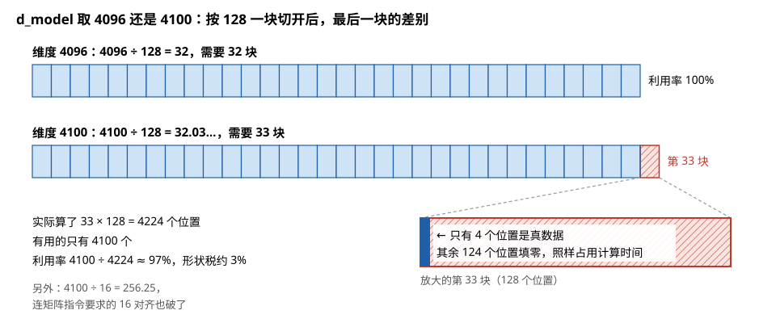
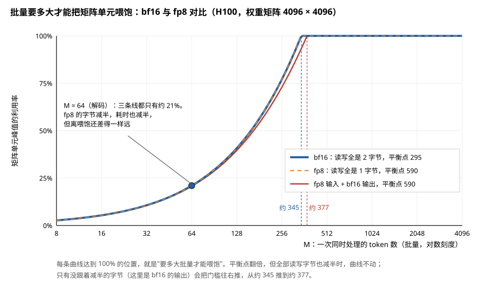
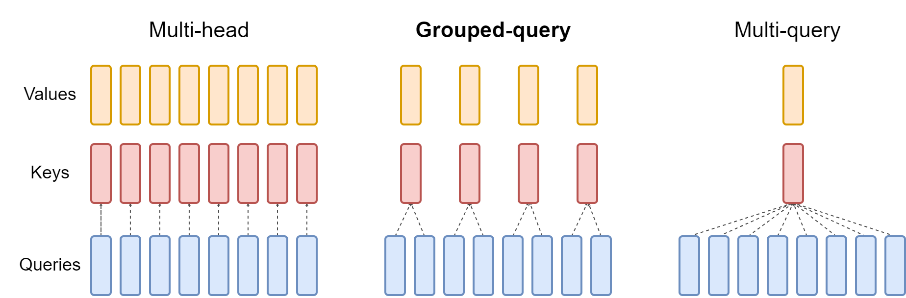
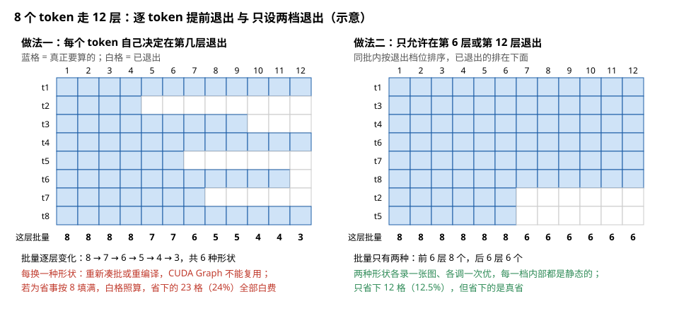
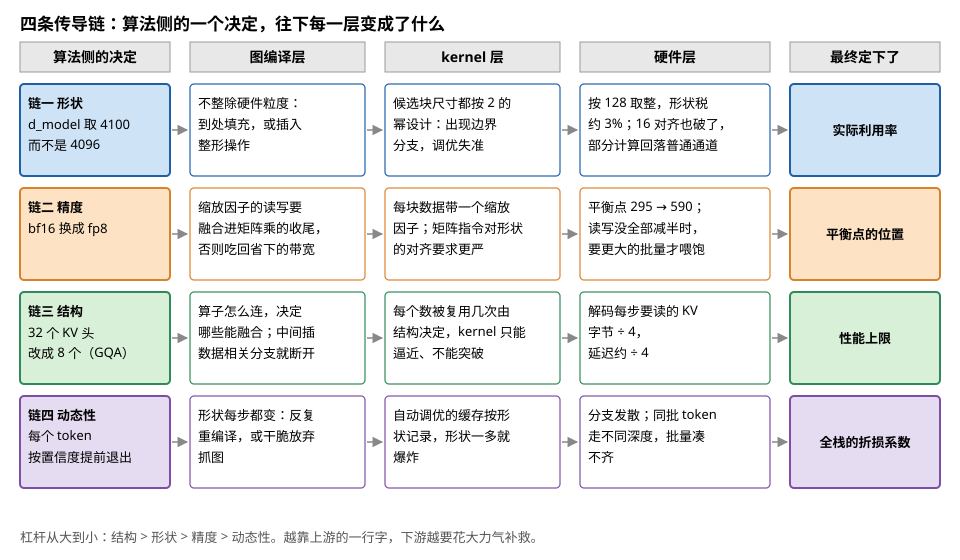
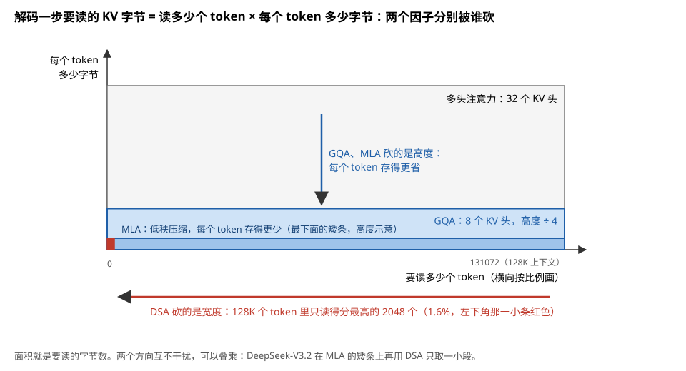

# 与算法侧的接口：你的决策如何沿栈传导

> **所属模块**：模块 40 · 软件优化栈（本模块收官节 · 直接服务日常工作）
> **状态**：🟨 学习中（第二版：按《写作规范》全文重写。知识截至 2026-08）
> **本节主旨**：前面所有章节讲的是"硬件长什么样、软件怎么迁就它"。这一节把方向反过来，站到你的位置上：**算法侧的每个设计决策（维度取多少、用什么精度、算子怎么连、形状变不变），会沿着软件栈一路向下传导，在某一层落地成硬件后果**。而且传导是单向的：上游一行代码就能定的事，下游要付出巨大代价才能补救。所以算法侧其实是全栈杠杆率最高的位置——本节给出四条传导链、正反两份清单、和一张评审提问单，把全库知识压缩成你开会评审时直接可用的工具。

---

## 0. 这一节要回答的问题

- 一个算法决策是怎么一层层变成硬件后果的？哪类决策杠杆最大？
- 设计模型时，哪些选择能"帮硬件的忙"？哪些会"给硬件添堵"？
- 听方案、做评审时，该问哪几个问题才能问到要害？
- 和做 infra 的同事对话时，我说的话在他们耳朵里是什么？
- 业界有哪些"为硬件重新设计算法"的成功案例？

---

## 1. 基础词汇：先把本节要用的词讲清楚

**传导（propagation）**。算法层的一个选择，经过图编译层、kernel 层、硬件层的逐层反应，最终落成性能后果的过程。传导是单向衰减的：源头一行代码，下游可能是几个人月的补救工程。

**杠杆率（leverage）**。同样的努力在不同层产生的性能影响之比。本节的中心论点：**算法侧的杠杆率最高**——因为它决定的是"性能上限"，下游各层只能逼近这个上限，不能突破它。

**算术强度（arithmetic intensity）**。每从内存搬一个字节能做多少次计算（模块 10 附录 A1 的核心量）。算法的**结构**直接决定它的上限——这是理解"杠杆"的钥匙。

## 2. 四条传导链：从你的一行代码到硅片

### 链一：形状——维度数字如何逐层放大成利用率

**例子：d_model 取 4096 还是 4100，逐层跟踪。** 两个数字在算法上几乎无差（参数量差 0.1%），传导下去：图编译层——4100 不整除任何硬件粒度，编译器要么到处填充、要么插入整形操作；kernel 层——自动调优的候选块尺寸全按 2 的幂设计，4100 逼出边界处理分支，最优配置失准；硬件层——按 128 粒度取整，形状税约 3%（模块 11 第 5 节的公式），更糟的是矩阵指令要求的 16 对齐也破了，部分计算静默回落到普通通道。**一个无心的数字，每层都在为它买单**——这就是"形状文化"（全行业维度取 64/128 倍数）的由来。设计时的规则简单到不像话：**维度过一遍"整除 128 吗"的检查，就避开了全部这类税。** 图 8-1 画出了 4100 在硬件层交的那 3%。

> **图 8-1**　一句话：维度 4096 按 128 一块正好切成 32 块；4100 要切成 33 块，而第 33 块里只有 4 个位置是真数据，其余 124 个位置填零后照样要算。
>
> **先知道一件事**：矩阵单元一次处理固定大小的一块数据，这里以 128 为例。维度不是 128 的整数倍时，最后一块的缺口要填零凑满；填进去的零也要占用计算时间，算出的结果却没有用。这笔浪费叫形状税。
>
> **按这个顺序看**：
> 1. 上面一行：4096 ÷ 128 = 32，32 块全是蓝色，一个位置都不浪费。
> 2. 下面一行：4100 ÷ 128 = 32.03…，要 33 块，最后一块画成红色斜线。
> 3. 右下的放大图：第 33 块的 128 个位置里，左边深蓝的一小条是 4 个真数据，其余 124 个是填进去的零。
> 4. 左下的账：一共算了 33 × 128 = 4224 个位置，有用的 4100 个，利用率约 97%，形状税约 3%。
> 5. 灰字：4100 除以 16 也除不尽，矩阵指令要求的 16 对齐同样被破坏了。
>
> **看懂的标志**：能回答"4100 只比 4096 多 0.1% 的参数，为什么要多付约 3% 的计算"——多出来的 4 个位置单独占了一整块，而这一块的计算量按 128 个位置算。维度"刚过"整数倍时最吃亏。
>
> **与正文的对照**：对应链一的例子。图中只画了一个维度；矩阵乘有 M、N、K 三个维度，每个不整除的维度都会乘上各自的税率（模块 11 第 5 节）。
>
> 来源：本库自绘。

### 链二：精度——省的字节要配套才能兑现

降精度（bf16 → fp8）表面上是免费加速：字节减半、矩阵单元吞吐翻倍。但传导下去有两个配套条件：kernel 层——fp8 需要伴随的缩放因子管理，缩放的读写必须搭矩阵乘的车（模块 40 第 3 节的收尾融合），否则省的带宽被缩放张量吃回去；硬件层——精度越低，硬件的"平衡点"越高（模块 10 附录 A1：bf16 约 295，fp8 时算术强度要将近 600 才算得上计算受限）。这里要把账算清楚：平衡点翻倍的同时，同一个矩阵乘因为字节减半，算术强度也翻倍，**前提是所有读写都跟着减半**。这时两者同步移动，要多大的批量才能喂饱，和 bf16 时一样，得到的是同样的利用率、一半的时间。实际系统里总有没跟着减半的字节：输出常常仍写 bf16，缩放因子也要读写。它们让算术强度涨不满一倍，于是需要比 bf16 时更大一些的批量才能回到计算受限（图 8-2 的例子里，从约 345 个 token 涨到约 377 个）。再加上 fp8 的矩阵指令每条沿 K 方向处理 32 个元素（bf16 是 16 个），K 维的对齐粒度也翻了倍。一句话：**降精度不会降低、而且往往会抬高对"形状和批量"的要求**——链二会反过来加重链一和链四的分量。

> **图 8-2**　一句话：把矩阵乘从 bf16 换成 fp8 之后，"要多大的批量才能把矩阵单元喂饱"基本不变；只有没跟着减半的那部分字节，会把这个门槛往上推一点。
>
> **先知道一件事**：矩阵单元能不能被喂饱，要拿算术强度（每从显存搬一个字节做几次运算）和芯片的"平衡点"（峰值算力 ÷ 显存带宽）比，前者大才喂得饱。H100 上 bf16 的平衡点约 295，fp8 约 590。解码时矩阵乘的算术强度主要由批量 M（一次同时处理几个 token）决定：M 越大，读进来的每个权重被重复使用的次数越多。
>
> **按这个顺序看**：
> 1. 横轴是批量 M（对数刻度，每格翻一倍），纵轴是矩阵单元峰值的利用率。曲线升到 100% 的位置，就是喂饱所需的最小批量。
> 2. 蓝色粗线是全部 bf16：M = 64 时利用率约 21%，M 约 345 时升到 100%。
> 3. 橙色虚线是全部 fp8（输入、权重、输出都是 1 字节），它和蓝线完全重合：平衡点翻了倍，但每个数的字节减了半，算术强度也翻倍，两者抵消。
> 4. 红色细线是更常见的情况：输入和权重是 fp8，输出仍写 bf16。输出的字节没有减半，算术强度涨不满一倍，曲线略微右移，要约 377 个 token 才能喂饱。
> 5. 左边的圆点：解码阶段 M = 64，三条线都只有约 21%。fp8 让这一步的耗时减半，但离喂饱还差得一样远。
>
> **看懂的标志**：能回答"换成 fp8 之后，凑不满批量的解码服务会不会更好地利用矩阵单元"——不会。字节减半让它快了近一倍，但利用率仍是约 21%；要提高利用率，还是得靠加大批量。
>
> **与正文的对照**：按 H100 的 bf16 峰值约 989 TFLOP/s、fp8 峰值约 1979 TFLOP/s、显存带宽 3.35 TB/s，权重矩阵 4096 × 4096 计算，忽略缩放因子的读写。
>
> 来源：本库自绘。

### 链三：结构——算子怎么连，决定性能上限本身

这是杠杆最大的一条链。算法的**结构**决定两件下游永远改不了的事：**融合机会**（相邻算子能不能融，取决于你把它们怎么摆——中间插一个数据相关的分支，融合窗口就断了）和**算术强度的上限**（数据的复用次数是结构性的：注意力里一个数被复用"序列长"次、MoE 专家权重被复用"分到的 token 数"次——结构定了，上限就定了，kernel 工程师只能逼近、不能突破）。

**例子：GQA 的一笔账——结构改动如何直接改写硬件账本。** 标准多头注意力 32 个头，解码时每步要读全部 KV 缓存。换成分组查询注意力（GQA），KV 头从 32 个减到 8 个——**KV 缓存的字节数直接除以 4**。解码是访存受限的（模块 10 附录 A2：每步就读一遍 KV，算术强度接近下限），时间约等于"KV 字节 ÷ 显存带宽"——**字节除以 4，解码延迟就除以约 4**。没有任何 kernel 优化能白送这样的倍数：这是**结构层的一行改动，直接改写了硬件账本的被除数**。精度损失则用训练来弥补——这就是"算法迁就硬件"的标准姿势。图 8-3 是 GQA 论文里的示意图，画的是 8 个头分 4 组的缩小版。

> **图 8-3**　一句话：分组查询注意力（GQA）让几个查询头共用同一组键和值，于是解码时要存、要读的 KV 缓存按组数成比例减少。
>
> **先知道一件事**：注意力里每个"头"都有三组向量：查询（Query，当前 token 拿来提问的）、键（Key）和值（Value，历史 token 留下的）。解码时，历史 token 的键和值会存起来反复使用，这就是 KV 缓存；每生成一个 token，都要把它完整地从显存读一遍。
>
> **按这个顺序看**：
> 1. 三个面板从下往上都是三排：最下排蓝色是查询头（Queries），中间红色是键头（Keys），最上排黄色是值头（Values）。虚线表示哪个查询头去用哪个键头，值头与键头一一对应。
> 2. 左边 Multi-head（多头注意力）：8 个查询头各有自己的键头和值头，KV 缓存要存 8 组。
> 3. 中间 Grouped-query（分组查询注意力）：每 2 个查询头共用一组键和值，只剩 4 组，KV 缓存减半。
> 4. 右边 Multi-query（多查询注意力）：8 个查询头全部共用一组键和值，KV 缓存只剩 1 组。
> 5. 查询头的数量三边都是 8 个：计算量几乎不变，变的只是要存、要读的键和值。
>
> **看懂的标志**：能把正文的数字套上去——32 个头的模型换成 8 个 KV 组，相当于从左边走到中间，只是每组有 4 个查询头。KV 缓存的字节 ÷ 4，访存受限的解码每步也就快约 4 倍。
>
> **与正文的对照**：图中是 8 个头分 4 组，正文的例子是 32 个头分 8 组。右边的多查询注意力是分组的极端情况：只有一个 KV 组，省得最多，对模型精度的影响也最大。原图右边缘的最后一个查询头被略微裁掉，是原图如此。
>
> 来源：[Overview of grouped-query method.png](https://commons.wikimedia.org/wiki/File:Overview_of_grouped-query_method.png)，出自 Ainslie 等人 2023 年的 GQA 论文（arXiv:2305.13245），Commons 上标注的作者为 Unknown author，许可 CC BY 4.0。

### 链四：动态性——全栈的公敌

形状每步都变、控制流依赖数据的值，这类"动态性"在每一层都触发降级：图编译层反复重编译或干脆放弃抓图（graph break）；kernel 层自动调优的缓存爆炸（模块 40 第 4 节）；硬件层分支发散（模块 10 第 3 节）、批量凑不齐。**例子**：给每个 token 加一个"按置信度提前退出"的分支——听起来省算力，传导下去：同批 token 走不同深度 → 批内形状不齐 → 每层都要重新凑批或填充 → 省下的算力远抵不上全栈的降级。动态性不是不能用，而是要**集中和分桶**：把变化收拢到少数几个档位（序列长度分桶、退出层数只设两三档），让每个档位内部保持静态。图 8-4 用 8 个 token、12 层把两种做法摆在一起。

> **图 8-4**　一句话：让每个 token 自己决定在第几层退出，会让每一层的批量都不一样；只设两个退出档位，省下的计算少一些，但每一档内部形状固定，下游的优化都用得上。
>
> **先知道一件事**：GPU 上的一层计算，是把同一批 token 拼成一个矩阵一起算的。批量（这一层同时算几个 token）一变，矩阵的形状就变了：之前按旧形状编译、调优、录制好的东西都要重来，或者只能填充凑回旧形状。
>
> **按这个顺序看**：
> 1. 两个网格的横向是第 1 到第 12 层，纵向是同一批里的 8 个 token（t1～t8）。蓝格表示这个 token 在这一层要算，白格表示它已经退出。
> 2. 左边做法一：每个 token 在自己有把握的那一层退出，t2 在第 4 层就走了，t7 在第 7 层，t3 在第 9 层。底下一行是每层剩下的批量：8、8、8、8、7、7、6、5、5、4、4、3，一共出现 6 种形状。
> 3. 左下红字：每换一种形状，就要重新凑批或重新编译，CUDA Graph（录制一次、之后整体重放的执行方式）也不能复用。如果为了省事把批量填回 8，白格也照算，省下的 23 格计算全部白费。
> 4. 右边做法二：只允许在第 6 层或第 12 层退出。t2、t5 在第 6 层退出；其余 token 即使中途已经有把握，也要算到第 12 层。批内按档位排好序后，前 6 层是 8 个 token，后 6 层是 6 个，只有两种形状。
> 5. 右下绿字：只省下 12 格，但两种形状可以各自编译、调优、录制一次，省下来的计算是真的省下来了。
>
> **看懂的标志**：能回答"做法一纸面上省了 24% 的计算，为什么实际可能比做法二还慢"——它省的是算术，付出的是 6 种形状带来的重编译、凑批和填充；只要按 8 填充，省下的就一格都不剩。
>
> **与正文的对照**：对应链四"按置信度提前退出"的例子和"集中和分桶"的建议。各 token 的退出层数是示意。
>
> 来源：本库自绘。

四条链的杠杆排序：**结构 > 形状 > 精度 > 动态性**——结构定上限，形状定实际利用率，精度定平衡点位置，动态性定全栈折损系数。**你在写下模型结构的那一刻，已经替 kernel 工程师定了他能做到的最好成绩。** 图 8-5 把四条链逐层排成一张表。

> **图 8-5**　一句话：算法侧的四类决定，沿着图编译层、kernel 层、硬件层一路往下传，每一层都把它变成一种具体的代价，最终分别定下利用率、平衡点、性能上限和折损系数。
>
> **先知道一件事**：软件栈从上到下的几层各管一件事。图编译层把模型的计算图整理、融合成一个个 kernel；kernel 层决定每个 kernel 怎样切块、怎样使用硬件；硬件层按固定的粒度和带宽执行。上游的一个决定，下游只能接受并想办法补救。
>
> **按这个顺序看**：
> 1. 每一行是一条链。最左边的彩色格是算法侧的一个具体决定，例如"d_model 取 4100 而不是 4096"。
> 2. 沿箭头往右读：图编译层怎样应付它，kernel 层受到什么影响，硬件层最后付出什么。例如链一在硬件层变成约 3% 的形状税和对齐破坏。
> 3. 最右边的彩色格是这条链最终定下的东西：形状定实际利用率，精度定平衡点的位置，结构定性能上限，动态性定全栈的折损系数。
> 4. 最下面一行：四条链的杠杆从大到小是结构、形状、精度、动态性。
>
> **看懂的标志**：能说出链三为什么排第一——结构定下的是上限。GQA 把要读的 KV 字节除以 4，下游任何 kernel 优化都做不到这件事；其它三条链决定的，只是离这个上限还有多远。
>
> **与正文的对照**：每一格的内容都取自上面四段文字。
>
> 来源：本库自绘。

## 3. 两份清单

**帮忙清单（正向设计规则）：**
1. 维度一律取 128 的倍数（至少 16 的倍数）；词表大小也 pad 到整数倍。
2. 能合并的投影合并（Q/K/V 三个矩阵乘并成一个——给横向融合喂料）。
3. 可融合的算子之间不插打印、数据相关分支、黑盒自定义算子（保住融合窗口）。
4. 解码场景优先砍 KV/权重的字节数（GQA/MLA/量化）——访存受限时字节就是时间。
5. 批量能攒就攒：无论 GPU 的占用率还是脉动阵列的权重复用，"每份权重服务更多 token"都是第一杠杆（模块 11 第 3 节的能量账）。
6. 动态性分桶收拢，档位越少越好。

**添堵清单（反面模式，见了要警觉）：**

| 反面模式 | 疼在哪 |
| --- | --- |
| 质数或"过界一点"的维度（4100、头维 100） | 形状税 + 对齐破坏 + 调优失准（链一） |
| 一堆不凑批的小矩阵乘 | 灌排/启动开销摊不平，机器大面积空转 |
| token 级数据相关分支 | 发散 + 抓图中断 + 无法凑批（链四） |
| 长逐元素链不开编译 | 全是中间结果落地税（模块 40 第 3 节） |
| 超细粒度专家 + 小批量解码 | 每个专家分到的 token 太少，权重搬运账惨不忍睹（模块 11 第 3 节的 M=8 账） |
| 每步变形状不分桶 | 全栈重编译、缓存爆炸 |

## 4. 评审提问单：五个问题问穿任何方案

听任何 kernel/系统/芯片适配方案，按这五问过堂（每问背后是全库的一块知识）：

1. **"这个负载是什么受限？"**——算术强度多少、卡算力还是哪级带宽（附录 A1 三步法）。答不上来的方案先存疑。
2. **"复用发生在哪一级？中间结果落不落显存？"**——放置决策，融合方案的命门（上一节③维）。
3. **"块尺寸和我们的形状整除吗？变长怎么处理？"**——形状税与分桶（模块 11 第 5 节）。
4. **"最贵的资源空转吗？靠什么填？"**——流水、分工、错峰（模块 40 第 4 节 §7）。
5. **"形状或路由变化时，哪些优化会失效？退化路径是什么？"**——**方案吹性能时最常隐藏的就是这条**：benchmark 用的固定形状，上线后的动态负载可能全部击穿。

**例子：五问过一个真实方案。** 某方案宣称"自研注意力 kernel 比开源快 30%"。问一：快在哪个受限区？——答"长序列预填充"（计算受限区，合理）。问二：中间结果放哪？——答"全程片上"（FA 同款放置，合理）。问三：head 维 96 支持吗？——答"只测了 128"（形状税没验证，标记风险）。问四：softmax 和矩阵乘重叠了吗？——答"还没做"（还有余量，也说明 30% 可能来自基线太弱）。问五：变长批次呢？——答"用填充"（**要害：上线负载变长严重时，填充会吃掉大部分收益**）。五问过完，这个"30%"的成色和适用边界清清楚楚——这就是本节要交付的对话能力。

## 5. 翻译表：你的话在 infra 同事耳朵里是什么

| 你说 | 对方听到 | 值得先自问 |
| --- | --- | --- |
| "头维从 128 改成 96 能省参数" | 形状税 + 矩阵指令对齐破坏 | 省的 0.5% 参数值不值 3~20% 的利用率 |
| "加个 per-token 的门控" | 发散 + 抓图断 + 批次碎 | 能否改成批内排序或掩码实现 |
| "专家数从 8 加到 64，更细粒度" | 每专家 token 数除以 8，解码权重搬运账恶化 8 倍 | 批量撑得起来吗（模块 11 第 3 节的账） |
| "序列长度完全放开" | 分桶/重编译/显存规划全部动摇 | 接受几档分桶的折中吗 |
| "换成这个新注意力变体" | 有没有现成的融合 kernel？没有就退到朴素映射 | FlexAttention 表达得了吗？值得手写吗 |

## 6. 业界成例：为硬件重新设计算法已是显学

- **GQA → MLA**：两代"为解码的 KV 带宽墙重造注意力结构"——GQA 减 KV 头数（第 2 节的账），MLA（DeepSeek）更进一步用低秩压缩把 KV 缓存再降一个量级。方向一致：**解码受限于 KV 字节，就从结构上砍字节。**
- **DeepSeek-V3 全套**：fp8 训练（链二）、维度全对齐（链一）、通信计算重叠的流水安排、细粒度专家配上专门的凑批系统（链三+链四的组合拳）——一篇论文把四条传导链全走了一遍，是"软硬协同设计"的当代范本。
- **投机解码**：解码每步只算 1 个 token 是访存受限的根源——那就**人为制造批量**：小模型先猜几个、大模型一次验证一串，把"每步 1 个"变成"每步一串"。结构层对抗"小 M 困境"的代表作。
- **滑动窗口/线性注意力混合**：把注意力的平方复杂度从结构上砍掉——**改结构抬算术强度上限**的一族尝试。
- **动态稀疏注意力（DeepSeek 的 DSA）**：这是 GQA/MLA 那条线之外的**第二个正交维度**，值得展开一句，因为它示范了同一个账本还能从哪一侧砍。
  - **机制**：先用一个"轻量索引器"（低秩投影，开销只有完整注意力的 1% 到 5%）给上下文里每个 token 块打一个相关度分数；然后**只从显存加载得分最高的那 K 个块**，在这个稀疏子集上跑标准注意力。DeepSeek-V3.2 取的是固定 top-2048 个 token。
  - **账**：128K 上下文下注意力的计算量砍掉约 98%，每次 query 的活跃 KV 足迹降到约 0.6 GB。
  - **它和 GQA/MLA 的关系**：GQA 减的是 KV 头数、MLA 压的是每个 token 的 KV 表示——**两者都在砍"每个 token 多少字节"**；DSA 砍的是**"要读多少个 token"**。用附录 A2 的账来说：decode 阶段的时间 ≈ KV 总字节 ÷ 带宽，而 KV 总字节 = token 数 × 每 token 字节数。**GQA/MLA 改的是后一个因子，DSA 改的是前一个。两者可以叠乘。**
  - **它给下游带来的新工作量**（这才是本节关心的传导）：kernel 的形态从"顺序扫过整个 KV"变成了"索引器 + 按块 gather"。**这一步在 GPU 上是可行的（有 LSU、有任意寻址），在静态调度的 NPU 上却很难**——模块 13 第 6 节讲过，NPU 的地址生成单元只表达得了"嵌套循环加固定步长"，gather 没有硬件通路。**所以"稀疏注意力成为主流"这件事，本身就在把天平往 GPU 那一侧推**（模块 00 那条"争夺焦点是负载的规则程度"的光谱）。

图 8-6 把"两个因子分别被谁砍"画成面积。

> **图 8-6**　一句话：解码时每一步要读的 KV 字节，等于"要读多少个 token"乘以"每个 token 占多少字节"；GQA 和 MLA 把后一个因子砍小，DSA 把前一个因子砍小，两者可以叠乘。
>
> **先知道一件事**：解码是访存受限的。每生成一个 token 都要把 KV 缓存从显存读一遍，而计算量很小，所以这一步的时间约等于要读的字节数除以显存带宽：字节少一半，时间就少一半。
>
> **按这个顺序看**：
> 1. 这是一张面积图：横向是要读多少个 token，纵向是每个 token 占多少字节，矩形的面积就是要读的总字节。
> 2. 最大的灰色矩形是多头注意力：128K（131072）个 token，每个 token 存 32 个 KV 头。
> 3. 浅蓝色矩形是 GQA：宽度不变，高度只剩四分之一（8 个 KV 头），面积也就是四分之一。
> 4. 最下面的矮条是 MLA：用低秩压缩把每个 token 的键和值存成更短的向量，高度进一步变矮（图中这一格的高度只是示意）。
> 5. 左下角那一小条红色是 DSA：一个轻量的索引器先给所有 token 打分，只读得分最高的 2048 个。2048 ÷ 131072 ≈ 1.6%，横向是按比例画的，所以它只有一小条。
>
> **看懂的标志**：能回答"GQA 和 DSA 能不能同时用"——能。一个把每个 token 压矮，一个只挑少数 token 来读，两个因子相乘，面积同时从两个方向缩小。DeepSeek-V3.2 就是在 MLA 的基础上再用 DSA。
>
> **与正文的对照**：对应上面 DSA 一条，top-2048 和 128K 上下文取自正文。纵向高度除 GQA 的"÷ 4"以外都是示意。
>
> 来源：本库自绘。

共同点：**这些成果都不是 kernel 优化，而是算法侧的人理解了硬件账本之后，从源头改写了被除数**——这正是本库希望你站上的位置。

## 7. 术语卡

### 传导链（形状/精度/结构/动态性）
**定义**：算法决策沿栈落地为硬件后果的四条主要路径。杠杆排序：结构 > 形状 > 精度 > 动态性。
**为什么存在**（作为框架）：它把"算法侧该懂多少硬件"具体化为四张检查清单——不需要会写 kernel，只需要知道自己的决策会在下游变成什么。
**语境例句**："这个改动走的是结构链，收益是搬运账的被除数。" —— 意思是：它改变的是复用结构（如砍 KV 字节），属于下游无法替代的上限级改动——优先级高于任何 kernel 调优。

### 杠杆率
**定义**：同样努力在不同层的性能影响之比。算法侧最高，因为它决定上限；越往下游越是在"逼近既定上限"。
**为什么存在**：资源有限时要把力气花在杠杆最大处——很多团队花人月优化 kernel，不如上游改一个维度或一个结构。
**语境例句**："先别投人写 kernel，上游把形状对齐了再说。" —— 意思是：链一的一行改动可能白送百分之几十，比链三下游的人月更划算——顺序错了两头亏。

### 硬件感知设计（hardware-aware design）
**定义**：在算法设计阶段就把硬件账本（带宽、形状税、复用结构）纳入目标的做法。GQA/MLA、投机解码、维度对齐都是实例。
**为什么存在**：访存墙时代，"数学等价"的不同算法形态性能差数量级——不感知硬件的算法设计，等于把上限交给运气。
**语境例句**："这个结构是 hardware-aware 的，KV 天然对齐且可分块驻留。" —— 意思是：设计时已考虑放置和形状——下游拿到手就能逼近硬件上限，不用先做补救手术。

### 评审五问
**定义**：受限于什么 / 复用在哪级 / 形状整除吗 / 贵资源空转吗 / 动态时什么失效——评审任何性能方案的固定提问单。
**为什么存在**：五问分别对应瓶颈判断、放置、形状税、流水、动态性——恰好覆盖映射四维加动态性，不重不漏；第五问专治"benchmark 漂亮、上线拉胯"。
**语境例句**："这个方案第五问没过。" —— 意思是：它只在固定形状下验证过，动态负载的退化路径没有答案——上线风险未定价，先补测再谈收益。

## 8. 我的困惑 / 待深挖

- MLA 的低秩压缩在 kernel 层的解压开销与省下的带宽，精确的交换比怎么算？
- 投机解码的接受率与"制造的批量"之间的收益曲线？
- "形状检查"能否做成模型设计工具链的自动 lint（给定目标硬件自动标出交税的维度）？

---

*最后更新：2026-08-31（第三版：§6 成例清单补入 DSA 动态稀疏注意力——它是"砍被除数"的第二个正交维度（砍 token 数而非每 token 字节数），并补上它对 NPU 侧的不友好这条推论。第二版：按含自检的写作规范重写；含 4096/4100 传导走查、GQA 账、五问过堂实战例）*（2026-09 补图 6 张：现成 1 张，自绘 5 张；图注按费曼法写）
