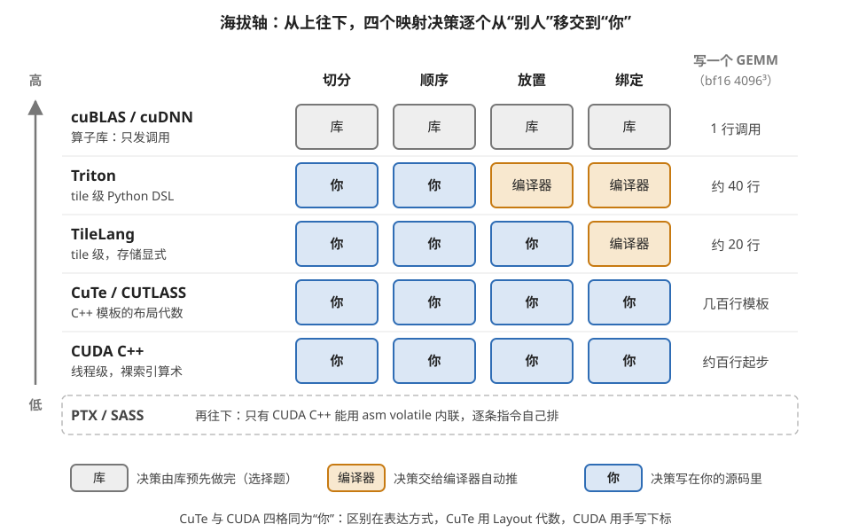
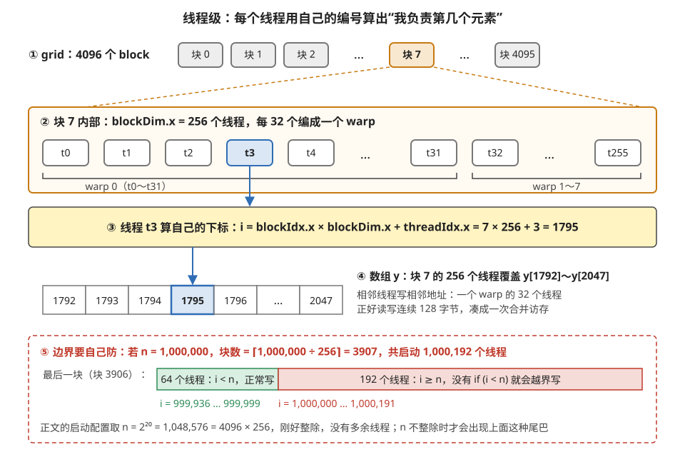
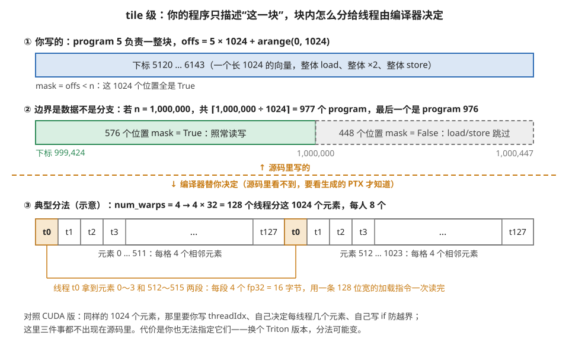
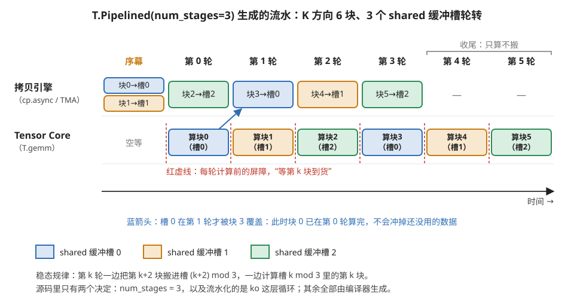
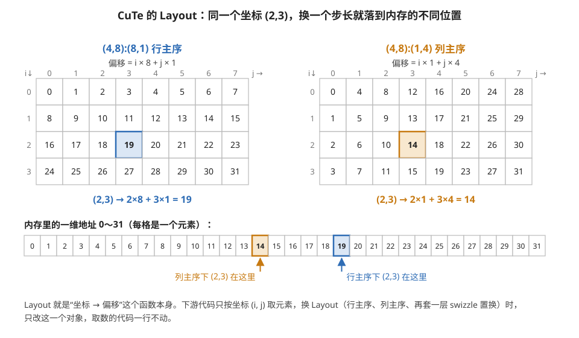
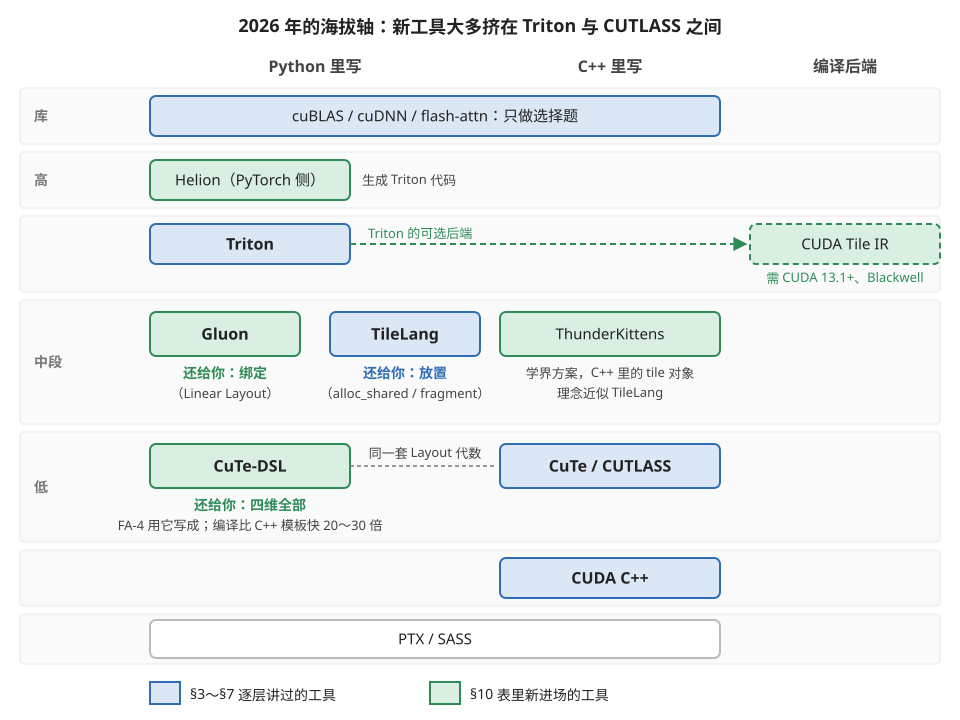

# 并行编程语言与算子库：写 kernel 的四种海拔

> **所属模块**：模块 40 · 软件优化栈（第 4 节 kernel 层的工具展开；与第 7 节映射问题直接呼应）
> **状态**：✅ 完成（第二版：§10 更新到 2026-08，海拔轴中段的工具格局已明显变化。知识截至 2026-08）
> **本节主旨**：写 GPU kernel 的工具不是一堆互相竞争的方言，而是**一条海拔轴**：从"一行都不写"的算子库（cuBLAS），到 tile 级的 Python DSL（Triton、TileLang），到 C++ 模板的布局代数（CuTe/CUTLASS），到线程级的 CUDA C++，最后到 PTX/SASS。每往下走一层，你**多接管一部分映射决策**（第 7 节的四维：切分、顺序、放置、绑定），也多背一份出错的责任。这一节讲清每层的心智模型、常用语法和它们各自落到硬件的哪个部件；配套的 B4 精读用**同一个 GEMM 写四遍**把差异变成可逐行对照的代码。

---

## 0. 这一节要回答的问题

- CUDA、Triton、TileLang、CuTe/CUTLASS 各自的心智模型是什么？写的时候你在扮演谁？
- 每门语言最常用的十来个语法构件是什么？各自落到硬件的什么部件上？
- "tile 级编程"和"线程级编程"的本质区别在哪？编译器替你做了什么、做不了什么？
- 算子库（cuBLAS/cuDNN/flash-attn）和编程语言是什么关系？什么时候该调库、什么时候该自己写？
- 开会听到 `program_id`、`Layout`、`T.Pipelined`、`cublasLt heuristic` 这些词，怎么立刻判断对方在哪个海拔说话？

---

## 1. 基础词汇：先把本节要用的词讲清楚

**DSL（Domain-Specific Language，领域特定语言）**。只为一类问题设计的小语言，不追求通用编程能力。Triton 和 TileLang 都是嵌在 Python 里的 DSL：你写的是 Python 语法，但它不在 Python 解释器里逐行跑，而是被翻译成 GPU 代码——Python 在这里只是"宿主"，负责元编程和把参数喂进去。

**线程级编程与 tile 级编程**。这是本节最重要的一对概念。**线程级**（CUDA C++ 的模型）：你写的程序描述"**一个线程**做什么"，几十万个线程各自执行这份程序，用自己的编号算出自己该处理哪个数据；数据怎么分块、放进哪级存储、哪个线程搬哪个字节，全部由你手写索引算术来表达。**tile 级**（Triton/TileLang 的模型）：你写的程序描述"**一个数据块（tile）**怎么被加工"，操作对象是 128×64 这种小矩阵而不是单个标量；"块内这么多元素怎么分给底下的线程"这件事交给编译器。一句话：线程级写的是"我这个工人干什么"，tile 级写的是"这批货怎么加工"。

**模板元编程（template metaprogramming）**。C++ 的一种用法：把尺寸、类型、布局这些量做成编译期常量（模板参数），让编译器在编译时就把索引算术化简掉、把分支删掉、为每种参数组合生成一份专门的机器码。CUTLASS 和 CuTe 全靠它——代价是编译慢、报错信息长，收益是运行时零开销。

**算子库**。预先编译好的 kernel 集合加一个选择器：cuBLAS（矩阵乘）、cuDNN（卷积和注意力）、flash-attn（注意力）。你不写 kernel、只发调用，库根据形状和硬件挑一个内部实现。它是海拔轴的最高点：所有映射决策都替你做完了。

**JIT（just-in-time，运行时编译）**。等程序跑起来、真实形状和参数已知之后才编译 kernel。Triton、TileLang、DeepGEMM 都是 JIT 派——这正是第 1 节"信息衰减"的反向操作：编译发生得越晚，可用的信息越多，代价是首次调用有编译延迟（靠缓存摊销）。

---

## 2. 全景：一条海拔轴，四维决策权的转让清单

第 7 节讲过，写 kernel 的全部工作就是回答四个问题：怎么**切分**（tiling）、按什么**顺序**算（ordering）、数据**放置**在哪级存储（placement）、活儿**绑定**给哪个执行单元（binding）。把各层工具按"谁替你回答哪几问"排开，整条海拔轴一目了然：

| 决策 → | 切分 | 顺序 | 放置 | 绑定（线程/warp） |
| --- | --- | --- | --- | --- |
| **cuBLAS / cuDNN**（库） | 库 | 库 | 库 | 库 |
| **Triton**（tile DSL） | **你**（BLOCK 常量） | **你**（循环结构） | 编译器（shared 自动管理） | 编译器（`num_warps` 只给总数） |
| **TileLang**（tile DSL） | **你** | **你**（循环 + `T.Pipelined`） | **你**（显式 `alloc_shared` / `alloc_fragment`） | 编译器（可用布局注解干预） |
| **CuTe / CUTLASS**（C++ 模板） | 你 | 你 | 你 | **你**（精确到哪个线程拿哪个元素） |
| **CUDA C++**（线程级） | 你 | 你 | 你 | 你（全手写索引算术） |

读出两个规律。第一，**从上往下是决策权的逐步移交**：库一问不留，Triton 把切分和顺序还给你、留下放置和绑定，TileLang 再把放置还给你，CuTe 和 CUDA 四问全归你——区别只是 CuTe 用代数对象表达、CUDA 用裸索引算术表达。第二，**每接管一问，就多一类只有你能犯的错**：接管放置就可能选错存储层级，接管绑定就可能制造 bank 冲突。图 9-1 把这张表画成了一条纵向的海拔轴。



> **图 9-1**　一句话：写 GPU kernel 的工具从上到下排成一列，越往下，四个映射决策里由你亲手写进源码的越多。
>
> **先知道一件事**：把一次计算放到 GPU 上跑，总要回答四个问题。切分：大矩阵切成多大的块。顺序：块和块内的循环按什么次序走。放置：每块数据放在哪一级存储（显存、片上共享内存 shared memory、每个线程私有的寄存器）。绑定：每个元素交给哪个线程去算。这四个问题总有人要回答，区别只在由谁回答。
>
> **按这个顺序看**：
> 1. 先看最上一行 cuBLAS / cuDNN（NVIDIA 预先写好的矩阵乘和卷积库）：四格都是灰色的“库”。你只调用一个函数、传入形状和指针，四个问题都由库内部预先调好的实现回答。
> 2. 往下看 Triton（嵌在 Python 里的 tile 级小语言，tile 指一小块矩阵）：切分和顺序变成蓝色的“你”，因为块大小和 K 方向的循环要写在源码里；放置和绑定是橙色的“编译器”，你不写，由编译器推。
> 3. 再看 TileLang：它比 Triton 多交出“放置”一格，你要在源码里声明哪块数据放 shared memory、哪块放寄存器；绑定仍归编译器。
> 4. 看 CuTe / CUTLASS 和 CUDA C++ 两行：四格全蓝。两者的差别不在谁做决定，而在怎么写：CuTe 用一种叫 Layout 的对象描述“坐标到地址”的换算，CUDA 让你用加减乘除手写每个下标。
> 5. 看右列的代码量：同一个 bf16 的 4096×4096×4096 矩阵乘，从 1 行涨到几百行。TileLang 比 Triton 还短，是因为它的流水线只是一个注解，不需要改写循环结构。
> 6. 最底下的虚线框是 PTX / SASS（GPU 的中间汇编和机器指令），只有 CUDA C++ 能用内联汇编直接写到这一层。
>
> **打个比方**：像装修房子。算子库是买精装房，什么都不用管；Triton 是半包，你定户型和施工顺序，材料放哪、工人怎么分由施工队定；CUDA 是自己当包工头，每个工人每天搬哪块砖都由你排。
>
> **看懂的标志**：能回答“同一个 kernel 从 Triton 换到 TileLang，多了哪一类可能犯的错”——多了放置一类：比如把一块太大的缓冲声明进 shared memory，挤掉了同时驻留的线程块数量。在 Triton 里这件事由编译器管，你犯不了这个错。
>
> **与正文的对照**：四格的内容与 §2 的决策权表逐格一致；右列代码量取自 §2 下方的对照实验。
>
> 来源：本库自绘。

**用一个对照实验感受海拔差**。同一个需求"bf16 的 4096³ 矩阵乘"，在各海拔上你要写的东西：

- **cuBLAS**：1 行调用。性能贴近峰值（这是它最擅长的形状），但你一格旋钮都没有——想融合个 epilogue 都要看库的脸色。
- **Triton**：约 40 行。切分（`BLOCK_M/N/K`）和 K 循环你写，shared memory、双缓冲、线程分工一个字不用提。性能大形状下约达 cuBLAS 的九成。
- **TileLang**：约 20 行（B4 有全文）。比 Triton 还短，因为流水线是一个注解（`T.Pipelined`）而不是重构；但 shared 和寄存器 buffer 是你显式声明的。
- **CuTe**：几百行模板代码。换来的是每个线程持有哪 8 个字节都由你的 Layout 表达式决定——FA-3 那种"把生产者的寄存器配额让给消费者 + 三引擎重叠"只有这个海拔写得出来。
- **CUDA C++**：约百行起步，同样全权，但所有索引、同步、双缓冲手写，正确性全靠自己对账。

下面逐层进去，每层讲三件事：心智模型、常用语法速查、每个构件落到硬件的哪。

---

## 3. CUDA C++：线程级——你写的是"一个线程的一生"

### 3.1 心智模型

CUDA 的执行模型三层嵌套：一次 kernel 启动产生一个 **grid（网格）**，grid 由若干 **block（线程块）** 组成，每块由若干 **thread（线程）** 组成。你写的函数体是**单个线程**的程序——同一份代码被几十万个线程各自执行，唯一的区别是每个线程拿到的编号（`threadIdx`、`blockIdx`）不同，于是各自算出不同的数据地址。所有并行性都藏在"这份代码同时被很多人跑"这个事实里，代码本身看起来是串行的。

**一个能走查的最小例子**。把一百万个数各乘 2：

```cuda
__global__ void scale(const float* x, float* y, int n) {
    int i = blockIdx.x * blockDim.x + threadIdx.x;   // 我是全局第几号线程
    if (i < n) y[i] = 2.0f * x[i];                   // 边界自己防
}
// 启动：scale<<<4096, 256>>>(x, y, 1 << 20);   // 4096 块 × 256 线程
```

逐步走查：启动配置 4096×256 = 1048576 个线程，正好一人一个元素。第 7 号块里的第 3 号线程算出 `i = 7×256+3 = 1795`，于是它负责 `y[1795]`。注意三件事都是你的责任：**启动配置的算术**（块数 = ⌈n/256⌉ 得你自己算）、**边界防护**（`if (i < n)`，没有它最后一块的多余线程会越界写）、以及这段代码里看不见但性能攸关的事实——同块内相邻线程访问相邻地址，正好凑成合并访存（10 模块第 4 节）。CUDA 不会提醒你任何一条。图 9-2 把这次编号换算和边界问题画了出来。



> **图 9-2**　一句话：CUDA 的每个线程都跑同一份代码，只靠“我在第几块、块里第几号”这两个编号，算出自己该处理数组里的哪一个元素。
>
> **先知道一件事**：一次 kernel 启动会产生一大批线程，按两级编号组织。先分成若干块（block），块的编号叫 blockIdx.x；每块里有固定数量的线程，块内编号叫 threadIdx.x，每块的线程数叫 blockDim.x。这三个值由硬件直接放在每个线程的寄存器里，读取不花时间。
>
> **按这个顺序看**：
> 1. 第 ① 行是整个 grid（一次启动产生的全部块）：4096 个块，橙色高亮的是块 7。
> 2. 第 ② 行把块 7 放大：里面有 256 个线程 t0～t255。硬件把每 32 个相邻线程编成一组同时执行，叫一个 warp，所以 256 个线程是 8 个 warp。蓝色的 t3 是我们跟踪的那一个。
> 3. 第 ③ 行是 t3 自己做的算术：前面 7 个整块各有 256 个线程，占掉下标 0～1791，再加上块内编号 3，得到 1795。
> 4. 第 ④ 行是数组 y：块 7 的 256 个线程正好覆盖 y[1792]～y[2047]，t3 写的就是 y[1795]。右边的说明指出一个你看不见却很要紧的事实：同一个 warp 的 32 个线程写的是 32 个相邻元素，也就是连续的 128 字节，硬件可以把它们合成一次内存访问（合并访存）。
> 5. 最下面红色虚线框是边界问题。正文的 n = 2²⁰ 正好是 4096 × 256，不多不少；如果 n 是 1,000,000，就要启动 ⌈1,000,000 ÷ 256⌉ = 3907 个块，共 1,000,192 个线程。最后一块里只有前 64 个线程的下标小于 n（绿色），后 192 个线程算出的下标在 1,000,000 到 1,000,191 之间（红色），数组里没有这些位置。代码里那句 if (i < n) 就是挡住这 192 个线程的。
>
> **打个比方**：像考场按“第几考场、第几号座位”给每个考生排座。每个考生拿着同一张说明“你的试卷编号 = 考场号 × 每场人数 + 座位号”，自己算出该领哪一份试卷。最后一个考场坐不满时，空座位上不该有人去领卷。
>
> **看懂的标志**：能回答“如果把每块线程数从 256 改成 128，t3 在块 7 里算出的下标是多少”——7 × 128 + 3 = 899。块数也要随之改成 ⌈n ÷ 128⌉，这笔算术同样由你负责。
>
> **与正文的对照**：块 7、线程 3、下标 1795 与 §3.1 的走查相同；n = 1,000,000 的边界情形是图里加的例子，用来说明正文那句“最后一块的多余线程会越界写”。
>
> 来源：本库自绘。

### 3.2 常用语法速查

| 构件 | 干什么 | 落到硬件的哪 |
| --- | --- | --- |
| `__global__` / `<<<grid, block>>>` | 声明 kernel / 指定启动配置 | 提交给 GigaThread Engine 分发线程块 |
| `threadIdx` / `blockIdx` / `blockDim` | 线程自我定位的编号 | 硬件寄存器里现成的值，零开销 |
| `__shared__ float s[N]` | 声明块内共享的暂存数组 | SM 的 shared memory（占用量直接进占用率除法） |
| `__syncthreads()` | 块内全体线程到齐再走 | 硬件屏障单元（10 模块第 5 节） |
| `__shfl_xor_sync(mask, v, i)` | warp 内线程直接交换寄存器值 | 不经过任何内存，warp 内归约的标准件 |
| `atomicAdd(&x, v)` | 原子加 | L2 的原子单元 |
| `cuda::memcpy_async` / `cp.async` | 异步把全局内存拷进 shared | Ampere 起的异步拷贝引擎，绕过寄存器 |
| `nvcuda::wmma::*` / PTX `mma` | 调用 Tensor Core | warp 级矩阵指令（模块 12 第 1 节） |
| `cudaStream_t` | 提交队列，跨 kernel 并发 | GMU 的多队列（10 模块第 7 节） |
| `__launch_bounds__` / `-maxrregcount` | 限制每线程寄存器数 | 拨寄存器-占用率的平衡 |

### 3.3 这层的真实处境

CUDA C++ 的全权是双刃剑。往下：它是唯一能直接内联 PTX 汇编（`asm volatile`）的层，DeepEP 那种 `ld.global.nc.L1::no_allocate` 级别的压榨只能在这写。往上：**现代硬件让手写越来越难**——要吃到 Hopper 的性能，你得手工编排 TMA 描述符、mbarrier 相位、wgmma 提交组（B2 里那一堆），裸 CUDA 写这些等于手写一个小型运行时。这就是下面几层存在的原因：**不是 CUDA 不够强，是它把太多"每次都一样的正确性苦活"留给了人**。

---

## 4. Triton：tile 级——线程从你的世界里消失了

### 4.1 心智模型

Triton 程序的执行单位叫 **program（程序实例）**：一个 program 负责输出的一个 tile，通常编译成一个线程块。关键的观念转变是：**program 内部没有线程**。你操作的最小对象是块状张量——`(128, 64)` 的小矩阵——所有运算（加载、乘加、归约）都作用在整个块上。"这 8192 个元素怎么分给 4 个 warp 的 128 个线程、每人搬几个字节、要不要经过 shared memory"，全部是编译器的事。

**同一个"乘 2"在 Triton 里的样子**，和 §3.1 直接对照：

```python
@triton.jit
def scale(X, Y, n, BLOCK: tl.constexpr):
    pid  = tl.program_id(0)                      # 我是第几个 program
    offs = pid * BLOCK + tl.arange(0, BLOCK)     # 我的 tile 覆盖哪些下标（一个向量）
    mask = offs < n                              # 边界：一个布尔向量
    x = tl.load(X + offs, mask=mask)             # 整块加载
    tl.store(Y + offs, 2.0 * x, mask=mask)       # 整块写回
# 启动：scale[(triton.cdiv(n, 1024),)](x, y, n, BLOCK=1024)
```

对照读出三个差异。第一，**没有 `threadIdx`**：`tl.arange(0, 1024)` 造出的是"这个 tile 的 1024 个下标"这个整体，谁算哪个下标你不知道也不用知道。第二，**边界是数据不是控制流**：CUDA 用 `if` 挡住越界线程，Triton 用 `mask` 向量告诉加载指令哪些位置无效——分支消失了，发散（10 模块第 3 节）也就不存在。第三，BLOCK=1024 远大于一个线程块的自然并行度，编译器自动把它摊成"每线程 8 个元素 + 矢量化加载"——这个决定你没参与。图 9-3 把"你写的"和"编译器替你定的"上下分开画。



> **图 9-3**　一句话：在 Triton 里，你的程序只说“这一整块 1024 个元素怎么处理”，越界用一串真假值挡掉，而这 1024 个元素具体由哪些线程、每人几个去搬，是编译器在你看不见的地方决定的。
>
> **先知道一件事**：Triton 的执行单位叫 program，一个 program 负责输出的一整块（tile），编译后通常对应 CUDA 的一个线程块。program 的编号用 tl.program_id 取得，它的地位相当于 CUDA 的 blockIdx，但 Triton 里没有 threadIdx 这个东西。
>
> **按这个顺序看**：
> 1. 第 ① 行：program 5 的下标向量 offs 是 5 × 1024 + (0, 1, …, 1023)，即 5120～6143 这一整段。加载、乘 2、写回都是对这整段一次写出的操作。mask（掩码，与 offs 一样长的一串真假值）表示哪些位置有效，这里 1024 个全是 True。
> 2. 第 ② 行：n = 1,000,000 时需要 977 个 program，最后一个是 program 976，下标 999,424～1,000,447。前 576 个位置小于 n，mask 为 True（绿色）；后 448 个位置越界，mask 为 False（灰色虚框），加载和写回指令直接跳过这些位置。源码里没有 if，因此也不会出现同一个 warp 里一部分线程走 if、一部分不走的情况。
> 3. 越过中间的橙色虚线：线以上是源码里写了的，线以下是编译器决定的。
> 4. 第 ③ 行是一种典型的分法（示意）：启动参数 num_warps = 4 表示给 4 个 warp，即 128 个线程。1024 ÷ 128 = 8，每人 8 个元素。编译器常见的排法是每个线程拿两段、每段 4 个相邻元素：t0 拿 0～3 和 512～515，t1 拿 4～7 和 516～519，依此类推。
> 5. 看橙色括线下的说明：4 个 fp32 共 16 字节，正好用一条 128 位宽的加载指令一次读进来，比 4 条 32 位的加载省指令。
>
> **打个比方**：你是仓库主管，只下指令“把 5 号货架那 1024 件货各贴一张标签，最后一个货架只到第 576 件为止”；至于派几个工人、每人拿几件、一次抱几件，由班组长安排。
>
> **看懂的标志**：能回答“把 num_warps 从 4 改成 8，第 ③ 行会怎么变”——线程数变成 256，每人只分到 4 个元素，一条 128 位加载就搬完，不再需要第二段。第 ① ② 行的源码一个字都不用改。
>
> **与正文的对照**：第 ① 行对应 §4.1 代码里的 offs 与 mask；第 ③ 行对应正文“每线程 8 个元素 + 矢量化加载”。具体的元素分配由编译器版本和目标硬件决定，图中只是一种常见排法，要确认实际分法得看生成的 PTX（§9）。n = 1,000,000 的边界情形是图里加的例子，与图 9-2 的 CUDA 版对照。
>
> 来源：本库自绘。

### 4.2 常用语法速查

| 构件 | 干什么 | 落到硬件的哪 |
| --- | --- | --- |
| `@triton.jit` | 声明这个 Python 函数是 kernel | 首调用时 JIT 编译到 PTX |
| `tl.program_id(axis)` | program 自我定位 | 即 blockIdx，tile 到 SM 的映射入口 |
| `tl.arange(0, BLOCK)` | 造下标向量 | 编译期常量形状（BLOCK 必须是 2 的幂） |
| `tl.load / tl.store(ptr, mask=)` | 带掩码的整块存取 | 编成合并访存 / `cp.async` / Hopper 上的 TMA，由编译器挑 |
| `tl.make_block_ptr` | 块指针（基址+形状+步长+偏移打包） | 帮编译器看清访问模式，好挑 TMA（B1 精读） |
| `tl.dot(a, b, acc)` | 块级矩阵乘加 | **Tensor Core（mma/wgmma）**——整个 DSL 的性能核心 |
| `tl.max / tl.sum(x, axis)` | 块内归约 | warp shuffle + shared 归约树，自动生成 |
| `tl.exp / tl.exp2` | 块级超越函数 | MUFU 管线 |
| `tl.constexpr` | 声明编译期常量（tile 尺寸都用它） | 每种取值编一份专门代码 |
| `num_warps` / `num_stages` | 启动元参数：线程预算 / 流水深度 | 绑定的总量提示 / 软件流水级数（第 4 节 §7） |
| `@triton.autotune` | 一组 config 实测挑最快 | 第 4 节 §6 的 autotune，就是在这用 |

### 4.3 编译器替你做的、和它做不好的

替你做的三大件：**放置**（要不要经过 shared、双缓冲怎么排——`num_stages=3` 一个数字换来第 4 节 §7 里手排流水那整套 prologue/steady/epilogue）；**绑定**（tile 内元素到线程的分配、矢量化宽度、避 bank 冲突的排布）；**指令选择**（`tl.dot` 按硬件代际自动挑 mma 还是 wgmma）。做不好的也要心里有数：**warp 级的精细分工做不到**（FA-3 那种生产者/消费者角色划分表达不出来，这正是 B2 要下到 CuTe 的原因）；跨 program 的协作原语很弱；生成代码的下限依赖编译器版本——同一份源码换个 Triton 版本性能可能变，因为真正的映射决策不在你的源码里。

---

## 5. TileLang：tile 级但存储显式——把"放哪"的旋钮还给你

### 5.1 心智模型

TileLang（2024 年底开源的 tile 级 DSL，构建在 TVM 栈上）站在 Triton 和 CUTLASS 之间的空档上：**保留 tile 级的写法，但把"放置"这一维决策权还给你**。具体说：Triton 里 shared memory 是隐形的，TileLang 里你显式声明三种作用域的缓冲——`T.alloc_shared`（shared memory）、`T.alloc_fragment`（寄存器，按线程私有切分）、以及全局张量本身——数据在层级间的每次移动都是一条看得见的 `T.copy`。这样一来，模块 11 讲的"数据流"（谁驻留、谁流动）在源码里直接可见，而线程绑定仍然由编译器推断（必要时可用布局注解干预）。

**感受一下它的味道**（完整 GEMM 在 B4，这里只看骨架的三行核心）：

```python
A_shared = T.alloc_shared((block_M, block_K), "float16")   # 放置：我要一块 shared
C_local  = T.alloc_fragment((block_M, block_N), "float")   # 放置：累加器驻留寄存器
for ko in T.Pipelined(K // block_K, num_stages=3):         # 顺序：这层循环软件流水，3 级
    T.copy(A[by*block_M, ko*block_K], A_shared)            # 搬运：HBM → shared，一条语句
    T.gemm(A_shared, B_shared, C_local)                    # 计算：Tensor Core，累加进寄存器
```

**`T.Pipelined` 值得单独走查**，因为它是"一个注解换一套机制"的标本。写 `num_stages=3` 之后编译器生成的东西，正是第 4 节 §7 手排流水的全套：shared 缓冲扩成 3 份轮转、`T.copy` 变成异步拷贝（Ampere 上 `cp.async`，Hopper 上 TMA）、循环体前面插预取序幕、`T.gemm` 前插"等第 k 份到货"的屏障、收尾排空。时间线（第 k 轮迭代）：

| 在干什么 → | 拷贝引擎 | Tensor Core |
| --- | --- | --- |
| 第 k 轮 | 预取第 k+2 块 → 缓冲槽 (k+2)%3 | 计算第 k 块（缓冲槽 k%3） |

把 K 方向取 6 块、逐轮展开，就是图 9-4。



> **图 9-4**　一句话：写上 num_stages=3 之后，编译器让“搬数据”始终比“算数据”提前两轮，于是计算单元不必停下来等数据。
>
> **先知道一件事**：矩阵乘沿 K 方向要分很多块依次处理，每块都要先从显存搬进片上的 shared memory（每个 SM 里一小块由程序管理的高速存储），再交给 Tensor Core（专做小矩阵乘加的硬件单元）计算。搬运由单独的拷贝硬件完成（Ampere 上的 cp.async 指令、Hopper 上的 TMA 引擎），可以和计算同时进行。缓冲槽就是 shared memory 里划出来的一块块等大的区域，这里有 3 个。
>
> **按这个顺序看**：
> 1. 横轴是时间，按轮划分。上面一行是拷贝引擎在搬什么，下面一行是 Tensor Core 在算什么。颜色表示用的是哪个缓冲槽：蓝色槽 0、橙色槽 1、绿色槽 2。
> 2. 先看最左边的“序幕”：拷贝引擎先把块 0 搬进槽 0、块 1 搬进槽 1，Tensor Core 还没有数据，只能空等。这是编译器插在循环前面的预取代码。
> 3. 看第 0 轮：Tensor Core 算槽 0 里的块 0，同时拷贝引擎把块 2 搬进槽 2。两件事并行进行。
> 4. 看第 1 轮和那支蓝色短箭头：块 3 被搬进槽 0，覆盖了块 0 的数据。这是安全的，因为块 0 在第 0 轮已经算完。三个槽正好够“一个在算、一个已到货待算、一个正在进货”。
> 5. 看每个计算格左边的红色虚线：这是屏障，意思是“确认第 k 块已经搬到，再开始算”。搬得慢时，Tensor Core 在这里等。
> 6. 看右侧的第 4、5 轮：已经没有新块可搬，只把剩下的两块算完。这叫收尾，也由编译器生成。
>
> **打个比方**：一个厨师配三个备菜盘。帮工总是提前备好后面两道菜的料，厨师炒完一盘，洗净的盘子立刻拿去装再后面一道的料，厨师从不因为缺料而停锅。
>
> **看懂的标志**：能回答“num_stages 改成 2 会怎样”——只剩两个槽，拷贝引擎只能提前一轮。只要某一块搬得比一轮计算慢，Tensor Core 就会在屏障处停下来等；槽越多，越能吸收搬运时间的波动，代价是占用更多 shared memory。
>
> **与正文的对照**：稳态规律与上面的时间线表一致：第 k 轮预取第 k+2 块进槽 (k+2) mod 3、计算槽 k mod 3 里的第 k 块。K 方向 6 块是为作图选的数；图中每轮等宽是示意，实际每轮时长由搬运和计算中较慢的一方决定。
>
> 来源：本库自绘。

你在源码里做的决策只有两个数字：切几级（3）、切哪层循环（ko）——机制归编译器，策略归你。这就是它比 Triton 显式、又比手写省力的位置。

### 5.2 常用语法速查

| 构件 | 干什么 | 落到硬件的哪 |
| --- | --- | --- |
| `T.Kernel(bx, by, threads=128)` | 声明 grid 和每块线程预算 | 启动配置 |
| `T.alloc_shared(shape, dtype)` | 显式 shared 缓冲 | shared memory（占用率账你自己看得见） |
| `T.alloc_fragment(shape, dtype)` | 显式寄存器缓冲（如累加器） | 寄存器堆，跨线程的切分由编译器推 |
| `T.copy(src, dst)` | 层级间整块搬运 | 矢量化 ld/st、`cp.async`、TMA，按代际挑 |
| `T.gemm(A_s, B_s, C_f)` | tile 矩阵乘加 | Tensor Core（mma/wgmma/tcgen05） |
| `T.Pipelined(n, num_stages=k)` | 循环软件流水注解 | 多缓冲 + 异步拷贝 + 屏障，全套生成 |
| `T.Parallel(m, n)` | 声明无依赖的逐元素循环 | 自动绑定到线程 + 矢量化 |
| `T.reduce_max / T.reduce_sum` | fragment 内归约 | shuffle + shared 归约 |
| `T.annotate_layout / T.use_swizzle` | 手动指定布局 / swizzle | 干预绑定与 bank 冲突（默认自动） |
| `@tilelang.jit` | JIT 编译入口 | 形状已知后现编，同 DeepGEMM 思路 |

### 5.3 这层的定位

一句话：**Triton 的省力 + CUTLASS 的可见性**。适合的场景是"Triton 的自动放置拿不到最后 15%、但又不想跳进 C++ 模板"——比如需要精确控制 fragment 驻留的 FA 变体、低精度 GEMM 的缩放融合。它比 Triton 年轻很多，生态（autotune 库、后端覆盖）还在补课，这是选型时要计入的现实。

---

## 6. CuTe / CUTLASS：把索引算术变成代数

### 6.1 先分清两个名字

**CUTLASS** 是 NVIDIA 的开源 C++ 模板库，提供可实例化的 GEMM/卷积 kernel 家族——你挑模板参数（tile 尺寸、流水级数、数据类型），它给你一个完整 kernel。**CuTe** 是 CUTLASS 3.x 底下的地基层：一套描述"布局"的代数工具。用 CUTLASS 是在选配置，用 CuTe 是在造 kernel——FA-3 就是拿 CuTe 的积木手搭的（B2 精读的对象）。

### 6.2 核心思想：Layout 是一等公民

CuTe 把全部索引算术收进一个对象：**Layout = 形状 × 步长（shape : stride）**，它是一个"逻辑坐标 → 内存偏移"的函数。**走查一遍**：Layout `(4,8):(8,1)` 表示 4×8 的矩阵、行步长 8、列步长 1（即行主序），坐标 (2,3) 的偏移 = 2×8 + 3×1 = **19**；换成 `(4,8):(1,4)`（列主序），同一坐标的偏移 = 2×1 + 3×4 = **14**。到这为止只是普通的步长数组，CuTe 的增量在于三件事：

1. **Layout 可以运算**。分块（`local_tile`）、给线程分活（`local_partition`）、转置、swizzle，全是 Layout 之间的代数组合，结果还是 Layout。你不再写 `A[by*BM*K + ko*BK + i*K + j]` 这种一错全错的算术，而是写"把 A 按 (BM,BK) 切块、取第 (by, ko) 块"。
2. **Tensor = 指针 + Layout**。对 Tensor 的每次划分产出的还是 Tensor，坐标语义一路保持——`tAgA(i, j, k)` 永远是"我这个线程负责的第 (i,j) 个元素在第 k 块里"，不管底下换了多少层布局。
3. **Atom（原子）封装硬件指令的形状契约**。一条 `mma.sync` 指令天生要求 32 个线程按固定 pattern 各持有 fragment 的固定几个元素（模块 12 第 1 节"两套词"的根源），CuTe 把这个 pattern 做成 `MMA_Atom` 的内置 Layout；`TiledMMA` 把 atom 平铺到整个 tile，然后 `partition` 一算，**每个线程该拿哪几个元素自动落出来**。同理 `Copy_Atom` 封装 `cp.async`/TMA/ldmatrix。搭 kernel = 选 atom + 用 Layout 代数把它们铺满你的 tile——发散的、错拍的、bank 冲突的组合在编译期就报错或根本表达不出来。

开头那次偏移计算画在图 9-5 里。



> **图 9-5**　一句话：Layout 就是一个“坐标 → 内存偏移”的函数，同一个坐标 (2,3)，在行主序下落到第 19 个位置，在列主序下落到第 14 个位置。
>
> **先知道一件事**：内存是一维的一长排格子，而矩阵是二维的，必须约定一个换算规则，把第 i 行第 j 列换成一维的第几个格子。CuTe 把这个规则写成“形状 : 步长”：(4,8):(8,1) 的意思是矩阵 4 行 8 列，行号每加 1 地址加 8，列号每加 1 地址加 1。
>
> **按这个顺序看**：
> 1. 左边的蓝色网格是 (4,8):(8,1)，格子里的数就是该格的内存偏移，等于 i × 8 + j。同一行的数是连续的 0、1、2……，所以叫行主序。
> 2. 右边的橙色网格是 (4,8):(1,4)，偏移等于 i × 1 + j × 4。同一列的数是连续的，所以叫列主序。
> 3. 两边都高亮了坐标 (2,3)：左边 2×8 + 3×1 = 19，右边 2×1 + 3×4 = 14。
> 4. 看下方的一维地址条：这两个格子在真实内存里分别落在第 19 格和第 14 格。
> 5. 最后一行说明它的用途：后面取数的代码只写“取坐标 (i, j)”，不写 19 或 14。所以要把行主序换成列主序，或者在外面再套一层打乱顺序的置换（swizzle，用来错开 shared memory 的访问冲突），只改 Layout 这一个对象，取数代码不动。
>
> **打个比方**：Layout 像一张“座位号 → 实际座位”的对照表。观众只认票上的“第 2 排第 3 座”；剧场换一种排座方式，只要换一张对照表，观众手里的票不用重印。
>
> **看懂的标志**：能说出 (4,8):(1,4) 中坐标 (3,7) 的偏移——3×1 + 7×4 = 31，是整个矩阵的最后一个格子。行主序下 (3,7) 也是 31：两种排法的起点和终点相同，中间的顺序不同。
>
> **与正文的对照**：两个数值 19 和 14 与 §6.2 的走查相同。正文第 1、2 点讲的分块、分给线程，是在这张“坐标 → 偏移”表上再做函数组合，结果仍是这样一张表。
>
> 来源：本库自绘。

**一个对照实验说明它解决的痛**。手写 CUDA 里换一个 swizzle 方案：所有相关索引算术推倒重来，错一处静默算错。CuTe 里：`composition(Swizzle<3,3,3>{}, sA_layout)`——原布局套一层 XOR 置换（10 模块第 4 节讲过的换座位函数），下游 partition 代码**一行不改**，因为它们只跟坐标打交道、不碰偏移。这就是"代数"两个字的现金价值：**布局决策局部化了**。

### 6.3 常用构件速查

| 构件 | 干什么 | 落到硬件的哪 |
| --- | --- | --- |
| `Layout<Shape, Stride>` | 坐标→偏移的函数，一切的地基 | 编译期化简成常数索引算术 |
| `make_tensor(ptr, layout)` | 指针 + 布局 = 张量 | gmem/smem/寄存器通吃 |
| `local_tile(T, tiler, coord)` | 从大张量切出本 CTA 的块 | tiling 这一维的表达 |
| `local_partition / partition_S/D` | 把 tile 分给线程（源/目的两侧） | **绑定**这一维的表达 |
| `MMA_Atom` / `TiledMMA` | 一条矩阵指令的形状契约 / 平铺 | `mma.sync` / `wgmma` / `tcgen05` |
| `Copy_Atom` / `TiledCopy` | 一条搬运指令的契约 / 平铺 | `ldmatrix` / `cp.async` / TMA |
| `partition_fragment_C` | 按 MMA 契约切出累加器 fragment | 寄存器（或 Blackwell 的 TMEM） |
| `cute::copy / cute::gemm` | 按平铺方案执行搬/算 | 展开成该线程的那份指令序列 |
| `Swizzle<B,M,S>` | XOR 置换布局，消 bank 冲突 | shared memory 排布（10 模块第 4 节） |
| `make_tma_copy` | 构造 TMA 描述符 | Hopper TMA 引擎（B2） |

### 6.4 代价

全权的账单：C++ 模板报错动辄几百行；编译一个配置几十秒；学习曲线是五门里最陡的（Layout 代数本身就是门小课程）。所以业界的用法是分工的——**CUTLASS 模板解决"标准形状要极限性能"，CuTe 手搭解决"结构非标准还要极限性能"（FA-3/FA-4）**，其余场景留给上面三层。

---

## 7. 算子库层：你只做选择题

海拔最高点。cuBLAS（Lt）、cuDNN、flash-attn、cuTENSOR 的共性：**内部是成百上千个预编译（或运行时生成）的 kernel 变体 + 一个按形状/精度/硬件挑变体的启发式选择器**。cuBLASLt 甚至把选择器暴露出来（`cublasLtMatmulAlgoGetHeuristic` 返回候选算法列表让你实测挑）。

**什么时候库会输**？做个对照就清楚：4096³ 的规整 GEMM，cuBLAS 贴峰值，你写的多半更慢——它的变体库里正好有为这个形状调过的实现。换成 MoE decode 那种 M=8 的长尾形状、或者"GEMM 后面紧跟一个非标准激活要融合"：库的变体网格没覆盖到、融合接口没这个算子，这时 Triton/TileLang 自写反超。**判断准则就一条：你的负载落在库的变体网格里，调库；落在网格外（怪形状、要融合、新算法结构），往下走一层**。第 4 节 §5 工具对照的结论在这里闭环。

---

## 8. 收束：判词法——听三个词就知道对方站在哪层

把 §2 的决策权表折成耳朵能用的判据：

- 听到 **`blockIdx` / `__shared__` / `__syncthreads`** → 线程级 CUDA，对方在手管全部四维。
- 听到 **`program_id` / `BLOCK_M` / `num_stages` / autotune config** → Triton，对方管切分和顺序，放置绑定归编译器——所以别问他"你的线程怎么分工的"，他真不知道，也不需要知道。
- 听到 **`T.alloc_shared` / `T.alloc_fragment` / `T.Pipelined`** → TileLang，放置也在他手里——可以问他"累加器驻留在哪"了。
- 听到 **`Layout` / `Atom` / `partition` / `TiledMMA`** → CuTe，四维全权且用代数表达——这是能聊"哪个线程持有 fragment 哪个元素"的唯一人群。
- 听到 **`heuristic` / `algo` / "让 cublasLt 自己挑"** → 库层，对方在做选择题不是在写 kernel。

**一句真实会议话术的翻译练习**："这个形状 cublas 打不满，我们先拿 Triton 顶上，等形状稳定了再下 CUTLASS 抠最后 10%。"——翻译：负载落在库的变体网格外（长尾形状）；先用 tile 级 DSL 快速拿到八九成性能（开发以小时计）；等业务形状冻结、值得投入了，再下到模板层接管放置和绑定换最后一截（开发以周计）。一句话里三个海拔的权衡全齐了。

---

## 9. 开发者视角

- **选型决策树**：先查库（cuBLASLt/cuDNN/flash-attn 覆盖没有）→ 没覆盖或要融合，Triton（一天内出八成性能）→ 放置卡住了，TileLang 或 CUTLASS 模板 → 结构非标准还要极限，CuTe 手搭 → 局部再不满意，内联 PTX。**每下一层，开发成本大约乘以三**，先想清楚那截性能值不值。
- **每层都能看下层的回执**：Triton 用 `kernel.asm['ptx']`（或环境变量 `TRITON_KERNEL_DUMP`）导出生成的 PTX；TileLang 用 `kernel.get_kernel_source()` 直接看生成的 CUDA 源码；CUTLASS/CuTe 本来就是源码；再往下就是 10 模块第 6 节的 `cuobjdump -sass`。**验证"我的高层写法有没有兑现成想要的指令"（tl.dot 有没有编成 wgmma、T.copy 有没有走 TMA），永远靠看回执，不靠猜。**
- **profiler 视角不变**：无论哪层写的 kernel，到 Nsight Compute 里都是同一套 SOL/占用率/stall 指标（10 模块附录 A1）——工具链的海拔只改变你怎么写，不改变硬件怎么跑。

## 10. 最新架构落点（时效锚点 · 知识截至 2026-08）

**这一年这条海拔轴上发生的事，可以概括成一句话：中段挤满了人。** 上一版这里还只提了两个"值得跟踪"的新玩家，现在它已经是一片拥挤的地带：

| 工具 | 海拔位置 | 2026-08 的状态 |
| --- | --- | --- |
| **CuTe-DSL** | CUTLASS 海拔，但用 Python | NVIDIA 把 CuTe 移植成 Python DSL（保留 Layout 代数、去掉 C++ 模板的编译负担）。**FA-4 完全用它写成**，论文报编译速度比 C++ 模板快 20 到 30 倍而表达力不减——"CUTLASS 海拔"正式向 Python 迁移 |
| **Gluon** | Triton 之下、CuTe 之上 | 已进 Triton 主线（官方仓库有 tutorial）。核心是 **Linear Layout**，让用户能做线程级操作——正好补上 §4.3 说的 Triton 那个"warp 级精细分工表达不出来"的缺口 |
| **TileLang** | Triton 与 CUTLASS 之间 | 2026-02 的 v0.1.8（动态流水改进、AMD 修复）、2026-04 的 v0.1.9（CuTe DSL GEMM V2、Metal 后端）。已被 DeepSeek 系开源项目实际采用，从"值得跟踪"进到"有生产用例" |
| **CUDA Tile IR / CuTile** | 编译后端与 NVIDIA 自家 tile 方案 | NVIDIA 把 CUDA Tile 做成 **Triton 的后端**（需 CUDA 13.1 以上、Blackwell 架构）。这是 NVIDIA 第一次直接介入 tile DSL 的编译后端 |
| **Helion** | PyTorch 侧的新入口 | 与 Inductor 生态更近的一档 |
| **ThunderKittens** | C++ 内嵌 tile 对象 | 学界方案，理念与 TileLang 相近 |

把这张表里的工具放回海拔轴上，就是图 9-6。



> **图 9-6**　一句话：这两年新出现的 kernel 工具，大多数没有往“更自动”的方向走，而是挤进 Triton 和 CUTLASS 之间，各自把一项原本由编译器做的决定交还给写代码的人。
>
> **先知道一件事**：纵向仍是图 9-1 的海拔：越往下，你在源码里亲自决定的事越多。横向是新加的一维：工具是在 Python 里写还是在 C++ 里写，以及它是不是一个供别的工具使用的编译后端（编译后端指把中间表示翻译成机器码的那一段）。
>
> **按这个顺序看**：
> 1. 先认颜色：蓝框是本节 §3～§7 逐层讲过的工具，绿框是 §10 表里新进场的工具。
> 2. 看“中段”这一横带：Gluon、TileLang（Python），ThunderKittens（C++）都在这里。每个框下面的绿字或蓝字写着它交还给你的那一项：Gluon 交还“绑定”（用一种叫 Linear Layout 的描述指定元素到线程的对应），TileLang 交还“放置”（显式声明 shared memory 和寄存器缓冲）。
> 3. 看“低”这一横带：CuTe-DSL 与 C++ 的 CuTe / CUTLASS 在同一高度，中间的虚线表示两者用同一套 Layout 代数。区别只是宿主语言换成了 Python，编译时间大幅缩短。FA-4（FlashAttention 第四版）就是用它写的。
> 4. 看最上面两带：Helion 在 Triton 之上，是 PyTorch 侧更高一层的入口，产物是 Triton 代码。
> 5. 看右边的绿色虚线框 CUDA Tile IR：它不是写 kernel 的语言，而是 Triton 可以选用的一个编译后端，由 NVIDIA 提供，只支持 Blackwell 架构、需 CUDA 13.1 以上。
>
> **看懂的标志**：能回答“为什么说 Gluon 和 TileLang 更可能互补而不是竞争”——两者交还的决策不是同一项：一个交还“哪个线程拿哪个元素”，一个交还“数据放在哪级存储”。
>
> **与正文的对照**：各工具的位置取自 §10 的表。Helion 的高度与 Gluon、TileLang 的左右次序都只是示意，正文没有给出它们的精确相对位置。
>
> 来源：本库自绘。

**从这张表能读出一条对选型有用的判断**：这些工具**没有一个是在"把 Triton 做得更自动"**——它们全都在往下开新海拔，或者在同一海拔上把某一维决策权还给人（Gluon 还绑定，TileLang 还放置，CuTe-DSL 还全部四维）。**这正面印证了本节的立论：当自动化不够用时，业界的选择是"给人更细的控制权"，而不是"让编译器更聪明"。** 反过来说，**如果哪天出现一个真正把这批工具都比下去的自动方案，那才是本节的海拔轴需要重画的时候。**

**同类异构对照**：TPU 的对应物是 **Pallas**（JAX 上的 tile 级 DSL，模块 01 讲过）；昇腾是 **Ascend C**（线程级 C++，显式操作 Cube/Vector 单元和 L1/UB 存储——海拔近似"CUDA 加显式 scratchpad"）；AMD 侧是 **HIP**（CUDA 的同构方言）加上 Triton 的 ROCm 后端。判词法跨生态通用：先听对方的词落在哪一维决策上。

## 11. 术语卡

### tile 级编程（block-level programming）

**定义**：以数据块（如 128×64 的小矩阵）为最小操作对象的 kernel 编程模型，程序描述"一个 tile 怎么被加工"，块内元素到线程的分配由编译器完成。Triton 和 TileLang 都属此类。

**为什么存在**：线程级编程里，索引算术、边界防护、bank 冲突规避这些"每个 kernel 都要重做一遍的正确性苦活"占了大半代码量且极易出错；tile 级把它们整体交给编译器，让人只写四维决策里真正需要人类判断的部分（切分和顺序）。

**语境例句**："这个算子用 Triton 写就 40 行，你手写 CUDA 那 200 行里 150 行是索引和同步。"——意思是：tile 级把绑定和放置外包给了编译器，源码里只剩映射策略本身。

### DSL（领域特定语言）

**定义**：只为一类问题设计的小语言。GPU kernel 领域的 DSL（Triton、TileLang、Pallas）通常嵌在 Python 里：Python 负责元编程和传参，DSL 部分被 JIT 编译成 GPU 代码。

**为什么存在**：通用语言要伺候所有场景，无法对"程序就是 tile 上的张量运算"这种强结构做深度自动化；DSL 用表达力换优化力——语言越窄，编译器能替你做的决定越多。

**语境例句**："别在 kernel 里写 Python 对象操作，@triton.jit 里面不是真 Python。"——意思是：DSL 只是借了宿主的语法，可用的构件仅限 `tl.*` 那一小圈。

### CUTLASS 与 CuTe

**定义**：CUTLASS 是 NVIDIA 的 C++ 模板 kernel 库（选模板参数得到完整 GEMM/卷积）；CuTe 是其 3.x 版本的底层布局代数（Layout/Tensor/Atom 三件套），是手搭极限 kernel 的积木。

**为什么存在**：Tensor Core 指令对"哪个线程持有哪个元素"有硬性 pattern 要求，手写索引算术表达这些 pattern 极易出错且不可组合；CuTe 把 pattern 封装成可运算的 Layout 对象，让布局决策局部化、组合正确性编译期可查。

**语境例句**："FA-3 那种 warp 分工，Triton 表达不出来，得下 CuTe。"——意思是：绑定这一维的精细控制只有布局代数这个海拔提供。

### TileLang

**定义**：2024 年底开源的 tile 级 DSL，介于 Triton 和 CUTLASS 之间：保留 Python tile 写法，但存储放置显式（`alloc_shared`/`alloc_fragment`）、流水线以注解表达（`T.Pipelined`），线程绑定仍由编译器推断。

**为什么存在**：Triton 把放置全自动化，拿不到需要精确控制数据驻留的最后一截性能；CUTLASS 全手动，开发成本高一个量级。TileLang 填的就是"要控制放置、不想手管绑定"这个空档。

**语境例句**："累加器想常驻寄存器、K/V 走三级流水——这需求 TileLang 十行就表达完了。"——意思是：放置和流水深度是源码里的显式决策，其余归编译器。

### 算子库（cuBLAS / cuDNN 一族）

**定义**：预编译 kernel 变体集合加形状启发式选择器的成品库。调用者不写 kernel，只提供形状、精度和指针，库内部挑一个最匹配的实现执行。

**为什么存在**：常见负载（规整 GEMM、标准卷积）的最优实现是有限可枚举的，厂商预先调好显然比每个用户重写一遍划算；库的边界也在这——变体网格没覆盖的长尾形状和非标准融合，就是自写 kernel 的地盘。

**语境例句**："先跑一遍 cublasLt 的 heuristic 看它给多少，打不满再说自己写的事。"——意思是：库是性能基线和第一选项，自写的立项依据是库在这个形状上的缺口。

## 12. 我的困惑 / 待深挖

- Triton 编译器内部：tile 到线程的绑定具体怎么推？layout 冲突时的代价模型是什么？
- Gluon 与 TileLang 的正面对比：同样是"把决策权还给人"，两者还给的维度一样吗？（初步答案：Gluon 还的是**绑定**（Linear Layout 描述线程级布局），TileLang 还的是**放置**（显式 alloc_shared/alloc_fragment）——如果这个判断成立，两者其实是互补而非竞争的，值得实测验证）
- CuTe 的 Layout 代数有形式化的完备性结果吗（哪些映射表达不出来）？
- TileLang 在昇腾/AMD 后端的实际成熟度？"一份 tile 源码多后端"的性能折损率？

---

*最后更新：2026-08-31（第二版：§10 重写为工具格局对照表——CuTe-DSL / Gluon / TileLang / CUDA Tile IR / Helion 五个新落点，并提炼出"业界选择往下开海拔而不是加自动化"这条判断。第一版：2026-07-08）*（2026-09 补图 6 张：现成 0 张，自绘 6 张；图注按费曼法写）
