# 编译器内部：IR、循环变换与从图到机器码的下沉链

> **所属模块**：模块 40 · 软件优化栈（第 1 节讲了五层地图与"信息衰减"，第 4 节讲了调度空间，本节讲**层与层之间那些变换本身**）
> **状态**：🟨 学习中（第一版。知识截至 2026-08）
> **本节主旨**：第 1 节说软件栈有五层、每层能做的优化由"这层还看得见什么"决定；第 4 节说 kernel 层的工作是在调度空间里搜索。**但两节都没有正面回答一个问题：编译器具体在做哪些动作？** "融合""切块""向量化""排流水"这些词在前面各节里被当作已知的名词反复使用，本节把它们收成一张**变换词汇表**——**每一种变换是什么、它换来了哪个硬件收益、它的合法性由什么保证**。然后走一遍完整的下沉链（一个矩阵乘从 Python 到 PTX 经过了哪几种 IR、每一步丢掉了什么信息），讲清 **MLIR 的 dialect 体系为什么长成那个样子**、**Dynamo 的抓图是怎么做到的以及 graph break 的完整触发条件**、**训练特有的那一步（自动微分）插在这条链的哪里**，最后回到一个贯穿全模块的问题：**编译器能做什么、不能做什么，这条边界是由什么划定的。**

---

## 0. 这一节要回答的问题

- 为什么编译器要用好几种 IR，而不是从源码直接生成机器码？
- 什么是 dialect？MLIR 到底提供了什么，让大家都在它上面造编译器？
- "循环变换"有哪几种？每一种换来的是哪个硬件收益？
- 一个变换合不合法由什么决定？为什么"两个循环能不能交换"是个需要证明的问题？
- 一个矩阵乘从 PyTorch 代码到 PTX，中间经过了哪几种表示？每步丢了什么？
- Dynamo 是怎么"抓"到计算图的？为什么 print 一下就会 graph break？
- 自动微分发生在这条链的哪一层？为什么这个位置很关键？
- 多面体模型是什么？它能解什么问题、为什么没有统治这个领域？
- 编译器为什么做不出 FlashAttention？这条边界的精确表述是什么？

---

## 1. 基础词汇：先把本节要用的词讲清楚

**IR（intermediate representation，中间表示）**。第 1 节介绍过：编译过程中每一层内部使用的工作语言。**这里要补一个更准确的理解：IR 不是"源码和机器码之间的过渡格式"，而是"为某一类分析和变换量身定做的数据结构"。** 一个 IR 之所以存在，是因为有一批优化只在这个抽象层次上才好做——高了看不见、低了做不动。

**pass（变换遍）**。对 IR 做一次特定改写的程序单元。编译器由几十到上百个 pass 串起来组成一条流水线：常量折叠是一个 pass、循环展开是一个 pass、死代码消除是一个 pass。**pass 的顺序很重要且相当讲究**——展开之后才能常量折叠，融合之前先做形状推断。

**lowering（下沉）**。把高层 IR 翻译成低层 IR 的动作。**注意它和"优化"是两件事**：优化是在同一层内把 IR 改得更好，下沉是换一个抽象层次。一条完整的编译链是"优化—下沉—优化—下沉"交替进行。

**dialect（方言）**。MLIR 引入的概念：**同一套 IR 基础设施里，可以并存多套各自定义的操作集合**，每一套叫一个 dialect。比如描述张量运算的一个 dialect、描述循环嵌套的另一个、描述 GPU 线程结构的第三个。**它们共用同一套数据结构、同一套 pass 管理器、同一套打印和验证工具，但语义各不相同。** 本节 §3 讲它解决的问题。

**循环嵌套（loop nest）**。张量计算的通用形态：几层嵌套的 for 循环，最内层是一个标量运算。矩阵乘是三层嵌套（m、n、k），卷积是七层（批、输出通道、输出高、输出宽、输入通道、核高、核宽）。**本节讲的绝大多数变换，作用对象都是循环嵌套。**

**依赖（dependence）**。两次循环迭代之间，如果一个写、另一个读同一个内存位置，它们之间就有依赖，**执行顺序不能随便换**。依赖分析是判断"一个变换合不合法"的核心工具，本节 §4 展开。

---

## 2. 为什么要好几种 IR：每一层保留恰好够用的信息

第 1 节讲了"信息衰减"——每往下一层丢掉一部分全局视野。**本节要给这句话补上另一半：信息不只是被动地丢失，它是被主动、有选择地丢弃的，而丢弃的时机就是设计 IR 层次的全部艺术。**

**用一个具体的问题说明。** 假设编译器要决定"这两个算子能不能融合"：

- **在图层 IR 上**，一个算子是一个节点，你能一眼看出"A 的输出只被 B 用"——**融合分析很容易**。但你**看不见循环**，所以做不了切块。
- **在循环层 IR 上**，一切都展开成了嵌套循环，切块、交换、展开都好做。但"这段循环原本属于哪个算子"这个信息已经没了——**融合分析变得极难**（要靠模式匹配去认出"这两段循环其实相邻"）。
- **在指令层 IR 上**，循环变成了跳转和标签，连"这是个循环"都要靠控制流分析重新认出来。**但寄存器分配只能在这一层做**（第 1 节讲过）。

**所以多层 IR 的存在理由可以精确表述**：

> **每一种优化都有一个"最容易做"的抽象层次——高一层缺少必要的细节，低一层丢失了必要的结构。IR 的分层，就是把这些"最容易做的层次"一个个立出来。**

图 10-1 把同一段计算在三个层次上的样子并排画出，并标出融合、切块、寄存器分配各自在哪一层好做。

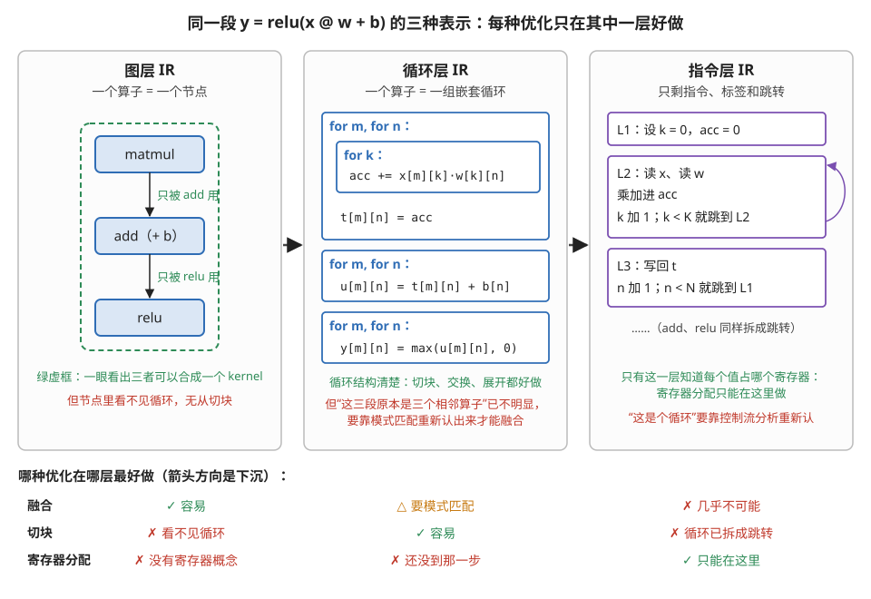

> **图 10-1**　一句话：同一段计算可以写成三种表示，融合只在第一种里好做，切块只在第二种里好做，寄存器分配只能在第三种里做，所以编译器要按顺序经过这三层。
>
> **先知道一件事**：IR（中间表示）是编译器内部用来存放程序的数据结构。这里的三种 IR 描述的是同一个计算，只是详细程度不同，就像同一座城市可以画成地铁线路图、街道图或门牌号清单。
>
> **按这个顺序看**：
> 1. 左栏是图层 IR：三个方框是三个算子（matmul 矩阵乘、add 加偏置、relu 负数置零），箭头是数据流。绿字标出一眼可见的事实：matmul 的输出只被 add 用，add 的输出只被 relu 用，所以三者可以合成一个 kernel（一次 GPU 函数调用）。但方框里没有循环，切块这个动作没有对象。
> 2. 中栏是循环层 IR：每个算子展开成一组 for 循环。现在循环的边界、下标都摆在明面上，切块、交换循环次序、展开都能直接做。但三段循环之间只剩“前一段写 t、后一段读 t”这样的数组关系，要重新分析才能认出它们原本是三个相邻算子，融合变难了。
> 3. 右栏是指令层 IR：循环变成了带标签的指令块（L1、L2、L3）和“条件满足就跳回某标签”的跳转，紫色弯箭头就是 L2 跳回自己。这一层才有具体的值和寄存器，所以寄存器分配只能在这里做；反过来，“这是一个循环”要靠分析跳转关系才能重新认出来。
> 4. 最后看下面的小表：三行三列，绿色勾是最好做的那一层，红叉是做不了或极难做的那一层。
>
> **打个比方**：规划搬家时，看楼层平面图才能决定哪几个房间的东西一起装车（融合），看每个房间的柜子清单才能决定怎么分箱（切块），到了装车那一刻才能决定每只箱子放车厢的哪个格子（寄存器分配）。
>
> **看懂的标志**：能回答“为什么编译器不在指令层做融合”——到那一层，三个算子已经变成几段互相跳转的指令，“哪几段原本是相邻算子、中间数组只被下一个用”这些信息都要重新推断，代价太高；在图层做，这些信息是现成的。
>
> **与正文的对照**：三栏对应 §2 的三条列表。中栏的 t、u 是未融合时写到显存的中间数组，指令层只画了矩阵乘那一段，add 和 relu 省略。
>
> 来源：本库自绘。

**这也解释了一个常见的困惑：为什么编译器不能"一步到位"。** 因为不同优化要求的信息互相冲突——**融合要求看得见算子边界，切块要求算子边界已经消失**。**它们不可能在同一个表示上同时最优，只能排成一条顺序：先在高层做完融合，再下沉到循环层做切块。** 而这个顺序一旦定了，**它就成了一条硬边界**：下沉之后想回头做融合，代价极高（这正是本节 §9 要讲的那条边界的技术来源）。

---

## 3. MLIR：为什么大家都在同一个地基上造编译器

第 1 节提过 MLIR"不是产品而是造编译器的工具箱"。这里讲清它到底提供了什么。

### 3.1 它解决的问题：每个人都在重造同样的轮子

**在 MLIR 之前**，每个深度学习编译器都要自己实现一整套基础设施：IR 的数据结构、pass 管理器、支配树分析、常量折叠、死代码消除、序列化与打印、验证器……**而这些东西在各家之间是高度相似的**——真正有差异的只有"我的操作集合是什么"和"我要做哪些领域特定的变换"。

**MLIR 的做法是把共性的部分做成基础设施，把差异的部分做成可插拔的 dialect。** 你定义自己的操作、自己的类型、自己的 pass，其余全部复用。

### 3.2 dialect 的实际形态：一条链上的若干种方言

**关键的设计是：多个 dialect 可以在同一个模块里共存，一个函数里可以同时有高层和低层的操作。** 于是"下沉"变成了**逐步把一个 dialect 的操作替换成另一个 dialect 的操作**，而不是"整体翻译成另一种语言"。

**典型的一条链**（各家实现略有出入，形状是普遍的）：

| 抽象层次 | 大致对应的 dialect | 这一层看得见什么 | 这一层做什么优化 |
| --- | --- | --- | --- |
| 框架图 | 高层张量 dialect（如 StableHLO） | 算子、张量形状、整张图 | 融合、常量折叠、布局指派 |
| 张量运算 | Linalg 一类的结构化操作 | 算子的循环语义（但还没展开） | 融合、切块的高层决策 |
| 显式循环 | 仿射 / SCF 循环 dialect | 循环嵌套、下标表达式 | 切块、交换、展开、向量化、流水 |
| 并行结构 | GPU dialect | 线程块、线程、shared memory | 线程映射、同步插入 |
| 目标指令 | NVVM / LLVM dialect | 具体指令、寄存器 | 指令选择、寄存器分配（交给 LLVM 或 ptxas） |

**这张表的价值在于：它把本节 §2 那句"每种优化有它最容易做的层次"变成了可以对号入座的清单。** 听到一个优化，问它作用在哪个 dialect 上，就知道它需要什么信息、以及为什么它不能在别的地方做。

**一个有意思的副作用**：因为 dialect 可以共存，**"部分下沉"成为可能**——把一个模块里的矩阵乘下沉到很低的层次（换成手写的库调用或专用指令），而周围的逐元素操作还留在高层。**这正是"矩阵乘用模板、epilogue 自动缝合"（本模块第 3 节讲的 Inductor 模板融合）在编译器内部的实现形态。** 图 10-2 按时间顺序画出了一个模块经历的几个状态，其中第 ③ 列就是部分下沉。

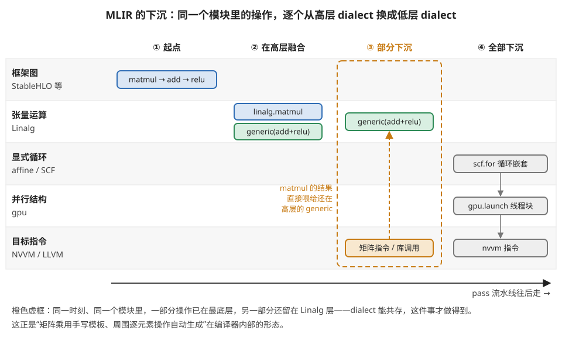

> **图 10-2**　一句话：在 MLIR 里，下沉不是把整个程序一次翻译成另一种语言，而是一个操作一个操作地往下换，所以同一时刻，模块里可以有的操作已经在最底层、有的还在高层。
>
> **先知道一件事**：dialect（方言）是 MLIR 里的一套操作集合，每套对应一个抽象层次。例如 Linalg 这套方言里有“矩阵乘”“逐元素运算”这种整块的操作，SCF 这套方言里只有 for 循环，NVVM 这套方言里是具体的 GPU 指令。多套方言可以同时出现在同一个模块（一个待编译的程序单元）里。
>
> **按这个顺序看**：
> 1. 先看五条横带，从上到下是越来越低的抽象层次，左侧写着层次名和对应的方言名。
> 2. 第 ① 列：起点，三个算子都在最上面的框架图层（StableHLO 是一种描述整张计算图的方言）。
> 3. 第 ② 列：降到张量运算层后做了融合，add 和 relu 合并成一个 generic（Linalg 里通用的逐元素操作，绿色），matmul 仍是单独的 linalg.matmul。
> 4. 第 ③ 列（橙色虚框）：matmul 被直接换成了最底层的矩阵指令或手写库调用（橙色），绿色的 generic 还留在张量运算层。橙色虚线箭头表示 matmul 的结果照常流给 generic。这就是部分下沉。
> 5. 第 ④ 列：剩下的部分也一路降下来，依次变成 scf.for 循环嵌套、gpu.launch（启动一组线程块）和 nvvm 指令。
> 6. 底部箭头是时间：pass（对 IR 做一次改写的程序单元）一个接一个地运行，模块从左边的状态走到右边。
>
> **打个比方**：像翻修一栋楼，不必全楼同时拆到毛坯。厨房可以先整体换成定制的成品橱柜，客厅还保持原样，两者照常连通使用。
>
> **看懂的标志**：能回答“部分下沉为什么对矩阵乘有用”——矩阵乘有高度优化的现成实现，值得直接换成它；周围的加偏置、激活这些逐元素操作形态多变，留在高层让编译器自动融合和生成代码更划算。两者能在同一个模块里共存，靠的就是多套方言可以混用。
>
> **与正文的对照**：五条横带与 §3.2 的表一一对应。第 ③ 列就是本段说的“矩阵乘下沉到很低的层次、逐元素操作还留在高层”。各列具体用哪些方言因项目而异，图中是一条典型路径。
>
> 来源：本库自绘。

---

## 4. 循环变换词汇表：每一种换来哪个硬件收益

**这是本节最实用的一部分。** 前面各节反复用到的那些词，在这里集中定义，并且**每一个都标出它对应本库的哪条硬件约束**——因为**变换不是为了好看，每一种都在兑现一个具体的硬件收益**。

### 4.1 七种基本变换

| 变换 | 做什么 | 换来的硬件收益 | 出处 |
| --- | --- | --- | --- |
| **循环切块（tiling / blocking）** | 把一层循环拆成"外层走块、内层走块内" | **制造复用**：让一块数据搬进快速存储后被反复使用 | 模块 11 第 4 节的两边夹逼 |
| **循环融合（fusion）** | 把两个相邻的循环合并成一个 | **消灭中间结果的落地税**：中间值不落显存，在寄存器里直接传 | 模块 40 第 3 节 |
| **循环分裂（fission / distribution）** | 融合的反操作：把一个循环拆成两个 | 降低寄存器压力、或让其中一半能被向量化 | 模块 10 第 2 节的寄存器溢出 |
| **循环交换（interchange / permutation）** | 调换嵌套的顺序 | **改变访存的步长**：让最内层沿着连续维走，从而合并访存 | 模块 10 第 4 节的合并 |
| **循环展开（unrolling）** | 把循环体复制 N 份、循环次数除以 N | **制造指令级并行**：相邻迭代之间没有依赖，可以背靠背发射 | 模块 10 第 2 节的 ILP |
| **向量化（vectorization）** | 把相邻的若干次迭代合并成一条宽指令 | **每条指令搬更多/算更多**：`LDG.E.128` 而不是四条 `LDG.E.32` | 模块 10 第 4 节的向量化访存 |
| **软件流水（software pipelining）** | 把"搬一块算一块"改写成三段式 | **让搬运藏进计算**：第 k 块算的同时搬第 k+N−1 块 | 模块 40 第 4 节 §7 |

**这张表的读法**：**左边是编译器的动词，右边是硬件的名词。** 学编译器的人从左往右看（"我做这个变换是为了什么"），学硬件的人从右往左看（"我想要这个收益，需要哪个变换"）。**本库的绝大多数内容住在右列，本节补上左列，两边接上之后，读任何编译器的优化报告都不会再有生词。**

表里的前几种变换各画了一张前后对比：切块见图 10-3，融合与分裂见图 10-4，展开与向量化见图 10-5；交换留到 §4.2 专门讲。

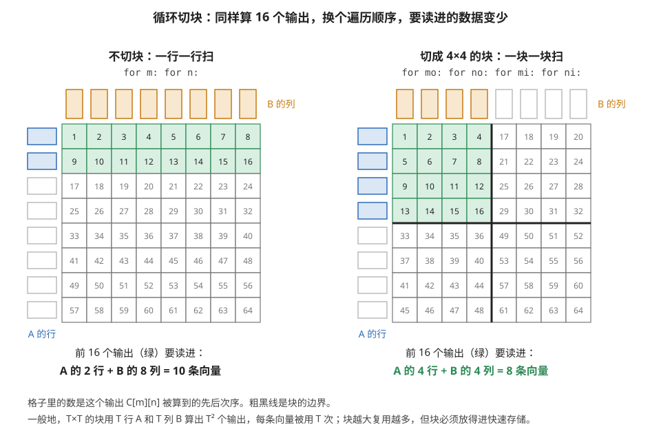

> **图 10-3**　一句话：只改变输出的计算次序，不改变任何一个输出的算法，切块就能让同样数量的输出少读一些数据，而且块越大省得越多。
>
> **先知道一件事**：矩阵乘 C = A × B 中，每个输出 C[m][n] 要用到 A 的第 m 整行和 B 的第 n 整列。算一批输出时，需要把这批输出涉及的所有行和列都读进快速存储（寄存器或 shared memory）。读进来的一行或一列，这里统称一条向量。
>
> **按这个顺序看**：
> 1. 两个 8×8 网格都是输出矩阵 C，格子里的数是这个输出第几个被算。网格上方的小竖条是 B 的 8 列，左边的小横条是 A 的 8 行。
> 2. 看左图（不切块，循环是 for m: for n:）：按行扫，前 16 个输出（绿色）是前两整行。它们用到 A 的 2 行（蓝色）和 B 的全部 8 列（橙色），共 10 条向量。
> 3. 看右图（切成 4×4 块，循环变成四层：外两层 mo、no 选块，内两层 mi、ni 走块内）：粗黑线是块的边界，前 16 个输出是左上那一块。它们只用到 A 的 4 行和 B 的 4 列，共 8 条向量。
> 4. 看最下面的一般规律：T×T 的块用 2T 条向量算出 T² 个输出，每条向量被反复用 T 次。T = 4 时每条用 4 次；T = 128 时每条用 128 次。
>
> **打个比方**：安排甲方 8 人和乙方 8 人两两面谈，每场面谈是一个输出，会议室座位有限。按“甲方一人依次和乙方 8 人谈完再换下一位”的次序，头 16 场要请进 2 位甲方和 8 位乙方；按“甲方 4 人和乙方 4 人进屋，两两谈完再换人”的次序，头 16 场只要请进 8 个人，每人谈 4 场。
>
> **看懂的标志**：能回答“块为什么不能无限大”——块越大，需要同时放在快速存储里的向量越多（2T 条），寄存器和 shared memory 的容量有限，放不下就要反复从显存重读，复用反而没了。
>
> **与正文的对照**：对应 §4.1 表里切块一行的“制造复用”。8×8 和 4×4 是为作图选的尺寸，真实 kernel 的块边长常在 64 到 256 之间。
>
> 来源：本库自绘。

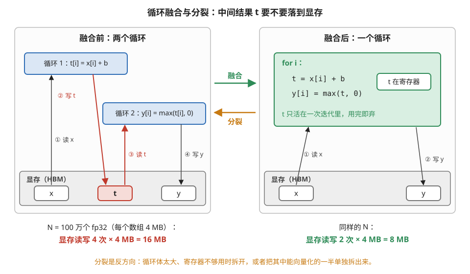

> **图 10-4**　一句话：融合把两个循环合成一个，让中间结果 t 从“写到显存再读回来”变成“在寄存器里用完就丢”，显存读写量减半。
>
> **先知道一件事**：显存（HBM）容量大但读写慢，寄存器是每个线程私有的、最快的存储，但只在一次计算过程中临时存放数值。一个循环结束时，它想留给下一个循环的结果只能写进显存。
>
> **按这个顺序看**：
> 1. 左图是融合前：循环 1 算 t = x + b，循环 2 算 y = max(t, 0)。底部灰框是显存，里面有 x、t、y 三个数组，t 是红色的。
> 2. 跟着编号看左图的四次显存访问：① 循环 1 读 x；② 循环 1 把 t 写进显存（红色）；③ 循环 2 把 t 读回来（红色）；④ 循环 2 写 y。红色的两次纯粹是为了在两个循环之间传递 t。
> 3. 右图是融合后：只剩一个循环，每次迭代先算出 t，紧接着用它算 y。t 只在这一次迭代里存在，放在寄存器里，显存里根本没有 t 这个数组，只剩 ① 读 x 和 ② 写 y 两次访问。
> 4. 看底部的数字：100 万个 fp32（每个 4 字节），每个数组 4 MB。融合前读写 16 MB，融合后 8 MB。这类逐元素运算的耗时基本由显存读写量决定，所以大约快一倍。
> 5. 中间橙色的反向箭头是分裂：循环体太大时，同时活着的中间值太多，寄存器不够用，就把一个循环拆回两个；或者把其中能向量化的一半单独拆出来。
>
> **打个比方**：两道工序之间，融合前是把半成品送回仓库、下一道工序再去仓库取；融合后是两个工人并排坐，半成品从一个人手里直接递给下一个。
>
> **看懂的标志**：能回答“为什么说融合消灭的是落地税而不是计算量”——两种写法做的加法和比较次数完全一样，省掉的只是 t 那一写一读的 8 MB 显存流量。
>
> **与正文的对照**：对应 §4.1 表里融合、分裂两行。本模块第 3 节讲的 Inductor 融合，在循环层看就是这个动作。
>
> 来源：本库自绘。

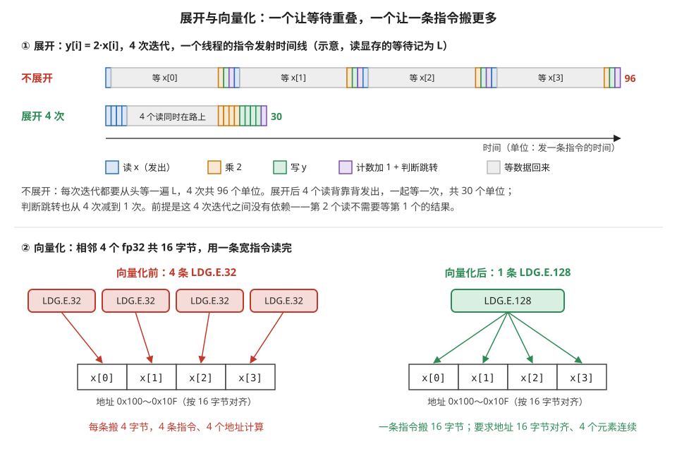

> **图 10-5**　一句话：展开让几次迭代的“等数据”重叠起来，向量化让一条指令一次搬几个相邻数据，两者都不改变计算内容，只减少等待和指令条数。
>
> **先知道一件事**：GPU 的一个线程按顺序发出指令。发出一条读显存的指令后，数据要过很久（几百个时钟周期）才回来；只要后面的指令不需要这份数据，就可以接着发，不必等。图上半部分把这段等待画成灰色长条，长度记为 L，取 20 个单位（示意）。
>
> **按这个顺序看**：
> 1. 上半部分是一个线程执行 y[i] = 2·x[i] 的 4 次迭代。每个小色块是发出一条指令：蓝色读 x，橙色乘 2，绿色写 y，紫色是循环计数加 1 并判断要不要跳回循环开头。
> 2. 看“不展开”一行：每次迭代先发读指令，然后乘法必须等数据回来，于是每次迭代都完整地等一次 L。4 次迭代共 96 个单位，几乎全是等待。
> 3. 看“展开 4 次”一行：循环体复制成 4 份，编译器把 4 条读指令提到最前面背靠背发出，4 份数据同时在路上，一起等一次。随后 4 个乘法、4 个写，只剩一次计数和跳转，共 30 个单位。能这样重排的前提是 4 次迭代互不依赖：第 2 次的读不需要第 1 次的结果。
> 4. 下半部分是向量化：左边 4 条 LDG.E.32（每条从显存读 32 位，即一个 fp32）各读一个元素；右边一条 LDG.E.128 一次读 128 位，正好是相邻的 4 个 fp32。
> 5. 看右下角的条件：4 个元素必须在内存里连续，并且起始地址是 16 的倍数（16 字节对齐），硬件才允许用这条宽指令一次读完。
>
> **打个比方**：展开像一次下单 4 件快递，一起等一次到货，而不是每件收到再下下一单；向量化像用一个大箱子一次装 4 件，而不是跑 4 趟各拿一件。
>
> **看懂的标志**：能回答“如果第 i 次迭代要用第 i−1 次的结果（比如求前缀和），展开还有没有用”——展开后的 4 次迭代仍然得一个等一个，读指令没法提前一起发，等待不能重叠，这时展开主要只省了计数和跳转那几条指令。
>
> **与正文的对照**：对应 §4.1 表里展开（制造指令级并行）与向量化（`LDG.E.128` 而不是四条 `LDG.E.32`）两行。L = 20 与每条指令占 1 个单位都是示意值；真实 GPU 上还有别的 warp 可以填补这段等待，展开的收益是在此之外，让单个线程自己也不闲着。
>
> 来源：本库自绘。

### 4.2 一个必须讲清的例子：循环交换为什么能改变性能

**取一个最小的矩阵乘。** 两种循环顺序，数学完全等价：

```
写法一（k 在最内）：            写法二（n 在最内）：
for m: for n: for k:            for m: for k: for n:
    C[m][n] += A[m][k]*B[k][n]      C[m][n] += A[m][k]*B[k][n]
```

**逐个数组分析最内层的访存步长**（假设都是行主序，行宽为 N）：

| | 写法一（k 最内） | 写法二（n 最内） |
| --- | --- | --- |
| A[m][k] | 步长 1（连续）✅ | **k 不变，同一个值**（可以放寄存器）✅ |
| B[k][n] | **步长 N（跨行）** ❌ | 步长 1（连续）✅ |
| C[m][n] | 不变（可放寄存器）✅ | 步长 1（连续）✅ |

**写法一里 B 是按列访问的**——按模块 10 第 4 节的账，32 个线程的地址间隔 N 个元素，**合并完全失效，实际带宽掉到八分之一**；写法二三个数组全是友好的访问模式。图 10-6 把 B 的两种走法画在同一块内存上。

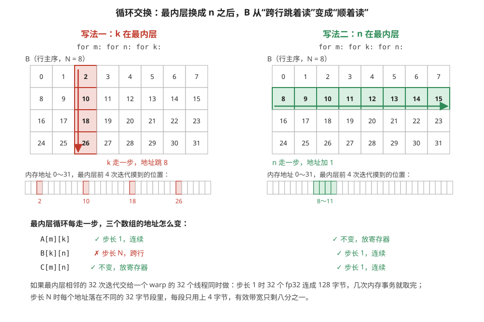

> **图 10-6**　一句话：两种循环次序算的是同一个矩阵乘，差别只在最内层循环每走一步时 B 的地址怎么变：一种每步跳过一整行，一种每步挪一格。
>
> **先知道一件事**：二维矩阵在内存里按行主序存放，即先存第 0 行的 8 个元素，再存第 1 行，依此类推。所以同一行里相邻的两个元素地址差 1，同一列里上下相邻的两个元素地址差一整行的长度 N（这里 N = 8）。
>
> **按这个顺序看**：
> 1. 两个网格都是矩阵 B，格子里的数是它在内存里的地址（以元素为单位）。
> 2. 左边写法一（最内层是 k）：固定 n = 2，k 从 0 走到 3，访问的是第 2 列（红色），地址 2、10、18、26，每步跳 8。
> 3. 右边写法二（最内层是 n）：固定 k = 1，n 从 0 走到 7，访问的是第 1 行（绿色），地址 8、9、10……15，每步加 1。
> 4. 看两个网格下方的地址条：写法一前 4 次迭代摸到的 4 个位置散开在四处；写法二前 4 次摸到的是紧挨着的 8～11。
> 5. 看下方的小表：A 和 C 两种写法都没问题（地址连续，或者在最内层里根本不变，可以一直放在寄存器里），唯一的差别在 B。
> 6. 最后一段说明为什么这对 GPU 要紧：假如最内层相邻的 32 次迭代由一个 warp（同时执行的 32 个线程）分着做，连续的地址能合成几次整块的内存访问；每步跳 N 的地址各自落在不同的 32 字节段里，每段只用上 4 字节，传输的数据八成浪费掉。
>
> **打个比方**：一本书按页印刷。写法二是逐字读完一页再翻下一页；写法一是每页只读第 3 个字，读完翻到下一页再读第 3 个字，大部分时间花在翻页上。
>
> **看懂的标志**：能回答“写法一里 C[m][n] 在最内层不变，这算好事还是坏事”——好事：它可以一直待在寄存器里累加，k 循环结束才写回一次。写法一的问题只出在 B 上。
>
> **与正文的对照**：两种写法和三数组的步长表与正文一致。N = 8 是为作图选的；真实矩阵的 N 成百上千，每步跳过的距离更远。
>
> 来源：本库自绘。

**同一个数学、同一个计算量，只是把两层循环换了个位置，性能差好几倍。** 这个例子值得记住，因为它最直接地说明了**"计算与调度分离"（本模块第 4 节的地基）不是一个抽象的哲学，它就是这么具体的东西。**

### 4.3 合法性：为什么变换需要"证明"

**上面的交换看起来只是换了个写法，但它并不总是合法的。** 判据是依赖：**如果两次迭代之间有依赖，改变它们的相对顺序就会改变结果。**

**一个反例**：

```
for i in 1..N:
    for j in 1..N:
        A[i][j] = A[i-1][j+1] + A[i][j-1]
```

这里第 (i,j) 次迭代要用到 (i−1,j+1) 和 (i,j−1) 的结果——**其中一个依赖指向"上一行、右一列"**。原顺序是一行一行地走，上一行早已整行算完，没有问题。交换 i 和 j 两层循环之后变成一列一列地走，(i−1,j+1) 在右边那一列，**还没轮到它就被读了**，读到的是旧值，**结果就错了**。

**值得对比的是：如果只依赖"上一格"(i−1,j) 和"左一格"(i,j−1)，交换反而是合法的**——一列一列地走时，上一格在同一列里先算，左一格在左边那一列里先算，两者都已就绪。所以合法性取决于依赖的具体方向，不取决于"有没有依赖"。图 10-7 把两种情况并排画了出来。

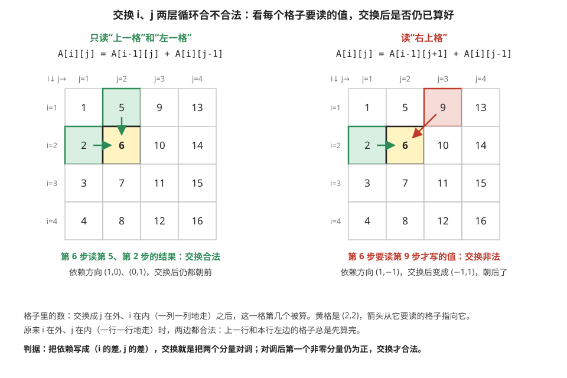

> **图 10-7**　一句话：判断能不能交换两层循环，就看每次迭代要读的那些值，在新次序下是否仍然比它先算出来。
>
> **先知道一件事**：一次迭代要读的值如果是另一次迭代写的，两者之间就有依赖：写的那次必须先执行。依赖可以用方向来记：从写的那格走到读的那格，行号差多少、列号差多少。例如读“上一格”，行号差 1、列号差 0，记作 (1,0)。
>
> **按这个顺序看**：
> 1. 两个网格都是 4×4 的迭代空间，每格代表一次迭代 (i,j)。格子里的数是交换之后（j 在外层、i 在内层，一列一列地走）这一格第几个被算。
> 2. 黄格是我们检查的迭代 (2,2)，它排在第 6 个。箭头从它要读的格子指向它。
> 3. 看左图：(2,2) 读上一格 (1,2)（第 5 个算）和左一格 (2,1)（第 2 个算），都比 6 早，绿色。交换合法。
> 4. 看右图：(2,2) 读左一格 (2,1)，第 2 个，没问题；但还读右上格 (1,3)，它要到第 9 个才算（红色）。第 6 步读它时它还没被写，读到的是旧值，结果错了。
> 5. 看底部的判据：把依赖方向的两个分量对调，就是交换后的方向。左图 (1,0)、(0,1) 对调后是 (0,1)、(1,0)，第一个非零分量都为正，仍然是“先写后读”；右图 (1,−1) 对调后是 (−1,1)，第一个分量为负，变成了“先读后写”。
>
> **打个比方**：排队打饭的规矩是“后面的人要等前面的人打完”。只要换一种排队方式之后，每个人要等的那些人仍然排在自己前面，怎么排都行；只要有一个人要等的人被排到了自己后面，这个排法就行不通。
>
> **看懂的标志**：能回答“原来的次序（一行一行地走）下，右图的循环合法吗”——合法。(1,3) 在第 1 行，一行一行地走时它比第 2 行的 (2,2) 先算。出问题的只是交换之后的次序。
>
> **与正文的对照**：右图对应上面代码里的反例，左图对应“值得对比的是”那一段。下标从 1 开始，与代码一致。
>
> 来源：本库自绘。

**所以编译器在做任何循环变换之前，必须先做依赖分析**：把每一对可能冲突的访问找出来，算出它们的依赖方向，再判断目标变换会不会违反某个方向。**这件事在下标是简单线性表达式时可以精确判定，在下标里出现间接寻址（`A[idx[i]]`）时基本无解——编译器只能保守地假设"有依赖"，于是什么变换都不敢做。**

**这条给写代码的人一个非常实用的推论**：

> **想让编译器帮你优化，就要让它看得懂你的下标。** 用简单的线性下标、避免间接寻址、避免指针别名（两个指针可能指向同一块内存时，编译器必须假设最坏情况）。**"这段代码编译器优化不了"，十次有八次是因为它证明不了变换的合法性，而不是因为它不会做那个变换。**

---

## 5. 走一遍完整的下沉链

**把前面的东西串起来，跟一个矩阵乘从 Python 走到 PTX。** 每一步标出"这一层看得见什么、做了什么、丢了什么"。

**起点**：`y = torch.relu(x @ w + b)`

**第 1 步：抓图（Dynamo）。** Python 字节码被拦截（§6 讲机制），产生一张图：三个节点（矩阵乘、加、relu），带着张量的形状和 dtype。
> **看得见**：整个函数的数据流。**丢了**：Python 的控制流细节、局部变量名。

**第 2 步：自动微分（AOTAutograd）。** 训练时在这里插一步：**根据前向图生成反向图**，同时决定哪些中间值要保存（模块 60 第 1 节讲的激活值）、哪些可以重算。
> **这一步的位置极其关键，§7 单独讲。**

**第 3 步：图层优化（Inductor 的图 pass）。** 融合决策（三个算子合成一个）、布局指派（要不要转成 channels_last）、显存规划（哪些张量可以复用同一块）。
> **看得见**：算子之间的关系。**丢了**：融合之后，"这里原本是三个算子"这个信息不再重要。

**第 4 步：下沉到循环层，生成 kernel 代码。** 融合后的算子被表达成循环嵌套，然后做切块（选 BLOCK_M/N/K）、决定哪些数据进 shared memory、排流水（num_stages）。**Inductor 在这一步生成 Triton 代码。**
> **看得见**：循环结构、访存模式。**丢了**：整张图的全局视野。

**第 5 步：Triton 编译器。** Triton 的 IR 经过一系列 pass：把 tile 级的操作分配给线程（绑定）、插入同步、选择指令（`tl.dot` 变成 `mma` 还是 `wgmma`）、生成 PTX。
> **看得见**：tile 与线程的对应。**丢了**：tile 这个抽象本身——到 PTX 里只剩线程和寄存器。

**第 6 步：ptxas。** 模块 10 第 6 节讲过：寄存器分配、指令调度与控制位、指令选择，产出 SASS。
> **看得见**：每条指令、物理寄存器。**丢了**：一切高层结构。

**六步走完，第 1 节那张"信息衰减"的图就有了实体。** 每一步都在丢东西，而**丢掉的都是这一步之后不再需要的**——这正是 §2 那句话的意思。

---

## 6. 抓图：Dynamo 怎么做到的，以及 graph break 的完整清单

本模块第 3 节提过 graph break，但没讲机制。**这一节补上，因为它是"为什么我的模型编译不动"这类问题的唯一答案来源。**

### 6.1 机制：在字节码层面拦截

**难点在于 Python 太动态了**：一个函数里可以有条件分支、可以调用任意对象的方法、可以在运行时改变类型。**静态地分析 Python 源码得不到可靠的图。**

**Dynamo 的做法是"边跑边抓"（业界叫追踪，tracing）**，但拦截的位置很特别——**Python 字节码的执行**：

1. 函数第一次被调用时，Dynamo 接管它的字节码解释。
2. **它一边解释一边做符号执行**：遇到张量操作就往图里加一个节点，遇到普通 Python 操作就真的执行。
3. 同时它记录下**这次追踪依赖了哪些假设**（张量的形状、dtype、某个 Python 变量的值），这些假设叫 **guard（守卫）**。
4. 追踪完成后，把图交给后端编译，**并把编译结果和那组 guard 一起缓存**。
5. 下次调用时先检查 guard：**全部满足就直接用缓存的编译结果，否则重新追踪一遍**。

**这个设计的精妙之处在于：它不需要理解 Python，只需要在字节码这一层观察。** 代价是它必须为"假设可能不成立"做准备——那就是 guard。

### 6.2 graph break：什么时候抓不下去了

**当 Dynamo 遇到一个它无法符号执行的东西时**，它不会报错，而是**在这里把图切断**：前面的部分编译成一个图、这个操作交回 Python 原样执行、后面的部分重新开始抓一张新图。图 10-8 的上半部分是 §6.1 的追踪与 guard 流程，下半部分是一次 graph break。

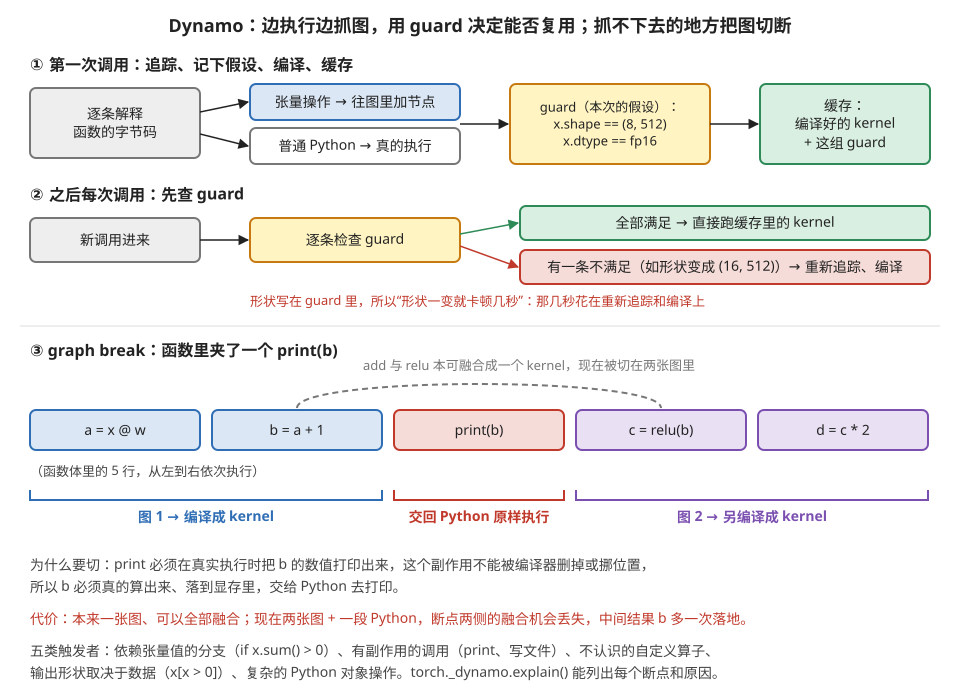

> **图 10-8**　一句话：Dynamo 在函数第一次运行时边执行边把张量操作记成一张图，同时记下“这张图在什么前提下成立”；遇到必须真的执行才能知道结果的语句，就在那里把图切成两段。
>
> **先知道一件事**：字节码是 Python 解释器实际执行的指令序列，每一行 Python 代码会被翻译成若干条字节码。Dynamo 把自己插在“解释执行字节码”这一步，所以能看到函数实际做的每个操作，而不需要读懂源码。
>
> **按这个顺序看**：
> 1. 第 ① 行，第一次调用：Dynamo 逐条解释字节码。遇到张量操作（如矩阵乘），不马上算，而是往图里加一个节点；遇到普通 Python 操作（如整数加法、读字典），就真的执行。
> 2. 同一行的黄框是 guard（守卫条件）：这次追踪依赖的假设，比如输入 x 的形状是 (8, 512)、数据类型是 fp16。图编译好后，连同这组 guard 一起存进缓存（绿框）。
> 3. 第 ② 行，之后的每次调用：先把新输入逐条对照 guard。全部满足（绿），直接运行缓存里编好的 kernel；有一条不满足，比如形状变成 (16, 512)（红），就重新追踪、重新编译。红字说明了“形状一变就卡顿几秒”的来源。
> 4. 第 ③ 行是 graph break（图断点）：函数体有 5 行，第 3 行是 print(b)。打印必须在真实运行时发生，而且要拿到 b 的真实数值，没法放进编译后的图里。于是前两行成为图 1（蓝），print 交回 Python 执行（红），后两行重新抓成图 2（紫）。
> 5. 看灰色虚线弧：b = a + 1 和 c = relu(b) 本来可以融合成一个 kernel，中间值不用写回显存；现在两者分属两张图，只能分成两个 kernel。
> 6. 最后两行文字列出了五类会触发断点的写法。
>
> **打个比方**：Dynamo 像一个跟着你做一遍菜的记录员，把每个步骤记成菜谱，并在菜谱顶上注明“本菜谱适用于 2 人份、用电磁炉”。下次条件相同就直接照菜谱做；你中途停下来尝一口（print），他只能把菜谱拆成“尝之前”和“尝之后”两份。
>
> **看懂的标志**：能回答“把 print(b) 挪到函数最后，会怎样”——前面 4 个张量操作都在 print 之前，能连成一张图，add 和 relu 可以融合；最后只剩一个 print 交回 Python。
>
> **与正文的对照**：第 ①② 行对应 §6.1 的五步流程，第 ③ 行对应本小节的切图机制和下表“有副作用的外部调用”一类。图中 guard 只列了两条示意，真实的 guard 列表通常更长。
>
> 来源：本库自绘。

**触发 graph break 的完整类别**（记住类别比记住例子有用）：

| 类别 | 典型例子 | 为什么抓不下去 |
| --- | --- | --- |
| **依赖张量值的控制流** | `if x.sum() > 0:` | 分支走哪边要等真的算出来才知道，**图里表达不了** |
| **有副作用的外部调用** | `print(x)`、写文件、日志 | 副作用必须在真实执行时发生，不能被优化掉或重排 |
| **不认识的 C 扩展或自定义算子** | 未注册的第三方算子 | 不知道它的语义，没法建模 |
| **数据依赖的形状** | `x[x > 0]`（布尔索引） | 输出形状要算完才知道，**下游全部形状推断失效** |
| **Python 层的复杂对象操作** | 修改全局状态、复杂的类反射 | 符号执行覆盖不到 |

**两个实践推论，比记清单更重要**：

**推论一：依赖张量值的分支是最贵的一类。** 因为它不但切断了图，**还让切断点两侧的融合机会全部丢失**（本模块第 3 节讲的融合）。**对策是把它改写成无分支的形式**——用掩码代替 if、把判断挪到 kernel 内部（用谓词化，模块 10 第 3 节）、或者干脆把这个判断提到整个模型之外去做一次。

**推论二：graph break 是可以量化的。** `torch._dynamo.explain()` 会列出所有断点的位置和原因。**优化的第一步不是猜，是跑一遍这个工具，看图被切成了几段。** 一个理想的模型应该是一整张图，切成几十段的模型基本享受不到编译的红利。

**这里还能顺带解释一个现象：为什么"形状一变就卡顿几秒"**（第 1 节排查表里的那一行）。因为形状是 guard 的一部分——**形状变了 guard 就不满足，要重新追踪加重新编译**。对策是模块 11 第 5 节讲的分桶，或者用动态形状模式（让 Dynamo 把某个维度标记为符号量而不是常量，代价是生成的代码更保守）。

---

## 7. 自动微分：训练特有的那一步，以及它为什么在这个位置

**推理只需要前向图，训练还需要反向图。** 反向图是自动微分生成的，而**它在编译链上的位置有讲究**。

**基本机制**：每个算子都有一条对应的求导规则（`matmul` 的反向是两个 `matmul`，`relu` 的反向是一个掩码乘法）。自动微分把前向图倒过来走一遍，**为每个节点插入它的反向节点**，就得到了反向图。

**关键在于"插在哪一层"**：

- **插得太早（在框架层，算子还没融合时）**：反向图是按原始算子逐个生成的，**它自己也要再走一遍融合优化**——好处是反向图和前向图都能享受完整的图层优化。
- **插得太晚（在 kernel 层，已经融合之后）**：一个融合 kernel 的"导数"是什么？**没有现成的规则**——你得为每一种融合组合单独写反向实现，组合爆炸。

**所以主流做法是在图层做微分，但在融合之前**——PyTorch 里这一步叫 AOTAutograd，它**先生成完整的前向图和反向图，再把两张图一起交给下游做融合与代码生成**。

**这个位置带来一个很实在的好处，值得记住**：因为编译器同时看得见前向图和反向图，**它可以做一个只有在这个视角下才能做的决策——重计算的自动选择**（模块 60 第 1 节讲的 §5）。**它能算出"保存这个中间值要多少显存"和"重算它要多少 FLOPs"，然后逐个张量地决定存还是重算。** 手写代码时这个决策只能按层粗粒度地做，编译器可以做到张量粒度。图 10-9 用 relu(x@w+b) 这一小段把这笔账具体算了一遍。

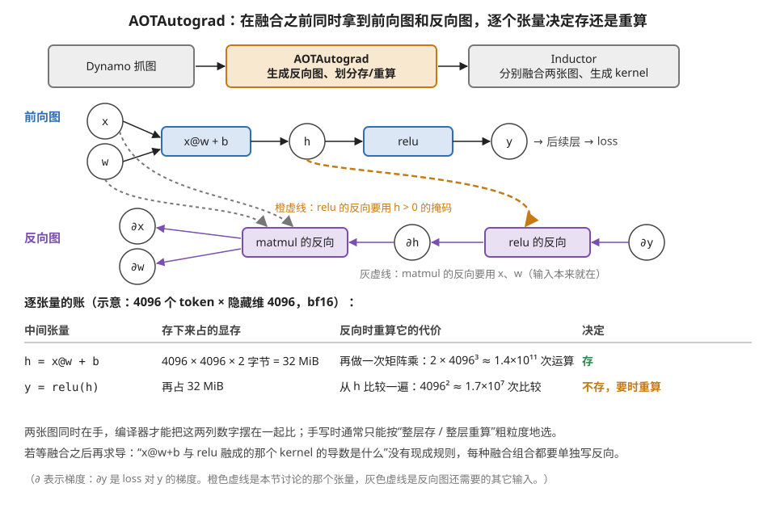

> **图 10-9**　一句话：自动微分放在“抓图之后、融合之前”，编译器手里同时有前向图和反向图，可以一个张量一个张量地比较“存下来”和“反向时重算”哪个更划算。
>
> **先知道一件事**：训练时，反向传播要用到前向计算的一些中间结果，例如 relu 的反向要知道前向时哪些位置是正数。这些中间结果要么在前向时存进显存留着，要么在反向时重新算一遍。存，占显存；重算，花计算时间。
>
> **按这个顺序看**：
> 1. 顶部三格是编译链的一段：Dynamo 抓到前向图后，AOTAutograd（橙色，PyTorch 里做自动微分的那一步）生成反向图，并决定哪些中间结果存、哪些重算；之后 Inductor 才分别对两张图做融合、生成 kernel。
> 2. 中间上排蓝色是前向图：x、w 经过 x@w+b 得到 h，h 经过 relu 得到 y，y 再流向后续层。
> 3. 下排紫色是反向图，从右往左读：∂y（loss 对 y 的梯度，由后续层传回）经过“relu 的反向”得到 ∂h，再经过“matmul 的反向”得到 ∂x 和 ∂w。
> 4. 看虚线：橙色虚线表示“relu 的反向”需要 h > 0 的位置信息；灰色虚线表示“matmul 的反向”需要 x 和 w，它们是输入，本来就在显存里。
> 5. 看下方的账（示意：4096 个 token、隐藏维 4096、bf16）：h 占 32 MiB，但重算它要再做一次矩阵乘，约 1.4×10¹¹ 次运算，所以存。y 也占 32 MiB，但反向只需要“哪些位置为正”，从 h 比较一遍即可得到，约 1.7×10⁷ 次比较，几乎不花时间，所以不存。
> 6. 最后两行文字对比了另一种做法：先融合再求导。那时 x@w+b 和 relu 已经合成一个 kernel，而“这个融合后的 kernel 的导数是什么”没有现成规则可套。
>
> **打个比方**：考试允许带一页纸。难推的公式（重算代价高的 h）抄上去；看一眼就能推出来的结论（重算便宜的 y）不抄，现场推。
>
> **看懂的标志**：能回答“如果 relu 换成一个很贵的函数，决定会不会变”——会。重算 y 的代价上升到接近存下它的代价时，编译器就可能改为存 y。这正是逐张量比账的意义：结论跟着每个张量的具体代价走。
>
> **与正文的对照**：对应本节 §7 的“插在哪一层”与“重计算的自动选择”。表中尺寸是为算账选的示意值；PyTorch 实际做这个划分的算法比这里的两行比较复杂，但比较的正是这两类代价。
>
> 来源：本库自绘。

**这也是"训练的编译比推理的编译难"的一个具体原因**：推理只有一张图，训练有两张互相纠缠的图，而且它们共享中间值——**融合决策、显存规划、重计算选择这三件事在训练时是耦合的，必须一起解。**

---

## 8. 多面体模型：能解什么，为什么没有统治

**这是循环优化领域最漂亮的一套理论，值得知道它是什么、以及它的边界在哪。**

**核心想法**：把一个循环嵌套的**所有迭代**看成高维空间里的一堆整数点（矩阵乘的三层循环就是三维空间里的一个立方体），**把每一种循环变换表示成对这些点的一个仿射变换**（矩阵乘法加平移）。

**这样做的好处非常大**：

1. **变换可以复合**。切块、交换、倾斜、展开在这套表示下都是矩阵，**几种变换的组合就是矩阵相乘**——不需要为每一种组合单独实现。
2. **合法性可以用数学判定**。依赖关系也是仿射约束，"这个变换合不合法"变成了一个整数规划的可行性问题。
3. **最优解可以搜索**。目标函数（比如最小化数据搬运）可以写成线性形式，用线性规划求解。

图 10-10 是这套表示的一个现成例子：同一组迭代点做一次"倾斜"变换前后的样子。

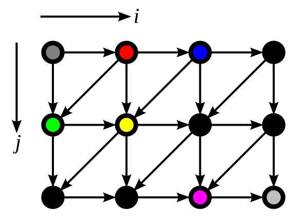
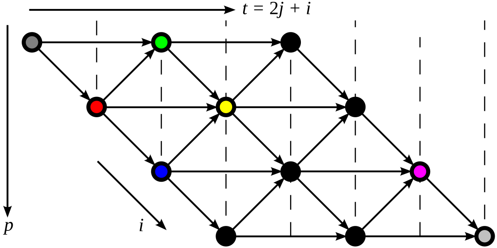

> **图 10-10**　一句话：把每次迭代画成一个点、把依赖画成箭头之后，“倾斜”只是对这些点做一次坐标变换；变换后所有箭头都朝右，于是同一条竖线上的点彼此没有依赖，可以同时算。
>
> **先知道一件事**：这两张图来自维基百科“多面体模型”条目的例子，是一段类似误差扩散抖动（把灰度图变成黑白点）的二重循环：外层 j 走行、内层 i 走列，第 (i, j) 次迭代要读 (i−1, j)、(i, j−1)、(i+1, j−1) 三次迭代的结果。图里每个圆点是一次迭代，箭头从“先算的”指向“要用它的”。
>
> **按这个顺序看**：
> 1. 先看第一张（变换前）：横轴 i，竖轴 j。每个点收到三种箭头：从左边来的（依赖 (i−1, j)）、从上面来的（依赖 (i, j−1)）、从右上斜着来的（依赖 (i+1, j−1)）。
> 2. 注意那条从右上指向左下的斜箭头：它说明同一行里右边的点要等上一行更右边的点。原来的循环里，内层 i 的每一步都依赖前一步（从左边来的箭头），整行只能一个一个地算。
> 3. 彩色的点是用来对照两张图的标记：灰色是 (0,0)，红色是 (1,0)，绿色是 (0,1)，蓝色是 (2,0)，黄色是 (1,1)，品红是 (2,2)，浅灰是 (3,2)。
> 4. 再看第二张（变换后）：新坐标 t = i + 2j 画在横轴，p = i 画在竖轴。每个点只是换了位置：红点 (1,0) 到了 t = 1，绿点和蓝点都到了 t = 2，黄点到了 t = 3。
> 5. 看箭头：现在全部朝右（t 增大的方向）。每条竖虚线上的点 t 相同，它们之间没有箭头相连，例如绿点和蓝点。所以只要按竖线从左到右推进，同一条竖线上的点就可以同时算。
>
> **打个比方**：一队人传话，规矩是每人要先听到左边、上边、右上边三个人的话。按原来的行列次序只能一个接一个；把队伍斜着重新站一遍之后，站在同一竖列的人要听的话都已传到，可以同时开口。
>
> **看懂的标志**：能回答“为什么说倾斜后的次序合法”——因为所有依赖箭头都指向 t 更大的一侧，按 t 从小到大执行，每个点要读的值总是在更早的竖线上算好了。这与图 10-7 的判据是同一件事：依赖方向在新坐标下仍然朝前。
>
> **与正文的对照**：对应本段第 1、2 点“变换是矩阵、合法性可以判定”：倾斜就是 (i, j) → (i, 2j + i) 这个线性变换。原图第二张顶部的标注误写为 t = ½ j + i，按图中各点的位置和维基百科正文给出的变换应为 t = 2j + i，本库已在图上改正。
>
> 来源：[Polytope model unskewed.svg](https://commons.wikimedia.org/wiki/File:Polytope_model_unskewed.svg) 与 [Polytope model skewed.svg](https://commons.wikimedia.org/wiki/File:Polytope_model_skewed.svg)，作者 Traced by User:Stannered，许可 Public domain（本库加了白色背景，并改正了第二张图顶部的公式）。例子的代码与变换见英文维基百科 [Polytope model](https://en.wikipedia.org/wiki/Polytope_model) 条目的 Detailed example 一节。

**它在什么地方真正有效**：**下标是循环变量的仿射函数、循环边界也是仿射的**——这类代码叫"静态控制部分"。**稠密的矩阵乘、卷积、stencil 全部符合**，所以多面体编译器在这些负载上能做得很好。

**它为什么没有统治这个领域，三条原因都很硬**：

1. **仿射的假设太强**。间接寻址（`A[idx[i]]`）、数据相关的循环边界、稀疏结构全部落在框架之外——**而这些恰恰是现代模型里越来越常见的部分**（MoE 的路由、稀疏注意力的 top-k）。
2. **求解代价高**。整数规划在循环层数多、依赖复杂时会爆炸，编译时间不可接受。
3. **最难的部分不在它解决的范围内**。**多面体模型擅长的是"给定一个循环嵌套，找最优的变换组合"，但深度学习编译的核心难题是"选哪个 tile 尺寸、开几级流水、用不用 Tensor Core"**——这些是离散的、依赖硬件常数的、且性能函数极不连续的选择（本模块第 4 节讲过：寄存器多用两个可能占用率跳水）。**线性规划求解不了悬崖。**

**所以现状是：多面体的思想被吸收进了主流编译器**（MLIR 有专门的仿射 dialect，很多依赖分析用的是它的方法），**但"选哪个配置"这件事仍然交给实测搜索**（本模块第 4 节的 autotune）。**理论负责保证正确、实测负责找最优——这个分工在可预见的将来不会变。**

---

## 9. 编译器的边界：那条线的精确表述

第 1 节说过"需要改数学的融合，编译器做不到"，本模块第 7 节说 FlashAttention 是为了放置目标而改写数学的产物。**有了本节的词汇，这条边界现在可以说得更精确。**

**编译器能做的是：在保持程序语义完全等价的前提下，重排计算与数据。** 它做的每一个变换都要能证明"改写前后的结果逐位相同（或在允许的浮点重结合范围内相同）"。

**FlashAttention 做的事超出了这个范围，而且可以精确指出超在哪里**：

| | 编译器的变换 | FlashAttention 做的事 |
| --- | --- | --- |
| 改的是什么 | 循环的顺序、数据的位置 | **求和的数学形式**（把 softmax 改写成可增量更新的在线形式） |
| 结果是否逐位相同 | 是（或在浮点重结合的容差内） | **不是逐位相同**（虽然数学上等价，浮点运算顺序完全变了） |
| 需要什么知识 | 依赖分析（机械的） | **"softmax 有一个在线形式"这个数学事实** |
| 谁能提供 | 编译器 | 人 |

**所以那条边界的精确表述是**：

> **编译器可以改变"怎么算"，不能改变"算什么的数学形式"。** 前者靠依赖分析就能保证正确，后者需要有人知道一条等价的数学恒等式——**而"知道某个函数有一个等价的增量形式"这件事，目前只能由人提供。**

**这条边界正在被两个方向蚕食，值得跟踪**：

1. **把常见的数学改写做成模板**。FlexAttention（本模块第 4 节讲过）就是这个思路——**不是让编译器发现在线 softmax，而是把在线 softmax 做成一个骨架，让用户只填打分和掩码的部分。** 这不是突破边界，是把边界那一侧的成果搬到这一侧来复用。
2. **等式变换搜索（e-graph 一类的方法）**。给定一组已知的数学恒等式，自动搜索它们的组合。**它的限制是恒等式库要人给**——所以它能自动化的是"组合已知的改写"，不是"发现新的改写"。

**理解这条边界的实用价值**：拿到一个"编译器为什么不帮我优化"的问题时，先判断它落在边界的哪一侧。**落在这一侧（编译器该做但没做）的，多半是 §4.3 讲的合法性证明不了——去简化下标、消除别名；落在那一侧（需要改数学）的，不要等编译器，直接上手写。**

---

## 10. 开发者视角

| 你想知道/控制什么 | 去哪里看/拧 |
| --- | --- |
| 图被切成了几段 | `torch._dynamo.explain(fn)(*args)`——列出每个 graph break 的位置和原因 |
| 编译器做了哪些融合决策 | `TORCH_LOGS=+inductor` 打印融合日志；`TORCH_COMPILE_DEBUG=1` 导出中间产物 |
| 生成的 kernel 长什么样 | Inductor 会把生成的 Triton 代码写到缓存目录，可以直接读 |
| Triton 生成的 PTX/SASS | `TRITON_KERNEL_DUMP=1` 或 `kernel.asm['ptx']`；再往下用 `cuobjdump`（模块 10 第 6 节） |
| 为什么形状一变就重编译 | guard 不满足触发重新追踪——用分桶或动态形状模式 |
| 变换为什么没做 | 检查下标是不是简单线性、有没有间接寻址、指针有没有可能别名 |
| 编译耗时太长 | 减少 autotune 候选数、固定形状让缓存命中、检查是不是在反复重编译 |
| 红旗信号 | graph break 数量以十计；每次调用都在重编译（guard 设计有问题）；生成的 Triton 代码里 `tl.dot` 缺席（Tensor Core 没吃上） |

**给算法侧的一句话**：**"这个写法编译器友不友好"这个问题，有一个可操作的自检**——① 有没有依赖张量值的分支？② 有没有间接寻址或布尔索引？③ 形状会不会每步都变？**三条都没有，编译器基本能发挥；中了任何一条，先想想能不能改掉，那比后面做任何 kernel 优化都省力。**

---

## 11. 最新架构落点（知识截至 2026-08）

- **MLIR 已经是事实上的地基**。主流的深度学习编译器（Triton、IREE、以及各家的新一代产品）几乎都建在它上面。**对读者的意义是：学一次 dialect / pass / lowering 这套概念，读任何一家的编译器文档都不再有生词。**
- **编译器与 tile DSL 的边界在移动**：NVIDIA 把 CUDA Tile IR 做成了 Triton 的后端（本模块第 9 节讲过），意味着"编译器"这一层的下半段开始由硬件厂商直接提供。**这条变化的方向和本节 §8 的判断一致——最优配置的选择仍然靠实测，但代码生成的质量在被厂商接管。**
- **训练侧的编译在追赶推理侧**。推理的图是静态的、只有前向，编译起来容易；训练有两张图、有重计算与显存规划的耦合（§7），成熟得晚。**当前的进展方向是把重计算选择、显存规划、融合决策放进同一个优化问题里一起解**，而不是像过去那样分三步各做各的。
- **动态性仍然是编译器最大的敌人**（模块 40 第 8 节的传导链四）。MoE 的路由、稀疏注意力的 top-k、变长序列——**这些都是 §8 讲的"仿射假设"之外的东西**，也是 graph break 的高发区。**业界的应对不是让编译器变聪明，而是把动态性收拢到少数几个位置**（分桶、固定 top-k、用掩码代替分支）——**这条策略本身就是本节 §9 那条边界的实践形态：与其等编译器突破边界，不如把问题挪到边界这一侧。**

---

## 12. 和其它模块的挂钩

- **模块 40 第 1 节（栈的分层全景）**：那一节讲"信息衰减决定优化归属"，本节 §2 给出它的另一半——信息是被主动、有选择地丢弃的，而丢弃的时机就是 IR 分层的设计。§5 的六步下沉链是那张五层地图的实体。
- **模块 40 第 3 节（图编译层）**：那里讲融合、布局、显存规划的收益，本节 §4 把它们归位成循环变换、§6 讲清 graph break 的机制。
- **模块 40 第 4 节（kernel 层）**：那里的"计算与调度分离"在本节 §4.2 有了最小的实证（循环交换让性能差好几倍）；那里的 autotune 在本节 §8 找到了理论上的位置（为什么搜索打不过、也替代不了求解）。
- **模块 40 第 7 节（映射问题）**：本节的七种循环变换，正好是四维决策的操作层形态——切块对应①，交换与流水对应②，融合与分裂影响③，向量化与展开影响④。
- **模块 60 第 1 节（训练系统）**：本节 §7 讲的自动微分位置，决定了那一节的重计算能不能被自动化；两节在"前向图与反向图耦合"这件事上接头。
- **模块 10 第 6 节（PTX 与 SASS）**：本节 §5 的最后一步就是那一节的全部内容——ptxas 是这条链的终点。

---

## 13. 术语卡

### IR 与 dialect

**定义**：IR 是编译过程中为某一类分析和变换量身定做的数据结构。dialect 是 MLIR 引入的概念——同一套基础设施里可以并存多套各自定义的操作集合，共用数据结构、pass 管理器与工具链，但语义各异，且**可以在同一个模块里共存**。

**为什么存在**：每种优化都有一个"最容易做"的抽象层次，高一层缺细节、低一层丢结构；分层就是把这些层次一个个立出来。而 dialect 让"下沉"从"整体翻译"变成"逐步替换操作"，于是**部分下沉**成为可能——矩阵乘可以先降到很低的层次，周围的逐元素操作还留在高层。

**语境例句**："这个 pass 跑在 linalg 上。"——意思是它作用的层次是"算子还没展开成显式循环、但循环语义已经明确"的那一层，所以它能做融合和切块的高层决策，但摸不到线程和寄存器。

### 循环变换七件套

**定义**：切块（制造复用）、融合（消灭中间结果落地）、分裂（降寄存器压力）、交换（改访存步长）、展开（造 ILP）、向量化（每条指令载重更大）、软件流水（搬运藏进计算）。**左边是编译器的动词，右边是硬件的收益。**

**为什么存在**（作为一张要背下来的对照表）：本库的绝大多数内容住在右列（硬件约束），编译器文档住在左列（变换名字）。把两边接上之后，读任何优化报告都不会有生词，也能反过来从"我想要什么收益"推出"该做什么变换"。

**语境例句**："这个循环没被 interchange。"——意思是最内层的访存步长不对、合并失效；追问下去多半是编译器证明不了交换的合法性（下标里有间接寻址或潜在的指针别名）。

### 依赖分析与合法性

**定义**：两次循环迭代若访问同一内存位置且至少一次是写，它们之间有依赖，相对顺序不能随便改。任何循环变换在执行前都要先证明它不违反依赖方向。下标是简单线性表达式时可精确判定，出现间接寻址时编译器只能保守假设有依赖。

**为什么存在**：它是"变换合不合法"的唯一判据。**它的实践含义比理论含义重要**——"编译器优化不了这段代码"十次有八次不是它不会做那个变换，而是它证明不了合法性。**所以让编译器帮忙的前提是让它看得懂你的下标。**

**语境例句**："这里用了 gather，编译器什么都不敢做了。"——间接寻址让依赖分析失效，编译器只能假设最坏情况，于是切块、向量化、流水全部放弃。

### Dynamo 的追踪与 guard

**定义**：在 Python 字节码执行层拦截、边跑边符号执行地抓取计算图；同时记录本次追踪依赖的假设（形状、dtype、Python 值）作为 guard，与编译结果一起缓存。下次调用先检查 guard，满足则复用，否则重新追踪。

**为什么存在**：Python 太动态，静态分析源码得不到可靠的图。字节码层的追踪不需要理解 Python，只需要观察——代价是必须为"假设不成立"做准备，这就是 guard。**它也解释了"形状一变就卡顿几秒"：形状是 guard 的一部分，变了就要重编译。**

**语境例句**："每次调用都在重编译。"——guard 反复不满足，多半是形状在变或者某个被记录的 Python 值在变；对策是分桶固定形状，或者用动态形状模式让那一维变成符号量。

### graph break

**定义**：Dynamo 遇到无法符号执行的东西时切断图的位置。五类触发者：依赖张量值的控制流、有副作用的外部调用、不认识的自定义算子、数据依赖的形状（如布尔索引）、Python 层的复杂对象操作。

**为什么存在**：追踪机制只能处理"可以被符号执行"的部分，遇到必须真执行才知道结果的东西就得停下来。**它的代价不只是"这一段没编译"，还有断点两侧的融合机会全部丢失**——所以依赖张量值的分支是最贵的一类。

**语境例句**："`dynamo.explain` 报了 17 个 break。"——意思是图被切成了十几段，编译红利基本享受不到；先看这些断点能不能挪走（把 print 移出热路径、把值分支改成掩码），比做任何 kernel 优化都省力。

### 自动微分的位置（AOTAutograd）

**定义**：在图层、但在融合之前生成反向图的做法。此时编译器同时看得见前向图和反向图，可以做一个只有在这个视角下才能做的决策——**逐张量地判断"保存这个中间值"还是"反向时重算"**。

**为什么存在**：微分插得太晚（融合之后）时，"一个融合 kernel 的导数是什么"没有现成规则、组合爆炸；插在图层且在融合前，两张图都能享受完整的图层优化，而且重计算可以从"按层粗粒度选择"细化到"按张量选择"。**这也是训练编译比推理编译难的具体原因：融合、显存规划、重计算三件事在训练时是耦合的。**

**语境例句**："重计算是编译器自动选的。"——它能算出每个张量"存的显存成本"与"重算的算力成本"再决定，比手写时按层一刀切精细得多；前提是微分发生在图层。

### 多面体模型与它的边界

**定义**：把循环嵌套的所有迭代看成高维空间的整数点、把循环变换表示成仿射变换的一套理论。好处是变换可复合（矩阵相乘）、合法性可用整数规划判定、最优解可用线性规划搜索。适用前提是下标与循环边界都是仿射的。

**为什么存在**（以及为什么没有统治）：它在稠密矩阵乘、卷积、stencil 上很有效，但三条限制很硬——仿射假设排除了间接寻址与稀疏结构（而这些正在变多）；求解代价随循环层数爆炸；**最难的问题（选哪个 tile 尺寸、开几级流水）是离散且性能函数极不连续的，线性规划求解不了悬崖**。现状是它的思想被吸收（MLIR 有仿射 dialect），而配置选择仍交给实测搜索。

**语境例句**："这个算子有 gather，多面体那套用不上。"——间接寻址让仿射框架失效；这类负载只能靠模式匹配或手写。

### 编译器的边界：改怎么算，不改算什么

**定义**：编译器可以在保持语义等价的前提下重排计算与数据（循环变换、融合、布局），但不能改变计算的数学形式。FlashAttention 需要"把 softmax 改写成可增量更新的在线形式"这条数学事实，超出了依赖分析能证明的范围。

**为什么存在**（作为一条判断依据）：拿到"编译器为什么不帮我优化"的问题时，先判断它落在边界哪一侧——**这一侧（该做没做）多半是合法性证明不了，去简化下标、消除别名；那一侧（需要改数学）不要等，直接手写。** 这条边界正被两个方向蚕食：把常见改写做成模板（FlexAttention），以及等式变换搜索（但恒等式库仍要人给）。

**语境例句**："这个能不能让 torch.compile 自动做出来？"——先问它需不需要一条数学恒等式。需要的话答案是不能，那是人的活。

---

## 14. 我的困惑 / 待深挖

- Inductor 判断"融不融"的成本模型具体长什么样？它用的是解析模型还是启发式规则？什么情况下它会判定不融更好？
- MLIR 各 dialect 之间的下沉路径在真实项目里有多标准？不同项目（Triton、IREE、各家自研）走的路是不是差异很大？
- Dynamo 的 guard 具体记录了哪些东西？有没有办法看到某次编译的完整 guard 列表，用来诊断"为什么老是重编译"？
- 自动微分之后的反向图，融合机会和前向图比是多是少？有没有反向图特有的融合模式？
- 等式变换搜索（e-graph）在张量程序上的现状？它能自动发现的改写到什么复杂度为止？
- §4.3 说"编译器证明不了合法性"是优化失效的主因——这个判断有没有量化的依据？在真实模型上，多少比例的优化失败源于此？

---

*最后更新：2026-08-31（第一版：模块 40 第 10 节。含"每种优化有它最容易做的层次"这条 IR 分层原理、MLIR dialect 的五层对照表、七种循环变换与硬件收益的对照表、循环交换的三数组步长走查、依赖分析的合法性反例、六步下沉链的逐步信息丢失、Dynamo 字节码追踪与 guard 机制、graph break 的五类触发者、自动微分位置与重计算自动化的关系、多面体模型的三条边界、编译器边界的精确表述与两个蚕食方向）*（2026-09 补图 10 张：现成 1 张，自绘 9 张；图注按费曼法写）
