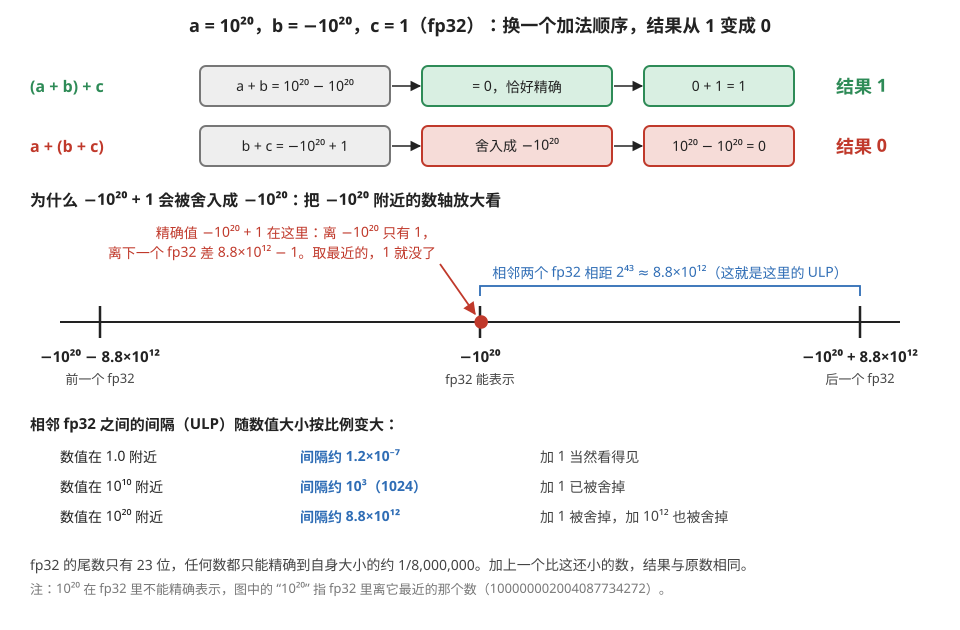
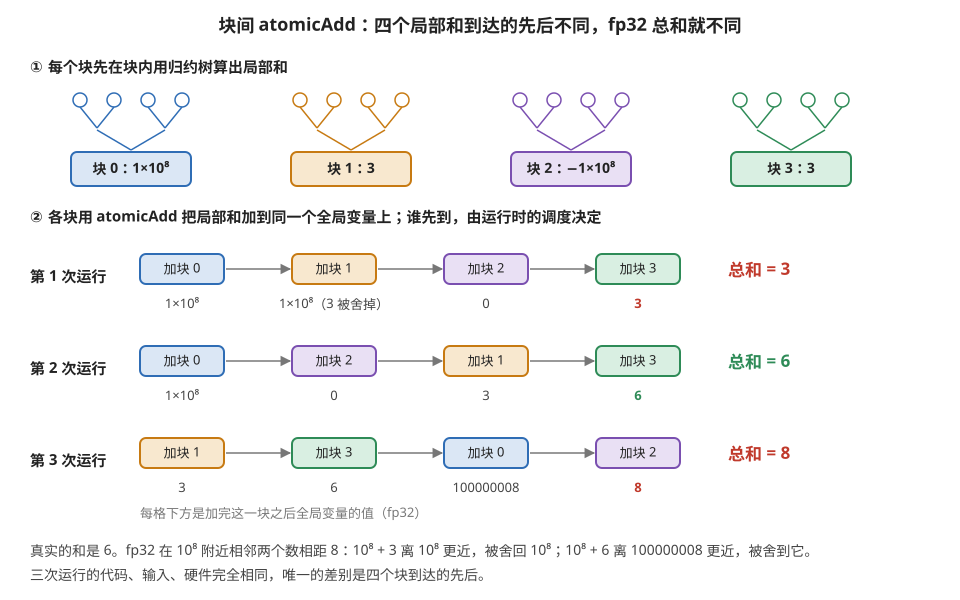
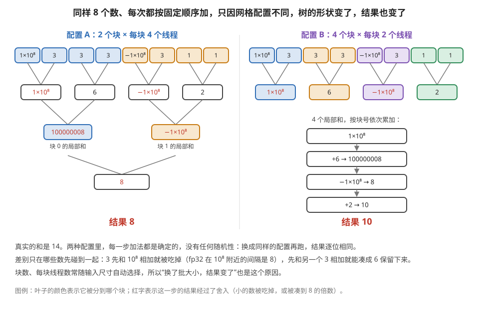
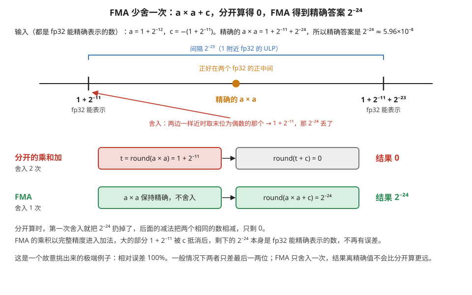
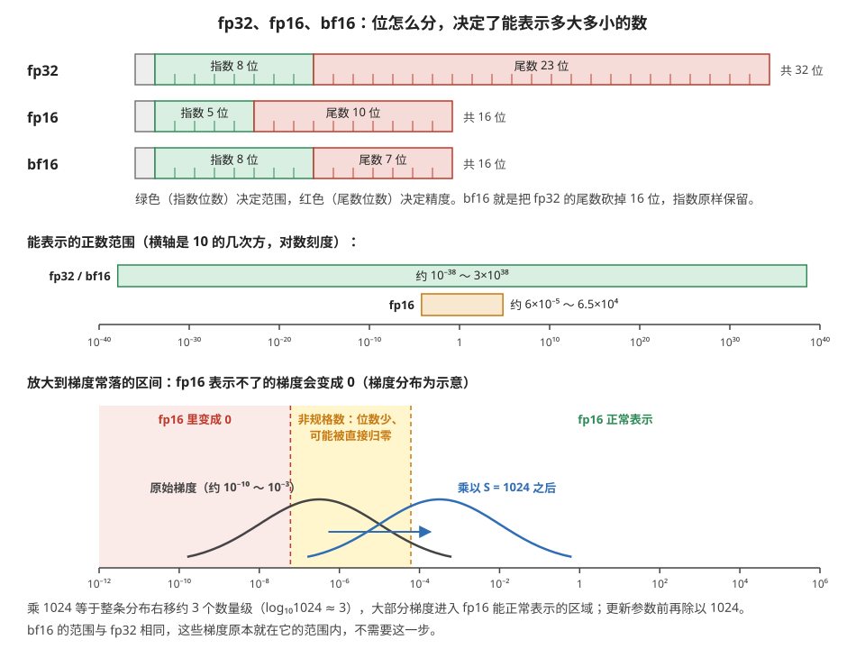
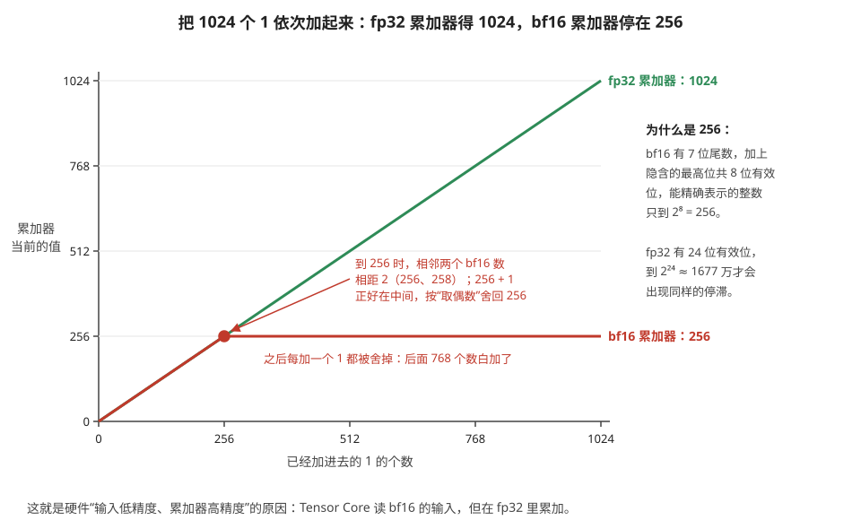
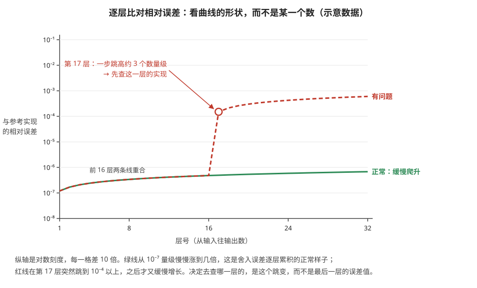

# 数值的一致性：为什么两次跑出来不一样，以及什么时候该担心

> **所属模块**：模块 40 · 软件优化栈（横跨硬件与软件的一节：它的原因全在模块 13 的电路里，它的症状全在你的日志里）
> **状态**：🟨 学习中（第一版。知识截至 2026-08）
> **本节主旨**：几乎每个做 GPU 的人都会遇到这几件事——**同一段代码跑两次结果不完全一样**、**GPU 的结果和 CPU 对不上**、**换了张卡精度就变了**、**开了编译之后数值对不上原来的实现**。这些现象经常被当成 bug 去查，其实**其中大部分是设计使然、而且不可避免**；剩下一小部分才是真的有问题。**本节要交付的能力是一条判据：拿到一个"数值对不上"的现象，能在几分钟内判断它属于哪一类，以及该不该管。** 内容从一个最基础的事实出发——**浮点加法不满足结合律**——推出全部的非确定性来源，然后讲清 FMA 与 Tensor Core 为什么让 GPU 的结果**比逐步计算更准而不是更差**、低精度训练的两个数值陷阱、以及"强制确定性"这个开关的真实代价。
>
> **和范围界定的关系**：本库主动跳过"量化方案"这类算法话题。**本节讲的不是量化，是数值的可复现性与调试**——它是一个系统与工程话题，而且是全栈认知里少数几个"不懂就会浪费大量时间"的点。

---

## 0. 这一节要回答的问题

- 同一段代码、同一张卡、同样的输入，为什么两次结果不完全一样？
- 浮点加法为什么不满足结合律？这件事有多严重（能严重到什么程度）？
- 非确定性的来源具体有哪几个？哪些能关掉、哪些关不掉？
- 为什么 GPU 的矩阵乘结果和 CPU 对不上？谁更准？
- FMA 和 Tensor Core 让结果变准了还是变糙了？
- 为什么 bf16 赢了 fp16？"loss scaling"在解什么问题？
- 拿到一个"结果对不上"的现象，怎么判断该不该管？容差该定多少？
- 怎么强制确定性？代价是什么？
- 数值真的出问题时，怎么定位到具体是哪一步开始发散的？

---

## 1. 基础词汇：先把本节要用的词讲清楚

**浮点数（floating point）**。用 `(−1)^s × 1.m × 2^e` 表示实数的方式（模块 13 第 2 节讲过它的电路实现）。**关键性质：它只能表示有限多个数**，任何运算的精确结果如果不在这个集合里，就要**舍入**到最近的一个。这一次次的舍入是本节所有现象的源头。

**ULP（unit in the last place，末位单位）**。一个浮点数与它相邻的下一个浮点数之间的距离。**它不是常数，而是随数值大小按比例增长的**——1.0 附近的 ULP 在 fp32 里约是 1.2×10⁻⁷，而 10¹⁰ 附近的 ULP 约是 10³。**"两个数差几个 ULP"是浮点误差的标准度量**，比"差多少绝对值"有意义得多。

**确定性（deterministic）与可复现（reproducible）**。这是两个常被混用但必须分清的概念：
- **确定性**：同一个程序、同一台机器、同样的输入，**每次运行结果逐位相同**。
- **可复现**：换一台机器、换一个库版本、换一个并行配置，结果仍然逐位相同。
**前者难，后者更难。** 实践中通常只追求前者，而且只在需要时追求（第 7 节讲代价）。

**归约（reduction）**。把一组数聚合成一个数的操作：求和、求最大值、求范数。**它是本节的主角**——因为求和的顺序会影响结果，而**并行归约的顺序天然是不确定的**。

**FMA（融合乘加）**。模块 13 第 2 节详细讲过：`a×b+c` 作为一条指令完成，**中间的乘积不舍入、以完整精度直接进入加法器，全程只在最后舍入一次**。它的数值后果是本节第 4 节的主题。

---

## 2. 一切的源头：浮点加法不满足结合律

### 2.1 一个能吓到人的例子

**实数的加法满足结合律：(a+b)+c = a+(b+c)。浮点加法不满足。**

**取三个数：a = 10²⁰，b = −10²⁰，c = 1**（都在 fp32 的表示范围内）：

| 顺序 | 逐步计算 | 结果 |
| --- | --- | --- |
| **(a + b) + c** | (10²⁰ − 10²⁰) = 0，然后 0 + 1 = 1 | **1.0** |
| **a + (b + c)** | (−10²⁰ + 1) = −10²⁰（**1 被舍掉了**），然后 10²⁰ − 10²⁰ = 0 | **0.0** |

**同样三个数、同样的加法，换个顺序，一个得 1、一个得 0——相对误差 100%。**

**中间那一步"1 被舍掉了"是关键**：10²⁰ 附近的 ULP 大约是 10¹³，而 1 远小于它，所以 `−10²⁰ + 1` 舍入回 `−10²⁰`，那个 1 就凭空消失了。

图 11-1 把这一步放到数轴上看。

> **图 11-1**　一句话：fp32 在 10²⁰ 附近能表示的数，彼此相隔约 8.8 万亿，所以给 −10²⁰ 加上 1，结果只能落回 −10²⁰，这个 1 就丢了；先算哪两个数，决定了这个 1 有没有机会被丢。
>
> **先知道一件事**：浮点数只能表示数轴上一些离散的点，任何运算的精确结果都要被挪到最近的那个点上，这叫舍入。相邻两点之间的距离叫 ULP（末位单位），它随数值大小按比例变化：数越大，点越稀。
>
> **按这个顺序看**：
> 1. 先看最上面两行。第一行先算 a + b：10²⁰ 减 10²⁰ 恰好是 0，没有误差；再加 1 得 1，正确。第二行先算 b + c：−10²⁰ + 1 被舍入成 −10²⁰（红框），再加 a 得 0。
> 2. 看中间的数轴：三条竖线是 fp32 在 −10²⁰ 附近能表示的三个相邻的数，中间是 −10²⁰，左右两个与它相差 2⁴³ ≈ 8.8×10¹²（蓝色括线）。
> 3. 看红点：精确值 −10²⁰ + 1 就在中间那条竖线旁边，离它只有 1，离右边的点还差将近 8.8×10¹²。舍入取最近的点，结果就是 −10²⁰。
> 4. 看下方的小表：同样加 1，在 1.0 附近（间隔 1.2×10⁻⁷）完全看得见；在 10¹⁰ 附近（间隔 1024）已被舍掉；在 10²⁰ 附近，连加 10¹² 都会被舍掉。
>
> **打个比方**：一把尺子只在每隔 8800 公里的地方有刻度，读数时只能读到最近的刻度。你把东西挪动 1 毫米，读数不会变。
>
> **看懂的标志**：能回答“fp32 里 10¹⁰ + 1000 等于多少”——10¹⁰ 附近间隔是 1024，精确值 10¹⁰ + 1000 离 10¹⁰ + 1024 更近（差 24，而离 10¹⁰ 差 1000），所以结果是 10¹⁰ + 1024，多出了 24。
>
> **与正文的对照**：正文说“10²⁰ 附近的 ULP 大约是 10¹³”，精确值是 2⁴³ ≈ 8.8×10¹²。图中的 10²⁰ 指 fp32 里最接近 10²⁰ 的那个数（100000002004087734272），两者差别不影响结论。
>
> 来源：本库自绘。

**这不是浮点数的缺陷，是它的定义**：用固定的位数表示跨越几十个数量级的实数，就必然要在"大数吃小数"的时候丢东西。

### 2.2 为什么这件事对 GPU 特别重要

**串行程序里求和的顺序是确定的**（就是循环的顺序），所以虽然结果不精确，但**每次都一样**。

**并行归约的顺序不确定**。设想 1024 个数在 GPU 上求和，典型实现是：

1. 每个线程块内部用归约树先算出一个局部和。
2. 各个块把自己的局部和用 `atomicAdd` 累加到同一个全局变量上。

**第 2 步里，各个块到达的先后完全取决于运行时的调度**（模块 10 第 7 节：块分发的顺序、每个块执行的快慢都不保证）。**所以这 N 个局部和相加的顺序每次都可能不同，结果也就每次都可能差几个 ULP。**

图 11-2 用四个块、三次运行，把"到达顺序不同、结果不同"具体算了一遍。

> **图 11-2**　一句话：四个线程块把自己的局部和加到同一个全局变量上，谁先加由硬件调度临时决定；同样四个数，按三种先后次序相加，fp32 结果分别是 3、6、8。
>
> **先知道一件事**：atomicAdd（原子加）保证多个线程块同时往一个变量上加时不会互相覆盖，每一次加法都完整生效；但它不保证谁先谁后。先后次序取决于每个块什么时候被分到硬件上、跑得快慢，每次运行都可能不同。
>
> **按这个顺序看**：
> 1. 第 ① 行：四个线程块各自在块内用归约树（两两相加、逐层合并）算出局部和：1×10⁸、3、−1×10⁸、3。四个数的真实总和是 6。
> 2. 第 ② 部分三行是三次运行。每行的方框是块到达的先后，方框下面是加完这一块后全局变量的值。
> 3. 第 1 次：先加块 0 得 10⁸；再加块 1，10⁸ + 3 被舍回 10⁸（fp32 在 10⁸ 附近相邻两数相距 8，3 离不够近）；加块 2 得 0；加块 3 得 3。
> 4. 第 2 次：两个大数先相遇，10⁸ − 10⁸ = 0，后面两个 3 都完整保留，得 6，恰好正确。
> 5. 第 3 次：两个 3 先相加得 6；10⁸ + 6 离 100000008 更近（差 2），被舍到 100000008；再减 10⁸ 得 8。
>
> **打个比方**：一个只能记到“整 8 块钱”的账本。先记一笔 1 亿进账，再记 3 块钱，3 块就记不上；要是先把两笔 3 块合成 6 块，再记上去，账本会记成“多 8 块”。记账的先后一变，余额就变。
>
> **看懂的标志**：能回答“要让结果每次都一样，该怎么改”——不让块直接原子加，而是让每个块把局部和写进数组的固定位置，再由一个块按编号顺序把它们加起来（两阶段归约）。代价是多一次 kernel 或一次同步，这就是 §3 表里“能关掉、但慢”的那一行。
>
> **与正文的对照**：对应本段的两步归约。四个局部和是为作图挑的数，让差异足够大；真实情况下差异通常只有最后几位。
>
> 来源：本库自绘。

**注意这不是"实现得不好"**：要让顺序确定，就得让各块按编号顺序依次累加——**那等于把并行退化成串行**。**并行与确定性在这里是直接冲突的**，这是第 7 节要讲的那个代价的根源。

---

## 3. 非确定性的来源清单

**把所有来源列全，并标出"能不能关掉"**——这是本节最实用的一张表：

| 来源 | 机制 | 能关掉吗 | 代价 |
| --- | --- | --- | --- |
| **浮点原子操作** | `atomicAdd` 的到达顺序由调度决定（§2.2） | **能**（换成确定性的两阶段归约） | 慢，有时慢很多 |
| **归约树的形状** | 树的形状取决于块数/线程数，而这些可能随输入尺寸变 | 能（固定网格配置） | 可能损失性能 |
| **cuBLAS 的算法选择** | 库按形状、可用工作空间等启发式挑内部实现；**split-K 用原子累加** | **能**（固定工作空间、禁用 split-K） | 某些形状明显变慢 |
| **autotune 选了不同配置** | 首次运行实测挑最快的，而实测有噪声（§见模块 40 第 4 节） | 能（固定配置或缓存复用） | 失去自动调优的收益 |
| **多卡归约的顺序** | 集合通信的归约顺序取决于算法（环形还是树形）与卡数 | 部分能（固定算法与拓扑） | 可能选不到最优算法 |
| **TF32 / fast math 开关** | 矩阵乘悄悄降精度、超越函数换快速近似 | **能**（显式关闭） | 慢，有时慢一倍以上 |
| **不同的硬件/库版本** | 不同代际的指令、不同版本的 kernel 实现 | **不能** | —— |

表中第二行"归约树的形状"与原子加不同：它没有任何随机性，却同样会让结果变。图 11-3 是一个例子。

> **图 11-3**　一句话：同样 8 个数，每一步加法都按固定规则进行，只因为块数和每块线程数不同，哪些数先碰到一起就不同，fp32 结果一个是 8、一个是 10。
>
> **先知道一件事**：GPU 上求和通常分两级：先把数据分给若干线程块，每块内部两两相加、逐层合并（归约树）；再把各块的结果加在一起。数据怎么分块由启动配置决定，而启动配置常常随输入尺寸自动选择。
>
> **按这个顺序看**：
> 1. 两边最上面一排是同样的 8 个数：10⁸、3、3、3、−10⁸、3、1、1，真实总和 14。叶子的颜色表示分给了哪个块。
> 2. 左边配置 A：2 个块，每块 4 个数。块 0 先算 10⁸ + 3（3 被吃掉，红字）和 3 + 3 = 6，再算 10⁸ + 6，被舍到 100000008（fp32 在 10⁸ 附近只能表示 8 的倍数）。块 1 里 −10⁸ + 3 和 −10⁸ + 2 都把小数吃掉，得 −10⁸。两块相加得 8。
> 3. 右边配置 B：4 个块，每块 2 个数，第一层结果是 10⁸（3 被吃掉）、6、−10⁸（3 被吃掉）、2。然后按块号依次累加：10⁸ + 6 → 100000008，减 10⁸ → 8，加 2 → 10。
> 4. 两边的差别：配置 B 里最后那个 2 是在大数抵消之后才加进来的，得以保留；配置 A 里它先碰上了 −10⁸，被吃掉了。
>
> **看懂的标志**：能回答“配置 A 跑两次结果会不会不同”——不会，两次都是 8。这类差异是“确定但依赖配置”的：同一配置逐位可复现，换卡数、换批大小、换网格配置才会变。这正是它在 §7 需要“固定并行配置”才能关掉的原因。
>
> **与正文的对照**：对应上表第二行。图中各块的局部和按块号顺序相加，排除了原子加的影响，只剩树形这一个变量。
>
> 来源：本库自绘。

**这张表里有一个反复咬人的项目值得单独点出来：TF32。**

**TF32 是模块 12 第 1 节讲过的折中精度**——数据保持 fp32 的外壳，但矩阵乘时把尾数截短到 10 位走 Tensor Core。**它在一些框架的一些版本里对矩阵乘是默认开启的**。后果是：**你以为在做 fp32 计算，实际有效精度接近 fp16**。

**它造成的困惑非常典型**："我明明用的 fp32，为什么结果和 CPU 差这么多？"——**因为 GPU 上那不是真的 fp32。** 排查数值问题时，**先确认 TF32 的状态是第一步**（`torch.backends.cuda.matmul.allow_tf32`）。

---

## 4. FMA 与 Tensor Core：GPU 结果和 CPU 对不上，而 GPU 更准

**这一节要纠正一个很普遍的误解：很多人默认"CPU 的结果是标准答案，GPU 对不上就是 GPU 的精度问题"。事实经常正好相反。**

### 4.1 FMA：少舍一次

模块 13 第 2 节讲过 FMA 的电路：乘积以完整的双倍宽度直接进入加法器，全程只舍入一次。

**对比两种算法**：

| | 分开的乘和加 | FMA |
| --- | --- | --- |
| 步骤 | `t = round(a×b)`，然后 `round(t+c)` | `round(a×b+c)` |
| 舍入次数 | **2 次** | **1 次** |
| 结果 | 有两次舍入误差 | **更接近精确值** |

**所以 GPU 上一段用了 FMA 的代码，和 CPU 上没用 FMA 的参考实现，结果必然对不上——而 GPU 那边是更准的那个。**

图 11-4 是一个能手算的例子。

> **图 11-4**　一句话：先把乘积舍入再相加，会在第一步就把一个小尾巴扔掉；FMA 让乘积带着全部位数参与加法，只在最后舍入一次，尾巴得以保留。
>
> **先知道一件事**：两个 24 位有效位的数相乘，精确乘积最多有 48 位有效位，放不进 fp32，必须舍入。分开计算时，这一次舍入发生在加法之前；FMA（融合乘加）把乘和加做成一条指令，乘积的 48 位直接进加法器，只有最终结果被舍入。
>
> **按这个顺序看**：
> 1. 看第一行的输入：a = 1 + 2⁻¹²，c = −(1 + 2⁻¹¹)，两者都能被 fp32 精确表示。精确的 a × a = 1 + 2⁻¹¹ + 2⁻²⁴，所以精确答案 a × a + c = 2⁻²⁴，约 5.96×10⁻⁸。
> 2. 看数轴：在 1 附近，fp32 相邻两个数相距 2⁻²³。精确乘积（橙点）比 1 + 2⁻¹¹ 多 2⁻²⁴，正好落在两个可表示数的正中间。
> 3. 看红色说明：两边一样近时，IEEE 的规则是取二进制末位为 0（“偶数”）的那个，这里是 1 + 2⁻¹¹。于是 2⁻²⁴ 被扔掉了。
> 4. 看“分开的乘和加”一行：t 已经是 1 + 2⁻¹¹，加上 c = −(1 + 2⁻¹¹)，得 0。
> 5. 看“FMA”一行：乘积不舍入，直接加 c，大的部分互相抵消，剩下 2⁻²⁴。它本身是 fp32 能精确表示的数，最后一次舍入不改变它，结果完全正确。
>
> **打个比方**：算账时每一步都四舍五入到元，和先按分精确算完、最后再四舍五入一次，后者更准，因为中途没有丢零头。
>
> **看懂的标志**：能回答“CPU 参考实现得 0、GPU 得 5.96×10⁻⁸，谁错了”——CPU 那边。两者都遵守 IEEE 标准，差别只是 CPU 那边多舍入了一次。
>
> **与正文的对照**：对应上面“分开的乘和加 vs FMA”的表：2 次舍入对 1 次舍入。这是故意挑出的极端例子，相对误差达 100%；一般情况下两者只差最后一两位。
>
> 来源：本库自绘。

**这条有一个很实用的推论**：**做数值对比时，如果一定要逐位对齐，正确的做法是让参考实现也用 FMA，而不是让 GPU 别用。** CUDA 提供了 `__fmul_rn` 加普通加法来强制不融合（模块 13 第 2 节的开发者视角表里有），但那是**为了对齐而牺牲精度**，只在调试时用。

### 4.2 Tensor Core：K 次乘加只舍一次

模块 13 第 2 节算过这笔账：一条 K=16 的矩阵指令内部是"16 对尾数并行相乘、一次性对阶、一棵大加法树压缩、一次 CPA、**一次舍入**"，而等价的标量代码是 16 条 FMA、**16 次舍入**。

**所以矩阵指令的数值精度比等价的标量循环更高。** 这条经常让人意外，因为直觉上"专用硬件为了快肯定牺牲了精度"——**在这件事上直觉是错的：它省的是舍入次数，不是精度。**

**综合 §4.1 和 §4.2，可以给出一条判断**：

> **当 GPU 的结果和一个逐步计算的参考实现对不上时，先假设 GPU 更准，而不是更糙。** 真正会让 GPU 变糙的是另外几件事：TF32 悄悄开着、fast math 换了近似的超越函数、或者低精度的累加器不够宽（§5）。**这三件都是可以逐一确认的，确认完还对不上，才轮到怀疑真的有 bug。**

---

## 5. 低精度训练的两个数值陷阱

**这一节只讲两件与"能不能训得动"直接相关的事**，不涉及量化方案本身（那在本库范围外）。

### 5.1 陷阱一：梯度下溢，以及 loss scaling 在解什么

**fp16 的问题不在精度，在范围。** fp16 只有 5 位指数，能表示的最小正规格数约 **6×10⁻⁵**（再往下是非规格数，精度急剧下降，而且模块 13 第 2 节讲过硬件可能直接 FTZ 归零）。

**而反向传播里的梯度经常比这个还小**——尤其是深层网络的浅层、或者训练后期。**结果是梯度直接变成 0，那一部分参数彻底停止更新，训练悄无声息地退化。**

**loss scaling 的解法非常朴素**：反向传播之前把 loss 乘一个大常数 S（比如 1024），于是**所有梯度按链式法则同比放大 S 倍**，落回 fp16 能表示的范围；更新参数之前再把梯度除以 S。**数学上完全等价，只是把整条梯度的数值区间平移了。**

**动态 loss scaling 更进一步**：S 不是定死的，而是**自适应调整**——如果某一步出现了 inf 或 nan（说明 S 太大导致上溢），就跳过这一步的更新并把 S 减半；如果连续很多步都正常，就把 S 翻倍试试。**这是一个很典型的"用运行时反馈找参数"的设计。**

### 5.2 陷阱二：bf16 为什么赢了

**bf16 的位分配是 1 位符号 + 8 位指数 + 7 位尾数**，和 fp32 的指数位数完全相同（fp16 是 5 位指数 + 10 位尾数）。

**这个选择的后果非常干净**：

| | fp16 | bf16 |
| --- | --- | --- |
| 指数位 | 5 | **8（与 fp32 相同）** |
| 动态范围 | 约 6×10⁻⁵ 到 6.5×10⁴ | **与 fp32 相同** |
| 尾数位 | 10 | 7（**精度更低**） |
| 需要 loss scaling 吗 | **需要** | **不需要** |
| 与 fp32 互转 | 要处理范围问题 | **截断/补零即可** |

**用一句话概括这次取舍**：**bf16 拿精度换了范围，而在深度学习里范围比精度重要得多。**

图 11-5 把三种格式的位分配、可表示范围，以及 §5.1 的 loss scaling 画在一起。

> **图 11-5**　一句话：指数位数决定能表示多大、多小的数；fp16 的指数只有 5 位，很多梯度小到它表示不了，loss scaling 把它们整体放大挪进可表示区，而 bf16 的指数和 fp32 一样有 8 位，从一开始就不存在这个问题。
>
> **先知道一件事**：浮点数把一个数写成“1.尾数 × 2^指数”。指数位越多，2 的次方能取的范围越大，能表示的数就越大、越小；尾数位越多，同一个数量级里能分得越细，也就是精度越高。
>
> **按这个顺序看**：
> 1. 上面三行是位分配：灰色 1 位符号，绿色指数，红色尾数。fp32 是 8 位指数、23 位尾数；fp16 是 5 位指数、10 位尾数；bf16 是 8 位指数、7 位尾数，正好是 fp32 砍掉尾数的后 16 位。
> 2. 中间是能表示的正数范围，横轴每格是 10 的 10 次方。fp32 和 bf16 的绿条从约 10⁻³⁸ 到 3×10³⁸；fp16 的橙条只有约 6×10⁻⁵ 到 6.5×10⁴。
> 3. 下面放大到 10⁻¹² 到 10⁶。红色区在 6×10⁻⁸ 以下，fp16 里只能是 0；黄色区是 fp16 的非规格数（为了表示更小的数而牺牲有效位数的特殊编码），精度很差，而且有的硬件会把它直接当 0 处理；绿色区 fp16 能正常表示。
> 4. 黑色曲线是一批梯度的大小分布（示意），大约落在 10⁻¹⁰ 到 10⁻³，有相当一部分在红区和黄区。
> 5. 蓝色曲线是把 loss 乘以 S = 1024 之后的同一批梯度：由于链式法则，所有梯度都乘了 1024，在对数轴上整体右移约 3 格（log₁₀1024 ≈ 3），大部分进入绿区。更新参数前再除以 1024，数学上不变。
>
> **打个比方**：一台秤最小只能显示 1 克，称一粒米永远显示 0。把 1000 粒米一起称，读出 25 克，再除以 1000，就得到每粒米的重量。loss scaling 就是这样先放大、后除回。
>
> **看懂的标志**：能回答“为什么 bf16 训练通常不用 loss scaling”——bf16 的指数有 8 位，能表示小到约 10⁻³⁸ 的数，图中这批梯度全在它的范围内；它缺的是尾数精度，而梯度对精度不敏感。
>
> **与正文的对照**：范围数值与 §5.2 的表一致（fp16 最小正规格数约 6×10⁻⁵、最大约 6.5×10⁴）；6×10⁻⁸ 是 fp16 最小的非规格数。梯度分布的位置与宽度是示意，真实模型的梯度范围因层和训练阶段而异。
>
> 来源：本库自绘。

**为什么范围更重要**：神经网络对权重和激活的小扰动本来就不敏感（这正是它能被量化的原因），**但一个变成 0 或 inf 的梯度是灾难性的**。**所以牺牲三位尾数换来"永远不会溢出、不需要 loss scaling"这个性质，是一笔非常划算的交易。**

**它还有一个模块 13 第 2 节提过的、常被忽略的电路层面好处**：**bf16 的指数位宽和 fp32 相同，所以浮点单元里的对阶逻辑可以和 fp32 通路共用**——这让 bf16 的硬件实现比 fp16 更省。**格式设计上的一个选择，同时在数值行为和电路面积两边占了便宜，这类情况不多见。**

### 5.3 累加器为什么必须比输入宽

模块 13 第 2 节从电路角度讲过这件事，这里给数值侧的理由。

**K 个数相加，最坏情况下结果的量级比单个数大 K 倍**，需要多 log₂K 位来表示。**更麻烦的是精度**：如果用 bf16（7 位尾数）累加 1024 个数，**当累加值远大于新加进来的那个数时，新的那个会被整个舍掉**（§2.1 那个"1 被吃掉"的现象）——**累加到中途就不再变化了**：把 1024 个 1 依次加进一个 bf16 累加器，加到 256 就停住，后面 768 个 1 全部白加（见图 11-6）。

**所以硬件的做法是输入低精度、累加器高精度**（Tensor Core 是 fp32 累加，NPU 的定点阵列是 32 位累加）。**这不是保守，是必需**——模块 13 第 6 节算过定点阵列的位宽账，那里的结论是"累加器位宽是正确性参数，不是性能参数"，这里是它的浮点版本。

> **图 11-6**　一句话：用 bf16 当累加器，把 1 一个一个加上去，加到 256 就再也加不动了；换成 fp32 累加器，1024 个 1 一个不少。
>
> **先知道一件事**：一个浮点格式能精确表示的连续整数是有上限的，上限由有效位数决定：有效位数是 p 位，就只能精确表示到 2^p 为止的全部整数，再往上相邻两个可表示的数就开始相隔 2、4、8……bf16 有 7 位尾数，加上一个不存储、默认为 1 的最高位，共 8 位有效位，上限是 2⁸ = 256。
>
> **按这个顺序看**：
> 1. 横轴是已经加进去几个 1，纵轴是累加器当前的值。
> 2. 绿线是 fp32 累加器：每加一个 1 就涨 1，一直涨到 1024。fp32 有 24 位有效位，要到约 1677 万才会遇到同样的问题。
> 3. 红线是 bf16 累加器：前 256 次和绿线重合，到 256 时变成水平线。
> 4. 看红色说明：到了 256，bf16 能表示的相邻两个数是 256 和 258。256 + 1 = 257 正好在两者中间，按“一样近时取偶数”的舍入规则回到 256。下一次还是 256 + 1，又回到 256，从此每一次加法都白做。
> 5. 最下面一行是结论：所以矩阵乘硬件让输入用低精度，累加器用高精度。
>
> **打个比方**：一个只能显示两位有效数字的计数器，数到 990 之后，再加 1 显示的还是 990（991 被四舍五入回 990），你按多少次按钮它都不会动。
>
> **看懂的标志**：能回答“如果每次加的不是 1 而是 2，bf16 累加器会停在哪”——停在 512。到 512 时相邻 bf16 数相距 4，512 + 2 = 514 正好在 512 和 516 中间，按取偶数规则舍回 512。
>
> **与正文的对照**：对应本段“累加到中途就不再变化”。图中的 bf16 累加是用“fp32 相加后立即舍入到 bf16”模拟的，与逐步用 bf16 累加的效果相同。
>
> 来源：本库自绘。

---

## 6. 判据：什么时候该担心

**有了前面的机制，现在可以给出一套判断流程。** 拿到一个"数值对不上"的现象，按这个顺序问：

**第一问：差多少？** 用**相对误差**而不是绝对误差衡量（因为 ULP 随数值大小按比例增长）。经验参考：

| 相对误差量级 | 判断 |
| --- | --- |
| 10⁻⁷ 以下（fp32）/ 10⁻³ 以下（bf16） | **正常**，就是舍入顺序不同 |
| 10⁻⁵ 到 10⁻³（fp32） | **可疑**，多半是 TF32 或 fast math 开着 |
| 10⁻² 以上 | **有问题**，或者你在比较两个数学上不等价的实现 |
| 出现 inf / nan | **一定有问题**，先查溢出（§5.1） |

**第二问：是不是每次都一样？** 跑三遍：

- **三遍完全一致**：不是非确定性问题，是两个实现之间的系统性差异（去查 TF32、fast math、算法选择）。
- **三遍互不相同**：是 §3 表里的某一项，按那张表逐个排除。

**第三问：这个差异会不会累积？** 这一问最重要，也最容易被忽略。

- **推理**：单次前向，误差不累积。**几个 ULP 的差异几乎肯定无关紧要**——除非你的输出是一个离散决策（argmax 选到了不同的 token），那时微小的数值差异会被放大成完全不同的输出。**这也解释了"为什么同一个 prompt 两次生成的文本不一样"这个常见现象**：不是模型有随机性，是数值抖动在 argmax 处被放大了。
- **训练**：误差会随步数累积，而且和优化过程耦合。**但要注意：训练本身对小扰动是鲁棒的**（数据顺序、初始化都有随机性），所以**逐位不一致完全正常**；真正要警惕的是**系统性的偏差**（比如某个算子的实现有 bug，误差始终朝一个方向），它会让训练曲线慢慢偏离。

**一句话收拢这三问**：

> **"结果不一样"本身几乎从来不是问题。要判断的是三件事：差得多不多、稳不稳定、会不会累积。三问过完，绝大多数"数值 bug"会被识别为正常现象。**

---

## 7. 强制确定性：开关在哪，代价是什么

**有些场景确实需要逐位可复现**：定位 §4 讲的 SDC（模块 60 第 4 节：怀疑某张卡算错时要重放对比）、复现一个偶发的训练崩溃、做严格的 A/B 对比。

**开启方式（以 PyTorch 为例）**：

1. **固定所有随机源**：Python、NumPy、PyTorch 的种子；DataLoader 的 worker 种子；数据顺序。
2. **打开确定性算法**：`torch.use_deterministic_algorithms(True)`。
3. **给 cuBLAS 固定工作空间**：设环境变量 `CUBLAS_WORKSPACE_CONFIG`（不设的话 cuBLAS 可能按可用空间选不同算法）。
4. **关掉 TF32 和 fast math**（如果要和参考实现严格对齐）。
5. **固定并行配置**：卡数、并行度、批大小都不能变——**它们改变了归约的树形，结果必然变。**

**代价有三条，都要说清**：

| 代价 | 说明 |
| --- | --- |
| **性能** | 某些算子的确定性实现明显更慢。最典型的是**带原子累加的散射类操作**（`scatter_add`、embedding 的反向、某些池化的反向）——确定性版本要用排序或两阶段归约代替原子加，**可能慢好几倍** |
| **覆盖不全** | 有些算子**根本没有确定性实现**，开了开关之后会直接抛错。这时只能换算子或接受不确定 |
| **只保证"这台机器上"** | 换硬件、换库版本、换并行配置，结果照样会变（§1 的"确定性"与"可复现"之分） |

**所以实践中的正确姿势是：默认不开，需要时临时开。** 把它当成一个调试工具，而不是一个应该常开的正确性保障。

---

## 8. 定位方法：二分找到发散点

**当你确认真的有数值问题时**（过了 §6 的三问），**最有效的定位方法是逐层比对，二分找到第一个发散的位置。**

**做法**：

1. 准备一个**可信的参考实现**（通常是 CPU 上的、或者用高精度跑的同一个模型）。
2. **在两边都注册钩子**，把每一层的输出保存下来。
3. **逐层比较相对误差**，画成一条曲线。
4. **找那个误差突然跳变的层**——正常情况下误差应该随层数缓慢累积（近似线性或平方根增长）；**如果某一层误差突然涨了几个数量级，那就是它。**

**这个方法的关键在第 4 步的判读**：

> **误差缓慢累积是正常的（那是舍入的自然行为）；误差在某一层突然跳变是不正常的（那是这一层的实现有问题）。** 看的是**曲线的形状**，不是绝对值。

图 11-7 画出这两种形状的对比。

> **图 11-7**　一句话：逐层比对时，正常的误差曲线是一条缓慢上升的线；如果在某一层突然跳高几个数量级，那一层就是要查的地方。
>
> **先知道一件事**：纵轴是对数刻度，每往上一格，数值大 10 倍。在这种刻度上，“从 10⁻⁷ 涨到 3×10⁻⁷”只是一小段缓坡，而“从 10⁻⁷ 涨到 10⁻⁴”是连跨三格的陡坎。
>
> **按这个顺序看**：
> 1. 横轴是层号，从靠近输入的第 1 层到第 32 层；纵轴是这一层的输出与参考实现相比的相对误差。
> 2. 绿线：从约 10⁻⁷ 起步，随层数缓慢上涨，到第 32 层也只是几倍。这是舍入误差逐层叠加的正常样子。
> 3. 红色虚线：前 16 层与绿线重合，第 17 层（圆圈）一下子跳到 10⁻⁴ 量级，之后又变回缓慢增长。
> 4. 看红字：该查的是第 17 层。后面各层的误差虽然也大，但它们只是把第 17 层带进来的误差继续往下传。
>
> **打个比方**：沿着一条水管逐段测水压，正常情况下压力沿途慢慢下降；某一段之后压力突然掉了一大截，漏水点就在那一段，而不是在压力最低的末端。
>
> **看懂的标志**：能回答“只看第 32 层误差是 5×10⁻⁴，能不能判断有问题”——不能单凭这一个数判断。要看它是一路缓慢累积来的，还是在某一层跳上去的；定位靠的是跳变的位置。
>
> **与正文的对照**：对应本节第 4 步“找那个误差突然跳变的层”。曲线是示意数据：正常线按层数的平方根增长，跳变的位置和幅度是为作图设定的。
>
> 来源：本库自绘。

**几个能加快定位的技巧**：

- **先用极小的输入**（batch=1、序列长度=2）。小输入下并行度低、归约树浅，非确定性的噪声也小，信号更干净。
- **先关掉所有的"加速开关"**（TF32、fast math、编译、autotune），确认基线是对的，再一个个打开看是哪个引入的差异。**这个二分同样有效，而且往往一次就中。**
- **如果怀疑是编译引入的**，用 `torch.compile` 的后端切换（比如换成 eager 或一个不做融合的后端）对比——**这能一次性把"融合改变了归约顺序"和"融合实现有 bug"区分开。**

---

## 9. 开发者视角

| 你想知道/控制什么 | 去哪里看/拧 |
| --- | --- |
| TF32 开着没有 | `torch.backends.cuda.matmul.allow_tf32` 与 `torch.backends.cudnn.allow_tf32`——**排查数值问题的第一件事** |
| fast math 开着没有 | 编译选项 `--use_fast_math`；SASS 里 `MUFU` 家族指令的具体变体 |
| FMA 有没有被融合 | SASS 里看到 `FFMA` 就是融合了；要强制不融合用 `__fmul_rn` 加普通加法（模块 13 第 2 节） |
| 结果稳不稳定 | 跑三遍比对——这个动作只要一分钟，却能立刻把问题分成两大类 |
| 怎么强制确定 | `torch.use_deterministic_algorithms(True)` + 固定种子 + `CUBLAS_WORKSPACE_CONFIG` |
| 哪一层开始发散 | 注册钩子逐层比相对误差，看**曲线形状**（缓慢累积正常、突然跳变不正常） |
| 低精度训崩了 | 先看是不是 inf/nan（溢出）还是梯度变 0（下溢）；fp16 要 loss scaling，bf16 通常不用 |
| 红旗信号 | 相对误差在 10⁻² 以上；出现 nan；误差曲线在某层跳变；"fp32 的结果和 CPU 差很多"（十有八九是 TF32） |

**一条最省时间的建议**：**遇到数值对不上，第一反应不是读代码，是跑三遍看稳不稳定、以及查 TF32 开关。** 这两个动作加起来不到五分钟，能解决掉大概一半的此类问题——**而如果跳过它们直接去读实现，可能会花几个小时去查一个根本不存在的 bug。**

---

## 10. 最新架构落点（知识截至 2026-08）

- **精度越低，本节的内容越重要**。fp8 与 fp4 时代，动态范围的问题（§5.1）从"深层网络偶尔遇到"变成了"每个块都要处理"——**块缩放（模块 13 第 2 节、模块 50 第 2 节 §4.6）本质上就是把 loss scaling 的思想从"整个 loss 一个缩放因子"细化到"每 16 或 32 个元素一个"。** 认识到这个连续性，块缩放就不再是一个陌生的新东西。
- **累加精度成为一个显式的设计变量**。DeepSeek 的 fp8 训练用的"两级累加"（模块 40 的 B3 精读讲过）就是这条线上的产物——**Tensor Core 内部的累加器位宽在低精度下不够用了，所以要在软件层再加一级更高精度的累加。** §5.3 那条"累加器必须比输入宽"的原则，在 fp8 时代需要软件参与才能满足。
- **矩阵指令的数值优势在扩大**。K 维从 Volta 的 4 涨到 Blackwell 的 16、32——**按 §4.2 的机制，K 越大，"一次舍入服务 K 次乘法"的精度优势越明显**。这是一个和吞吐无关、但真实存在的好处。
- **确定性的成本在上升**。并行度越高、归约树越宽、集合通信的算法选择越多，"让它每次一样"要放弃的东西就越多。**方向上业界是在放弃逐位确定性、转而追求"统计上可复现"**（训练曲线的形状可复现，而不是每个数逐位相同）——这在实践中是更合理的目标。
- **一个值得跟踪的方向**：随着 SDC（模块 60 第 4 节）成为大规模训练必须处理的现实，**"确定性重放"从调试工具变成了可靠性基础设施的一部分**。这会反过来推动确定性算法的覆盖率和性能——**因为它不再只是调试时偶尔用一下的东西。**

---

## 11. 和其它模块的挂钩

- **模块 13 第 2 节（算术单元的物理实现）**：本节 §4 的全部机制都在那一节的电路里——FMA 为什么只舍一次、Tensor Core 内部怎么做到 K 次乘加一次舍入、bf16 的指数位宽为什么在电路上也占便宜。**那一节讲"它是怎么实现的"，本节讲"所以你会看到什么现象"。**
- **模块 13 第 6 节（NPU 微架构）**：那里的"累加器位宽是正确性参数不是性能参数"是 §5.3 的定点版本，两节讲的是同一条原则。
- **模块 12 第 1 节（Tensor Core）**：TF32 的术语卡在那里，本节讲它作为"默默改变精度的开关"在排查时的位置——**它是数值问题的头号嫌疑人。**
- **模块 40 第 4 节（kernel 层）**：autotune 的实测挑选是非确定性来源之一（§3）；本节 §8 的"逐个关掉加速开关做二分"是那一节调优流程的反向操作。
- **模块 40 第 10 节（编译器内部）**：融合改变了归约的顺序，所以编译前后数值不同是正常的；§8 的"切换后端对比"能把它和真正的 bug 分开。
- **模块 60 第 1 节（训练系统）**：loss scaling 与累加精度直接影响训练能不能跑下去；多卡归约顺序是 §3 表里的一行。
- **模块 60 第 4 节（可靠性）**：那一节讲 SDC 时说"训练脚本必须能精确重放"，本节 §7 讲的就是这个能力怎么开、代价是什么。

---

## 12. 术语卡

### 浮点加法的非结合性

**定义**：`(a+b)+c` 与 `a+(b+c)` 在浮点下不一定相等。极端情况下差异可以是 100%（a=10²⁰、b=−10²⁰、c=1 时，一个得 1、一个得 0）。根源是"大数吃小数"——当累加值远大于新加进来的数时，后者会被整个舍掉。

**为什么存在**：用固定位数表示跨越几十个数量级的实数，必然要在量级悬殊时丢信息。**它不是缺陷而是定义**，任何浮点系统都有。**它是本节所有现象的唯一源头**：并行归约的顺序不确定，于是结果不确定。

**语境例句**："这个求和两次结果差了几个 ULP。"——正常现象，多半是块间的原子累加顺序不同；要担心的不是差异存在，而是差异有多大、稳不稳定、会不会累积。

### ULP 与相对误差

**定义**：ULP 是一个浮点数与相邻浮点数之间的距离，**它随数值大小按比例增长**（fp32 在 1.0 附近约 1.2×10⁻⁷，在 10¹⁰ 附近约 10³）。因此衡量浮点误差要用相对误差而不是绝对误差。

**为什么存在**（作为一个度量习惯）：用绝对误差判断浮点结果会得出荒谬的结论——在大数值上"差了 1000"可能只是一个 ULP，在小数值上"差了 0.001"可能是天大的错误。**统一用相对误差，才能跨量级地比较。**

**语境例句**："误差 0.003，能接受吗？"——先问基准值多大。如果结果在 10⁵ 量级，相对误差是 3×10⁻⁸，完全正常；如果结果在 0.01 量级，相对误差 30%，那是灾难。

### TF32：数值问题的头号嫌疑人

**定义**：数据保持 fp32 外壳、矩阵乘时把尾数截短到 10 位走 Tensor Core 的折中精度模式。**在一些框架的一些版本里对矩阵乘默认开启。**

**为什么存在**（以及为什么它在本节出现）：它让没改造过的 fp32 代码也能吃到矩阵引擎的算力，是一个降低迁移门槛的过渡设计。**但它的副作用是"你以为在做 fp32，实际有效精度接近 fp16"**——这造成了"GPU 的 fp32 结果和 CPU 差很多"这个最常见的困惑。**排查数值问题时确认它的状态是第一步。**

**语境例句**："fp32 的结果和 numpy 对不上第四位小数。"——先查 `allow_tf32`；十有八九是它，而不是实现有 bug。

### FMA 与 Tensor Core 让 GPU 更准

**定义**：FMA 的乘积不舍入直接进加法器，全程只舍一次（对比分开的乘和加舍两次）；Tensor Core 的一条 K 维矩阵指令内部保持全精度累加，最后只舍一次（对比 K 条标量 FMA 舍 K 次）。

**为什么存在**（作为一条要纠正直觉的事实）：很多人默认"专用硬件为了快牺牲了精度"。**在这两件事上恰恰相反——它们省的是舍入次数。** 所以 GPU 与逐步计算的参考实现对不上时，**先假设 GPU 更准**；真正让 GPU 变糙的是 TF32、fast math、累加器不够宽这三件，逐一确认完还对不上才轮到怀疑 bug。

**语境例句**："矩阵指令和手写循环结果不一样。"——正常，而且矩阵指令那边更准；要逐位对齐只能让参考实现也用同样的舍入策略。

### loss scaling 与 bf16 为什么赢

**定义**：fp16 只有 5 位指数、最小正规格数约 6×10⁻⁵，梯度容易下溢成零。loss scaling 在反向前把 loss 乘一个大常数、更新前再除回来，把整条梯度平移进可表示范围；动态版本按是否出现 inf/nan 自适应调整这个常数。bf16 用 8 位指数（与 fp32 相同）换 3 位尾数，**动态范围与 fp32 一致，因而不需要 loss scaling**。

**为什么存在**：神经网络对小扰动不敏感（精度可以让），但一个变成 0 或 inf 的梯度是灾难（范围不能让）。**bf16 拿精度换范围，正好换在了刀刃上。** 它还顺带在电路上占了便宜——指数位宽与 fp32 相同，对阶逻辑可以共用（模块 13 第 2 节）。

**语境例句**："换成 bf16 之后 loss scaling 可以关了。"——对，因为下溢问题从根上消失了；这也是 bf16 成为训练默认格式的主要原因，而不是它更快。

### 确定性与可复现的区别

**定义**：确定性指同一程序、同一机器、同一输入每次结果逐位相同；可复现指换机器、换版本、换并行配置结果仍相同。**后者严格更难，实践中通常只追求前者，且只在需要时追求。**

**为什么存在**（作为一对必须分清的概念）：并行归约的顺序天生不确定，要让它确定就得放弃部分并行；而并行配置一变（卡数、批大小、网格大小），归约树的形状就变，结果必然变。**所以"可复现"在分布式训练里基本不可得，追求它是在浪费力气。** 更合理的目标是"统计上可复现"——训练曲线的形状可复现。

**语境例句**："换了卡数之后 loss 对不上了。"——正常，归约树形状变了；该看的是曲线形状是否一致，而不是逐步的数值是否相同。

### 数值问题的三问判据

**定义**：拿到"结果对不上"的现象，依次问——**差多少**（用相对误差，对照量级表）、**稳不稳定**（跑三遍：一致则是系统性差异，不一致则是非确定性）、**会不会累积**（推理不累积但可能在 argmax 处被放大，训练会累积但对随机扰动鲁棒、真正要警惕的是系统性偏差）。

**为什么存在**：绝大多数"数值 bug"其实是正常现象，而区分它们只需要几分钟的机械动作。**跳过这三问直接去读代码，是这类问题最常见的时间浪费方式。**

**语境例句**："这个算子的结果和参考实现有差异，要不要修？"——先过三问；三问都过不去才值得投入去查实现。

---

## 13. 我的困惑 / 待深挖

- 各主流算子的确定性实现相对非确定性版本，性能差距的实测数据？哪些算子差得最多？
- §6 那张相对误差的量级表，在不同深度的网络上该怎么调整？误差随层数累积的理论增长率是多少（线性还是平方根）？
- fp8 训练里"两级累加"的具体做法与精度收益？它相对硬件 fp32 累加多了多少开销？
- 集合通信的归约顺序在 NCCL 里到底确不确定？环形算法的顺序是固定的（由环的拓扑决定），树形呢？换算法会不会改变结果？
- "统计上可复现"有没有可操作的定义和检验方法（比如 loss 曲线的某种距离度量在阈值内）？
- SDC 检测需要的确定性重放，和调试用的确定性模式是同一套机制吗？前者能不能做得更轻量（只重放一步而不是全程开确定性）？

---

*最后更新：2026-09-01（第一版：模块 40 第 11 节。含 10²⁰ 三数求和得 1 还是 0 的非结合性例子、七类非确定性来源与能否关闭的对照表、FMA 与 Tensor Core"少舍一次"因而更准的辨析、loss scaling 与 bf16 拿精度换范围的取舍表、判断该不该管的三问判据与相对误差量级表、强制确定性的五个开关与三条代价、逐层比对找发散点的曲线形状判读法）*（2026-09 补图 7 张：现成 0 张，自绘 7 张；图注按费曼法写）
