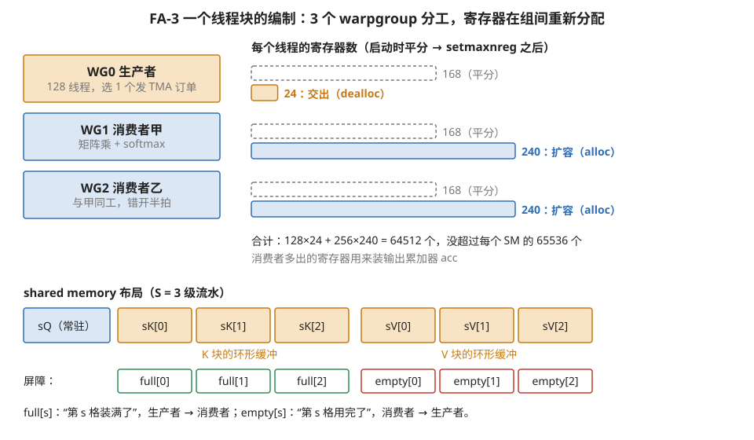
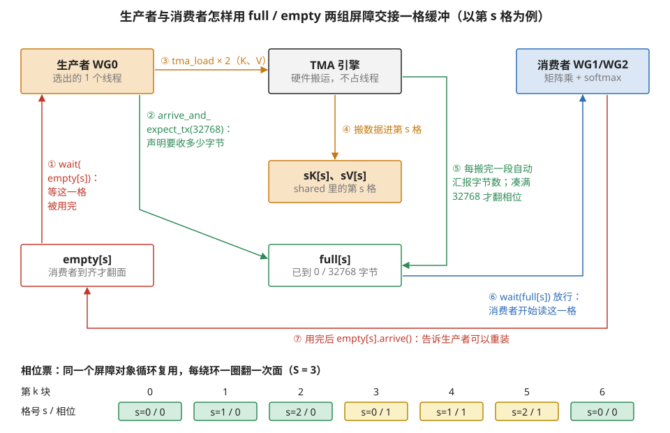
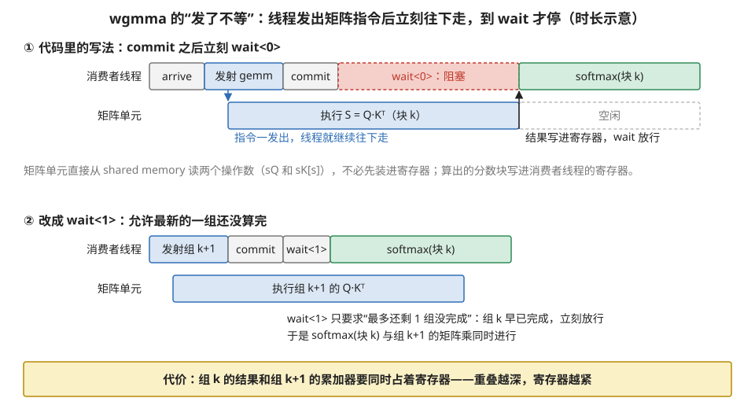
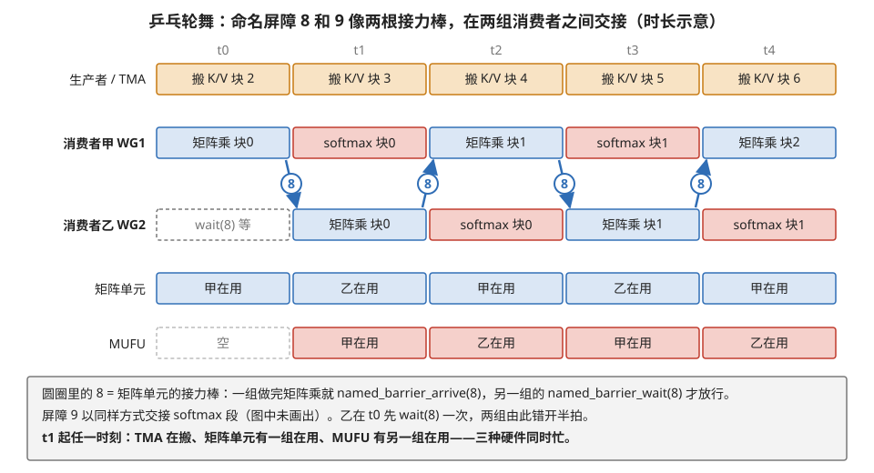

# B2 · 代码精读：FlashAttention-3 的 Hopper 流水线

> **所属系列**：模块 40 · 代码精读 B 系列（B1 Triton FA-2 → **B2** → B3 DeepSeek 栈）
> **状态**：🟨 学习中（第二版：按《写作规范》重写。代码为忠实于 CUTLASS 3.x / FA-3 结构的注释性伪代码——保留全部关键机制与真实指令名，省略模板噪音；真实实现见 flash-attention 仓库的 hopper 目录。知识截至 2026-01——**代码结构与机制不受时效影响；对应的最新代际信息见附录 A1 与模块 01 第 1 节 §6**）
> **本篇主旨**：B1 结尾留了一个瓶颈：softmax 走的特殊函数单元把矩阵单元拖到只有三成利用率。FA-3 在 Hopper 上把它治好了——手段是**把 Triton 用一个参数代管的东西全部显式摊开**：搬运引擎的订单（TMA）、可等字节数的屏障（mbarrier）、异步矩阵指令、寄存器的重新分配、两组计算线程的错拍轮舞。读完本篇你会明白两件事：**Triton 的 num_stages 背后到底是什么**；以及"同步是异步的账单"（模块 10 第 5 节）这句话在真实代码里长什么样——每一个异步器件旁边，必然站着它的等待原语。

---

## 0. 这一篇要回答的问题

- FA-3 的"人员编制"是什么样的？为什么要把线程分成搬运工和计算工？
- 生产者怎么用 TMA 加 mbarrier 发货？"期待字节数"和"相位"在代码里怎么用？
- 消费者怎么用异步矩阵指令边算边等？
- 两组消费者的"乒乓"轮舞怎么用屏障指挥？它治好了 B1 的哪个瓶颈？
- B1 的每个 Triton 写法，对应这里的哪段显式代码？

## 1. 基础词汇：先把 Hopper 的四样器件讲清楚

（都在模块 10 有完整机制，这里给读代码够用的版本。）

**warpgroup（线程组团）**。4 个 warp（128 线程）结成的调度单位。Hopper 的大块矩阵指令（wgmma）以它为操作主体——块大到单个 warp 的寄存器装不下，需要四个 warp 拼资源（模块 12 第 1 节）。

**mbarrier（可计数屏障）**。放在 shared memory 里的小计数器对象，三个动作：到达（计数）、等待（阻塞到条件满足）、**期待字节数**（先声明"这轮要收到 N 字节"，搬运引擎每交一段货自动汇报，凑满才放行）。它还自带**相位位**：每完成一轮自动在 0/1 之间翻面，等待者认"相位变了"而非"计数归零"——同一个屏障对象因此能在循环里无限复用（模块 10 第 5 节的心跳机制）。

**setmaxnreg（寄存器重分配）**。Hopper 允许一个线程块内的不同 warpgroup **动态调整各自的寄存器配额**：一组交出（dealloc），另一组扩容（alloc）。总量不变，内部转移。

**命名屏障（named barrier）**。带编号的屏障，每个线程块最多 16 个，各自指定参与线程数——比"全块等齐"的 `__syncthreads` 更细：可以只让两个 warpgroup 之间等齐，不惊动别人。

## 2. 全景：人员编制与同步器件清单

一个线程块 = 384 线程 = 3 个 warpgroup，各司其职：

```
WG0（生产者）：只发 TMA 搬运订单。用 setmaxnreg 交出寄存器（瘦身到约 24 个/线程）
WG1（消费者甲）：矩阵乘 + softmax。扩容到约 240 寄存器/线程（装输出累加器）
WG2（消费者乙）：与甲同工，错开半拍轮舞

shared memory 布局：
  sQ           —— Q 块（装一次，常驻）
  sK[0..S-1]   —— K 块的环形缓冲（S = 流水级数，如 3）
  sV[0..S-1]   —— V 块的环形缓冲
  full[0..S-1] —— mbarrier × S：「第 s 格装满了」（生产者→消费者的信号）
  empty[0..S-1]—— mbarrier × S：「第 s 格用完了」（消费者→生产者的信号）
```

先立一张**同步器件清单**——模块 10 第 5 节"每种异步配一把锁"在这份代码里的完整展览：

| 异步的事 | 配套的等待原语 |
| --- | --- |
| TMA 引擎搬数据（不占线程） | full 屏障 + 期待字节数 |
| 缓冲格的回收 | empty 屏障 |
| 矩阵指令异步执行（发了不等） | wgmma 的提交组/等待组指令 |
| 两组消费者错拍轮舞 | 命名屏障（编号 8 和 9） |

图 B2-1 把人员编制、寄存器配额和 shared memory 布局画在一起。



> **图 B2-1**　一句话：FA-3 的一个线程块由三组各 128 线程的 warpgroup 组成，一组只管发搬运命令、两组只管计算；寄存器从搬运组挪给计算组，shared memory 里是 Q、三格 K/V 环形缓冲和两组屏障。
>
> **先知道一件事**：寄存器是每个线程私有、最快的存储，一个 SM 一共只有 65536 个 32 位寄存器，由同时驻留的所有线程分。通常同一个线程块里每个线程分到一样多；Hopper 的 setmaxnreg 指令允许在运行中把一部分 warpgroup 的配额调低、另一部分调高，总数不变。
>
> **按这个顺序看**：
> 1. 左侧三个方框：WG0 是生产者，128 个线程里只选出 1 个去发 TMA（专职搬数据的硬件引擎）的搬运订单；WG1、WG2 是两个消费者，各自做矩阵乘和 softmax，彼此错开半拍。
> 2. 中间的横条：虚线框是启动时的平均配额，384 个线程平分 65536 个寄存器，每人约 168 个。实心条是 setmaxnreg 之后：生产者降到 24 个（它只发订单，几乎不存数据），两组消费者各升到 240 个。
> 3. 合计那一行：128×24 + 256×240 = 64512，仍在 65536 以内。消费者多出来的寄存器用来装输出累加器 acc。
> 4. 下方 shared memory：蓝色 sQ 是本线程块的 Q 块，装一次常驻；橙色 sK[0..2]、sV[0..2] 是 K、V 块的三格环形缓冲，第 k 块放在第 k mod 3 格。
> 5. 最下一排：每格缓冲配两个屏障。绿框 full[s] 表示"第 s 格装满了"，由生产者一侧点亮、消费者等待；红框 empty[s] 表示"第 s 格用完了"，由消费者点亮、生产者等待。
>
> **打个比方**：一个厨房三个人，一个专门跑腿去仓库取菜，两个专门掌勺。台面空间有限，跑腿的只需要一个小篮子，把大部分台面让给两位厨师摆锅碗；三格传菜架的每一格都挂着"满了"和"空了"两块牌子。
>
> **看懂的标志**：能回答"不做寄存器重分配会怎样"——每个消费者线程只有约 168 个寄存器，装不下大的累加器，只能缩小块尺寸，或让变量溢出到显存，性能都会明显下降。
>
> **与正文的对照**：168 是按 65536 ÷ 384 向下取到 8 的倍数得到的示意值；24、240 与 §3.2 代码一致。
>
> 来源：本库自绘。

## 3. 逐段精读

### 3.1 Host 侧：TMA 订单在启动前就编译好了

```cpp
auto tma_load_K = make_tma_copy(
    SM90_TMA_LOAD{},              // 拷贝原子：TMA 整块加载
    gK,                           // 显存里的 K 张量（含形状和步长）
    sK_layout,                    // shared memory 目标布局——内含 swizzle 说明！
    tile_shape_KV, ...);          // 每单搬运的块尺寸
```

**【映射】** 搬运的粒度（切分）和目的地布局（放置）在 **CPU 上就编译定型**，生成一张 128 字节的"订单模板"传给 kernel。
**【硬件】** `sK_layout` 里绑定的 swizzle（防 bank 冲突的换座位布局，模块 10 第 4 节）在这里显式指定——**B1 里编译器代管的那个 swizzle，就是这一行的手动版**。它必须同时满足三方：TMA 按它写入、矩阵指令按它读取——**写读两端布局不一致会静默算错**。
**【反事实】** swizzle 选错或 shared memory 基址没对齐 128 字节：订单创建失败或 bank 冲突复现；张量步长不满足 16 字节对齐：启动直接报错——TMA 的对齐要求是硬的。

### 3.2 开场：按 warpgroup 分工，重新分配寄存器配额

```cpp
int wg = threadIdx.x / 128;                     // 我是哪个 warpgroup
if (wg == 0) {                                  // —— 生产者 ——
    warpgroup_reg_dealloc<24>();                // 交出寄存器：我只发订单，用不着
    producer_loop(...);
} else {                                        // —— 消费者甲/乙 ——
    warpgroup_reg_alloc<240>();                 // 扩容：我要装大累加器
    consumer_loop(wg, ...);
}
```

**【映射】** 绑定决策的进化：B1 里所有线程同构（都又搬又算）；这里**按 warpgroup 划分工种**——一组专职搬运、两组专职计算。这是模块 40 第 4 节 §7.3 讲的"手排流水第三档"：不再改写一个循环，而是改组织结构。
**【硬件】** setmaxnreg 让寄存器堆在块内**转移**：生产者只发订单，24 个寄存器足够；省出的配额给消费者装输出累加器（B1 §3.4 算过的那 1.6 万个寄存器有了着落）。总量不变，穷帮富——不，是富济贫的反向：闲人把资源让给干重活的。
**【反事实】** 不做重分配：消费者装不下大累加器，只能缩小块尺寸（性能降）或溢出到显存（性能崩）；生产者白白抱着几千个用不上的寄存器。

### 3.3 生产者循环：发订单，向屏障声明"这次到货多少字节"

```cpp
void producer_loop(...) {
  if (elect_one_sync()) {                     // 128 个线程里选 1 个代表干活
    for (int k = 0; k < 块数; ++k) {
      int s = k % S;                          // 环形缓冲的格号
      empty[s].wait(phase_empty[s]);          // 等"第 s 格已被用完"才敢覆盖
      full[s].arrive_and_expect_tx(KV字节数);  // ★ 声明：这轮要等这么多字节到货
      tma_load(tma_load_K, sK[s], 第k块坐标);  // 发 K 的搬运订单（引擎自己去搬）
      tma_load(tma_load_V, sV[s], 第k块坐标);  // 发 V 的订单；完成时引擎向 full[s] 汇报字节
    }
  }
}
```

**【映射】** 顺序维度的搬运侧：永远超前消费者 S-1 块——就是模块 40 第 4 节 §7.2 那个三段式的"序幕+补发"，只是从"同一批线程自己交替"改成了"专人负责"。
**【硬件】** 三个器件同框亮相。**选代表**（elect_one_sync）：TMA 订单一个线程发就够，没必要 128 个都发。**期待字节数**（arrive_and_expect_tx）：这是模块 10 第 5 节说"同步对象从线程扩展到引擎"的那一行——生产者向屏障声明总量后就不管了，**TMA 引擎每搬完一段自动向屏障汇报字节**，凑满才翻相位放行消费者。**相位票**（phase_empty[s]）：环形缓冲每绕一圈，软件把本地相位翻一位——同一个屏障对象无限复用的钥匙。
**【反事实】** 期待字节数写小了：屏障提前翻面，消费者**读到搬了一半的数据**，静默算错；写大了：永远凑不满，死等。忘了先等 empty：覆盖消费者还在用的格子，同样静默算错。**这两类 bug 性能工具查不出来，只能靠竞争检测工具或对拍**——这就是 Triton 代管这一切的价值，也是显式流水的代价。

图 B2-2 把一格缓冲从"被腾空"到"被装满"再到"被用完"的七步交接画了出来，下方是相位票随循环翻转的规律。



> **图 B2-2**　一句话：一格缓冲在生产者和消费者之间来回交接，靠的是两个屏障：empty 说"这格可以重装了"，full 说"这格装满了"；而判断装满的是 TMA 引擎汇报的字节数，不是线程。
>
> **先知道一件事**：mbarrier 是放在 shared memory 里的一个小计数器。线程可以在它上面"到达"（计数加一）或"等待"（停在这里直到本轮完成）。它还能先登记"本轮要收 N 字节"，之后搬运引擎每搬完一段就自动往上加字节数，加满才算本轮完成。每完成一轮，它内部的相位位在 0 和 1 之间翻一次。
>
> **按这个顺序看**：
> 1. ①（左侧红线）：生产者先等 empty[s]，确认上一次放在第 s 格里的数据已被消费者用完，否则新数据会覆盖还在用的旧数据。
> 2. ②（绿线）：生产者在 full[s] 上登记"这一轮要收 32768 字节"，即一个 K 块加一个 V 块。登记完它就不管了。
> 3. ③④（橙线）：生产者向 TMA 引擎发两张订单（K、V 各一张），引擎自己把数据从显存搬进第 s 格，不占任何线程。
> 4. ⑤（右侧绿线）：引擎每搬完一段，自动把字节数报给 full[s]。凑满 32768 字节时，full[s] 完成本轮、翻转相位。
> 5. ⑥（蓝线）：一直等在 full[s] 上的消费者此时被放行，开始用这一格做矩阵乘。
> 6. ⑦（底部红线）：消费者用完后在 empty[s] 上到达，下一圈生产者的第①步就能通过。
> 7. 下方一排是相位票：第 k 块用第 k mod 3 格。k = 0、1、2 时相位是 0；k = 3 时又回到第 0 格，这是它第二次被用，相位变成 1；k = 6 再翻回 0。等待方手里拿着"我要等的相位"，据此区分"这一圈装满了"和"上一圈装满过"。
>
> **打个比方**：三格传菜架，每格挂两块牌子。跑腿的看到"空了"才往里放菜，并在"满了"牌子上写"应到 2 盘"；送菜的机器人每放一盘就在牌子上记一笔，记满 2 盘牌子自动翻过来；厨师看到牌子翻面才去拿。牌子正反两面轮流用，厨师记得自己这圈该看到哪一面。
>
> **看懂的标志**：能回答"第②步登记的字节数写成 16384 会怎样"——只搬到一半（K 块到了、V 块还没到）屏障就完成了，消费者读到不完整的 V 块，结果静默算错，而且不报任何错误。
>
> **与正文的对照**：32768 字节按 BLOCK_N = 64、头维 128、16 位数据计算（K、V 块各 16 KB），是示意取值；正文代码里写作"KV字节数"。
>
> 来源：本库自绘。

### 3.4 消费者循环：异步矩阵指令的"发了不等"

```cpp
void consumer_loop(int wg, ...) {
  for (int k = 0; k < 块数; ++k) {
    int s = k % S;
    full[s].wait(phase_full[s]);            // 等第 s 格的 K/V 字节到齐
    // —— 第一个矩阵乘：S 块 = Q·Kᵀ ——
    warpgroup_arrive();                     // 栅栏：保护即将被读的寄存器操作数
    gemm(mma0, sQ, sK[s], 分数块寄存器);      // wgmma：异步矩阵指令，发了不等
    warpgroup_commit_batch();               // 把上面几条打包成一组
    warpgroup_wait<0>();                    // 等这组出结果（0 = 不允许悬空）
    在线softmax与重缩放(分数块, m, l, acc);   // B1 §3.6 的那几行，此处在寄存器上做
    // —— 第二个矩阵乘：acc += P·V ——
    转精度并重排(分数块 → P块_16位);
    warpgroup_arrive();
    gemm(mma1, P块, sV[s], acc);
    warpgroup_commit_batch();  warpgroup_wait<0>();
    empty[s].arrive();                      // 报告"这格用完了"，生产者可以重装
  }
  收尾(acc, l);                              // 归一化 + 写回
}
```

**【映射】** 与 B1 的主循环逐行对应——**数学一个字没变**（同一套在线 softmax），变的全是"等谁、谁算、何时放行"。
**【硬件】** wgmma 的**异步四件套**：栅栏（arrive，防止矩阵指令还在读的寄存器被后面的代码改写）→ 发射若干条异步矩阵指令 → 打包成组（commit）→ 按组等待（wait）。注意 wgmma 的 **B 操作数直接从 shared memory 读**（sK/sV 没有先装进寄存器）——这是 Hopper 矩阵指令的新能力（模块 12 第 1 节演化表），对比 B1 里 Triton 版 K/V 还要过一道寄存器。
**【反事实】** 漏写栅栏：异步矩阵指令还在读寄存器时，softmax 已经改写了它——静默错。`wait<0>` 改成 `wait<1>`（允许一组悬空）：更深的重叠、更高性能，但寄存器要同时养两组操作数——**又是"重叠深度换寄存器"的老账**（模块 40 第 4 节 §7.4）。

图 B2-3 把"发了不等"在时间轴上画了出来，并对比 `wait<0>` 与 `wait<1>`。



> **图 B2-3**　一句话：wgmma 指令发出后线程不等它算完就继续往下执行，真正停下来等结果的是 `warpgroup_wait`；等得越宽松，矩阵乘和后续工作重叠得越多，但要占用更多寄存器。
>
> **先知道一件事**：普通指令的结果一般几拍后就能用；wgmma 是一大块矩阵乘，要几百拍。Hopper 让它异步执行：线程发出指令后，矩阵单元在后台算，线程可以去干别的，直到代码里明确写"等"。`commit` 把刚发出的几条打成一组，`wait<N>` 的意思是"等到还没完成的组不超过 N 个"。
>
> **按这个顺序看**：
> 1. 上幅第一行是消费者线程，第二行是矩阵单元。线程先执行 `arrive`（一道栅栏，保证之前对寄存器的改写已经完成，矩阵单元读到的是新值），再发射 gemm。蓝色小箭头表示：指令一发出，矩阵单元开始算，线程继续往下。
> 2. 线程接着 `commit`，然后 `wait<0>`，要求所有组都完成，于是在红色虚线框里停住。矩阵单元这时正在算 S = Q·Kᵀ，它的两个操作数 sQ、sK[s] 都直接从 shared memory 读。
> 3. 矩阵乘完成，结果写进线程的寄存器，`wait` 放行，线程开始 softmax。此时矩阵单元无事可做（灰色虚线框）。这正是正文代码的写法；这段空闲要靠另一个消费者组来填（见图 B2-4）。
> 4. 下幅换成 `wait<1>`：线程发射下一组（块 k+1）并 commit 后，只要求"未完成的不超过 1 组"。块 k 那组早已算完，所以立刻通过，线程去做块 k 的 softmax，矩阵单元同时在算块 k+1。
> 5. 底部黄框：代价是块 k 的结果和块 k+1 的结果要同时占着寄存器。
>
> **打个比方**：把衣服丢进洗衣机后不必站在旁边等，可以去做饭；`wait<0>` 相当于做完手头的事后一定要等这一桶洗完，`wait<1>` 相当于允许一桶还在洗，先去晾上一桶，但就得多备一个洗衣篮。
>
> **看懂的标志**：能回答"漏写 `warpgroup_arrive` 会怎样"——矩阵单元可能读到还没写完的寄存器操作数，或者后面的代码改写了矩阵单元还在读的寄存器，结果静默出错。
>
> **与正文的对照**：各段长度是示意，不代表真实拍数。正文代码两处都用 `wait<0>`；`wait<1>` 是 §3.4【反事实】里讨论的写法，FA-3 实际在哪一段使用它见本篇 §7 的待深挖。
>
> 来源：本库自绘。

### 3.5 乒乓轮舞：两个消费者错拍，治好 B1 的遗留瓶颈

B1 验收时留的病根：softmax 走特殊函数单元（吞吐低），它和矩阵乘在关键路径上**串行**——矩阵单元每算完一块就得干等 softmax。FA-3 的解法：**两组消费者错开半拍，用两个命名屏障强制"你算矩阵时我做 softmax，你做 softmax 时我算矩阵"**：

```cpp
// 屏障 8 = "矩阵单元使用权"的交接棒；屏障 9 = "特殊函数单元"的交接棒
if (wg == 2) named_barrier_wait(8);   // 乙先让甲起跑——错出半拍的初始相位差
...每轮：
named_barrier_wait(8);                // 拿到矩阵单元使用权
gemm(...); commit; wait;
named_barrier_arrive(8);              // 交棒：对方的矩阵乘可以开始了
softmax与重缩放(...);                  // 我做 softmax 时，对方正在做矩阵乘
named_barrier_arrive(9); named_barrier_wait(9);   // softmax 段同理交接
```

时间线（甲乙两组、两种硬件单元）：

| 时间段 | t0 | t1 | t2 | t3 |
| --- | --- | --- | --- | --- |
| 消费者甲 | 矩阵乘(块0) | softmax(块0) | 矩阵乘(块1) | softmax(块1) |
| 消费者乙 | （等） | 矩阵乘(块0) | softmax(块0) | 矩阵乘(块1) |
| 矩阵单元 | 甲在用 | 乙在用 | 甲在用 | 乙在用 —— **从不空闲** |
| 特殊函数单元 | — | 甲在用 | 乙在用 | 甲在用 —— 与矩阵乘全程重叠 |

**【映射】** 绑定决策的最后一块拼图：两组线程共享的硬件管道（矩阵单元、特殊函数单元）被屏障排成**时分复用**。
**【硬件】** 命名屏障只同步两个消费者组（256 线程），生产者不受打扰——这正是它比全块屏障细的价值。加上底层还在跑的 TMA，此刻**三种引擎同时在忙**：搬运引擎搬第 k+2 块、一组消费者在矩阵单元算第 k+1 块、另一组在特殊函数单元处理第 k 块。
**【反事实】** 去掉这对屏障让两组自由跑：两组的矩阵乘段随机撞车抢同一个矩阵单元、softmax 段也撞——实测利用率明显下降。**"多加两次同步反而更快"**：这两个屏障买到的不是安全（去掉也不会算错），而是**错峰用资源的秩序**——模块 10 第 5 节"每个同步都要说得出买到了什么"的最佳注脚。FA-3 靠这套把 H100 上的矩阵单元利用率从 FA-2 的约三成拉到七成以上。

上面的表只列了"谁在用什么"，图 B2-4 补上了"谁把使用权交给谁"：屏障 8 在两组之间来回传递的每一次交接。



> **图 B2-4**　一句话：两个消费者组用屏障 8 传递"矩阵单元使用权"，一组做完矩阵乘就把使用权交给另一组，自己去做 softmax；于是矩阵单元和 MUFU 每一段时间都各有一组在用。
>
> **先知道一件事**：命名屏障是一种带编号、可以只让指定线程参与的同步点。`named_barrier_wait(8)` 让本组停在这里，直到另一组执行 `named_barrier_arrive(8)`。这里它不是用来保证数据正确的（去掉也不会算错），而是用来规定两组轮流使用矩阵单元的顺序。MUFU 是专算 exp 这类函数的慢单元，softmax 主要压在它上面。
>
> **按这个顺序看**：
> 1. 最上一道：生产者借 TMA 一直在搬后面的 K/V 块，t0 时已经在搬第 2 块，与消费者的计算同时进行。
> 2. 中间两道是两个消费者组。t0：甲做矩阵乘（块 0），乙执行一次 `wait(8)` 停住（灰色虚线框），这一次停顿让两组从此错开半拍。
> 3. 看圆圈里的 8 和箭头：t0 结束时甲的矩阵乘做完，`arrive(8)` 交出使用权（向下的箭头），乙的 `wait(8)` 放行，乙在 t1 做矩阵乘，甲同时去做 softmax。t1 结束时乙交回使用权（向上的箭头），甲在 t2 做块 1 的矩阵乘。如此往复。
> 4. 下面两道是硬件视角：矩阵单元每一格都写着"甲在用"或"乙在用"，从不空闲；MUFU 从 t1 起每一格也都有一组在用。加上最上面的 TMA，t1 以后三种硬件同时在忙。
> 5. 屏障 9 以同样方式交接 softmax 段的顺序，图中没有画出，以免箭头过密。
>
> **打个比方**：两位厨师共用一台大烤箱（矩阵单元）和一个调味台（MUFU），规定"烤箱钥匙"只有一把。一人烤完就把钥匙递给另一人，自己去调味台；于是烤箱和调味台都一直有人用，谁也不会同时挤到烤箱前。
>
> **看懂的标志**：能回答"为什么多加两次同步反而更快"——不加屏障时两组会随机地同时想用矩阵单元、又同时去做 softmax，两种硬件轮流空着；屏障强制它们错峰，买到的是秩序，不是正确性。
>
> **与正文的对照**：图与 §3.5 的时间线表一致，只多画了 TMA 一道和屏障 8 的交接箭头。每段等长是示意，实际矩阵乘段和 softmax 段的长度不同，节拍由较长的那段决定。
>
> 来源：本库自绘。

## 4. 总账：B1 ↔ B2 对照（Triton 一个参数 ↔ 显式一套机器）

| B1 里的写法 | B2 里的显式形态 | 机制出处 |
| --- | --- | --- |
| num_stages=3 | sK/sV 环形缓冲×3 + full/empty 屏障×3 + 相位票 | 模块 10 第 5 节、40 第 3 节 §5 |
| make_block_ptr（要走 TMA 时是张量描述符） | Host 侧 TMA 订单模板 + 显式 swizzle 布局 | 模块 10 第 4 节、模块 14 第 3 节 |
| tl.dot | wgmma 异步四件套，B 操作数直读 shared | 模块 12 第 1 节 |
| 线程同构 | 三组分工 + 寄存器重分配 + 选代表 | 模块 40 第 4 节 §7.3 |
| （Triton 表达不了） | **乒乓命名屏障** —— SOTA 与"良好"的差距所在 | 模块 10 第 5 节 |

一句读后感：**Triton 用一个参数买到八十分的流水；最后二十分（乒乓、寄存器重分配、允许悬空的深等待）需要显式操纵同步原语——而每一个原语都在模块 10 第 5 节的全家桶清单里。硬件知识到这一层，不再是背景知识，是直接的操作对象。**

## 5. 验收

- **对照真码**：flash-attention 仓库 hopper 目录，搜 `pipeline`、`setmaxnreg`、`NamedBarrier` 等关键词，本篇每个机制都能对号入座。
- **机器码**：反汇编应见 TMA 加载指令（UTMALDG 字样）、warpgroup 矩阵指令（HGMMA）、屏障指令。
- **性能画像**：矩阵管道活跃度应达七成上下（对照 B1 的三成）；停顿分布应呈短而规律的屏障等待（流水线的节拍），若某项等待异常长——对应哪级缓冲饿了或堵了，回模块 40 第 4 节 §7.4 的三方预算查。

## 6. 术语卡

### 生产者-消费者分工（warp specialization）
**定义**：把线程块内的 warpgroup 按角色划分：一组专发搬运订单（生产者），其余专做计算（消费者），用屏障交接。手排流水的组织形态升级版。
**为什么存在**：交替式流水（一批线程又搬又算）里，两种活的资源需求互相牵制；分工后搬运方几乎不占寄存器、计算方满配寄存器，各自全速。
**语境例句**："这个 kernel 是 warp specialized 的，一组 DMA warp 带两组 MMA warpgroup。" —— 意思是：采用了分工组织——读代码先找"threadIdx 除以 128 的分支"，那里是全部角色分配。

### arrive_and_expect_tx（到达并声明字节数）
**定义**：mbarrier 的特殊到达动作：声明"本轮共需收到 N 字节"，搬运引擎每完成一段自动向屏障汇报，字节凑满屏障才翻相位放行等待者。
**为什么存在**：等待的对象是硬件引擎而非线程——引擎不会执行"到达"指令，只会汇报搬运量；以字节计数是让"线程等引擎"成立的桥。
**语境例句**："expect-tx 的字节数和实际 TMA 搬的对不上，卡死了。" —— 意思是：声明量大于实际到货，屏障永远凑不满——显式流水的第一类事故，检查每单搬运的字节数合计。

### 相位票（phase）
**定义**：mbarrier 自带的 0/1 交替标志：每完成一轮自动翻面；等待者持有本地相位副本，等"屏障相位 ≠ 我手里的票"。环形缓冲每绕一圈，软件把本地票翻一位。
**为什么存在**：让同一个屏障对象在循环中免重置复用——若靠计数归零判断完成，上一轮的完成和下一轮的进行会混淆（经典的复用竞争）；奇偶相位把两轮隔开。
**语境例句**："wait 传错了 phase，第二圈开始全乱了。" —— 意思是：本地相位没有随缓冲绕圈翻面，等待条件失效——环形流水的标配 bug，检查相位翻转是否与格号回绕同步。

### 命名屏障（named barrier）
**定义**：带编号（每块最多 16 个）、可指定参与线程数的屏障——比全块屏障更细粒度：只同步指定的组，不惊动其他线程。
**为什么存在**：分工之后，"两个消费者组之间的交接"不该拖上生产者；乒乓轮舞需要两根独立的交接棒（矩阵段一根、softmax 段一根），全块屏障给不了。
**语境例句**："这两组 warpgroup 用 barrier 8 和 9 做 ping-pong。" —— 意思是：两组计算线程被两个命名屏障强制错拍，让矩阵单元和特殊函数单元时分复用、双双不空——FA-3 性能的点睛之笔。

## 7. 我的困惑 / 待深挖

- `wait<1>` 级的深重叠在真实 FA-3 代码里用于哪段？寄存器代价实测？
- 因果掩码下两组消费者的负载天然不均（对角块轻、满块重），乒乓怎么保持节拍？
- 线程块簇 + TMA 多播在 FA-3 上省多少二级缓存流量？

---

*最后更新：2026-07-06（第二版：按含自检的写作规范重写；新增基础词汇节、乒乓时间线表、四张术语卡，全部注解改为完整句）（2026-09 补图 4 张：现成 0 张，自绘 4 张；图注按费曼法写）*
