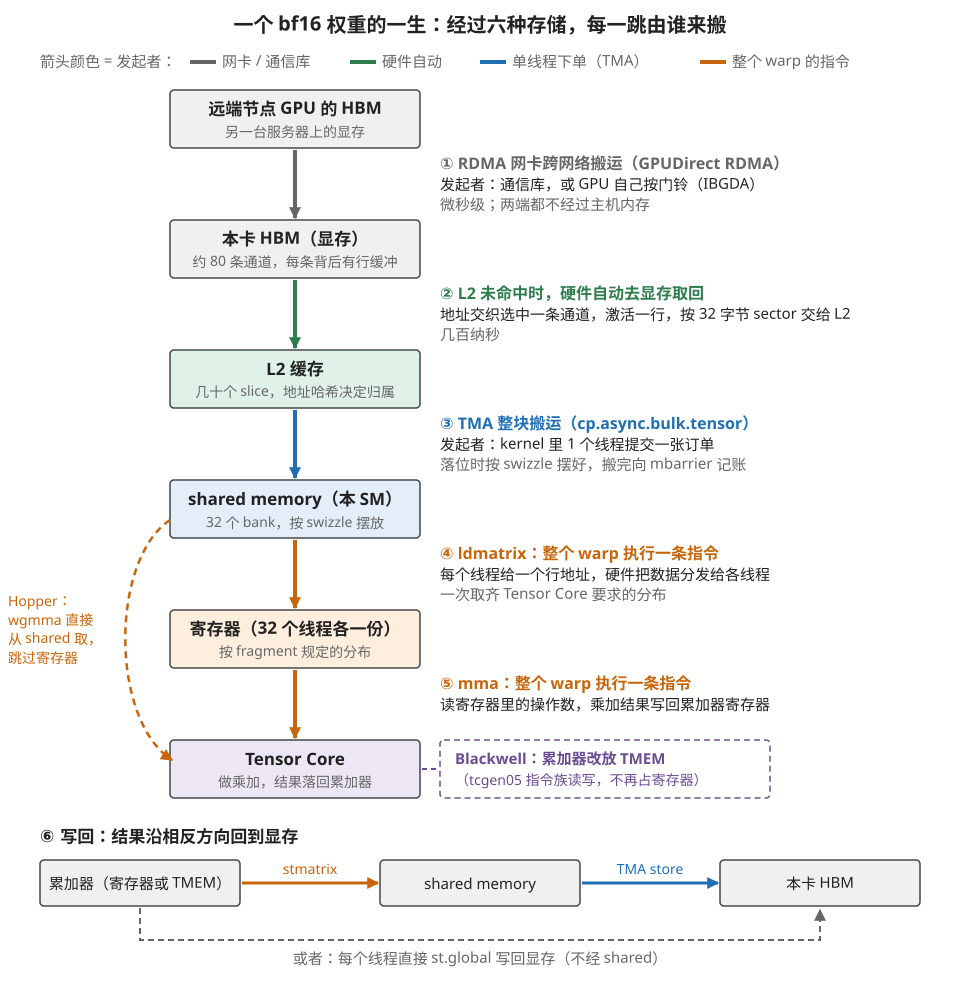
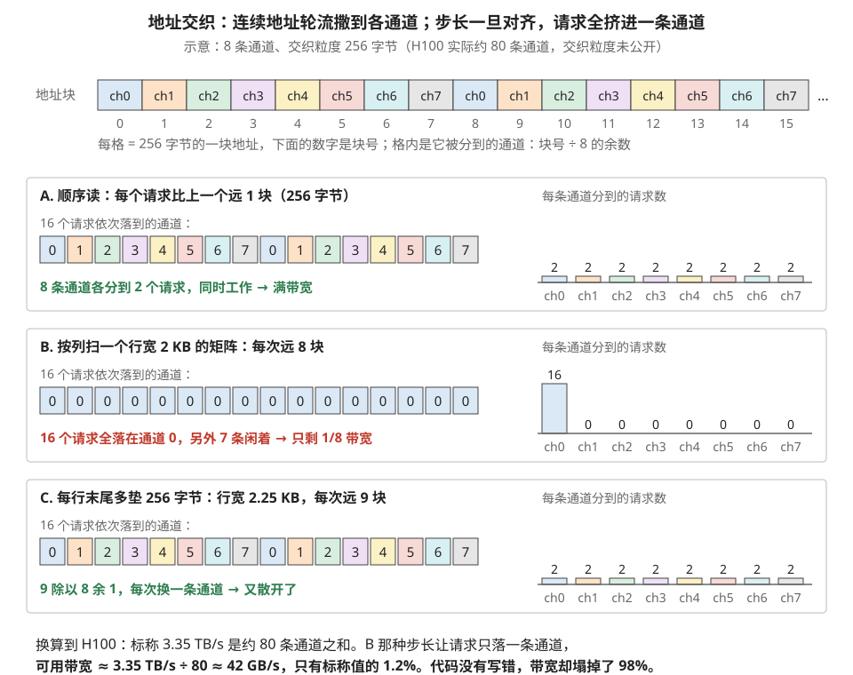
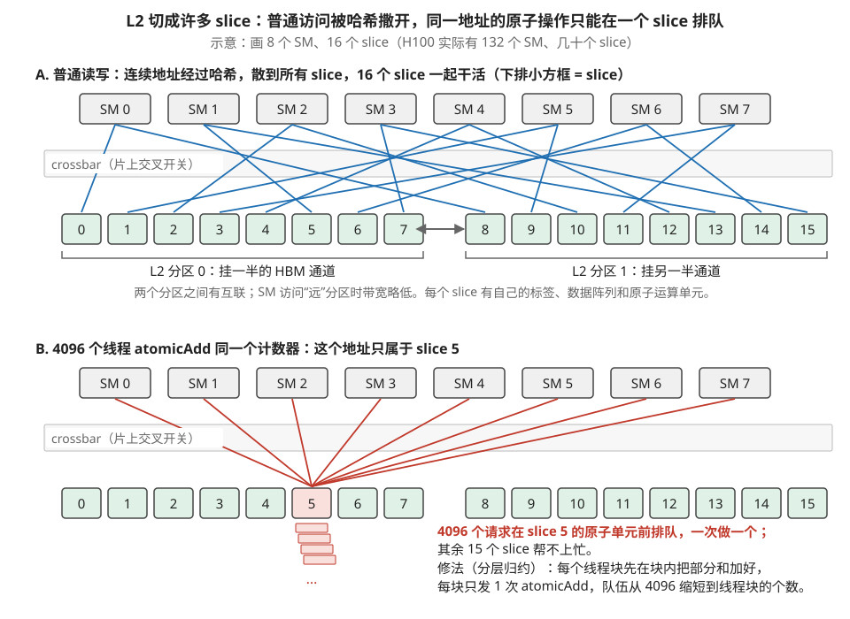
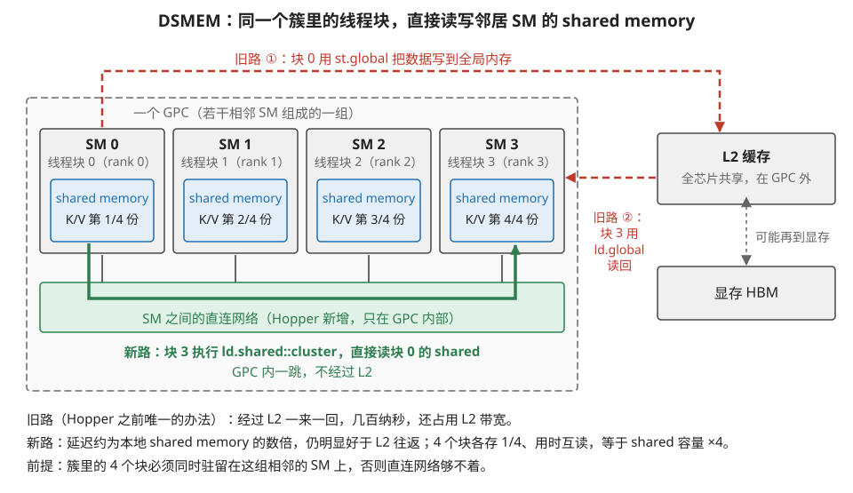
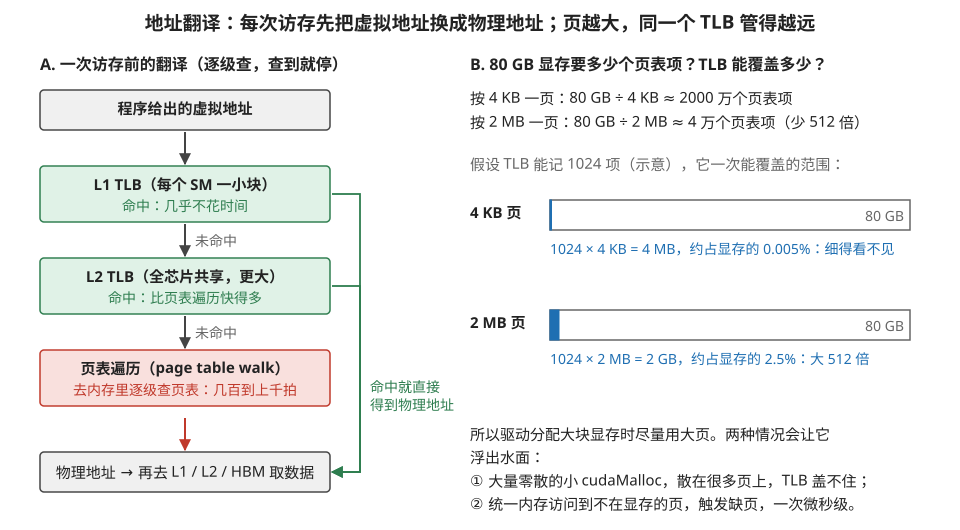
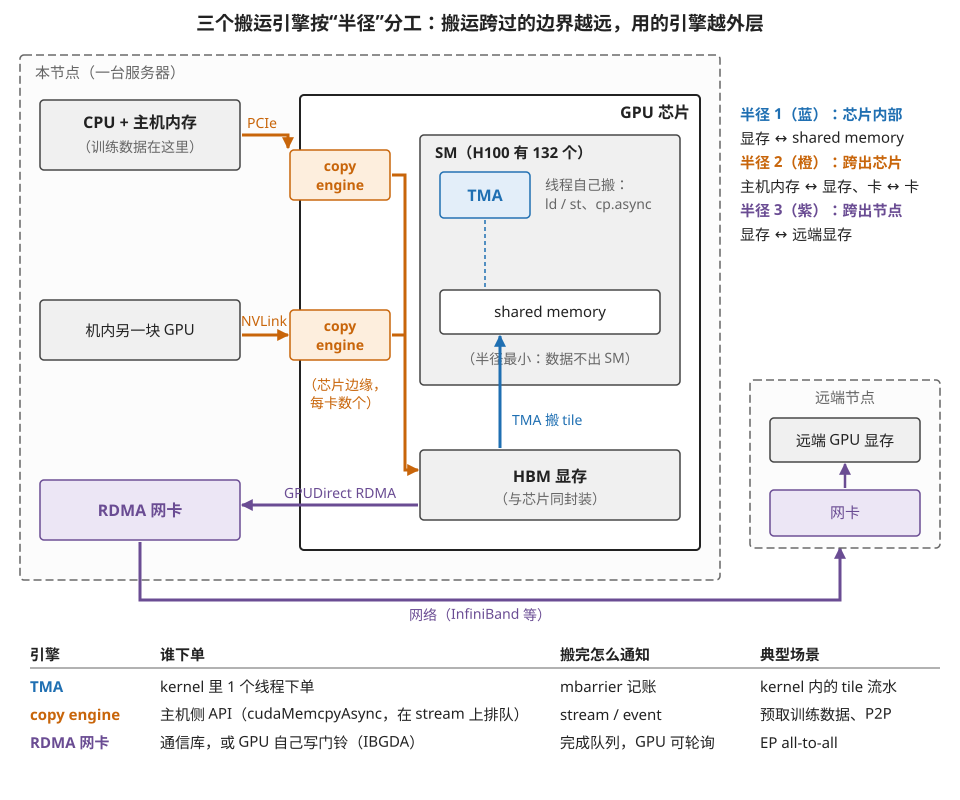

# 数据的一生：存储层级的物理切分与搬运指令全图

> **所属模块**：模块 50 · 数据视角（跟着数据走，而不是跟着部件走）
> **状态**：✅ 完成（第一版即按写作规范撰写。知识截至 2026-08。各级切分的具体数目 NVIDIA 未完全公开，标注"据公开资料/量级"处请以此理解）
> **本节主旨**：前面的模块按部件组织知识——SM 一章、脉动阵列一章；这一节换一根轴，**跟着一个数走完它的一生**：从跨节点的远端显存，到 HBM，到 L2，到 shared memory，到寄存器，到 Tensor Core，再一路写回去。三样东西贯穿全程：**每一级存储在物理上都是切开的**（HBM 切成通道、L2 切成 slice、shared memory 切成 bank、寄存器堆也切 bank）——切开是为了并行供数，而"32 个请求怎么散落在这些切片上"决定了实际带宽是标称值还是它的零头；**每一跳都有专属的搬运指令**，谁发起、什么粒度、走哪条线各不相同，本节收拢成一张矩阵表；**搬运引擎有三个，按"半径"分工**——SM 内的 TMA、芯片边缘的 copy engine、跨节点的 RDMA 网卡。配套的下一节讲"数据在每一级里该怎么摆"——先看清这一节的物理切分，才能理解摆法为什么不是自由发挥。

---

## 0. 这一节要回答的问题

- 一个 bf16 数从远端节点的显存到本卡 Tensor Core，完整要经过哪几站？每站谁在管？
- HBM 的"通道/行缓冲"、L2 的"slice"、shared memory 和寄存器堆的"bank"分别是什么？它们怎么决定实际带宽？
- shared memory 和 distributed shared memory（DSMEM）是一回事吗？后者到底新在哪里？
- 这些层级在代码里分别怎么拿到、怎么控制？开发者日常摸得到哪几级？
- 为什么同样的总数据量，换一种地址步长，显存带宽能塌到标称值的百分之几？
- 层级之间每一跳分别用什么指令搬？谁发起（每个线程 / 一个线程下单 / 引擎 / 主机）？
- TMA、copy engine、RDMA 网卡三个搬运引擎怎么分工？IBGDA 在这张图的哪里？

---

## 1. 基础词汇：先把本节要用的词讲清楚

**切分（partitioning/banking）**。任何一块存储，想让它每拍供出更多数据，物理上只有一条路：**切成多份独立供电供数的子块，让它们同时工作**。一块 SRAM 一拍出一个字；切成 32 个 bank 就能一拍出 32 个字——前提是 32 个请求正好散落在 32 个不同的子块上。本节会看到，从 HBM 到寄存器堆，**每一级都在用这一招**，也都继承了同一个软肋：请求挤在少数子块上时，并行度塌方，带宽跟着塌。

**通道（channel）**。HBM 的切分单位。一颗 HBM 堆叠对外不是一个整体接口，而是十几条各自独立收发的通道；整卡的标称带宽是**所有通道带宽之和**——这句话反过来读就是本节最重要的警告：只用到一部分通道，就只有一部分带宽。

**行缓冲（row buffer）**。DRAM 的物理特性：存储阵列按"行"组织（一行千字节量级），读任何一个字都要先把它所在的**整行**激活到行缓冲里，然后才能从行缓冲里取字。连续访问同一行的数据，激活一次、取很多次，很快；不停跨行跳，每跳都要"关旧行、开新行"（预充电 + 激活，几十纳秒），慢好几倍。**"顺序访问快、随机访问慢"在 DRAM 这一层的根源就是它**——不是玄学，是电容阵列的工作方式。

**slice**。L2 缓存的切分单位：整块 L2 被切成几十个独立的片，每片有自己的标签、数据阵列和原子运算单元，用一个片上交叉开关（crossbar）连接所有 SM。哪个地址归哪个 slice 由一个**地址哈希函数**决定（硬件内置，特意设计得让连续地址尽量散开）。

**发起者（initiator）**。数据视角下看搬运，最重要的属性不是快慢而是**谁下的单**：是 warp 里每个线程各发一条指令，还是一个线程提交一张订单，还是完全不劳驾 SM 的独立引擎，还是主机侧的驱动。发起者决定了这次搬运消耗谁的资源、能和什么重叠——本节的矩阵表专门有这一列。

---

## 2. 全景：一个 bf16 数的一生

先把整条路走一遍再逐站解剖。设想 MoE 推理里的一个权重值：它存在**另一个节点**的 GPU 显存里（专家并行，权重分布在多卡上），最终要进本卡的 Tensor Core 参与一次矩阵乘。它的旅程：

1. **远端 HBM → 本卡 HBM**：RDMA 网卡直接从远端显存读出、跨 InfiniBand 网络写进本卡显存（GPUDirect RDMA——不绕任何一边的主机内存）。发起者可以是主机侧的通信库，也可以是 GPU 自己按门铃（IBGDA，B3 讲过）。这一跳以微秒计。
2. **HBM → L2**：kernel 里某个 warp 发出加载，未命中 L1、未命中 L2，请求到达显存控制器；地址被交织函数散到某条通道，该通道激活对应的行，按 32 字节的 sector 把数据吐给 L2 的某个 slice。几百纳秒。
3. **L2 → shared memory**：这个数属于一个规整的权重 tile，所以走 TMA——一个线程早已提交订单，TMA 引擎批量把整个 tile 从 L2/HBM 搬进 shared memory，落位时按 swizzle 模式摆好（下一节的主题），搬完向 mbarrier 记账。
4. **shared memory → 寄存器**：消费者 warp 用 `ldmatrix` 指令按 Tensor Core 要求的 fragment 分布，一次把整个 warp 的份额从 shared memory 搬进 32 个线程各自的寄存器。
5. **寄存器 → Tensor Core → 寄存器**：`mma` 指令消费它，乘加结果落回累加器寄存器（Hopper 的 `wgmma` 可以跳过第 4 步直接从 shared memory 喂；Blackwell 的 `tcgen05` 连累加器都搬进了 TMEM）。
6. **结果写回**：累加器 → shared memory（`stmatrix`）→ 显存（TMA store），或者直接每线程 `st.global`。

图 1-1 把这六步画成了一条从上往下的路线，每一跳旁边标出了搬运它的指令或引擎、以及由谁发起。

> **图 1-1**　一句话：一个权重值从别的服务器的显存出发，要经过六种存储才能被 Tensor Core 用上，而每一跳由不同的指令或引擎来搬、由不同的角色下命令。
>
> **先知道一件事**：图里的"发起者"指的是"谁下命令让这次搬运发生"，不是"谁的电路在搬"。同样是搬数据，可以是网卡自己搬、可以是硬件在缓存没命中时自动去取、可以是 kernel 里一个线程向搬运引擎下一张订单，也可以是一个 warp（32 个线程组成的执行单位）的全部线程一起执行一条指令。箭头的颜色就代表这四种发起者，图顶的图例给出了对应关系。
>
> **按这个顺序看**：
> 1. 从最上面的方框看起：数据最初在另一台服务器的 GPU 显存（HBM，一种堆叠在 GPU 旁边的高带宽内存）里。灰色箭头 ① 是 RDMA 网卡（能直接读写远端内存的网卡）把它搬到本卡显存，中间不经过任何一边的 CPU 内存，耗时以微秒计。
> 2. 绿色箭头 ② 是"硬件自动"：kernel 要用这个数时，L2 缓存里没有，硬件自己去显存取。显存控制器按地址选中一条通道、打开存着它的那一行，按 32 字节一段（叫 sector）交给 L2。几百纳秒。
> 3. 蓝色箭头 ③ 是 TMA（Hopper 起每个 SM 里的搬运引擎）：kernel 里只有一个线程提交一张"把这个 tile 搬进来"的订单，引擎把整块数据搬进 shared memory（SM 内由程序员管理的一块片上存储），并按 swizzle 规则（一种错开存放的摆法，下一节细讲）摆好。
> 4. 两个橙色箭头 ④⑤ 都是整个 warp 执行一条指令：`ldmatrix` 把 shared memory 里的数据按 Tensor Core 要求的分布分发到 32 个线程的寄存器里；`mma` 让 Tensor Core 读这些寄存器做乘加。
> 5. 左边的橙色虚线是 Hopper 的捷径：`wgmma` 指令可以让 Tensor Core 直接从 shared memory 取数，跳过第 ④ 步。右边的紫色虚线框是 Blackwell 的变化：乘加结果（累加器）不再放在寄存器里，而是放进专用的 TMEM。
> 6. 最后看底部的 ⑥：结果沿相反方向回到显存，要么经 `stmatrix` 写回 shared memory 再由 TMA 整块写出，要么每个线程直接 `st.global` 写回。
>
> **打个比方**：像一件快递从外省仓库到你手上：跨省干线（网卡）、本市分拣中心自动调货（缓存未命中取回）、一个人下单叫整车配送（TMA）、最后一段所有人排好队一起传递（warp 指令）。每一段的承运方和下单方都不同。
>
> **看懂的标志**：能回答"从 L2 到 shared memory 这一跳，SM 里的 128 个线程有多少个在忙着发搬运指令"——只有 1 个。它向 TMA 下了一张订单，其余线程不需要为搬运发任何指令。
>
> **与正文的对照**：图中 ①～⑥ 对应正文列表的六步。正文第 2 步说"某个 warp 发出加载"，本图把 ② 画成由 ③ 那次 TMA 请求在 L2 未命中时触发，两种情况都走同一条"未命中 → 显存控制器 → L2"的路径。
>
> 来源：本库自绘。

数一下：**一个数最多要过六种存储介质、被四种不同的发起者经手**。这条链上每一跳的细节，就是接下来两部分的内容：第 3 部分讲每一站的物理切分（决定这一站快不快），第 4、5 部分讲每一跳的指令和引擎（决定这一跳怎么发起）。

## 3. 逐级解剖：每一级的物理切分，和它带来的传输特性

### 3.1 HBM：通道 × 行缓冲，两层并行两个坑

HBM 的物理组织是三层：整卡几颗**堆叠**（H100 用 5 颗 HBM3），每颗堆叠十几条独立**通道**（H100 合计约 80 条 64 位通道，据公开规格），每条通道背后若干 **bank**，每个 bank 一次激活一整**行**（千字节量级）到行缓冲。这个组织带来两条并行度，也就有两个对应的坑：

**坑一：通道拥挤（partition camping）**。标称 3.35 TB/s 是 80 条通道之和，硬件用地址交织把连续地址按几百字节的粒度轮流撒到各通道（具体粒度未公开）。**算一笔塌方账**：如果访问步长恰好是"交织粒度 × 通道数"的整数倍——比如按列扫一个行宽正好对齐的大矩阵——所有请求会**永远落在同一条通道**上：可用带宽 = 3.35 TB/s ÷ 80 ≈ **42 GB/s，标称值的 1.2%**。代码一个字没错，带宽塌掉 98%。这就是"大二维数组的行宽最好别取 2 的大幂"这条老经验的物理根源（加一点 padding 打乱对齐即可），也是为什么 profiler 里 DRAM 利用率上不去时要检查**地址步长**而不只是访问总量。图 1-2 用一个缩小的例子把塌方和修法都画了出来。

> **图 1-2**　一句话：显存把连续地址一块一块轮流分给各条通道，顺序访问时所有通道一起工作；但如果每次访问的间隔恰好是"通道数 × 块大小"，所有请求都会落进同一条通道，带宽只剩一条通道那么多。
>
> **先知道一件事**：通道是显存里能各自独立收发数据的一条路。整卡的带宽是所有通道带宽加起来，所以只有请求均匀分到每条通道上，才能拿到标称带宽。哪个地址归哪条通道，由硬件按一个固定规则决定，程序员不能指定。
>
> **按这个顺序看**：
> 1. 先看最上面的一排格子：每格代表 256 字节的一段地址，下面的数字是块号，格内的 ch0～ch7 是它被分到的通道。规则很简单：块号除以 8 的余数就是通道号。这就是"地址交织"。图中的 8 条通道、256 字节都是为了画得下而缩小的示意值。
> 2. 看 A 框：程序按顺序读 16 块，每次比上次远 1 块。左边 16 个小方块是这 16 个请求各自落到的通道，0～7 轮了两遍；右边的柱子是每条通道分到的请求数，8 条都是 2。8 条通道同时工作，拿到满带宽。
> 3. 看 B 框：程序按列扫一个每行 2 KB 的矩阵。同一列上下相邻的两个元素相隔一整行，也就是 2 KB = 8 块。块号每次加 8，除以 8 的余数永远是 0，于是 16 个请求全落在通道 0，右边只有一根柱子。其余 7 条通道闲着，带宽只剩 1/8。
> 4. 看 C 框：只在每行末尾多垫 256 字节不用，行宽变成 2.25 KB = 9 块。块号每次加 9，除以 8 余 1，每次都换一条通道，又均匀散开了。
> 5. 最后看底部：H100 实际约有 80 条通道。B 那种情况下带宽只剩 3.35 TB/s ÷ 80 ≈ 42 GB/s，是标称值的 1.2%。
>
> **打个比方**：超市有 8 个收银台，顾客按号码尾数分台。如果来的人号码恰好都是 8 的倍数，就全挤在 0 号台排队，其余 7 个台空着。给每个人的号码加 1 错开一下，队伍就散开了。
>
> **看懂的标志**：能回答"为什么大二维数组的行宽最好不要取 2 的大幂"——行宽是 2 的大幂时，按列访问的步长很容易恰好是"通道数 × 交织粒度"的整数倍，所有请求挤进同一条通道。加一点 padding 让步长不再对齐，就能散开。
>
> **与正文的对照**：正文的"坑一：通道拥挤（partition camping）"就是 B 框的情形。H100 的真实交织函数未公开，通常也不是简单的取余，但"步长与交织周期对齐就会挤在一起"这个结论不变。
>
> 来源：本库自绘。

**坑二：跨行乱跳**。同一 bank 内，顺序读已激活的行是流水化的快路径；每跳一个新行就付一次"预充电 + 激活"（几十纳秒）。**对照实验的量级**：全顺序扫描能吃到接近标称带宽；完全随机的 32 字节访问（每次都开新行）实际带宽常常只有标称的十分之一以下——同样的字节数，快慢差一个数量级。第 4 节讲的访存合并解决的是"32 个线程这一拍的地址凑不凑得成整段"，这里是更下面一层：**凑成的段与段之间，落在 DRAM 的哪一行哪一通道**。

### 3.2 L2：slice × 哈希，共享层的两张面孔

L2（H100 约 50 MB）切成几十个 slice，地址哈希决定归属，crossbar 连接所有 SM。物理上它还分成**两个分区**（各挂一半通道，两分区间有互联，SM 访问"远分区"带宽略低，据公开资料）。切分带来的特性有三条：

**特性一：散开就快**。正常的连续访问被哈希撒到所有 slice，全带宽服务——这正是哈希函数存在的目的，多数时候你感知不到 slice。

**特性二：单地址热点必然串行**。每个 slice 有自己的原子单元，**一个地址只属于一个 slice**。4096 个线程 `atomicAdd` 同一个计数器：不管芯片有多少 slice，这 4096 个请求全部排进同一个 slice 的同一个队列，一个一个做。第 5 节（10 模块）讲原子操作时说"单点原子会串行"，物理位置就在这——**分层归约（先块内合并再全局原子）本质是在把打向一个 slice 的流量摊薄成一次**。图 1-3 把特性一和特性二放在一起对比。

> **图 1-3**　一句话：L2 缓存由许多个能各自独立工作的小片（slice）组成，普通访问会被分散到所有小片上并行处理；但对同一个地址的原子加法只能交给一个小片，只能排队一个一个做。
>
> **先知道一件事**：每个地址只归一个 slice 管，归哪个由硬件里固定的哈希函数（把地址打散成编号的计算）决定。原子操作（比如 `atomicAdd`：读出、加上、写回，中间不许别人插进来）是在这个 slice 自己的运算单元上做的。
>
> **按这个顺序看**：
> 1. 先看 A 部分的结构：上排是 SM（GPU 里执行线程的计算单元），下排编号 0～15 的小方框是 L2 的 slice，中间的灰色横条是 crossbar（交叉开关，让任何一个 SM 都能连到任何一个 slice）。
> 2. 看 A 的蓝线：各个 SM 读写的是不同的地址，经哈希后分散到全部 16 个 slice，每个 slice 都分到一些活，大家同时工作。这就是正文说的"散开就快"，平时你感觉不到 slice 的存在。
> 3. 看 A 下方的括号：slice 分成两个分区，每个分区挂着一半的显存通道，中间的双向箭头是分区间的互联。SM 访问"远"的那个分区，带宽略低。
> 4. 看 B 部分的红线：4096 个线程都在对同一个计数器做 `atomicAdd`。这个地址只属于 slice 5，于是所有请求都汇到 slice 5，下面叠着的小条代表排队的请求。其余 15 个 slice 帮不上忙。
> 5. 看 B 右边的修法：每个线程块先在自己的 shared memory 里把部分和加好，每块只发 1 次 `atomicAdd`，排队长度从 4096 降到线程块的个数。
>
> **打个比方**：银行有 16 个窗口，平时顾客按账号分到各个窗口，16 个窗口一起办业务。但如果 4096 个人都要往同一个账户存钱，而这个账户只能在一个窗口办理，就只能排成一条长队。先让每个单位把钱收齐，派一个人去存，队伍就短了。
>
> **看懂的标志**：能回答"芯片上 slice 数量翻倍，能不能让单个计数器的原子加法变快"——不能。同一个地址永远只归一个 slice，slice 再多也分担不了它的队伍。
>
> **与正文的对照**：图中 8 个 SM、16 个 slice 是为了画得下的示意数量；H100 有 132 个 SM、几十个 slice（具体数目与哈希函数未公开）。
>
> 来源：本库自绘。

**特性三：它是"驻留"可以做文章的一层**。L2 够大、又是全芯片共享，CUDA 提供驻留控制（persisting 窗口）：把反复使用的热数据（比如 decode 阶段的小权重）标成高优先级驻留，等于手动干预缓存替换。这是层级链上唯一一级"既硬件自动管理、又留了旋钮"的存储。

### 3.3 shared memory：32 个 bank（已在 10-04 详解，这里放进全图）

shared memory 切成 32 个 bank、每 bank 每拍 4 字节，warp 的 32 个请求落满 32 个不同 bank 才能一拍完成，撞车就串行——机制、三种冲突例子和 padding/swizzle 两种修法在 10 模块第 4 节已完整讲过，此处只补一条它在**全图里的独特地位**：它是整条层级链上**唯一由程序员显式管理摆放**的一级（寄存器归编译器、缓存归硬件），所以下一节"摆数的学问"里一半的篇幅属于它。另一个物理细节：shared memory 和 L1 其实是**同一块 SRAM**，两者的容量配比可以按 kernel 配置（carveout）——shared 要得多，L1 就剩得少，这是占用率三方预算之外又一笔看得见的资源账。

### 3.4 DSMEM：邻居的 shared memory 成为半级新存储（Hopper）

先说清一个容易误会的点：**DSMEM（Distributed Shared Memory，分布式共享内存）不是一种新的存储器**——物理上它就是别的 SM 里那块普通的 shared memory。新的是**访问通路**：Hopper 在每个 GPC（若干 SM 组成的分组）内部修了一张 SM 之间的直连网络，同一个线程块簇（cluster）里的块可以把彼此的 shared memory 当作可寻址的目标直接读写（`ld/st.shared::cluster`），**不绕 L2、不占 L2 带宽**。Hopper 之前，两个线程块交换数据只有一条路：写到全局内存、过 L2 甚至显存、再读回来——几百纳秒一个来回；DSMEM 把这条路缩短成 GPC 内的一跳。图 1-4 把新旧两条路画在了一起。

> **图 1-4**　一句话：Hopper 在相邻的几个 SM 之间修了一张直连网络，同一个簇里的线程块可以直接读邻居的 shared memory，不必再把数据写到 L2 绕一圈。
>
> **先知道一件事**：shared memory 是每个 SM 内部的一块高速存储，原本只有在这个 SM 上运行的那个线程块能访问，别的线程块看不见。线程块簇（cluster）是 Hopper 新增的一级分组：几个线程块被绑在一起，保证同时运行在同一个 GPC（若干个相邻 SM 组成的一组）里。
>
> **按这个顺序看**：
> 1. 先看左边的虚线大框：它是一个 GPC，里面画了 4 个 SM，各运行簇里的一个线程块，编号 rank 0～3（rank 是线程块在簇内的序号，访问邻居时要用它指明找谁）。每个 SM 里的蓝框是它的 shared memory，这里约定每块各存 K/V 数据的四分之一。
> 2. 看红色虚线：这是 Hopper 之前的旧路。块 0 先用 `st.global` 把数据写到全局内存（①），数据进了 GPC 外面的 L2，甚至落到显存；块 3 再用 `ld.global` 读回来（②）。一来一回几百纳秒，还占用 L2 带宽。
> 3. 看绿色实线：这是 DSMEM 的新路。块 3 执行 `ld.shared::cluster`，请求经过 SM 之间的直连网络（绿色横条），直接从块 0 的 shared memory 取到数据，只在 GPC 内部走一跳。
> 4. 看底部三行：新路的延迟大约是读本地 shared memory 的数倍，但仍明显快于经 L2 往返；4 个块各存四分之一、需要时互读，相当于 shared memory 的容量扩大到 4 倍；代价是整个簇必须同时驻留在这组相邻的 SM 上。
>
> **打个比方**：四个相邻办公室的同事交换资料，以前必须先送到楼下的收发室（L2），对方再去收发室取；现在四间办公室之间开了内门，直接过去拿就行。但前提是四个人被安排在相邻的四间办公室里。
>
> **看懂的标志**：能回答"DSMEM 是一种新的存储器吗"——不是。它读写的仍是邻居 SM 里那块普通的 shared memory，新增的只是 SM 之间的访问通路。
>
> **与正文的对照**：图中 GPC 内画 4 个 SM、簇大小为 4 都是示意；"本地约 30 周期、DSMEM 为数倍"引自正文的公开微基准量级。
>
> 来源：本库自绘。

从数据视角看，它给层级链**插进了半级**：延迟和带宽介于本地 shared 和 L2 之间（本地 shared 约 30 周期，DSMEM 为它的数倍，仍明显好于 L2 往返，据公开微基准量级）。叫它"半级"是因为它不带来新容量——**它带来的是拼接**：簇内 4 个块可以约定"K/V 数据各存四分之一、用时互读"，等效 shared 容量 ×4，代价是四分之三的访问变成跨 SM 的一跳。这也解释了第 7 节（10 模块）讲过的调度约束的来历：**簇内的块必须同时驻留在同一组相邻 SM 上**——不然这张直连网络够不着。

**和本地 shared memory 的异同一句话总结**：同一块物理 SRAM、同一套 bank 规则，但三点不同——地址空间不同（要带上"第几号邻居"的 rank）、延迟不同（数倍）、生命周期约束不同（依赖整簇同时驻留）。所以代码里不能把二者当同一种东西混用：热数据放本地，簇内共享的放"拼接层"。

### 3.5 寄存器堆：最快的一级也切 bank

每 SM 256 KB 的寄存器堆同样切成若干 bank（现代架构约 4 个，据逆向研究）。一条 `FFMA R0, R1, R2, R3` 要同拍读三个源操作数：如果 R1、R2、R3 恰好有两个落在同一 bank，就得分两拍取——这就是第 7 节（10 模块）讲操作数收集器时提过的**寄存器 bank 冲突**。软件几乎管不到寄存器编号（编译器的事），但编译器留了一个可见的补救：SASS 控制位里的 **reuse 标志**（第 2 节讲过），把上一拍用过的操作数留在收集器的小缓存里，下一条指令直接复用、不再读 bank。**在数据视角下值得记住的是：连"零延迟"的寄存器堆都在玩"切分 + 防撞车"这套游戏**——层级链上没有一级例外。

### 3.6 TMEM：为矩阵累加器单开的一级（Blackwell）

Blackwell 给每个 SM 加了一块 **TMEM**（Tensor Memory，256 KB 量级，据公开资料）：专门存放 Tensor Core 的累加器，由 `tcgen05` 指令族直接读写。它的存在理由用本节的语言说就是：矩阵累加器是"被 Tensor Core 高频读写、被普通指令低频访问"的特殊数据，把它从寄存器堆里搬出来单独建一级，**寄存器堆的容量和端口就还给了普通指令**——10 模块附录 A1 例 2 那种"64 个累加器吃掉寄存器预算压低占用率"的困境，从存储层级的设计上被拆掉了。

### 3.7 还有一层没画出来：地址翻译

前面六个小节讲的都是"数据存在哪个物理位置"。**但你的程序拿到的从来不是物理地址，而是虚拟地址**——中间隔着一层翻译，而这一层本身也有性能。它在架构图上通常不画，但它会以"莫名其妙的延迟"形式出现在 profiler 里，值得单列出来。

**GPU 也有 MMU 和 TLB。** 和 CPU 一样，GPU 有一套内存管理单元把虚拟地址翻译成物理地址，翻译结果缓存在 **TLB（translation lookaside buffer，地址翻译缓存）**里。**结构同样是分级的**：SM 内部有一小块 L1 TLB，全芯片共享一块更大的 L2 TLB，都未命中时要去内存里查页表（这叫 **page table walk，页表遍历**，代价是**几百到上千拍**——比一次显存访问还贵，因为页表本身可能要查好几级）。

**为什么这一层在 GPU 上比在 CPU 上更容易出问题**，有一个很直接的原因：**GPU 的工作集大得多**。一张 H100 有 80 GB 显存，如果按 4 KB 的页管理，那就是 **2000 万个页表项**——任何容量合理的 TLB 都装不下其中的一小部分。

**解法是大页（large page / huge page）**：把页的粒度从 4 KB 提到 2 MB 甚至更大。**同样容量的 TLB，覆盖的地址范围直接放大 512 倍。** 驱动在分配大块显存时会自动尽量使用大页，所以多数时候你感觉不到这一层。图 1-5 把翻译的查找顺序和大页的覆盖范围画在一起。

> **图 1-5**　一句话：每次访存之前都要先把虚拟地址翻译成物理地址，翻译结果缓存在 TLB 里；页的粒度越大，同样大小的 TLB 能覆盖的显存范围就越大。
>
> **先知道一件事**：程序里用的地址是"虚拟地址"，数据实际存放的位置是"物理地址"，两者之间靠一张叫页表的对照表翻译，一张表项管一页（一段连续地址）。TLB（地址翻译缓存）是记着最近用过的那些表项的小缓存，查 TLB 比查页表快得多。
>
> **按这个顺序看**：
> 1. 先看 A 部分的第一步：程序给出一个虚拟地址，先查 SM 内部的 L1 TLB。命中（查到）就沿右边的绿线直接得到物理地址。
> 2. 没命中就往下查全芯片共享的 L2 TLB；它更大，命中同样直接得到物理地址。
> 3. 两级都没命中，才去做红框里的页表遍历：到内存里一级一级地查页表，要几百到上千拍，比一次显存访问还贵。
> 4. 拿到物理地址后，才去 L1、L2 或 HBM 取真正的数据。所以这一关挡在每一级存储前面。
> 5. 再看 B 部分的算术：80 GB 显存如果按 4 KB 一页，要约 2000 万个页表项；按 2 MB 一页，只要约 4 万个，少 512 倍。
> 6. 看两根横条：假设 TLB 能记 1024 项（这是示意数字），4 KB 页时它只覆盖 4 MB，在 80 GB 的条上细得看不见；2 MB 页时覆盖 2 GB，占 2.5%，能看到一小段蓝色。
>
> **打个比方**：TLB 像一本写满常用地址的随身小本子，页表像放在总部的全市地址簿。小本子页数固定，每一条记的是"一条街"还是"一整个街区"决定了它能帮你找到多大的范围。
>
> **看懂的标志**：能回答"为什么框架都要自己实现显存分配器"——理由之一是它一次向驱动要一大块，再在里面自己切分，这样显存能用上大页，TLB 覆盖得住；如果每次都向驱动要几 KB，分配结果散在很多页上，频繁触发页表遍历。
>
> **与正文的对照**：TLB 的实际项数 NVIDIA 未公开，图中 1024 项只用来比较两种页大小的相对差别，512 倍这个比例与项数无关。
>
> 来源：本库自绘。

**有两种场景会让它浮出水面**：

1. **大量零散的小分配**。每次 `cudaMalloc` 都申请几 KB，分配出来的区域可能散在很多个页上，**TLB 覆盖不住，访存时频繁触发页表遍历**。这也是所有框架都自建显存分配器（caching allocator）的原因之一——**它一次向驱动要一大块，然后在这块里自己切分**，既省了分配开销，也保住了大页。
2. **统一内存与按需分页**。用 `cudaMallocManaged` 分配的内存可以超过显存容量，访问到不在显存里的页时会触发 **page fault（缺页）**，驱动把那一页从主机内存搬过来。**这一次缺页的代价是微秒级**——比任何片上事件都贵几个数量级。**它的实用含义是：统一内存适合"偶尔访问的大数据"，不适合放热数据**；把每步都要完整读一遍的权重放上去，会变成一场缺页风暴。

**放进本节的框架看，地址翻译是一条"横穿所有层级"的通路**：不管你访问的是 L1、L2 还是 HBM，都要先过这一关。**所以它不是层级链上的一级，而是每一级前面都有的一道门。** 这也解释了为什么它容易被忽略——它不在任何一张存储层次图上。

**小结一张表**（把切分视角补进 10-04 的层级表）：

| 层级 | 物理切分 | 并行供数的条件 | 破坏条件时的病名 |
| --- | --- | --- | --- |
| HBM | 约 80 通道 × bank × 行缓冲 | 地址散布所有通道、少跨行 | 通道拥挤（camping）、行抖动 |
| L2 | 几十个 slice + 地址哈希 | 哈希自动散（通常没事） | 单地址原子热点 |
| shared | 32 bank × 4 B | 32 请求落 32 bank | bank 冲突 |
| DSMEM（邻居的 shared） | 同 shared，多一跳 GPC 内直连网络 | 整簇同时驻留在相邻 SM | 簇凑不齐座位则整簇等待（10 模块 §7） |
| 寄存器堆 | 约 4 bank | 同拍操作数不同 bank | 寄存器 bank 冲突（编译器管） |
| TMEM | Tensor Core 专属端口 | tcgen05 指令族访问 | —（专用化本身就是解法） |
| **（横穿各级）地址翻译** | TLB 分级（SM 内 L1 TLB + 全芯片 L2 TLB） | 工作集能被 TLB 覆盖（靠大页） | **TLB 缺失 → 页表遍历（几百到上千拍）**；统一内存还会有缺页（微秒级） |

## 4. 搬运指令矩阵：每一跳用什么、谁发起

把层级间每条边的搬运方式收进一张表（PTX 名为主，SASS 对应见 10 模块第 8 节）：

| 这一跳 | 指令 / 机制 | 发起者 | 粒度 | 备注 |
| --- | --- | --- | --- | --- |
| 显存 → 寄存器 | `ld.global`（LDG） | 每线程 | 4–16 B/线程 | 走 L1/L2，合并规则见 10-04 |
| 寄存器 → 显存 | `st.global`（STG） | 每线程 | 同上 | |
| 显存 → shared | `cp.async`（LDGSTS） | 每线程，异步 | 4/8/16 B | 绕寄存器；组语义等待 |
| 显存 ↔ shared（整 tile） | TMA：`cp.async.bulk.tensor` | **1 个线程下单** | 整个多维 tile | 读入记账 mbarrier；写出走组语义；可多播/归约 |
| shared → 寄存器 | `ld.shared`（LDS）；**`ldmatrix`** | 每线程 / 每 warp | 4–16 B；8×8 块×N | ldmatrix 按 Tensor Core fragment 分布整 warp 一次取齐 |
| 寄存器 → shared | `st.shared`（STS）；`stmatrix` | 同上 | 同上 | stmatrix 是 ldmatrix 的写方向（Hopper+） |
| 寄存器 ↔ 寄存器（跨线程） | `shfl.sync`（SHFL） | 每 warp | 4 B/线程 | 不经过任何内存，warp 内归约主力 |
| shared ↔ 别的块的 shared | `ld/st.shared::cluster`（DSMEM） | 每线程 | 4–16 B | Hopper 簇内 SM 直连网络，不绕 L2 |
| shared → Tensor Core | `wgmma` 的矩阵描述符 | 每 warpgroup | 整 tile | 操作数不占寄存器 |
| TMEM ↔ shared / 寄存器 | `tcgen05.ld / .st / .cp` | warp/warpgroup | 块 | Blackwell |
| 主机内存 ↔ 显存 | `cudaMemcpyAsync` → **copy engine** | 主机/驱动 | 任意 | 与 kernel 全并行 |
| 本卡显存 ↔ 别卡显存（机内） | copy engine 经 NVLink；或 kernel 直接 `ld/st` 对方地址 | 主机 / 每线程 | 任意 / 4–16 B | 后者即 NVLink 上的 P2P load/store |
| 本卡显存 ↔ 跨节点显存 | **RDMA 网卡**（GPUDirect RDMA） | 通信库 / **GPU 按门铃（IBGDA）** | 消息 | 不绕主机内存 |

**读表要点**：竖着看"发起者"一列，会看到一条清晰的演化线——**发起粒度越来越粗、离计算单元越来越远**：从每线程一条指令（ld/st），到每线程但异步（cp.async），到一个线程下单引擎代办（TMA），到完全不占 SM 的芯片级引擎（copy engine），再到跨节点的网卡（RDMA）。每粗一级，搬运就少抢一种计算资源、多一分与计算重叠的自由——这条线和 10 模块第 4 节 §6 讲的"搬运从全员劳动变成订单业务"是同一个故事，在这里看到它的全谱。

**用一个具体问题验证这张表**：DeepEP 的 low-latency dispatch（B3 精读）为什么快？按表回答：跨节点这一跳，它选了发起者最省的组合——GPU 按门铃（IBGDA，不劳驾主机也不占 SM）+ GPUDirect（不绕主机内存）；节点内那一跳，normal 模式选了 NVLink 上的 P2P 直写（kernel 线程直接 `st` 对方显存地址）。整条路径上没有一跳浪费在"更贵的发起者"上。

## 5. 三个搬运引擎：按半径分工

把表里三个"订单式"引擎单独拎出来对齐——它们经常都被口语称作"DMA"，分清靠半径：

| | **TMA** | **copy engine** | **RDMA 网卡** |
| --- | --- | --- | --- |
| 位置 | 每个 SM 内部 | 芯片边缘（每卡数个） | 节点的 NIC（每卡配一或多块） |
| 管辖半径 | 芯片内：显存 ↔ shared | 跨芯片边界：主机↔显存、卡↔卡（NVLink） | 跨节点：显存 ↔ 远端显存 |
| 谁下单 | kernel 里 1 个线程 | 主机侧 API（stream 上排队） | 通信库（主机）或 GPU 直接写门铃（IBGDA） |
| 完成通知 | mbarrier 记账 / 组语义 | stream/event | 完成队列（CQ），GPU 可轮询 |
| 典型场景 | kernel 内 tile 流水 | 训练数据预取、checkpoint 落盘、P2P | EP all-to-all、跨节点 TP/PP |
| 对应 NPU 部件 | 昇腾 MTE | 主机接口 DMA | 昇腾 HCCS/RoCE 引擎 |

图 1-6 把三个引擎放进同一张机器示意图里，按它们各自跨过的边界着色。

> **图 1-6**　一句话：GPU 相关的三个"DMA 引擎"管的路段不同——TMA 只在芯片内部搬，copy engine 负责跨出芯片，RDMA 网卡负责跨出整台机器。
>
> **先知道一件事**：DMA（直接内存访问）指的是把搬运交给一个专门的硬件引擎：你告诉它从哪搬到哪、搬多少，它自己完成，不需要计算单元一条一条地执行搬运指令。三个引擎都是这类硬件，区别在于它们安装的位置，也就决定了能搬到多远。
>
> **按这个顺序看**：
> 1. 先认框：最外面的虚线框是一台服务器（节点）；里面的黑色实线框是 GPU 芯片；芯片里的灰框是一个 SM（计算单元），右下是显存 HBM。左侧三个框是芯片外的东西：CPU 与主机内存、机内另一块 GPU、网卡。最右边的虚线框是另一台服务器。
> 2. 看蓝色（半径 1）：TMA 在每个 SM 内部，把 tile 从显存搬进本 SM 的 shared memory（也能反向写回），数据不出芯片。SM 里还标了半径更小的一种：每个线程自己执行 `ld/st`、`cp.async` 搬数据，数据只在 SM 与显存之间来回。
> 3. 看橙色（半径 2）：copy engine 在芯片边缘。它经 PCIe 把主机内存里的数据搬进显存，或经 NVLink 与机内另一块 GPU 交换数据，跨过的是"芯片"这条边界。
> 4. 看紫色（半径 3）：RDMA 网卡在芯片之外。它直接读本卡显存（GPUDirect RDMA，不经主机内存），经网络送到远端节点的网卡，再写进远端 GPU 的显存，跨过的是"节点"这条边界。
> 5. 最后看底部的表：三个引擎的下单方和完成通知各不相同。TMA 由 kernel 里一个线程下单，搬完在 mbarrier（shared memory 里的一种计数同步对象）上记账；copy engine 由主机侧 API 在 stream 上排队下单，用 stream/event 通知；网卡由通信库或 GPU 自己写门铃下单，搬完写入完成队列，GPU 可以轮询。
>
> **打个比方**：公司里有三种跑腿：楼层内的传送员（TMA）、负责进出大楼的收发室（copy engine）、跨城市的快递公司（网卡）。你要寄的东西跨出了哪道门，就该找哪一个。
>
> **看懂的标志**：能回答"把训练数据从 CPU 内存搬进显存，用的是哪个引擎"——copy engine，因为它跨过了芯片边界但没有出节点；TMA 够不着主机内存，网卡管的是节点之间。
>
> **与正文的对照**：图下的表是正文 §5 对照表中"谁下单""完成通知""典型场景"三行的压缩版。copy engine 每卡有几个、画在芯片的哪一侧都是示意。
>
> 来源：本库自绘。

一句判词：**听到"DMA"先问搬运跨了什么边界**——不出显存是 TMA 的事，出芯片不出节点是 copy engine 的事，出节点是网卡的事。三个引擎可以同时开工互不占用，大型训练的稳态就是三个半径一起满载：TMA 在喂 Tensor Core，copy engine 在预取下一批数据，网卡在做梯度 all-reduce。

## 6. 开发者视角

### 6.1 每一级怎么拿到、怎么控制

先回答"这些层级在代码里长什么样"——每级的分配方式和控制旋钮完全不同，这张表按层过一遍（以 CUDA C++ 为基准，括注 tile 级 DSL 的对应写法）：

| 层级 | 怎么拿到 | 你有哪些旋钮 |
| --- | --- | --- |
| 寄存器 | **没有 API**：kernel 里的局部标量和小的定长数组，由编译器自动放进寄存器 | 只能间接拨：`__launch_bounds__`/`-maxrregcount` 限总量；写法上保持数组下标编译期可定（否则溢出到 local，10-04 讲过 LDL/STL 的红旗） |
| shared memory | `__shared__ float s[N]`（静态）或启动参数里给动态大小（Triton 不可见、由编译器管；TileLang `T.alloc_shared`） | 用量直接进占用率除法；carveout 配比（`cudaFuncSetAttribute` 调 shared/L1 分界）；布局（padding/swizzle，下一节主题） |
| DSMEM | 先以簇启动 kernel（`cudaLaunchKernelEx` 设 cluster 维度），再用协作组拿邻居指针：`cluster.map_shared_rank(本地指针, 目标rank)`，返回可直接读写的邻居 shared 地址 | 簇的大小（越大越难凑座位，10 模块 §7）；跨块同步用 `cluster.sync()` |
| L2 | **拿不到也不用拿**：硬件自动管理 | 两个旋钮：驻留窗口（`accessPolicyWindow` 把一段地址标为高优先驻留，适合 decode 的小权重）；缓存策略修饰符（`__ldg`、`ld.global.nc`、`.cs` 流式——10 模块 §8 的缓存策略轴） |
| HBM | `cudaMalloc`/`cudaMallocAsync`（PyTorch 用户在其上还有 caching allocator 一层） | 对齐和布局（下一节）；分配策略影响碎片——paged KV 就是在这一级做文章 |
| TMEM | **不直接**：`tcgen05` 指令族里有专门的分配指令，由 CUTLASS/编译器代管，普通用户经由库触及 | 目前基本没有用户旋钮，知道"累加器不再占我的寄存器预算"即可 |
| 主机内存 | `malloc` 之外多一种关键类型：**锁页内存**（`cudaHostAlloc`）——只有锁页的，copy engine 才能全速 DMA；普通可分页内存要先被驱动暗中中转一次 | pinned 与否（H2D 带宽差可达一倍）；`cudaMallocManaged` 统一内存让驱动按缺页自动迁移 |

**站位阶梯提醒**：PyTorch 用户日常只碰最上（tensor 在 HBM）和最下（DataLoader 的 `pin_memory=True` 就是那个锁页旋钮）两行；Triton 用户多碰一行（shared 由编译器管、但 `num_stages` 间接决定它的用量）；写 CUDA/CuTe 才会全表逐行打交道。**判断一个方案讲到哪一层，看它动了表里哪几行的旋钮。**

### 6.2 每一级怎么诊断

| 想诊断什么 | 去哪看 |
| --- | --- |
| 通道拥挤 / 行抖动 | Nsight Compute 的 DRAM 利用率远低于预期而请求量正常时，查访问步长；`dram__*` 计数器组 |
| L2 原子热点 | Warp State 里 `LG Throttle`/长排队 + 源码里的单点 atomic；解法是分层归约 |
| shared bank 冲突 | `Shared Memory Bank Conflicts` 计数（10-04） |
| TLB 压力 | 没有直接计数器；间接判据是"访存延迟异常高但各级命中率都正常"。检查是不是大量小分配、或者用了统一内存 |
| 寄存器 bank 冲突 | 基本不可直接观测，靠 SASS 里 reuse 标志的密度间接判断（编译器已尽力） |
| 三个引擎各自忙不忙 | TMA 流量在 Memory Workload 页；copy engine 在 Nsight **Systems**（时间线上的 Memcpy 行）；网卡在 `ibstat`/NCCL 日志——注意这三个要用三个不同的工具看 |

**一条排查心法**：数据视角的性能问题永远先问"**这批数据此刻卡在哪一跳、那一跳的切分被谁挤住了**"——是通道（步长）、slice（原子热点）、bank（布局）还是发起者太贵（该用订单式却在全员搬运）。四个问题把本节的表扫一遍，多数访存疑难有了方向。

## 7. 最新架构落点（时效锚点 · 知识截至 2026-08）

- **Grace-Hopper / GB200**：CPU 和 GPU 用 NVLink-C2C 直连（900 GB/s 量级），主机内存第一次以"可被 GPU 直接寻址的慢速大层"身份进入这张层级图——层级链在往上长，"显存放不下就 offload"的成本结构变了。
- **Blackwell**：TMEM 落地（§3.6）；HBM3e 带宽约 8 TB/s，通道更多——camping 的病没变，塌方分母更大。NVL72 让 72 颗 GPU 在一个 NVLink 域内互访显存，"机内 P2P"半径扩到整机柜。
- **昇腾对照**：AI Core 内 L1/L0A/L0B/L0C 多级 scratchpad 全部显式管理、MTE 统一搬运（模块 01），等于把本节"唯一显式层"扩成了"全部显式"——切分照样存在（cube 单元对 L0 的分块访问约束），只是冲突从运行时现象变成编译期约束。
- **RDMA 侧**：GPUDirect Async / IBGDA 一族在把"网卡的发起者"从主机彻底挪到 GPU，本节矩阵表最后一行的"发起者"列还会继续演化。
- **Rubin 一代（2026 爬产）**：288 GB HBM4、约 20 TB/s。**按 §3.1 那笔通道拥挤的账重算**——带宽翻六倍意味着通道数更多，**塌方的分母更大、单条通道占比更小**，所以同样的步长错误造成的相对损失更严重。**这条趋势的实践含义是：带宽每涨一代，"地址散不散得开"这件事的重要性就更高一分。**
- **这条层级链的上游现在补齐了**：本节从"远端节点的显存"开始，**再往上（磁盘、主机内存、PCIe 这道最窄的坎、NUMA 亲和性、GPUDirect Storage）见本模块第 3 节**。合起来才是完整的一生：从磁盘上的一个字节，到 Tensor Core 里的一次乘加。
- **地址翻译这一层也补上了**（§3.7）：TLB、大页、统一内存的缺页。**它不在任何一张存储层次图上，但它横穿所有层级**——这是本节这一版新增的内容里最容易被忽略、也最值得记的一条。

## 8. 术语卡

### 通道与地址交织（channel & interleaving）

**定义**：HBM 由几十条独立收发的通道组成，标称带宽是全体之和；硬件用交织函数把连续地址按几百字节粒度轮流撒到各通道，让正常的顺序访问自动吃满全部通道。

**为什么存在**：单条 DRAM 通道的带宽物理受限，堆带宽只能堆通道数；交织则保证"不用软件操心也能用上所有通道"——但步长恰好对齐交织周期时所有请求打进一条通道，带宽按通道数塌方。

**语境例句**："行宽 4096 的矩阵按列扫，DRAM 利用率只有 2%——典型的 partition camping，行宽加个 padding 就好。"——意思是：步长对齐了交织周期，请求挤在一条通道上，打乱对齐即散开。

### 行缓冲（row buffer）

**定义**：DRAM 的 bank 读数据前必须把整行（千字节量级）激活到行缓冲，之后对该行的访问都从缓冲取；换行要付预充电加激活的几十纳秒。

**为什么存在**：这是 DRAM 电容阵列的物理工作方式，不是设计选择；它把"顺序快、随机慢"刻进了最底层——上层的合并、tile 化、顺序化优化，最终都是在提高行缓冲的命中率。

**语境例句**："随机 gather 就算合并成 sector 也只有十分之一带宽，行都打散了。"——意思是：每次访问都落在新行上，时间花在激活/预充电，行缓冲零复用。

### L2 slice

**定义**：L2 被切成几十个独立的片，各有标签、数据和原子单元，地址哈希决定归属，crossbar 连接所有 SM。H100 的 L2 另分两个分区，跨分区访问带宽略低。

**为什么存在**：几十 MB 的单体 SRAM 无法做到全芯片一拍多端口；切片加哈希让几十个 SM 的请求并行散落。代价是单地址操作（尤其原子）必然归一个 slice 串行——热点由此而生。

**语境例句**："全局计数器成了瓶颈，所有 CTA 的 atomicAdd 都在挤同一个 L2 slice。"——意思是：单地址原子被哈希钉死在一个 slice 的原子单元上排队，需要分层归约摊薄。

### carveout（L1 与 shared 的容量配比）

**定义**：每个 SM 里 L1 缓存和 shared memory 共用同一块物理 SRAM，两者的分界线可按 kernel 配置（如 shared 取最大时 L1 缩到最小）。

**为什么存在**：不同 kernel 的需求两极——手工管理数据流的 kernel 要大 shared、不碰 shared 的要大 L1；做成可配比一块硅片伺候两种风格。副作用是"shared 用量"多了一层含义：它同时决定了你还剩多少 L1。

**语境例句**："这个 kernel shared 开到 200 KB，L1 基本没了，散装的全局读会变贵。"——意思是：carveout 偏向 shared 后，L1 容量缩水，未走 shared 的访问命中率下降。

### DSMEM（簇内分布式 shared memory）

**定义**：Hopper 起，同一线程块簇内的块可以直接读写彼此的 shared memory（`ld/st.shared::cluster`），走 GPC 内的 SM 直连网络，不绕 L2。

**为什么存在**：块间交换数据原本必须经全局内存打一个来回（几百纳秒 + L2 流量）；簇内直连把"邻居的 shared"变成半级新存储，延迟和带宽都介于本地 shared 与 L2 之间——层级链上多出的这半级正是为 tile 间协作（如簇内分摊 KV）准备的。

**语境例句**："簇内 4 个块分摊 K/V，各存四分之一，用 DSMEM 互读，shared 容量等于翻了四倍。"——意思是：用簇内直连把多个 SM 的 shared 拼成一块逻辑大缓冲。

### 发起者（搬运的下单方）

**定义**：一次数据搬运由谁触发并占用谁的资源：每线程指令、单线程订单（TMA）、芯片级引擎（copy engine）、网卡（RDMA），或主机驱动。

**为什么存在**：搬运的字节数相同，发起者不同则成本结构完全不同——占不占发射口、占不占寄存器、能不能与计算重叠。优化搬运的一半工作不是提带宽，而是**换一个更便宜的发起者**。

**语境例句**："这段拷贝别用 kernel 搬，丢给 copy engine，SM 一拍都不用出。"——意思是：把发起者从"每线程指令"换成"芯片级引擎"，搬运彻底移出计算资源的账本。

## 9. 我的困惑 / 待深挖

- NVIDIA 的地址交织函数和 L2 slice 哈希的具体形式（社区有逆向论文，值得精读一篇）？
- GPU 的 TLB 层级容量与页表遍历的实际代价，有没有可信的实测数据？大页在多大分配尺寸下才会被驱动启用？
- 行缓冲命中率有没有可观测的计数器？`dram__` 组里哪几个最接近？
- DSMEM 的实测延迟/带宽与 L2 的定量对比？簇大小对它的影响？
- Grace 统一内存进层级后，"显存不够 offload 到主机"的实际带宽账（C2C 900 GB/s vs PCIe 64 GB/s）改变了哪些设计决策？

---

*最后更新：2026-09-01（第二版：§7 更新到 2026-08；新增 §3.7「地址翻译」——GPU 的 MMU/TLB、大页为什么必要、caching allocator 的第二个理由、统一内存的缺页代价；层级小结表与诊断表各补一行。第一版：2026-07-08）*（2026-09 补图 6 张：现成 0 张，自绘 6 张；图注按费曼法写）
