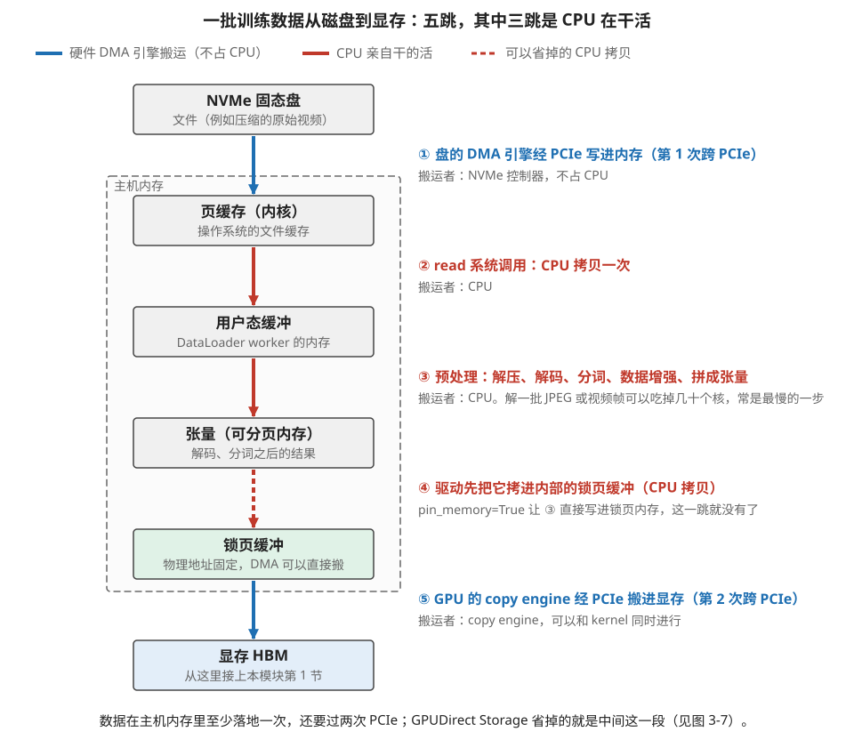
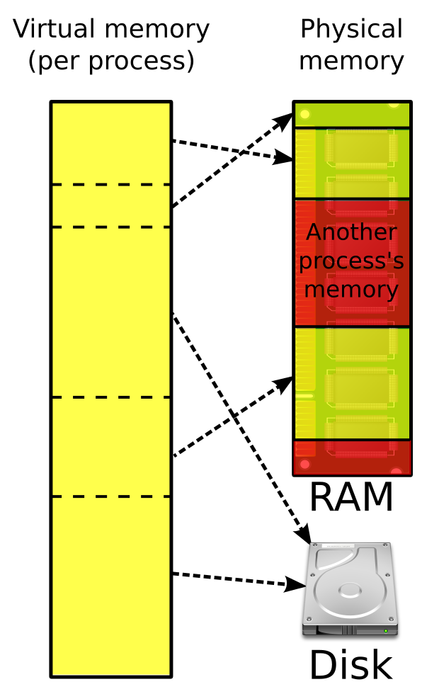
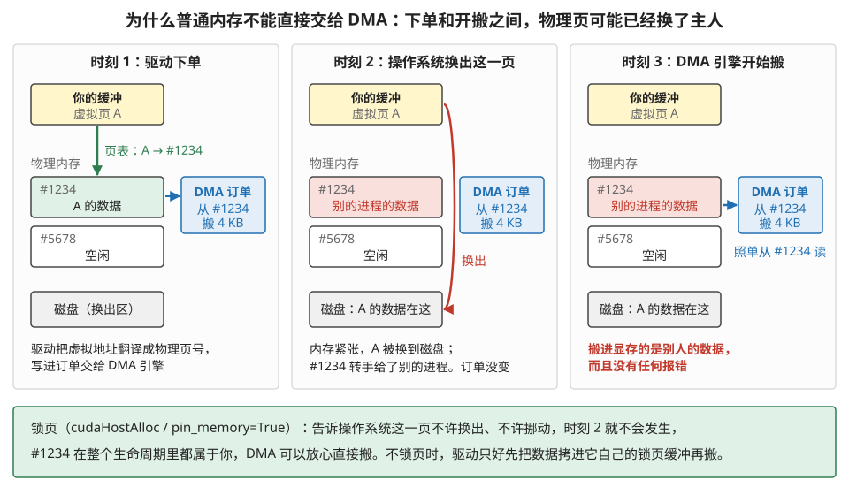
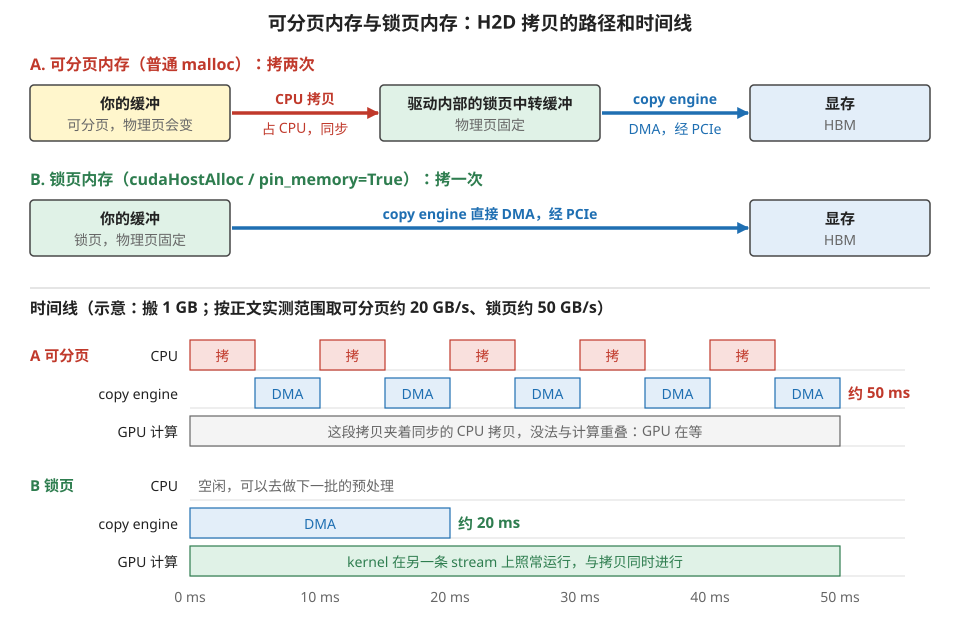
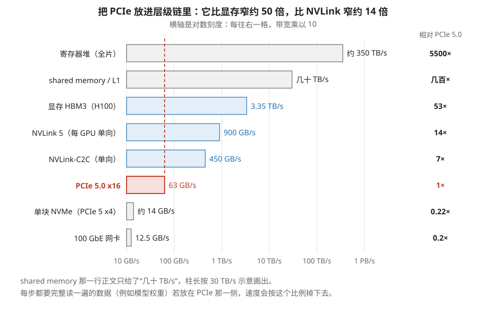
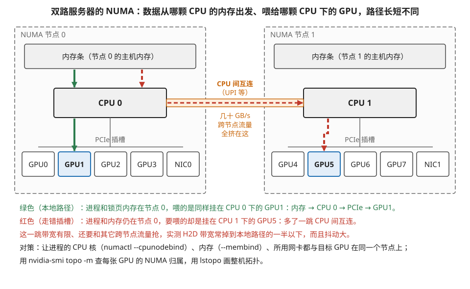
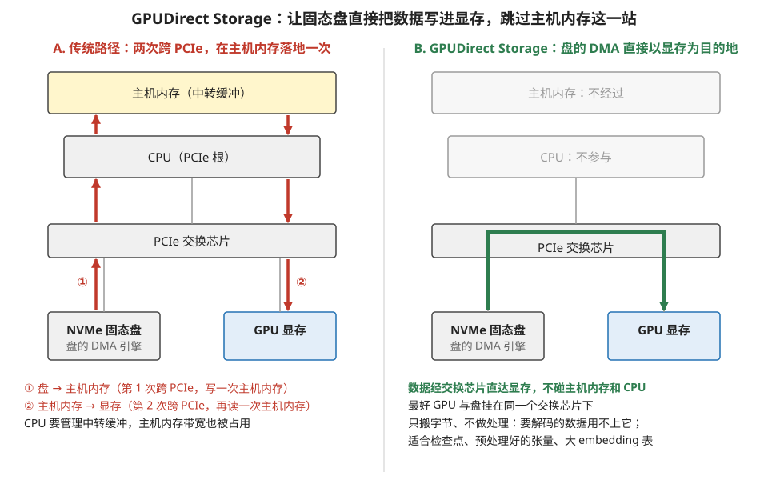
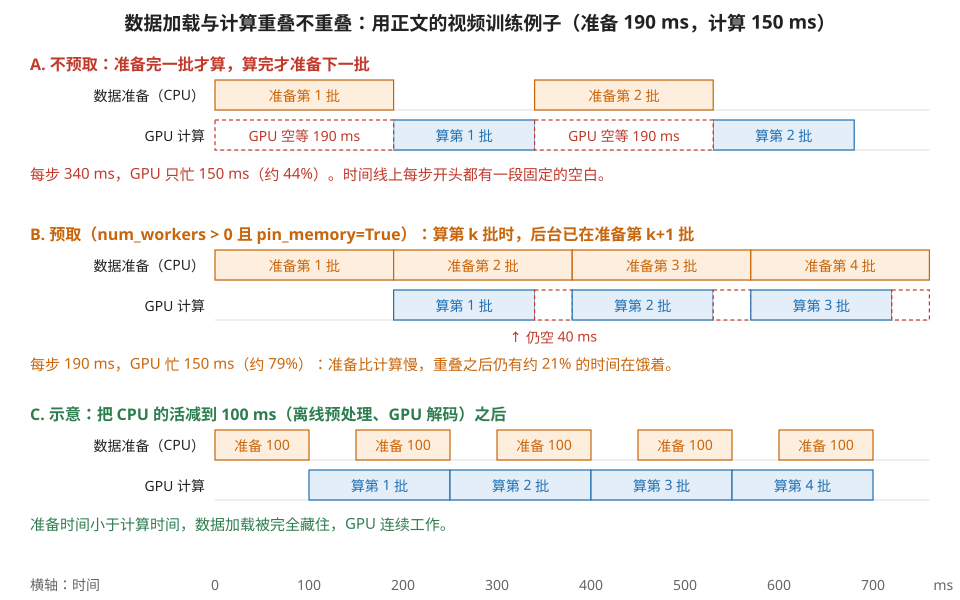

# 数据进 GPU 之前：从存储到显存的上游通路

> **所属模块**：模块 50 · 数据视角（本模块第 1 节从"远端节点的显存"开始讲数据的一生，这一节把这条链再往上游接一段）
> **状态**：🟨 学习中（第一版。知识截至 2026-08）
> **本节主旨**：本模块第 1 节跟着一个数走完了它从显存到 Tensor Core 的一生，但那条链的**起点是"数据已经在某张 GPU 的显存里"**。这一节补上更上游的那一段：**它是怎么从磁盘或对象存储，经过主机内存，翻过 PCIe 这道坎，落进显存的。** 这一段在快乐的时候完全隐形（数据加载被计算掩盖，没人注意到它），但它一旦成为瓶颈，表现是**每一步开头都有一个固定的空隙、GPU 利用率再怎么优化都上不去**——而且因为它不在 GPU 上，所有 GPU 侧的性能工具都看不见它。本节讲清这条链的四个环节：**为什么普通内存不能被 DMA 直接搬（锁页内存存在的全部理由）**、**PCIe 这道坎有多窄以及 NUMA 拓扑怎么让它更窄**、**GPUDirect Storage 绕开了哪一段**、以及**一个可以在动手前就算出来的判据：数据加载会不会成为你的瓶颈**。最后讲 Grace 这类 CPU-GPU 紧耦合方案如何把主机内存变成了存储层级里的新一级。

---

## 0. 这一节要回答的问题

- 一批数据从磁盘到显存，完整要经过哪几站？每一站谁在搬？
- 什么是锁页内存？为什么不锁页的内存不能被 DMA 直接搬？代价是什么？
- 为什么 `pin_memory=True` 这个开关能让传输速度翻倍？它到底改变了什么？
- PCIe 有多快？和 NVLink、和显存带宽比是什么量级？
- NUMA 是什么？为什么"网卡插错插槽"会让带宽掉一半？
- GPUDirect Storage 绕开了哪一段？什么时候值得用？
- 怎么在动手之前就判断"数据加载会不会成为瓶颈"？
- 每步开头那个固定的空隙是什么？怎么消掉？
- Grace 这类 CPU-GPU 紧耦合方案，改变了存储层级的什么？

---

## 1. 基础词汇：先把本节要用的词讲清楚

**主机（host）与设备（device）**。CUDA 语境里，主机指 CPU 及其内存，设备指 GPU 及其显存。**"H2D"（host to device）指从主机内存拷到显存，"D2H"是反方向。** 本节讲的就是 H2D 这条路。

**虚拟内存与物理内存**。操作系统给每个进程一个连续的虚拟地址空间，实际的物理内存是分散的页（典型 4 KB 一页），中间靠页表翻译。**关键性质是：操作系统有权在任何时刻把某一页换出到磁盘、或者把它挪到另一个物理位置**（内存整理、NUMA 迁移都会这么做）——**这个权力正是第 3 节要讲的麻烦的根源。**

**可分页内存（pageable memory）与锁页内存（pinned / page-locked memory）**。普通 `malloc` 分配的是可分页内存，操作系统可以换出它。锁页内存是通过特殊接口（CUDA 里是 `cudaHostAlloc` 或 `cudaHostRegister`）申请的、**被明确告知操作系统"不许换出、不许移动"**的内存。

**DMA（Direct Memory Access）**。本模块第 1 节介绍过：给一个专职搬运引擎一张订单，它自己完成搬运、不占用计算单元。**这里要补一个关键细节：DMA 引擎看不到操作系统的页表，它不认识进程的虚拟地址。**（更准确地说，copy engine 用的是 GPU 自己那套地址，由 GPU 的页表翻译到总线地址；它和操作系统的页表是两张表。下文说的"物理地址"是这个意思的简化。） 第 3 节全靠这一条。

**PCIe（Peripheral Component Interconnect Express）**。主板上连接 CPU 与各种外设（GPU、网卡、SSD）的标准总线。它是链路 lane 那一类（模块 30 第 2 节讲过 lane 的四种含义）：`x16` 表示 16 条差分对。**它是本节这条链上最窄的一段，第 4 节算账。**

**NUMA（Non-Uniform Memory Access，非一致内存访问）**。多路服务器上，每颗 CPU 各自直连一部分内存条和一部分 PCIe 插槽。**访问"自己那半边"的内存和外设很快，访问"对面那半边"要经过 CPU 之间的互连，慢且带宽有限。** 第 4.2 节讲它怎么把 PCIe 这道坎变得更窄。

**GPUDirect Storage（GDS）**。让 NVMe 固态盘直接把数据写进显存、不经过主机内存的技术。第 5 节展开。

---

## 2. 全景：一批数据从磁盘到显存的完整路径

**先把整条路走一遍再逐站解剖。** 设想一个训练任务要读一批训练样本：

1. **磁盘 → 主机内存（页缓存）**：操作系统把文件从 NVMe 盘读进内核的页缓存。搬运者是 **NVMe 控制器的 DMA 引擎**，走 PCIe。
2. **页缓存 → 用户态缓冲**：一次内存拷贝（`read` 系统调用），**由 CPU 完成**。
3. **用户态的预处理**：解压、解码（图片的 JPEG 解码、视频的帧解码）、分词、数据增强、拼成张量。**全部由 CPU 完成，而且这一步经常是整条链上最慢的。**
4. **用户态缓冲 → 锁页缓冲**：如果第 3 步的结果在可分页内存里，**驱动必须先把它拷进一块内部的锁页缓冲**（第 3 节讲为什么）。**这又是一次 CPU 拷贝。**
5. **锁页缓冲 → 显存**：**GPU 的 copy engine**（本模块第 1 节讲过的、位于芯片边缘的那个搬运引擎）通过 PCIe 把数据搬进显存。这一步与 kernel 执行完全并行。
6. **显存 → …**：从这里开始就是本模块第 1 节讲的内容了。

图 3-1 把这五跳画成一条竖直的路线，并按"谁在搬"着色。



> **图 3-1**　一句话：一批训练数据从磁盘进到显存要走五跳，头尾两跳由硬件搬运引擎完成，中间三跳全是 CPU 在干活。
>
> **先知道一件事**：DMA 引擎是专门负责搬数据的硬件，接到"从哪搬到哪、搬多少"的订单后自己完成，不占用 CPU；而 CPU 拷贝是 CPU 一条条执行读写指令，搬多久就占 CPU 多久。
>
> **按这个顺序看**：
> 1. 从顶上的 NVMe 固态盘看起。蓝色箭头 ① 是盘自己的 DMA 引擎经 PCIe（主板上连接 CPU 和外设的总线）把文件写进主机内存，这是第一次跨 PCIe。
> 2. 虚线框是主机内存，里面四个方框都是它的一部分。第一个是页缓存，操作系统用它缓存读过的文件。
> 3. 红色箭头 ② 是 `read` 系统调用：CPU 把数据从页缓存拷到 DataLoader 进程自己的缓冲。
> 4. 红色箭头 ③ 是预处理：解压、解码、分词、数据增强、拼成张量。解一批 JPEG 或视频帧可以吃掉几十个 CPU 核，这一步常是全程最慢的。
> 5. 红色虚线箭头 ④：如果结果放在普通的可分页内存里，驱动必须先把它拷进自己的锁页缓冲（物理位置固定、DMA 能直接搬的内存，§3 讲原因）。虚线表示这一跳可以省：打开 `pin_memory=True`，③ 就直接把结果写进锁页内存。
> 6. 蓝色箭头 ⑤ 是 GPU 的 copy engine（芯片边缘的搬运引擎）经 PCIe 把数据搬进显存，这是第二次跨 PCIe，可以和 GPU 上正在运行的 kernel 同时进行。
>
> **打个比方**：像网购的商品从仓库到你家：快递车（DMA）把货运进小区驿站，接下来拆箱、分拣、重新打包都是驿站员工（CPU）手工做，最后再由另一辆车（copy engine）送到你家门口。员工手慢，车再快也没用。
>
> **看懂的标志**：能回答"数据加载慢，先怀疑哪一跳"——先怀疑红色的 CPU 跳，尤其是 ③ 预处理；两段 PCIe 的带宽相对于每步要搬的数据量通常绰绰有余（§6 有算例）。
>
> **与正文的对照**：①～⑤ 对应正文列表的第 1～5 步，第 6 步（显存之后）接本模块第 1 节。底部提到的 GPUDirect Storage 见 §5 与图 3-7。
>
> 来源：本库自绘。

**这条路上有三个值得立刻记住的观察**：

**观察一：CPU 干的活比想象中多。** 第 2、3、4 步全在 CPU 上，而且第 3 步（预处理）的计算量完全取决于数据类型——**读预先分词好的文本几乎不花时间，而解码一批 JPEG 或视频帧可以吃掉几十个 CPU 核心。**

**观察二：第 4 步那次拷贝是可以省掉的**，办法是让第 3 步直接把结果写进锁页内存。这就是 `pin_memory=True` 做的事（第 3 节）。

**观察三：整条链上有两处"跨 PCIe"**（第 1 步和第 5 步），而且**数据在主机内存里至少过了一遍手**。GPUDirect Storage 消掉的正是这个中转（第 5 节）。

---

## 3. 锁页内存：为什么它不是一个"优化选项"而是一个必要条件

### 3.1 问题：DMA 引擎不认识虚拟地址

> 📍 copy engine 的命令流、完成通知和卡间、网卡发起的搬运，见[模块 14 第 9 节](../../1-计算硬件/14-数据搬运/09-主机与设备·copy-engine、流与事件.md)和[第 10 节](../../1-计算硬件/14-数据搬运/10-卡间与节点间·P2P、RDMA与集合通信.md)。

**先把矛盾摆出来。**

- 你的程序拿到的是**虚拟地址**，比如 `0x7f8a...`。这个地址背后的物理页，**操作系统随时可以换出到磁盘或挪到别处**。
- GPU 的 copy engine 是一个独立的硬件，**它工作在物理地址上**——你得告诉它"从物理地址 0x1234_5000 开始搬 4096 字节"。它不会去查页表，也不知道页表是什么。

先看一眼虚拟地址和物理内存之间是什么关系（图 3-2）。



> **图 3-2**　一句话：程序看到的是一段连续的虚拟地址，但它背后的数据被切成页，分散放在物理内存各处，有的页甚至被放到了磁盘上。
>
> **先知道一件事**：虚拟地址是操作系统发给每个进程的"门牌号"，物理地址是内存条上真实的位置。两者之间靠页表一页一页地对应，典型的一页是 4 KB。
>
> **按这个顺序看**：
> 1. 左边黄色长条是一个进程的虚拟内存（Virtual memory, per process），从上到下地址连续，横虚线把它分成一页一页。
> 2. 右上的绿色条是物理内存（Physical memory, RAM）。黑色虚线箭头表示"这一页虚拟地址实际存在哪里"：连续的虚拟页被映射到物理内存里互不相邻的位置。
> 3. 物理内存中间和底部的红色块标着 Another process's memory，是别的进程的内存，与这个进程的页交错在一起。
> 4. 右下的硬盘（Disk）：有两页虚拟地址的箭头指向这里，表示它们目前被换出到了磁盘上，不在内存里。
>
> **打个比方**：虚拟地址像一本书的页码，物理内存像图书馆的书架。书的第 1、2、3 页在你看来是连着的，实际上可能放在三个不相邻的书架上，有几页还暂时被收进了地下仓库（磁盘）。
>
> **看懂的标志**：能回答"同一段虚拟地址，物理位置会不会变"——会。操作系统可以把某一页换出到磁盘，以后换回来时放到另一个物理位置，程序完全感觉不到；这正是下面 DMA 出问题的根源。
>
> 来源：[Virtual memory.svg](https://commons.wikimedia.org/wiki/File:Virtual_memory.svg)，作者 Ehamberg，许可 CC BY-SA 3.0（本库加了白色背景）。

**于是问题来了**：驱动把虚拟地址翻译成物理地址交给 DMA 引擎，**但在 DMA 引擎真正开始搬的那一刻，操作系统可能已经把那一页换出去了**——那个物理地址上现在是别的进程的数据。**结果是搬了一堆垃圾，而且没有任何报错。**

**这不是理论上的风险，是必然会发生的**，因为 DMA 是异步的：从"发出订单"到"真正搬运"之间有一段任意长的时间窗口。

图 3-3 把这个时间窗口里发生的事按三个时刻画了出来。



> **图 3-3**　一句话：驱动给 DMA 引擎下单时写的是物理页号；如果在引擎真正开搬之前，操作系统把这一页换了出去，引擎就会照着旧页号搬走别人的数据。
>
> **先知道一件事**：DMA 引擎只认物理地址，不会去查页表。订单一旦写好，它就照着上面的物理页号去读，不会知道这一页中途换了主人。
>
> **按这个顺序看**：
> 1. 看左栏"时刻 1"：黄框是你的缓冲（虚拟页 A）。驱动查页表得知 A 在物理页 #1234（绿色箭头），于是在蓝色的 DMA 订单上写下"从 #1234 搬 4 KB"。
> 2. 看中栏"时刻 2"：内存紧张，操作系统把 A 换到了磁盘（红色弧线），腾出来的 #1234 分给了别的进程（红底）。注意右边的订单没有任何变化。
> 3. 看右栏"时刻 3"：DMA 引擎终于开搬，照单从 #1234 读数据（蓝色箭头）。它搬进显存的是别人的数据，而且整个过程没有任何报错。
> 4. 看底部绿框：锁页就是告诉操作系统"这一页不许换出、不许挪动"，时刻 2 就不会发生；不锁页时，驱动只能先把数据拷进它自己的锁页缓冲，再让 DMA 从那里搬。
>
> **打个比方**：你给快递员一张写着"3 号货架"的取件单，他明天才来取。今晚仓库整理，把你的货挪走了，3 号货架放上了别人的货。快递员第二天照单取走的就是别人的东西。锁页相当于在货架上贴"不许挪动"。
>
> **看懂的标志**：能回答"为什么说锁页是 DMA 能工作的前提，而不只是一个加速选项"——因为不锁页时物理页随时可能被挪走，DMA 直接搬是不安全的，驱动只能多做一次 CPU 拷贝来兜底。
>
> **与正文的对照**：#1234、#5678 是示意页号，与正文"从物理地址 0x1234_5000 开始搬 4096 字节"的例子对应。
>
> 来源：本库自绘。

### 3.2 两种解法，代价不同

**解法一：锁页。** 通过 `cudaHostAlloc` 申请内存时，驱动向操作系统声明"这些页不许换出、不许移动"。**于是物理地址在整个生命周期内固定，DMA 可以放心地直接搬。**

**解法二（驱动的兜底）：内部中转。** 如果你交给 `cudaMemcpy` 的是普通的可分页内存，驱动不会报错——**它会自己维护一小块锁页缓冲区，先把你的数据拷进去（CPU 拷贝），再让 DMA 从那里搬。**

**这就完整解释了 `pin_memory=True` 为什么能让传输快将近一倍**：

| | 可分页内存 | 锁页内存 |
| --- | --- | --- |
| 数据要被拷几次 | **两次**（用户缓冲 → 驱动的锁页缓冲 → 显存） | **一次**（锁页缓冲 → 显存） |
| 第一次拷贝由谁做 | **CPU**（占 CPU 时间，且是单线程的） | 不存在 |
| 能不能与 kernel 重叠 | **不能完全重叠**（CPU 拷贝那段是同步的） | **能**（纯 DMA，走 copy engine） |
| 实测 H2D 带宽（PCIe 5.0 x16） | 通常 **10~25 GB/s** | 通常 **45~55 GB/s** |

**注意最后两行才是重点**：带宽翻倍只是表象，**更重要的是"能不能与计算重叠"**。可分页内存的传输里夹着一段 CPU 拷贝，它必须在 CUDA stream 之外同步完成——**这意味着发起拷贝的 CPU 线程在那段时间被卡住，没法继续提交新工作**（GPU 上已经提交的工作照常跑；后面没有排队的工作时，GPU 才会空转）。

图 3-4 把两种内存的拷贝路径和时间线放在一起对比。



> **图 3-4**　一句话：从可分页内存拷到显存要先经过一次 CPU 拷贝，既慢又没法和 GPU 计算重叠；从锁页内存拷只需一次 DMA，更快，而且 GPU 可以同时照常计算。
>
> **先知道一件事**：GPU 上的工作按 stream（一条按顺序执行的任务队列）排队，不同 stream 上的任务可以同时进行。copy engine 的 DMA 可以放在一条 stream 上、kernel 放在另一条上，两者并行；但 CPU 拷贝不在任何 stream 里，它发生在 CPU 上，GPU 只能等它做完。
>
> **按这个顺序看**：
> 1. 看 A 行的路径：你的缓冲是可分页内存，红色箭头是 CPU 把它拷进驱动内部的锁页中转缓冲，蓝色箭头才是 copy engine 经 PCIe 的 DMA。数据被拷了两次。
> 2. 看 B 行的路径：你的缓冲本身就是锁页内存，copy engine 直接 DMA 进显存，只拷一次。
> 3. 看下半部分的时间线（示意：搬 1 GB，可分页按约 20 GB/s、锁页按约 50 GB/s，都取自正文表格的实测范围）。A 的 CPU 行和 copy engine 行交替出现"拷"和"DMA"：驱动一小块一小块地先由 CPU 拷进中转缓冲、再 DMA 出去，全程约 50 ms。GPU 计算行是灰色：这段时间里夹着同步的 CPU 拷贝，GPU 在等。
> 4. 看 B 的时间线：copy engine 一口气 DMA 完，约 20 ms；CPU 行是空的，可以去准备下一批；GPU 计算行是绿色的，kernel 在另一条 stream 上照常运行。
>
> **打个比方**：寄一箱东西，A 是先由你自己把东西从乱放的房间一件件搬到门口的固定位置，快递员再从门口取走；搬的过程中你什么别的事都干不了。B 是东西本来就放在门口，快递员直接取走，你照常干活。
>
> **看懂的标志**：能回答"`pin_memory=True` 最重要的好处是什么"——不只是带宽翻倍，更重要的是去掉了那次同步的 CPU 拷贝，让 H2D 传输能和 GPU 计算重叠。
>
> **与正文的对照**：两行路径对应正文表格的"拷几次""谁做第一次拷贝"两行；时间线对应"能不能与 kernel 重叠"和实测带宽两行。A 中 CPU 拷贝与 DMA 分块交替的画法是示意，实际的分块大小由驱动决定。
>
> 来源：本库自绘。

### 3.3 锁页也有代价

**不能无限锁页。** 被锁住的内存操作系统再也不能回收，**锁得太多会挤压系统可用内存，严重时导致整机变慢甚至无法分配**。所以：

- 锁页缓冲应该**复用**而不是反复申请释放（申请锁页内存本身很慢，要走内核）。
- 典型的做法是分配固定数量的锁页缓冲，做成一个环形队列轮流用——**这正是 DataLoader 的 `pin_memory` 实现在做的事。**

**这一节最值得记住的一句话**：

> **锁页内存不是一个"让传输更快"的优化，它是"让 DMA 能够工作"的前提。** 不锁页时并不是"慢一点"，而是驱动在背后替你做了一次拷贝——**代价没有消失，只是被藏起来了。**

---

## 4. PCIe 这道坎：它有多窄，以及 NUMA 怎么让它更窄

### 4.1 带宽账：把它放进层级链里

用模块 30 第 2 节那套折算公式（带宽 = 通道数 × 每次传输位数 × 每秒传输次数 ÷ 8）算一遍 PCIe：

| 代际 | 每 lane 符号率 | 编码 | x16 单向带宽 |
| --- | --- | --- | --- |
| PCIe 4.0 | 16 GT/s | 128b/130b | 约 **31 GB/s** |
| PCIe 5.0 | 32 GT/s | 128b/130b | 约 **63 GB/s** |
| PCIe 6.0 | 64 GT/s（PAM4） | 加 FEC | 约 **121 GB/s** |

**把它放进本模块第 1 节那条层级链里对照，才能看清它有多窄**：

| 通路 | 带宽量级 | 相对 PCIe 5.0 x16 |
| --- | --- | --- |
| 寄存器堆（全片） | 约 350 TB/s | 5500× |
| shared memory / L1 | 几十 TB/s | 几百× |
| 显存 HBM3（H100） | 3.35 TB/s | **53×** |
| NVLink 5（每 GPU 单向） | 900 GB/s | **14×** |
| NVLink-C2C（Grace-Hopper） | 450 GB/s 单向 | **7×** |
| **PCIe 5.0 x16** | **63 GB/s** | **1×** |
| 单块 NVMe SSD（PCIe 5 x4） | 约 14 GB/s | 0.22× |
| 100 GbE 网卡 | 12.5 GB/s | 0.2× |

图 3-5 把这张表画成对数刻度的横条，看得出 PCIe 夹在哪里。



> **图 3-5**　一句话：从寄存器到网卡，带宽跨了四个多数量级；PCIe 5.0 x16 比显存窄约 50 倍、比 NVLink 窄约 14 倍，是 GPU 与主机之间最窄的一段。
>
> **先知道一件事**：横轴是对数刻度，每往右一格带宽乘以 10，不是加 10。所以两根柱子长度差一格，带宽就差 10 倍；差两格就差 100 倍。
>
> **按这个顺序看**：
> 1. 先看红色那根：PCIe 5.0 x16，63 GB/s，红色竖虚线标出它的位置，右侧一列"相对 PCIe 5.0"以它为 1×。
> 2. 往上看蓝色的三根：NVLink-C2C（Grace 与 GPU 的直连）7 倍、NVLink 5（GPU 之间的直连）14 倍、显存 HBM3 53 倍。数据一旦要从显存那一侧跨到 PCIe 这一侧，速度就掉一到两个数量级。
> 3. 最上面两根灰色是芯片内部：shared memory 几十 TB/s（正文没给确切值，柱长按 30 TB/s 示意），寄存器堆全片约 350 TB/s。
> 4. 往下看：单块 NVMe 固态盘约 14 GB/s，100 GbE 网卡 12.5 GB/s，比 PCIe 5.0 x16 还窄，它们挂在 PCIe 上，占的是 x4 这样更窄的链路。
>
> **打个比方**：像从市中心的高架路（显存）下到一条单车道小路（PCIe），再往外是乡间土路（固态盘、普通网卡）。车在高架上跑得再快，到了小路口也得排队。
>
> **看懂的标志**：能回答"为什么训练时不能把权重放在主机内存里、每步经 PCIe 按需读"——每步都要完整读一遍权重，而 PCIe 比显存窄约 50 倍，训练会按这个比例慢下来。
>
> **与正文的对照**：所有数值取自正文上面那张表；NVLink-C2C 取单向 450 GB/s。
>
> 来源：本库自绘。

**PCIe 比显存窄五十倍、比 NVLink 窄十四倍。** 这就是为什么：

- **训练时的模型状态绝不能放在主机内存里按需搬**（除非用专门的 offload 方案并接受性能损失）。
- **多卡之间的数据交换要走 NVLink 而不是"经主机内存中转"**——后者不但慢，还要过两次 PCIe。
- **`nvidia-smi topo -m` 显示两卡之间是 PCIe 而不是 NVLink 时，那是一个红旗**（模块 30 第 1 节讲过）。

### 4.2 NUMA：拓扑错了，带宽再打对折

**双路服务器的物理结构**大致是这样：

```
   ┌─────────── CPU 0 ───────────┐    ┌─────────── CPU 1 ───────────┐
   │  内存条（NUMA 节点 0）      │    │  内存条（NUMA 节点 1）      │
   │  PCIe 插槽：GPU0-3, NIC0    │    │  PCIe 插槽：GPU4-7, NIC1    │
   └──────────────┬──────────────┘    └──────────────┬──────────────┘
                  └────── CPU 间互连（UPI / Infinity Fabric）──────┘
```

**关键事实：CPU 之间的互连带宽有限**（几十 GB/s 量级），而且要被所有跨节点的流量共享。

**于是会出现一种非常典型、也非常隐蔽的性能问题**：

**场景**：你的 DataLoader 进程被调度到了 CPU 0 上、它分配的锁页内存也在 NUMA 节点 0；但你要喂的是 GPU 5，而 GPU 5 挂在 CPU 1 的 PCIe 插槽上。

**数据的实际路径**：NUMA 节点 0 的内存 → **CPU 间互连** → CPU 1 → PCIe → GPU 5。

**后果**：多了一跳 CPU 间互连，而这一跳的带宽还要和其它所有跨节点流量竞争。**实测 H2D 带宽常常掉到本地路径的一半以下，而且抖动很大。**

图 3-6 把本地路径和走错插槽的路径画在同一张双路服务器的示意图上。



> **图 3-6**　一句话：多路服务器上每颗 CPU 各管一半内存和一半 PCIe 插槽；数据从一颗 CPU 的内存送到另一颗 CPU 下的 GPU，要多走一段带宽有限的 CPU 间互连。
>
> **先知道一件事**：NUMA（非一致内存访问）的意思是：CPU 访问"自己那半边"的内存和外设快，访问"对面那半边"慢。每个虚线框就是一个 NUMA 节点：一颗 CPU 加上直接连在它上面的内存条和 PCIe 插槽。
>
> **按这个顺序看**：
> 1. 先认结构：左右两个虚线框是 NUMA 节点 0 和 1。每个框顶上是内存条，中间是 CPU，底下一排是挂在这颗 CPU 上的 PCIe 设备：4 块 GPU 和 1 块网卡（NIC）。两颗 CPU 之间的橙色细条是 CPU 间互连（Intel 叫 UPI），带宽只有几十 GB/s 量级，所有跨节点的流量都挤在这里。
> 2. 看绿色实线：DataLoader 进程和它的锁页内存在节点 0，要喂的 GPU1 也挂在 CPU 0 下。路径是内存 → CPU 0 → PCIe → GPU1，全在本节点内。
> 3. 看红色虚线：进程和内存还在节点 0，要喂的却是挂在 CPU 1 下的 GPU5。数据必须先穿过 CPU 间互连到 CPU 1，再下到 GPU5，多了一跳。
> 4. 看底部文字：这一跳带宽有限、又和其它跨节点流量共用，实测 H2D 带宽常掉到本地路径的一半以下，还抖动很大。对策是把进程的 CPU 核、内存、网卡都绑到目标 GPU 所在的节点上。
>
> **打个比方**：一栋楼有东西两个楼梯，各通各自那半边的房间。东边办公室的人要把文件送到西边，只能走中间一条窄走廊，而全楼跨侧的人都挤这条走廊。
>
> **看懂的标志**：能回答"同样的代码换一台机器 H2D 慢了一半，不改代码能不能修"——多半能：用 `nvidia-smi topo -m` 查 GPU 的 NUMA 归属，再用 `numactl` 把进程和内存绑到那个节点上。
>
> **与正文的对照**：GPU0～3 与 NIC0 挂在 CPU 0、GPU4～7 与 NIC1 挂在 CPU 1，与正文的文本示意图一致；GPU1 与 GPU5 是为了对照随手选的两块。
>
> 来源：本库自绘。

**同样的问题也发生在网卡上**：跨节点训练时，如果 GPU 和网卡分属不同的 NUMA 节点，GPUDirect RDMA 的效率会明显下降，严重时驱动会退化到"经主机内存中转"的慢路径。

**对策就是绑定亲和性**：

- 让每个训练进程绑定到"它负责的那张 GPU 所在的 NUMA 节点"的 CPU 核心上（`numactl --cpunodebind`，或框架自带的亲和性设置）。
- 让它分配的内存也在同一个节点上（`--membind`）。
- 让它用的网卡是同一节点的那块。

**怎么查**：`nvidia-smi topo -m` 会同时打印 GPU 之间的连接方式**和每张 GPU 的 NUMA 亲和性**；`lstopo` 能画出完整的机器拓扑图。

**这个问题值得单独强调，因为它是本节所有内容里最容易被忽略、也最容易修复的一个**：它不需要改一行计算代码，只需要改启动脚本里的绑定，收益却可能是一倍的 H2D 带宽。

---

## 5. GPUDirect Storage：把主机内存这一站跳过去

**回到 §2 那条路径，看看能不能砍掉一段。** 第 1 步（盘 → 主机内存）和第 5 步（主机内存 → 显存）都过了一次 PCIe，中间在主机内存里落了一次地。**如果 SSD 能直接把数据写进显存呢？**

**这就是 GPUDirect Storage（GDS）**。它让 NVMe 控制器的 DMA 引擎**直接以显存地址为目的地**——数据从盘出来经 PCIe 交换芯片直接进显存，**根本不经过主机内存和 CPU**。

图 3-7 把传统路径和 GDS 路径画在同一套硬件拓扑上。



> **图 3-7**　一句话：传统做法里，数据从固态盘先上到主机内存、再下到显存，两次经过 PCIe；GPUDirect Storage 让固态盘直接把数据写进显存，主机内存和 CPU 都不参与。
>
> **先知道一件事**：PCIe 交换芯片是一个"路口"，它把一条上行的 PCIe 链路分给下面挂着的多个设备（这里是固态盘和 GPU），挂在同一个交换芯片下的两个设备可以直接互传，不必绕到 CPU。
>
> **按这个顺序看**：
> 1. 先认结构（左右两图相同）：最上是主机内存，下面是 CPU（PCIe 的根，所有 PCIe 链路从它出发），再下是 PCIe 交换芯片，最底下是固态盘（NVMe）和 GPU 显存。
> 2. 看左图的红色箭头 ①：盘的 DMA 引擎把数据经交换芯片、CPU 写进主机内存里的中转缓冲。这是第一次跨 PCIe，并且写了一次主机内存。
> 3. 看左图的红色箭头 ②：数据再从主机内存经 CPU、交换芯片送进显存。这是第二次跨 PCIe，又读了一次主机内存。
> 4. 看右图的绿色箭头：盘的 DMA 引擎以显存地址为目的地，数据进到交换芯片后直接拐向 GPU。上面灰掉的主机内存和 CPU 完全不参与。
> 5. 看右图底部：它只搬字节、不做处理。数据如果需要解压或解码，那一步还得在 CPU 上做，GDS 就用不上；最适合的是已经是最终格式的大块二进制数据。
>
> **打个比方**：原来厂家发货要先送到你公司的收发室，再由收发室转送到你的办公室；GDS 相当于厂家直接送到办公室门口。但如果货需要先拆箱组装（解码），还是得先进收发室。
>
> **看懂的标志**：能回答"为什么 GDS 对检查点加载特别有效、对 JPEG 训练数据却帮不上忙"——检查点是纯二进制大块，搬进来就能用；JPEG 需要 CPU 解码，数据必须先落在主机内存里。
>
> **与正文的对照**：左图对应 §2 路径的第 1 步和第 5 步；"最好在同一个交换芯片下"对应正文"代价与限制"第一条。
>
> 来源：本库自绘。

**收益有三条**：

1. **省掉一次 PCIe 往返和一次主机内存的读写**——延迟降低、带宽提升（尤其在多块盘并发时）。
2. **CPU 完全不参与**，省下的 CPU 时间可以拿去做预处理（§2 观察一说的那件事）。
3. **主机内存带宽被解放**——大规模训练时主机内存带宽本身也是紧张资源。

**代价与限制**（这几条决定了它的适用范围）：

- **需要硬件与驱动栈的配合**：GPU、NVMe 盘、PCIe 拓扑（最好在同一个 PCIe 交换芯片下）、文件系统都要支持。
- **它只搬字节，不做任何处理**。如果你的数据需要解压或解码，**那一步还是得在 CPU 上做**——GDS 就用不上了。**所以它最适合"已经是最终格式的大块二进制数据"**：预处理好的张量、检查点文件、大规模的 embedding 表。
- **小文件不划算**：每次传输有固定开销，文件太小时跳过主机内存省下的还不够补开销。

**最典型的两个受益场景**：

- **检查点的加载与保存**（模块 60 第 4 节算过：1120 GB 的模型状态，读写速度直接决定故障恢复的 MTTR）。
- **超出显存容量的数据结构**——比如推荐系统里几百 GB 的 embedding 表、或者推理时被卸载到 SSD 上的 KV cache。

---

## 6. 数据加载会不会成为你的瓶颈：一个动手前就能算的判据

**这一节给一个可操作的方法，避免"训练慢了才发现是数据没跟上"。**

**判据非常简单**：

> **数据加载不是瓶颈 ⟺ 每步的数据准备时间 < 每步的计算时间**（且两者重叠）

**分子（数据准备时间）由三项里最慢的一项决定**：

1. **存储读取**：每步的数据字节数 ÷ 存储带宽。
2. **CPU 预处理**：每步的样本数 × 每样本的预处理耗时 ÷ 并行的 worker 数。
3. **H2D 传输**：每步的数据字节数 ÷ 实测 H2D 带宽（用 §3.2 的表估，或实测）。

**分母（计算时间）**用模块 60 第 1 节的方法算：`6N × 每步 token 数 ÷ (卡数 × 峰值 × MFU)`。

**代两个截然不同的例子，对比会很鲜明。**

**例子一：LLM 预训练（数据是预先分词好的整数序列）。**

- 每步 400 万 token，每 token 一个 int32 = **16 MB**。
- 存储读取：16 MB ÷ 2 GB/s（很保守）= **8 毫秒**。
- CPU 预处理：几乎为零（数据已经是最终格式）。
- H2D：16 MB ÷ 50 GB/s = **0.3 毫秒**。
- 计算时间（模块 60 第 1 节算过）：**约 4.1 秒**。

**数据准备 8 毫秒对计算 4.1 秒——差 500 倍，完全不是瓶颈。** 这就是为什么做纯文本 LLM 训练的人几乎从不谈数据加载。

**例子二：视频理解模型训练。**

- 每步 64 个视频片段，每片段 32 帧、每帧 224×224×3 = 150 KB，**解码后每步 307 MB**。
- 存储读取（读压缩的原始视频，假设压缩比 20 倍）：15 MB ÷ 2 GB/s ≈ 8 毫秒。
- **CPU 预处理**：解码 2048 帧。假设单核解一帧要 3 毫秒，共 6.1 秒的 CPU 工作；用 32 个 worker 并行 → **190 毫秒**。
- H2D：307 MB ÷ 50 GB/s = **6 毫秒**。
- 计算时间：假设 **150 毫秒**。

**数据准备 190 毫秒对计算 150 毫秒——数据是瓶颈，GPU 有约 21% 的时间在饿着。**

**对比这两个例子，本节最有用的一条结论出来了**：

> **数据加载的瓶颈几乎总是在 CPU 预处理上，而不是在带宽上。** 存储和 PCIe 的带宽虽然比显存窄几十倍，但**每步要搬的数据量比每步的计算量小得多**，所以带宽通常绰绰有余；真正吃紧的是"把原始格式变成张量"这件事，而它跑在 CPU 上。

**这条结论直接给出了对策的优先级**：

1. **先想办法减少 CPU 的活**——离线预处理成最终格式、用 GPU 做解码（NVIDIA 的 DALI 这类库把 JPEG/视频解码搬到 GPU 上）、缓存预处理结果。
2. **再加 worker 数**（但受 CPU 核心数限制，且每个 worker 有内存开销）。
3. **最后才是带宽层面的优化**（GDS、更快的盘）——**除非你的数据本来就是最终格式的超大块**，那时带宽才是主角。

### 6.1 每步开头那个固定空隙

**症状**：时间线上每一步的开头都有一个固定长度的空白，GPU 什么都没干。

**它几乎总是同一个原因：数据加载没有和计算重叠。** 正确的做法是**预取**——在计算第 k 步时，后台已经在准备第 k+1 步的数据。这需要三件事同时成立：

1. **DataLoader 有多个 worker 在后台准备数据**（`num_workers > 0`）。
2. **准备好的数据落在锁页内存里**（`pin_memory=True`），否则第 4 步那次 CPU 拷贝会同步阻塞。
3. **H2D 传输发生在一条独立的 stream 上**，与计算 stream 并发，靠 event 同步。第三条框架通常已经处理好，前两条要自己开。

图 3-8 用 §6 例子二的数字，把"不预取""预取"两种情况画成时间线。



> **图 3-8**　一句话：数据准备和 GPU 计算如果串行进行，每一步开头都会空出一段等数据的时间；让两者重叠能把空白缩到"准备时间减计算时间"，只有准备比计算快，空白才会完全消失。
>
> **先知道一件事**：这张图的横轴是时间（毫秒），每个条块表示某件事占用的时间段。上一行是 CPU 在准备数据，下一行是 GPU 在计算；两行的条块在竖直方向上对齐，就表示它们同时进行。
>
> **按这个顺序看**：
> 1. 看 A（不预取）：CPU 准备第 1 批用 190 ms，这段时间 GPU 空等（红色虚线框）；然后 GPU 算 150 ms，这时 CPU 又停下来。每步 340 ms，GPU 只忙 150 ms，约 44%。时间线上每步开头那段固定的空白就是它。
> 2. 看 B（预取）：CPU 的 worker 一批接一批地准备，不再等 GPU。GPU 算第 1 批时，第 2 批已经在准备。但准备要 190 ms、计算只要 150 ms，GPU 每算完一批还要等 40 ms（红色虚线小框），忙的比例是 150 ÷ 190 ≈ 79%，约 21% 的时间在饿着。
> 3. 看 C（示意）：假设把 CPU 的活减到每批 100 ms（离线预处理、用 GPU 解码），准备比计算快，下一批总能提前备好，GPU 行变成连续的一条。
>
> **打个比方**：一个厨师（GPU）配一个备菜员（CPU）。A 是备好一道菜才开火、炒完才去备下一道；B 是厨师炒菜时备菜员已在切下一道，但切菜比炒菜慢，厨师每道之间仍要等一会儿；C 是备菜员换了更快的办法，厨师就一直不停手。
>
> **看懂的标志**：能回答"已经开了 `num_workers` 和 `pin_memory`，GPU 仍有空闲，下一步该做什么"——看准备时间是否仍大于计算时间。如果是，重叠已经做到头了，要么减少 CPU 的活，要么增加 worker 把准备时间压到计算时间以下。
>
> **与正文的对照**：190 ms 与 150 ms 取自 §6 例子二，"约 21%"与正文一致。C 的 100 ms 是为说明而假设的数字，正文没有给出。
>
> 来源：本库自绘。

**一个诊断技巧**：把训练循环里的真实数据换成一个预先生成好、常驻显存的假张量再跑一遍。**如果速度明显变快，那就是数据加载的问题；如果不变，问题在 GPU 侧。** 这个对照实验只要几行代码，却能一次性排除掉整条上游链路。

---

## 7. 主机内存正在变成存储层级的新一级

**传统上，主机内存不算在"存储层级"里**——它隔着 PCIe 这道窄门，慢到只能当"数据的来源"而不是"计算过程中可以随时读的一级"。

**Grace-Hopper 这类 CPU-GPU 紧耦合方案改变了这一点。** 它用 **NVLink-C2C** 把 CPU 和 GPU 直连，带宽约 900 GB/s（双向），是 PCIe 5.0 x16 的十几倍；而且 CPU 内存对 GPU 是**可直接寻址**的——GPU 上的 kernel 可以像访问显存一样访问它（延迟更高，但不需要显式拷贝）。

**这件事对本模块第 1 节那张层级表的影响**：主机内存以"**容量极大、带宽中等**"的身份挤进了层级链：

| 层级 | 容量量级 | 带宽量级 |
| --- | --- | --- |
| 显存 HBM | 几十到几百 GB | 几 TB/s |
| **主机内存（经 C2C）** | **几百 GB 到几 TB** | **约 0.5 TB/s** |
| 主机内存（经 PCIe） | 同上 | 约 0.06 TB/s |
| 本地 NVMe | 几 TB 到几十 TB | 约 0.01 TB/s |

**中间那一行的出现，让一批过去不可行的方案变得可行**：

- **训练时把优化器状态卸载到主机内存**。按模块 60 第 1 节的账，优化器状态占 16 字节里的 12 字节——卸载掉它，显存需求降到四分之一。过去走 PCIe 时这个方案的性能损失太大，走 C2C 就现实得多。
- **推理时把 KV cache 分层**：热的留显存、温的放主机内存。按模块 60 第 2 节的账，KV cache 直接等于并发数，多一层容量就是多一批用户。
- **超大 embedding 表直接住在主机内存里**，由 GPU 按需读取。

**但要提醒一句**：C2C 的 0.5 TB/s 仍然只有显存的六分之一到十几分之一。**它扩的是容量，不是带宽**——把带宽敏感的数据（比如每步都要完整读一遍的权重）放上去，性能会按带宽比例掉下来。**判断一个 offload 方案值不值，方法和本库其它地方一样：算这份数据的复用次数。复用多的（优化器状态每步只读写一次）适合卸载，复用少但每步必读的不适合。**

---

## 8. 开发者视角

| 你想知道/控制什么 | 去哪里看/拧 |
| --- | --- |
| 数据加载是不是瓶颈 | **假数据对照实验**（§6.1）：换成常驻显存的假张量再跑，速度变快就是上游的问题 |
| H2D 带宽实测多少 | CUDA 示例里的 `bandwidthTest`；分别测 pageable 和 pinned 两种，差距应该接近一倍 |
| 锁页开了没有 | DataLoader 的 `pin_memory=True`；自己写的话用 `cudaHostAlloc` 或 `cudaHostRegister` |
| 预取开了没有 | `num_workers > 0` 且 `prefetch_factor` 合理；时间线上每步开头不应有固定空隙 |
| NUMA 绑对了没有 | `nvidia-smi topo -m` 看 GPU 的 NUMA 亲和性；`lstopo` 画拓扑；用 `numactl` 绑定进程与内存 |
| CPU 预处理占多少 | 单独跑一遍 DataLoader（不训练）测它的最大吞吐；和每步计算时间比 |
| 要不要上 GDS | 数据是不是"最终格式的大块二进制"；是的话值得试，需要解码的话先解决 CPU 那一步 |
| 传输与计算重叠没有 | Nsight **Systems**（不是 Compute）时间线上的 Memcpy 轨道——它应该和计算轨道重叠 |
| 红旗信号 | 每步开头固定空隙；H2D 带宽只有理论值的三分之一（多半是没锁页或 NUMA 跨了）；CPU 满载而 GPU 半闲 |

**一条容易被忽略的提醒**：**这一整条链在 Nsight Compute 里是看不见的**——那个工具只看 GPU 上的 kernel。**上游问题要用 Nsight Systems（看整条时间线）或者干脆用 §6.1 的假数据对照实验。** 用错工具是这类问题长期查不出来的常见原因。

---

## 9. 最新架构落点（知识截至 2026-08）

- **CPU-GPU 紧耦合从特例变成主流形态**：Grace-Hopper 与 Grace-Blackwell 的 NVLink-C2C（约 900 GB/s 双向），Rubin 一代配 Vera CPU 延续同样的结构；AMD 的 MI300A 是把 CPU 和 GPU 做进同一个封装的 APU 形态。**方向很清楚：主机内存正在从"数据的来源"变成"存储层级里的一级"**（§7）。
- **PCIe 6.0（约 121 GB/s，x16 单向）开始出现在新平台上**（Rubin CPX 就用 PCIe Gen6），把这道坎拓宽了一倍。但它仍然比显存窄一个数量级以上——**PCIe 作为"最窄的一段"这个定位没有改变。**
- **GPU 侧预处理在扩大地盘**：JPEG/视频解码、数据增强、甚至部分特征工程都在往 GPU 上搬（DALI 一类的库）。**动机正是 §6 那条结论——瓶颈在 CPU 而不在带宽**，所以解法是把活从 CPU 挪走，而不是加带宽。
- **KV cache 的分层存储正在成型**（模块 60 第 2 节提过）：热的留 HBM、温的放主机内存、冷的放 SSD。**这条链正是本节讲的上游通路被反向使用**——过去是"数据往 GPU 里送"，现在多了一条"显存装不下的往外卸"。
- **一个值得跟踪的方向**：随着 C2C 带宽继续提升，"显存"和"主机内存"的边界会越来越模糊。**如果某一代的 C2C 带宽接近显存带宽，本模块第 1 节那张层级表就要重画**——那时"卸载"这个概念本身可能都不再需要。

---

## 10. 和其它模块的挂钩

- **模块 20 第 4、5 节（NAND 闪存、闪存的接口与控制器）**：本节把固态盘当作一个带宽数字来用，那两节打开这个盒子——读延迟的尾部从哪来（读重试与软判决，20-04 §8）、持续写入速度为什么会在写了一段之后下降（SLC 缓存，20-05 §4）、检查点写入会不会把盘写坏（寿命的系统账，20-05 §5）、NVMe 一次读在主机与盘之间的完整步骤（20-05 §6）。主机内存一侧的接口（通道数与带宽、内存训练、CXL）见模块 20 第 3 节。
- **模块 50 第 1 节（存储层级与搬运指令全图）**：本节是它的上游延伸。那里的搬运指令矩阵最后一行是"主机内存 ↔ 显存，由 copy engine 搬"，本节把这一行展开成了完整的一节；那里讲的三个搬运引擎按半径分工，本节补上"半径最外的那一圈之外还有什么"。
- **模块 10 第 4 节（访存通路 §6.5）**：那里澄清了 copy engine 与 TMA 是两个不同的"DMA"，本节讲的就是 copy engine 那一侧的完整业务。
- **模块 60 第 1 节（训练系统）**：本节 §6 的判据用到了那一节的计算时间公式；§7 的 offload 方案直接改写那一节的显存账。
- **模块 60 第 2 节（推理服务）**：KV cache 分层卸载走的就是本节这条通路。
- **模块 60 第 4 节（可靠性）**：检查点的读写走这条链，而检查点速度直接决定故障恢复的 MTTR；GDS 在这个场景上收益最明显。
- **模块 30 第 2 节（互连的物理实现）**：PCIe 是那一节讲的"链路 lane"的典型例子，带宽折算用的是同一个公式；每比特能量表里"跨封装 SerDes"那一行就是它。

---

## 11. 术语卡

### 锁页内存（pinned / page-locked memory）

**定义**：通过特殊接口申请、并被明确告知操作系统"不许换出、不许移动"的主机内存。CUDA 里用 `cudaHostAlloc` 分配或 `cudaHostRegister` 把已有内存锁住；PyTorch 的 DataLoader 用 `pin_memory=True` 开启。

**为什么存在**：DMA 引擎工作在物理地址上、不查页表，而普通内存的物理页随时可能被操作系统换出或挪动——在 DMA 真正开始搬的那一刻，那个物理地址上可能已经是别人的数据了。锁页固定了物理地址，使 DMA 可以安全直搬。**不锁页时驱动会自己先拷进一块内部锁页缓冲，所以代价没有消失，只是变成了一次隐藏的 CPU 拷贝**——实测带宽因此差将近一倍，更重要的是那次拷贝无法与 kernel 重叠。

**语境例句**："H2D 只跑到 20 GB/s，PCIe 5 应该有 60 才对。"——第一嫌疑就是没锁页，驱动在背后多做了一次 CPU 拷贝；第二嫌疑是 NUMA 跨了节点。

### PCIe 作为整条链上最窄的一段

**定义**：连接 CPU 与外设的标准总线。PCIe 5.0 x16 单向约 63 GB/s，6.0 约 121 GB/s。它比显存带宽窄五十倍、比 NVLink 窄十几倍。

**为什么存在**（作为一个必须记住的量级）：它决定了"什么能放在主机内存、什么必须放在显存"这条分界线。任何"每步都要完整读一遍"的数据放在 PCIe 那一侧都会成为瓶颈；只有复用次数少、或者容量大到显存装不下的数据才值得卸载出去。

**语境例句**："把优化器状态 offload 到主机内存。"——按它每步只读写一次的复用特征，走 PCIe 尚可、走 NVLink-C2C 更好；但如果有人提议把权重 offload 出去，直接用这个带宽比就能否掉。

### NUMA 亲和性

**定义**：多路服务器上每颗 CPU 各自直连一部分内存和一部分 PCIe 插槽，访问本地的快、访问对面的要过 CPU 间互连。让训练进程、它分配的内存、它使用的 GPU 与网卡都落在同一个 NUMA 节点上，就叫绑定亲和性。

**为什么存在**（作为一个必查项）：跨节点访问会多一跳带宽有限的 CPU 间互连，实测 H2D 带宽常掉到一半以下且抖动变大；网卡跨节点还会让 GPUDirect RDMA 退化到经主机内存中转的慢路径。**它是本节所有问题里最容易修复的一个——只需要改启动脚本的绑定，不用动一行计算代码。**

**语境例句**："同样的代码在这台机器上慢一半。"——先跑 `nvidia-smi topo -m` 和 `lstopo` 看 GPU、网卡、内存的 NUMA 归属，很可能是进程绑在了对面的 CPU 上。

### GPUDirect Storage（GDS）

**定义**：让 NVMe 盘的 DMA 引擎直接以显存为目的地，数据不经过主机内存和 CPU。省掉一次 PCIe 往返、一次主机内存读写，以及全部的 CPU 参与。

**为什么存在**：传统路径里数据要在主机内存落一次地，这既浪费带宽也占 CPU。但它只搬字节不做处理——**如果数据需要解压或解码，那一步仍在 CPU 上，GDS 就用不上**。所以它的主场是"已经是最终格式的大块二进制"：检查点、预处理好的张量、大 embedding 表、卸载出去的 KV cache。

**语境例句**："检查点加载太慢，影响故障恢复时间。"——这正是 GDS 最典型的受益场景，因为检查点文件是纯二进制大块、不需要任何 CPU 处理。

### 数据加载瓶颈的判据

**定义**：数据准备时间（存储读取、CPU 预处理、H2D 传输三项里最慢的一项）与每步计算时间的比较。三项里**几乎总是 CPU 预处理最慢**——带宽虽窄，但每步要搬的数据量比计算量小得多。

**为什么存在**（作为一个动手前的检查）：它把"要不要为数据加载做优化"从事后发现变成事前判断，而且直接给出了对策的优先级——**先减少 CPU 的活（离线预处理、GPU 解码），再加 worker，最后才是带宽层面的手段**。

**语境例句**："GPU 利用率只有 60%，kernel 都优化过了。"——先做假数据对照实验（换成常驻显存的假张量），如果速度上去了，问题在上游而不在 GPU，继续优化 kernel 是白费力气。

### NVLink-C2C 与主机内存的层级化

**定义**：把 CPU 与 GPU 直连的高速接口（Grace-Hopper 一代约 900 GB/s 双向），且 CPU 内存对 GPU 可直接寻址、无需显式拷贝。它使主机内存以"容量极大、带宽中等"的身份进入存储层级。

**为什么存在**：PCIe 那 63 GB/s 太窄，导致主机内存只能当"数据来源"；带宽提高十几倍之后，一批过去不可行的方案变得现实——优化器状态卸载、KV cache 分层、超大 embedding 表常驻主机内存。**但它扩的是容量不是带宽**（仍只有显存的几分之一），所以判断能不能卸载，依据仍然是那份数据的复用次数。

**语境例句**："有了 C2C，显存不够就往主机内存放。"——对复用次数少的数据成立（优化器状态每步只读写一次）；对每步都要完整读一遍的权重不成立，那样性能会按带宽比例掉下去。

---

## 12. 我的困惑 / 待深挖

- 锁页内存的合理上限是多少？锁太多对操作系统的具体影响（页回收压力）在什么规模上开始显现？
- GDS 在真实系统上相对普通路径的提升幅度？它对 PCIe 拓扑（是否同一个交换芯片下）的敏感程度有多高？
- GPU 侧预处理（DALI 一类）会挤占多少 GPU 算力？在什么样的数据/模型比例下它反而变成负收益？
- NUMA 绑定的收益在不同平台上差多少？单路服务器和 Grace 这类紧耦合平台上还需要关心它吗？
- §7 的 offload 判据（按复用次数）能不能做成一个自动的决策工具——给定模型和硬件，自动决定哪些张量该卸载？
- C2C 带宽继续提升到什么程度，"显存/主机内存"的边界会实质性消失？届时模块 50 第 1 节的层级表要怎么改？

---

*最后更新：2026-08-31（第一版：模块 50 第 3 节。含从磁盘到显存的六站路径走查、锁页内存的必要性推导（DMA 不认虚拟地址）与两种解法的四行对照、PCIe 放进层级链的带宽对照表、NUMA 跨节点的路径图与对策、GDS 的三条收益与三条限制、数据加载瓶颈判据与 LLM/视频两个反差极大的算例、假数据对照实验、C2C 让主机内存成为层级新一级）*（2026-09 补图 8 张：现成 1 张，自绘 7 张；图注按费曼法写）
